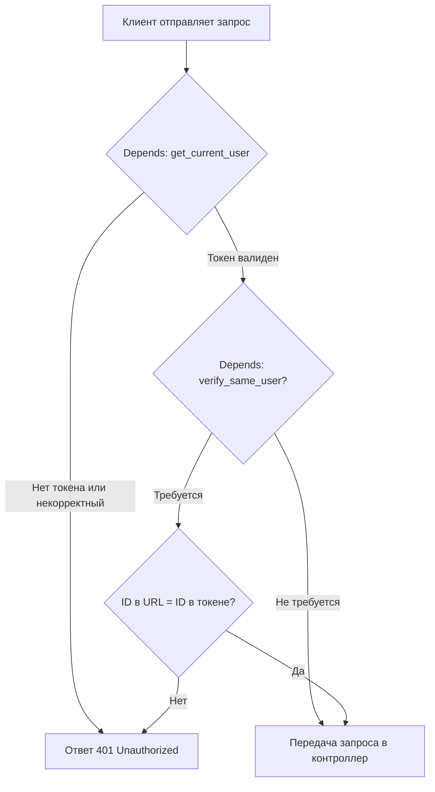

# Разработка слоя контроллеров web-приложения

Перед тем как переходить к определению маршрутов в FastAPI-приложении, нам нужно подготовить зависимости (dependencies) для обработки авторизации пользователей.
В FastAPI принято использовать механизм зависимостей (Depends).

Создайте в папке `src` папку `dependencies`, а в ней файл `auth.py`, и поместите в него следующий код:

```python
from fastapi import Depends, HTTPException, Request
from jose import jwt, JWTError
from pydantic import BaseModel
from os import getenv

JWT_SECRET = getenv("ACCESS_TOKEN_SECRET")
ALGORITHM = "HS256"

class TokenPayload(BaseModel):
    sub: str  # ID пользователя
    exp: int  # время жизни токена

def get_current_user(request: Request) -> TokenPayload:
    auth_header = request.headers.get("Authorization")
    if not auth_header or not auth_header.startswith("Bearer "):
        raise HTTPException(status_code=401, detail="Missing token")

    token = auth_header[7:]  # убираем "Bearer "

    try:
        payload = jwt.decode(token, JWT_SECRET, algorithms=[ALGORITHM])
        user = TokenPayload(**payload)
        request.state.user = user
        return user
    except JWTError:
        raise HTTPException(status_code=401, detail="Invalid token")

def verify_same_user(user_id: int, token: TokenPayload = Depends(get_current_user)):
    if int(token.sub) != int(user_id):
        raise HTTPException(status_code=401, detail="Forbidden")
    return token

```

Здесь определены две зависимости:

- `get_current_user` — проверяет наличие и корректность JWT-токена в заголовке Authorization. Если всё в порядке, возвращает объект `TokenPayload`, содержащий ID пользователя (`sub`).
- `verify_same_user` — дополнительно проверяет, что ID в URL совпадает с ID пользователя, извлечённым из токена. Это предотвращает изменение чужих данных.



Такая реализация делает код FastAPI-приложения:

- централизованным — авторизация обрабатывается в одном месте;
- расширяемым — можно легко заменить JWT на другую схему;
- безопасным — исключает доступ к чужим данным;
- декларативным — зависимости описываются явно и видны в сигнатуре функций.

## Разаботка контроллера авторизации

Контроллер авторизации отвечает за обработку запросов пользователей, связанных с входом в систему (`login`) и регистрацией новых пользователей (`register`).
На этом этапе контроллер принимает HTTP-запросы, проводит валидацию входных данных и делегирует бизнес-логику в сервис аутентификации.

Этот подход помогает соблюдать разделение ответственности между уровнями приложения: контроллеры отвечают только за прием и возврат данных, а логика обработки сосредоточена в сервисах.

В папке `src` создайте папку `controllers`, а в ней файл `auth_controller.py`, и поместите туда следующий код:

```python
from fastapi import APIRouter, HTTPException, status
from dto.auth_dto import LoginDTO, RegisterDTO
from services.auth_service import login as login_service, register as register_service

router = APIRouter(prefix="/auth", tags=["Auth"])

@router.post("/login")
def login(dto: LoginDTO):
    try:
        tokens = login_service(dto.model_dump())
        return tokens
    except ValueError as e:
        raise HTTPException(status_code=status.HTTP_401_UNAUTHORIZED, detail=str(e))

@router.post("/register", status_code=201)
def register(dto: RegisterDTO):
    try:
        tokens = register_service(dto.model_dump())
        return tokens
    except ValueError as e:
        raise HTTPException(status_code=status.HTTP_401_UNAUTHORIZED, detail=str(e))
```

**`login(req, res)`**

- Принимает данные пользователя: `user_name` и `password`.

- Если данные валидны, вызывает метод `login` в сервисе аутентификации.

- При успешной аутентификации возвращает пользователю пару токенов (`access_token` и `refresh_token`).

- В случае ошибки возвращает соответствующий `HTTPException` с кодом `401 Unauthorized`.

**`register(req, res)`**

- Принимает регистрационные данные: `user_name`, `password`, `password_confirm`, `first_name`, `last_name`.

- Если данные валидны, вызывает метод `register` в сервисе аутентификации.

- При успешной регистрации возвращает пару токенов для нового пользователя.

- В случае ошибки выбрасывает исключение `HTTPException` с кодом `401 Unauthorized`.

Сейчас входные валидируются через валидационные схемы — специальные модели на базе `pydantic`, которые автоматически проверяют структуру и корректность данных, поступающих на сервер (`LoginDTO` и `RegisterDTO`).

::: details DTO и словари (dict)
DTO (Data Transfer Object) — это простой объект, который описывает структуру данных, передаваемых от клиента к серверу (или между слоями приложения). Он не содержит бизнес-логики, а используется исключительно для описания формы входных данных и их валидации.

В FastAPI роль DTO выполняют `pydantic`-модели. Они:

- автоматически валидируют данные запроса;
- гарантируют типобезопасность;
- формируют документацию OpenAPI;
- позволяют удобно описывать ограничения (например, длина строки, формат email и т.д.).

В контроллере мы вызываем `dto.model_dump()`, чтобы передать данные в сервис в виде словаря. Это сделано осознанно: на этапе написания сервисов DTO ещё не существовали — в архитектуре мы придерживаемся принципа, при котором контроллеры отвечают за приём и валидацию данных, а сервисы работают уже с готовыми, проверенными структурами.
Такой подход упрощает разработку: сначала создаются репозитории и сервисы, не завязанные на конкретные фреймворки, а DTO добавляются позже, уже на уровне FastAPI-контроллеров.

Если хочется — можно самостоятельно попробовать переписать сервисы так, чтобы они принимали DTO-объекты вместо словарей. FastAPI и Pydantic это позволяют, и такой подход делает код строже типизированным.
:::

Создайте в папке `src/dto` (DTO - data transfer object) файл `auth_dto.py` и добавьте в него следующий код:

```python
from pydantic import BaseModel, Field, field_validator, model_validator
import regex as re

def username_validator(value: str) -> str:
    if not re.match(r"^[a-zA-Z0-9_]{5,30}$", value):
        raise ValueError("Must be alphanumeric or underscore (5-30 characters)")
    if re.match(r"^[0-9]", value):
        raise ValueError("Must start with a letter")
    return value

def password_validator(value: str) -> str:
    if not re.match(r"^(?=.*[a-zA-Z])(?=.*\d)(?=.*[@$!%*?&]).{5,30}$", value):
        raise ValueError("Must contain letter, number and special character (5-30 characters)")
    return value

def name_validator(value: str) -> str:
    if not re.match(r"^[\p{L}]+$", value, re.UNICODE):
        raise ValueError("Only letters allowed")
    return value

class LoginDTO(BaseModel):
    user_name: str = Field(..., min_length=5, max_length=30)
    password: str = Field(..., min_length=5, max_length=30)

    @field_validator("user_name")
    @classmethod
    def validate_username(cls, value: str) -> str:
        return username_validator(value)
    @field_validator("password")
    @classmethod
    def validate_password(cls, value: str) -> str:
        return password_validator(value)

class RegisterDTO(LoginDTO):
    password_confirm: str = Field(..., min_length=5, max_length=30)
    first_name: str = Field(..., min_length=1, max_length=30)
    last_name: str = Field(..., min_length=1, max_length=30)

    @field_validator("password_confirm")
    @classmethod
    def validate_password_confirm(cls, value: str) -> str:
        return password_validator(value)

    @field_validator("first_name")
    @classmethod
    def validate_first_name(cls, value: str) -> str:
        return name_validator(value)

    @field_validator("last_name")
    @classmethod
    def validate_last_name(cls, value: str) -> str:
        return name_validator(value)

    @model_validator(mode='after')
    def passwords_match(self):
        if self.password != self.password_confirm:
            raise ValueError("Passwords must match")
        return self
```

Этот файл содержит схемы валидации для тела запроса (`request.body`) при авторизации пользователей.

Всё построено на библиотеке `pydantic` — это современный и мощный инструмент для декларативной валидации данных в Python и FastAPI.

```python
def username_validator(value: str) -> str:
    if not re.match(r"^[a-zA-Z0-9_]{5,30}$", value):
        raise ValueError("Must be alphanumeric or underscore (5–30 characters)")
    if re.match(r"^[0-9]", value):
        raise ValueError("Must start with a letter")
    return value
```

- Строка длиной от `5` до `30` символов.
- Только буквы, цифры и подчёркивание (`_`).
- Первая буква должна быть символом, не цифрой.

```python
def password_validator(value: str) -> str:
    if not re.match(r"^(?=.*[a-zA-Z])(?=.*\d)(?=.*[@$!%*?&]).{5,30}$", value):
        raise ValueError("Must contain letter, number and special character (5–30 characters)")
    return value
```

- Строка длиной от `5` до `30` символов.
- Обязательно должна содержать:
  - хотя бы одну букву,
  - хотя бы одну цифру,
  - хотя бы один спецсимвол (`@`, `$`, `!`, `%`, `*`, `?`, `&`).

```python
class LoginDTO(BaseModel):
    user_name: str = Field(..., min_length=5, max_length=30)
    password: str = Field(..., min_length=5, max_length=30)

    @field_validator("user_name")
    @classmethod
    def validate_username(cls, value: str) -> str:
        return username_validator(value)
    @field_validator("password")
    @classmethod
    def validate_password(cls, value: str) -> str:
        return password_validator(value)
```

Проверяет `user_name` и `password` при логине.

```python
class RegisterDTO(LoginDTO):
    password_confirm: str = Field(..., min_length=5, max_length=30)
    first_name: str = Field(..., min_length=1, max_length=30)
    last_name: str = Field(..., min_length=1, max_length=30)

    @field_validator("password_confirm")
    @classmethod
    def validate_password_confirm(cls, value: str) -> str:
        return password_validator(value)

    @field_validator("first_name")
    @classmethod
    def validate_first_name(cls, value: str) -> str:
        return name_validator(value)

    @field_validator("last_name")
    @classmethod
    def validate_last_name(cls, value: str) -> str:
        return name_validator(value)

    @model_validator(mode='after')
    def passwords_match(self):
        if self.password != self.password_confirm:
            raise ValueError("Passwords must match")
        return self
```

Проверяет:

- `user_name`, `password`, `password_confirm` (по тем же схемам, что и при логине).
- `first_name` и `last_name` — строки длиной от `1` до `30` символов, только буквенные символы, включая буквы любых алфавитов (`\p{L}`).

Дополнительная проверка реализована через `@model_validator(mode='after')`:

- `password` и `password_confirm` должны совпадать, иначе будет выброшена ошибка "Passwords must match".

Теперь нужно обновить `app.py`, чтобы FastAPI знал про `auth_controller`. Добавьте две строки, выделенные внизу:

```python
import os

from dotenv import load_dotenv
from fastapi import FastAPI, Response, status
from routes.auth_routes import router as auth_router # [!code ++]

load_dotenv()

from config.db import pool

app = FastAPI()
app.include_router(auth_router, prefix="/api") # [!code ++]

port = int(os.getenv("PORT", 3000))


@app.get("/api/health-check")
def health_check():
    try:
        with pool.connection() as conn:
            with conn.cursor() as cur:
                cur.execute("SELECT 1")
                cur.fetchone()
        return Response(content="OK", status_code=status.HTTP_200_OK)
    except Exception:
        return Response(content="DB connection failed", status_code=status.HTTP_500_INTERNAL_SERVER_ERROR)


if __name__ == "__main__":
    import uvicorn
    uvicorn.run("app:app", host="0.0.0.0", port=port, reload=True)
```

После этого нужно запустить сервер. Если все сделано правильно, он запустится без ошибок:

```bash
python3 app.py
```

Чтобы убедится, что все работает, давайте попробуем зарегистрировать пользователя и затем авторизоваться.


В Postman откройте запрос `register` в каталоге `auth`. Для начала можно проверить валидацию. Давайте удалим поле `first_name` и добавим в поле `last_name` цифры.


Если же мы отправим корректный запрос, то в ответ получим пару `access_token` и `refresh_token`.


Откройте вкладку `Scripts` на панели запроса в Postman.


Этот скрипт читает ответ от сервера и устанавливает переменные из окружения Postman. То есть Postman "запоминает" токены, и может их использовать в других запросах.
Это можно увидеть, еслди открыть любой запрос, требующий авторизации, и перейти на вкладку `Authorizaton`.


Тут указано, что Postman будет подставлять в заголовок `Authorization` строку с нашим `Bearer <access_token>`. Обратите внимание, что в файле `src/middleware/auth` как раз проверяется наличие заголовка `Authorization` со значением `Bearer <access_token>`.

Попробуйте самостоятельно авторизоваться в системе - через Postman выполнить запрос `/login`.

## Тестирование контроллера авторизации

В каталоге `tests` создайте каталог `controllers`, а в нем файл `test_auth_Controller.py`, и поместите туда код:

::: details Unit тесты authController

```python
import pytest
from fastapi.testclient import TestClient
from unittest.mock import patch
from app import app

client = TestClient(app)


@pytest.fixture
def tokens():
    return {"access_token": "access", "refresh_token": "refresh"}


def test_login_success(tokens):
    login_data = {"user_name": "test_user", "password": "test123!"}

    with patch("controllers.auth_controller.login_service", return_value=tokens) as mock_login:
        response = client.post("/api/auth/login", json=login_data)

    assert response.status_code == 200
    assert response.json() == tokens
    mock_login.assert_called_once_with(login_data)


def test_login_failure():
    login_data = {"user_name": "test_user", "password": "invalid123!"}

    with patch("controllers.auth_controller.login_service", side_effect=ValueError("Wrong password")) as mock_login:
        response = client.post("/api/auth/login", json=login_data)

    assert response.status_code == 401
    assert response.json() == {"detail": "Wrong password"}
    mock_login.assert_called_once_with(login_data)


def test_register_success(tokens):
    register_data = {
        "user_name": "test_user",
        "password": "test123!",
        "password_confirm": "test123!",
        "first_name": "John",
        "last_name": "Doe",
    }

    with patch("controllers.auth_controller.register_service", return_value=tokens) as mock_register:
        response = client.post("/api/auth/register", json=register_data)

    assert response.status_code == 201
    assert response.json() == tokens
    mock_register.assert_called_once_with(register_data)


def test_register_failure():
    register_data = {
        "user_name": "test_user",
        "password": "test123!",
        "password_confirm": "test123!",
        "first_name": "John",
        "last_name": "Doe",
    }

    with patch("controllers.auth_controller.register_service", side_effect=ValueError("User already exists")) as mock_register:
        response = client.post("/api/auth/register", json=register_data)

    assert response.status_code == 401
    assert response.json() == {"detail": "User already exists"}
    mock_register.assert_called_once_with(register_data)
```

:::

Если все сделано правильно, тесты выполнятся успешно:

```bash
pytest -v

tests/controllers/test_auth_controller.py::test_login_success PASSED                                              [  1%]
tests/controllers/test_auth_controller.py::test_login_failure PASSED                                              [  3%]
tests/controllers/test_auth_controller.py::test_register_success PASSED                                           [  5%]
tests/controllers/test_auth_controller.py::test_register_failure PASSED                                           [  6%]
tests/repositories/test_post_repository.py::test_create_post_success PASSED                                       [  8%]
tests/repositories/test_post_repository.py::test_create_post_error PASSED                                         [ 10%]
tests/repositories/test_post_repository.py::test_get_all_posts_success PASSED                                     [ 12%]
tests/repositories/test_post_repository.py::test_get_all_posts_error PASSED                                       [ 13%]
tests/repositories/test_post_repository.py::test_get_post_by_id_success PASSED                                    [ 15%]
tests/repositories/test_post_repository.py::test_get_post_by_id_not_found PASSED                                  [ 17%]
tests/repositories/test_post_repository.py::test_delete_post_success PASSED                                       [ 18%]
tests/repositories/test_post_repository.py::test_delete_post_not_found PASSED                                     [ 20%]
tests/repositories/test_post_repository.py::test_view_post_success PASSED                                         [ 22%]
tests/repositories/test_post_repository.py::test_view_post_error_sql PASSED                                       [ 24%]
tests/repositories/test_post_repository.py::test_view_post_already_viewed PASSED                                  [ 25%]
tests/repositories/test_post_repository.py::test_like_post_success PASSED                                         [ 27%]
tests/repositories/test_post_repository.py::test_like_post_error PASSED                                           [ 29%]
tests/repositories/test_post_repository.py::test_like_post_already_liked PASSED                                   [ 31%]
tests/repositories/test_post_repository.py::test_dislike_post_success PASSED                                      [ 32%]
tests/repositories/test_post_repository.py::test_dislike_post_error PASSED                                        [ 34%]
tests/repositories/test_post_repository.py::test_dislike_post_not_found PASSED                                    [ 36%]
tests/repositories/test_user_repository.py::test_create_user_success PASSED                                       [ 37%]
tests/repositories/test_user_repository.py::test_create_user_error PASSED                                         [ 39%]
tests/repositories/test_user_repository.py::test_get_all_users_success PASSED                                     [ 41%]
tests/repositories/test_user_repository.py::test_get_all_users_error PASSED                                       [ 43%]
tests/repositories/test_user_repository.py::test_get_user_by_id_success PASSED                                    [ 44%]
tests/repositories/test_user_repository.py::test_get_user_by_id_not_found PASSED                                  [ 46%]
tests/repositories/test_user_repository.py::test_get_user_by_username_success PASSED                              [ 48%]
tests/repositories/test_user_repository.py::test_get_user_by_username_not_found PASSED                            [ 50%]
tests/repositories/test_user_repository.py::test_update_user_success PASSED                                       [ 51%]
tests/repositories/test_user_repository.py::test_update_user_no_fields PASSED                                     [ 53%]
tests/repositories/test_user_repository.py::test_update_user_not_found PASSED                                     [ 55%]
tests/repositories/test_user_repository.py::test_delete_user_success PASSED                                       [ 56%]
tests/repositories/test_user_repository.py::test_delete_user_not_found PASSED                                     [ 58%]
tests/services/test_auth_service.py::test_login_success PASSED                                                    [ 60%]
tests/services/test_auth_service.py::test_login_user_not_found PASSED                                             [ 62%]
tests/services/test_auth_service.py::test_login_wrong_password PASSED                                             [ 63%]
tests/services/test_auth_service.py::test_register_success PASSED                                                 [ 65%]
tests/services/test_post_service.py::test_get_all_posts_success PASSED                                            [ 67%]
tests/services/test_post_service.py::test_get_all_posts_error PASSED                                              [ 68%]
tests/services/test_post_service.py::test_create_post_success PASSED                                              [ 70%]
tests/services/test_post_service.py::test_create_post_error PASSED                                                [ 72%]
tests/services/test_post_service.py::test_delete_post_success PASSED                                              [ 74%]
tests/services/test_post_service.py::test_delete_post_error PASSED                                                [ 75%]
tests/services/test_post_service.py::test_view_post_success PASSED                                                [ 77%]
tests/services/test_post_service.py::test_view_post_error PASSED                                                  [ 79%]
tests/services/test_post_service.py::test_like_post_success PASSED                                                [ 81%]
tests/services/test_post_service.py::test_like_post_error PASSED                                                  [ 82%]
tests/services/test_post_service.py::test_dislike_post_success PASSED                                             [ 84%]
tests/services/test_post_service.py::test_dislike_post_error PASSED                                               [ 86%]
tests/services/test_user_service.py::test_get_all_users_success PASSED                                            [ 87%]
tests/services/test_user_service.py::test_get_all_users_failure PASSED                                            [ 89%]
tests/services/test_user_service.py::test_get_user_by_id_success PASSED                                           [ 91%]
tests/services/test_user_service.py::test_get_user_by_id_failure PASSED                                           [ 93%]
tests/services/test_user_service.py::test_update_user_success PASSED                                              [ 94%]
tests/services/test_user_service.py::test_update_user_failure PASSED                                              [ 96%]
tests/services/test_user_service.py::test_delete_user_success PASSED                                              [ 98%]
tests/services/test_user_service.py::test_delete_user_failure PASSED                                              [100%]
====================================================== 58 passed =======================================================
```

## Разработка контроллера пользователей

Полностью аналогично `auth_controller` выполним все действия.

В каталоге `src/controllers` создадим файл в `user_controller.py` и поместим в него следующий код:

```python
from fastapi import APIRouter, HTTPException, Query, Path, status
from typing import List

from dto.user_dto import UpdateUserDTO, ReadUserDTO
from services.user_service import (
    get_all_users,
    get_user_by_id,
    update_user,
    delete_user,
)

router = APIRouter(prefix="/users", tags=["Users"])


@router.get("/", response_model=List[ReadUserDTO])
def get_all(limit: int = Query(10, ge=1), offset: int = Query(0, ge=0)):
    try:
        return get_all_users(limit, offset)
    except Exception as e:
        raise HTTPException(status_code=status.HTTP_400_BAD_REQUEST, detail=str(e))


@router.get("/{user_id}", response_model=ReadUserDTO)
def get_by_id(user_id: int = Path(..., gt=0)):
    try:
        return get_user_by_id(user_id)
    except Exception as e:
        raise HTTPException(status_code=status.HTTP_404_NOT_FOUND, detail=str(e))


@router.put("/{user_id}", response_model=ReadUserDTO)
def update_by_id(user_id: int, dto: UpdateUserDTO):
    try:
        return update_user(user_id, dto.model_dump())
    except Exception as e:
        raise HTTPException(status_code=status.HTTP_400_BAD_REQUEST, detail=str(e))


@router.delete("/{user_id}", status_code=status.HTTP_204_NO_CONTENT)
def delete_by_id(user_id: int = Path(..., gt=0)):
    try:
        delete_user(user_id)
    except Exception as e:
        raise HTTPException(status_code=status.HTTP_404_NOT_FOUND, detail=str(e))
```

В каталоге `src/dto` создайте файл `user_dto.py` и поместите туда код:

```python
from pydantic import BaseModel, Field, field_validator, model_validator
from typing import Optional
import regex as re


def username_validator(value: str) -> str:
    if not re.match(r"^[a-zA-Z0-9_]+$", value):
        raise ValueError("Must be alphanumeric or underscore")
    if re.match(r"^[0-9]", value):
        raise ValueError("Must start with a letter")
    return value


def password_validator(value: str) -> str:
    if not re.match(r"^(?=.*[a-zA-Z])(?=.*\d)(?=.*[@$!%*?&])", value):
        raise ValueError("Must contain letter, number and special character")
    return value


def name_validator(value: str) -> str:
    if not re.match(r"^[\p{L}]+$", value):
        raise ValueError("Only letters allowed")
    return value


class UpdateUserDTO(BaseModel):
    user_name: Optional[str] = Field(None, min_length=5, max_length=30)
    password: Optional[str] = Field(None, min_length=5, max_length=30)
    password_confirm: Optional[str] = Field(None, min_length=5, max_length=30)
    first_name: Optional[str] = Field(None, min_length=1, max_length=30)
    last_name: Optional[str] = Field(None, min_length=1, max_length=30)

    @field_validator("user_name")
    def validate_username(cls, v):
        return username_validator(v)

    @field_validator("password")
    def validate_password(cls, v):
        return password_validator(v)

    @field_validator("password_confirm")
    def validate_password_confirm(cls, v):
        return password_validator(v)

    @field_validator("first_name")
    def validate_first_name(cls, v):
        return name_validator(v)

    @field_validator("last_name")
    def validate_last_name(cls, v):
        return name_validator(v)

    @model_validator(mode="after")
    def check_passwords_match(self):
        if (self.password or self.password_confirm) and self.password != self.password_confirm:
            raise ValueError("Passwords must match")
        return self


class ReadUserDTO(BaseModel):
    id: int
    user_name: str
    first_name: Optional[str]
    last_name: Optional[str]
    status: int

    class Config:
        orm_mode = True
```

Далее необходимо обновить `app.py`, добавив две строки (выделены цветом):

```python
import os

from dotenv import load_dotenv
from fastapi import FastAPI, Response, status
from controllers.auth_controller import router as auth_router
from controllers.user_controller import router as user_router         # [!code ++]

load_dotenv()

from config.db import pool

app = FastAPI()
app.include_router(auth_router, prefix="/api")
app.include_router(user_router, prefix="/api")               # [!code ++]

port = int(os.getenv("PORT", 3000))


@app.get("/api/health-check")
def health_check():
    try:
        with pool.connection() as conn:
            with conn.cursor() as cur:
                cur.execute("SELECT 1")
                cur.fetchone()
        return Response(content="OK", status_code=status.HTTP_200_OK)
    except Exception:
        return Response(content="DB connection failed", status_code=status.HTTP_500_INTERNAL_SERVER_ERROR)


if __name__ == "__main__":
    import uvicorn
    uvicorn.run("app:app", host="0.0.0.0", port=port, reload=True)
;
```

После этого нужно запустить сервер. Если все сделано правильно, он запустится без ошибок:

```bash
python3 app.py
```

Самостоятельно проверьте эндпоинты из папки `users` в Postman:

- `get all` - получить всех пользователей
- `get by id` - получить информацию о пользователе по `id`
- `delete` - удалить пользователя (можно удалить только себя; проверьте, что произойдет с записью пользователя в базе данных)
- `update` - обновить данные пользователя (можно обновить только свои данные)

## Тестирование контроллера пользователей

В каталоге `tests/controllers` создайте файл `test_user_controller.py` и поместите в него следующий код:

::: details Unit тесты `user_controller`

```python
import pytest
from fastapi.testclient import TestClient
from unittest.mock import patch
from app import app

client = TestClient(app)


@pytest.fixture
def mock_token_header():
    return {"Authorization": "Bearer mockToken"}

@pytest.fixture
def mock_user_dto():
    return {
        "id": 1,
        "user_name": "test_user",
        "first_name": "John",
        "last_name": "Doe",
        "status": 1
    }

@pytest.fixture
def mock_update_dto():
    return {
        "id": 1,
        "user_name": "test_user",
        "first_name": "Jane",
        "last_name": "Smith",
        "status": 1
    }


def test_get_all_users_success(mock_token_header, mock_user_dto):
    users = [mock_user_dto]
    with patch("controllers.user_controller.get_all_users", return_value=users):
        res = client.get("/api/users?limit=10&offset=0", headers=mock_token_header)
        assert res.status_code == 200
        assert res.json() == users


def test_get_all_users_failure(mock_token_header):
    with patch("controllers.user_controller.get_all_users", side_effect=Exception("Service error")):
        res = client.get("/api/users?limit=10&offset=0", headers=mock_token_header)
        assert res.status_code == 400


def test_get_user_by_id_success(mock_token_header, mock_user_dto):
    with patch("controllers.user_controller.get_user_by_id", return_value=mock_user_dto):
        res = client.get("/api/users/1", headers=mock_token_header)
        assert res.status_code == 200
        assert res.json() == mock_user_dto


def test_get_user_by_id_invalid_id(mock_token_header):
    res = client.get("/api/users/abc", headers=mock_token_header)
    assert res.status_code == 422


def test_get_user_by_id_not_found(mock_token_header):
    with patch("controllers.user_controller.get_user_by_id", side_effect=ValueError("Not found")):
        res = client.get("/api/users/2", headers=mock_token_header)
        assert res.status_code == 404


def test_update_user_success(mock_token_header, mock_user_dto, mock_update_dto):
    with patch("controllers.user_controller.update_user", return_value=mock_update_dto):
        res = client.put("/api/users/1", headers=mock_token_header, json=mock_user_dto)
        assert res.status_code == 200
        assert res.json() == mock_update_dto


def test_update_user_invalid_id(mock_token_header):
    res = client.put("/api/users/abc", headers=mock_token_header, json={})
    assert res.status_code == 422


def test_update_user_validation_fail(mock_token_header):
    invalid_dto = {"user_name": "x"}
    res = client.put("/api/users/1", headers=mock_token_header, json=invalid_dto)
    assert res.status_code == 422


def test_update_user_service_error(mock_token_header,mock_update_dto):
    with patch("controllers.user_controller.update_user", side_effect=Exception("Service error")):
        res = client.put("/api/users/1", headers=mock_token_header, json=mock_update_dto)
        assert res.status_code == 400


def test_delete_user_success(mock_token_header):
    with patch("controllers.user_controller.delete_user", return_value=None):
        res = client.delete("/api/users/1", headers=mock_token_header)
        assert res.status_code == 204


def test_delete_user_invalid_id(mock_token_header):
    res = client.delete("/api/users/abc", headers=mock_token_header)
    assert res.status_code == 422


def test_delete_user_not_found(mock_token_header):
    with patch("controllers.user_controller.delete_user", side_effect=ValueError("Not found")):
        res = client.delete("/api/users/2", headers=mock_token_header)
        assert res.status_code == 404

```

:::

Если все сделано правильно, тесты выполнятся успешно:

```bash
pytest -v
tests/controllers/test_auth_controller.py::test_login_success PASSED                                                  [  1%]
tests/controllers/test_auth_controller.py::test_login_failure PASSED                                                  [  2%]
tests/controllers/test_auth_controller.py::test_register_success PASSED                                               [  4%]
tests/controllers/test_auth_controller.py::test_register_failure PASSED                                               [  5%]
tests/controllers/test_user_controller.py::test_get_all_users_success PASSED                                          [  7%]
tests/controllers/test_user_controller.py::test_get_all_users_failure PASSED                                          [  8%]
tests/controllers/test_user_controller.py::test_get_user_by_id_success PASSED                                         [ 10%]
tests/controllers/test_user_controller.py::test_get_user_by_id_invalid_id PASSED                                      [ 11%]
tests/controllers/test_user_controller.py::test_get_user_by_id_not_found PASSED                                       [ 12%]
tests/controllers/test_user_controller.py::test_update_user_success PASSED                                            [ 14%]
tests/controllers/test_user_controller.py::test_update_user_invalid_id PASSED                                         [ 15%]
tests/controllers/test_user_controller.py::test_update_user_validation_fail PASSED                                    [ 17%]
tests/controllers/test_user_controller.py::test_update_user_service_error PASSED                                      [ 18%]
tests/controllers/test_user_controller.py::test_delete_user_success PASSED                                            [ 20%]
tests/controllers/test_user_controller.py::test_delete_user_invalid_id PASSED                                         [ 21%]
tests/controllers/test_user_controller.py::test_delete_user_not_found PASSED                                          [ 22%]
tests/repositories/test_post_repository.py::test_create_post_success PASSED                                           [ 24%]
tests/repositories/test_post_repository.py::test_create_post_error PASSED                                             [ 25%]
tests/repositories/test_post_repository.py::test_get_all_posts_success PASSED                                         [ 27%]
tests/repositories/test_post_repository.py::test_get_all_posts_error PASSED                                           [ 28%]
tests/repositories/test_post_repository.py::test_get_post_by_id_success PASSED                                        [ 30%]
tests/repositories/test_post_repository.py::test_get_post_by_id_not_found PASSED                                      [ 31%]
tests/repositories/test_post_repository.py::test_delete_post_success PASSED                                           [ 32%]
tests/repositories/test_post_repository.py::test_delete_post_not_found PASSED                                         [ 34%]
tests/repositories/test_post_repository.py::test_view_post_success PASSED                                             [ 35%]
tests/repositories/test_post_repository.py::test_view_post_error_sql PASSED                                           [ 37%]
tests/repositories/test_post_repository.py::test_view_post_already_viewed PASSED                                      [ 38%]
tests/repositories/test_post_repository.py::test_like_post_success PASSED                                             [ 40%]
tests/repositories/test_post_repository.py::test_like_post_error PASSED                                               [ 41%]
tests/repositories/test_post_repository.py::test_like_post_already_liked PASSED                                       [ 42%]
tests/repositories/test_post_repository.py::test_dislike_post_success PASSED                                          [ 44%]
tests/repositories/test_post_repository.py::test_dislike_post_error PASSED                                            [ 45%]
tests/repositories/test_post_repository.py::test_dislike_post_not_found PASSED                                        [ 47%]
tests/repositories/test_user_repository.py::test_create_user_success PASSED                                           [ 48%]
tests/repositories/test_user_repository.py::test_create_user_error PASSED                                             [ 50%]
tests/repositories/test_user_repository.py::test_get_all_users_success PASSED                                         [ 51%]
tests/repositories/test_user_repository.py::test_get_all_users_error PASSED                                           [ 52%]
tests/repositories/test_user_repository.py::test_get_user_by_id_success PASSED                                        [ 54%]
tests/repositories/test_user_repository.py::test_get_user_by_id_not_found PASSED                                      [ 55%]
tests/repositories/test_user_repository.py::test_get_user_by_username_success PASSED                                  [ 57%]
tests/repositories/test_user_repository.py::test_get_user_by_username_not_found PASSED                                [ 58%]
tests/repositories/test_user_repository.py::test_update_user_success PASSED                                           [ 60%]
tests/repositories/test_user_repository.py::test_update_user_no_fields PASSED                                         [ 61%]
tests/repositories/test_user_repository.py::test_update_user_not_found PASSED                                         [ 62%]
tests/repositories/test_user_repository.py::test_delete_user_success PASSED                                           [ 64%]
tests/repositories/test_user_repository.py::test_delete_user_not_found PASSED                                         [ 65%]
tests/services/test_auth_service.py::test_login_success PASSED                                                        [ 67%]
tests/services/test_auth_service.py::test_login_user_not_found PASSED                                                 [ 68%]
tests/services/test_auth_service.py::test_login_wrong_password PASSED                                                 [ 70%]
tests/services/test_auth_service.py::test_register_success PASSED                                                     [ 71%]
tests/services/test_post_service.py::test_get_all_posts_success PASSED                                                [ 72%]
tests/services/test_post_service.py::test_get_all_posts_error PASSED                                                  [ 74%]
tests/services/test_post_service.py::test_create_post_success PASSED                                                  [ 75%]
tests/services/test_post_service.py::test_create_post_error PASSED                                                    [ 77%]
tests/services/test_post_service.py::test_delete_post_success PASSED                                                  [ 78%]
tests/services/test_post_service.py::test_delete_post_error PASSED                                                    [ 80%]
tests/services/test_post_service.py::test_view_post_success PASSED                                                    [ 81%]
tests/services/test_post_service.py::test_view_post_error PASSED                                                      [ 82%]
tests/services/test_post_service.py::test_like_post_success PASSED                                                    [ 84%]
tests/services/test_post_service.py::test_like_post_error PASSED                                                      [ 85%]
tests/services/test_post_service.py::test_dislike_post_success PASSED                                                 [ 87%]
tests/services/test_post_service.py::test_dislike_post_error PASSED                                                   [ 88%]
tests/services/test_user_service.py::test_get_all_users_success PASSED                                                [ 90%]
tests/services/test_user_service.py::test_get_all_users_failure PASSED                                                [ 91%]
tests/services/test_user_service.py::test_get_user_by_id_success PASSED                                               [ 92%]
tests/services/test_user_service.py::test_get_user_by_id_failure PASSED                                               [ 94%]
tests/services/test_user_service.py::test_update_user_success PASSED                                                  [ 95%]
tests/services/test_user_service.py::test_update_user_failure PASSED                                                  [ 97%]
tests/services/test_user_service.py::test_delete_user_success PASSED                                                  [ 98%]
tests/services/test_user_service.py::test_delete_user_failure PASSED                                                  [100%]
====================================================== 58 passed =======================================================
```

## Разработка контроллера постов

Осталось разработать последний контроллер - `post_controller`.

В каталоге `src/controllers` создадим файл в `post_controller.py` и поместим в него следующий код:

```python
from fastapi import APIRouter, Depends, HTTPException, Query, Path, status
from typing import List

from services.post_service import (
    get_all_posts,
    create_post,
    delete_post,
    view_post,
    like_post,
    dislike_post,
)
from dto.post_dto import PostCreateDTO, PostReadDTO, PostFilterDTO
from dependencies.auth import get_current_user

router = APIRouter(prefix="/posts", tags=["Posts"])


@router.get("/", response_model=List[PostReadDTO])
def get_all_posts_handler(
    limit: int = Query(10, ge=1),
    offset: int = Query(0, ge=0),
    reply_to_id: int = Query(0),
    owner_id: int = Query(0),
    search: str = Query(""),
    user=Depends(get_current_user),
):
    try:
        filter_dto = PostFilterDTO(
            user_id=user["sub"],
            limit=limit,
            offset=offset,
            reply_to_id=reply_to_id,
            owner_id=owner_id,
            search=search,
        )
        return get_all_posts(filter_dto)
    except Exception as e:
        raise HTTPException(status_code=status.HTTP_400_BAD_REQUEST, detail=str(e))


@router.post("/", response_model=PostReadDTO, status_code=status.HTTP_201_CREATED)
def create_post_handler(dto: PostCreateDTO, user=Depends(get_current_user)):
    try:
        dto.user_id = user["sub"]
        return create_post(dto)
    except Exception as e:
        raise HTTPException(status_code=status.HTTP_400_BAD_REQUEST, detail=str(e))


@router.delete("/{post_id}", status_code=status.HTTP_204_NO_CONTENT)
def delete_post_handler(post_id: int = Path(..., gt=0), user=Depends(get_current_user)):
    try:
        delete_post(post_id, user["sub"])
    except Exception as e:
        raise HTTPException(status_code=status.HTTP_404_NOT_FOUND, detail=str(e))


@router.post("/{post_id}/view", status_code=status.HTTP_201_CREATED)
def view_post_handler(post_id: int = Path(..., gt=0), user=Depends(get_current_user)):
    try:
        view_post(post_id, user["sub"])
    except Exception as e:
        raise HTTPException(status_code=status.HTTP_404_NOT_FOUND, detail=str(e))


@router.post("/{post_id}/like", status_code=status.HTTP_201_CREATED)
def like_post_handler(post_id: int = Path(..., gt=0), user=Depends(get_current_user)):
    try:
        like_post(post_id, user["sub"])
    except Exception as e:
        raise HTTPException(status_code=status.HTTP_404_NOT_FOUND, detail=str(e))


@router.delete("/{post_id}/like", status_code=status.HTTP_204_NO_CONTENT)
def dislike_post_handler(post_id: int = Path(..., gt=0), user=Depends(get_current_user)):
    try:
        dislike_post(post_id, user["sub"])
    except Exception as e:
        raise HTTPException(status_code=status.HTTP_404_NOT_FOUND, detail=str(e))

```

В каталоге `src/validators` создайте файл `postValidators.js` и поместите туда код:

```python
import { z } from "zod";

export const createPostValidator = z.object({
  text: z.string().min(1).max(280),
  reply_to_id: z
    .number()
    .optional()
    .nullable()
    .refine(val => val === undefined || val > 0, {
      message: "ReplyToID must be greater than 0",
    }),
});

export const filterPostValidator = z.object({
  search: z.string().optional(),
  owner_id: z.string().regex(/^\d+$/).optional(),
  user_id: z.string().regex(/^\d+$/).optional(),
  reply_to_id: z.string().regex(/^\d+$/).optional(),
  limit: z.string().regex(/^\d+$/).optional(),
  offset: z.string().regex(/^\d+$/).optional(),
});
```

Далее добавим маршруты. В каталоге `src/routes` создайте файл `postRoutes.js` и поместите туда код:

```python
import express from "express";
import { PostController } from "../controllers/postController.js";
import { validate } from "../middleware/validate.js";
import { requestAuth, requestAuthSameId } from "../middleware/auth.js";
import { createPostValidator } from "../validators/postValidators.js";

const router = express.Router();

router.get("/", requestAuth(process.env.ACCESS_TOKEN_SECRET), PostController.getAllPosts);

router.post(
  "/",
  requestAuth(process.env.ACCESS_TOKEN_SECRET),
  validate(createPostValidator),
  PostController.createPost
);

router.delete("/:id", requestAuthSameId(process.env.ACCESS_TOKEN_SECRET), PostController.deletePost);

router.post("/:id/view", requestAuth(process.env.ACCESS_TOKEN_SECRET), PostController.viewPost);

router.post("/:id/like", requestAuth(process.env.ACCESS_TOKEN_SECRET), PostController.likePost);

router.post("/:id/dislike", requestAuth(process.env.ACCESS_TOKEN_SECRET), PostController.dislikePost);

export default router;
```

Далее необходимо обновить `app.js`, добавив две строки (выделены зеленым цветом):

```python
import dotenv from "dotenv";
import express from "express";
import { pool } from "./config/db.js";
import authRoutes from "./routes/authRoutes.js";
import postRoutes from "./routes/postRoutes.js"; // [!code ++]
import userRoutes from "./routes/userRoutes.js";

dotenv.config();

const app = express();
const PORT = process.env.PORT || 3000;

app.use(express.json());

app.use("/api/auth", authRoutes);
app.use("/api/posts", postRoutes); // [!code ++]
app.use("/api/users", userRoutes);

app.get("/api/health-check", async (req, res) => {
  try {
    await pool.query("SELECT 1");
    res.status(200).send("OK");
  } catch (err) {
    res.status(500).send("DB connection failed");
  }
});

app.listen(PORT, () => {
  console.log(`Server is running on port ${PORT}`);
});
```

После этого нужно запустить сервер. Если все сделано правильно, он запустится без ошибок:

```bash
npm run dev

> gophertalk-backend-express@0.1.0 dev
> nodemon src/app.js

[nodemon] 3.1.9
[nodemon] to restart at any time, enter `rs`
[nodemon] watching path(s): *.*
[nodemon] watching extensions: js,mjs,cjs,json
[nodemon] starting `node src/app.js`
Server is running on port 3000
```

Самостоятельно проверьте эндпоинты из папки `users` в Postman:

- `get all` - получить все посты
- `delete` - удалить пост (можно удалить только свой пост; проверьте, что произойдет с записью поста в базе данных)
- `create` - создать пост
- `like` - поставить лайк
- `dislike` - удалить лайк
- `view` - просмотреть пост

## Тестирование контроллера постов

В каталоге `__tests__/controllers` создайте файл `postController.test.js` и поместите в него следующий код:

::: details Unit тесты postController

```python
import { expect, jest } from "@jest/globals";
import dotenv from "dotenv";
import express from "express";
import jwt from "jsonwebtoken";
import request from "supertest";
import { PostController } from "../../src/controllers/postController.js";
import { requestAuth } from "../../src/middleware/auth.js";
import { validate } from "../../src/middleware/validate.js";
import { PostService } from "../../src/services/postService.js";
import { createPostValidator } from "../../src/validators/postValidators.js";

dotenv.config();

const app = express();
app.use(express.json());

app.use((req, res, next) => {
  const token = jwt.sign({ sub: "1" }, process.env.ACCESS_TOKEN_SECRET);
  req.headers.authorization = `Bearer ${token}`;
  requestAuth(process.env.ACCESS_TOKEN_SECRET)(req, res, next);
});

app.get("/api/posts", PostController.getAllPosts);
app.post("/api/posts", validate(createPostValidator), PostController.createPost);
app.delete("/api/posts/:id", PostController.deletePost);
app.post("/api/posts/:id/view", PostController.viewPost);
app.post("/api/posts/:id/like", PostController.likePost);
app.delete("/api/posts/:id/like", PostController.dislikePost);

describe("PostController", () => {
  afterEach(() => {
    jest.clearAllMocks();
  });

  describe("GET /api/posts", () => {
    it("should fetch posts successfully", async () => {
      const posts = [{ id: 1, text: "Test post" }];
      jest.spyOn(PostService, "getAllPosts").mockResolvedValueOnce(posts);

      const res = await request(app).get("/api/posts?limit=10&offset=0");

      expect(res.status).toBe(200);
      expect(res.body).toEqual(posts);
      expect(PostService.getAllPosts).toHaveBeenCalled();
    });

    it("should handle service error", async () => {
      jest.spyOn(PostService, "getAllPosts").mockRejectedValueOnce(new Error("Service error"));

      const res = await request(app).get("/api/posts?limit=10&offset=0");

      expect(res.status).toBe(400);
      expect(PostService.getAllPosts).toHaveBeenCalled();
    });
  });

  describe("POST /api/posts", () => {
    it("should create a post successfully", async () => {
      const post = { id: 1, text: "New post" };
      jest.spyOn(PostService, "createPost").mockResolvedValueOnce(post);

      const res = await request(app).post("/api/posts").send({ text: "New post" });

      expect(res.status).toBe(201);
      expect(res.body).toEqual(post);
      expect(PostService.createPost).toHaveBeenCalled();
    });

    it("should handle validation error", async () => {
      const res = await request(app).post("/api/posts").send({});

      expect(res.status).toBe(422);
    });

    it("should handle service error", async () => {
      jest.spyOn(PostService, "createPost").mockRejectedValueOnce(new Error("Service error"));

      const res = await request(app).post("/api/posts").send({ text: "New post" });

      expect(res.status).toBe(400);
      expect(PostService.createPost).toHaveBeenCalled();
    });
  });

  describe("DELETE /api/posts/:id", () => {
    it("should delete post successfully", async () => {
      jest.spyOn(PostService, "deletePost").mockResolvedValueOnce();

      const res = await request(app).delete("/api/posts/1");

      expect(res.status).toBe(204);
      expect(PostService.deletePost).toHaveBeenCalled();
    });

    it("should handle invalid id", async () => {
      const res = await request(app).delete("/api/posts/abc");

      expect(res.status).toBe(404);
    });
  });

  describe("POST /api/posts/:id/view", () => {
    it("should view post successfully", async () => {
      jest.spyOn(PostService, "viewPost").mockResolvedValueOnce();

      const res = await request(app).post("/api/posts/1/view");

      expect(res.status).toBe(201);
      expect(PostService.viewPost).toHaveBeenCalled();
    });

    it("should handle invalid id", async () => {
      const res = await request(app).post("/api/posts/abc/view");

      expect(res.status).toBe(404);
    });
  });

  describe("POST /api/posts/:id/like", () => {
    it("should like post successfully", async () => {
      jest.spyOn(PostService, "likePost").mockResolvedValueOnce();

      const res = await request(app).post("/api/posts/1/like");

      expect(res.status).toBe(201);
      expect(PostService.likePost).toHaveBeenCalled();
    });

    it("should handle invalid id", async () => {
      const res = await request(app).post("/api/posts/abc/like");

      expect(res.status).toBe(404);
    });
  });

  describe("DELETE /api/posts/:id/like", () => {
    it("should dislike post successfully", async () => {
      jest.spyOn(PostService, "dislikePost").mockResolvedValueOnce();

      const res = await request(app).delete("/api/posts/1/like");

      expect(res.status).toBe(204);
      expect(PostService.dislikePost).toHaveBeenCalled();
    });

    it("should handle invalid id", async () => {
      const res = await request(app).delete("/api/posts/abc/like");

      expect(res.status).toBe(404);
    });
  });
});
```

:::

Если все сделано правильно, тесты выполнятся успешно:

```bash
npm run test

> gophertalk-backend-express@0.1.0 test
> node --experimental-vm-modules node_modules/jest/bin/jest.js

(node:47799) ExperimentalWarning: VM Modules is an experimental feature and might change at any time
(Use `node --trace-warnings ...` to show where the warning was created)
 PASS  __tests__/controllers/postController.test.js
 PASS  __tests__/services/authService.test.js
 PASS  __tests__/controllers/userController.test.js
 PASS  __tests__/services/userService.test.js
 PASS  __tests__/controllers/authController.test.js
 PASS  __tests__/repositories/postRepository.test.js
 PASS  __tests__/repositories/userRepository.test.js
 PASS  __tests__/services/postService.test.js

Test Suites: 8 passed, 8 total
Tests:       83 passed, 83 total
Snapshots:   0 total
Time:        0.967 s, estimated 1 s
Ran all test suites.
```

## Итог

В рамках занятия была разработана прикладная программа — серверное приложение на Express, моделирующее работу социальной сети GopherTalk. В процессе работы особое внимание уделялось прикладному применению баз данных: создание, использование, чтение и изменение данных происходили через сервисы, а взаимодействие с базой осуществлялось через продуманную структуру контроллеров, сервисов и репозиториев. Благодаря этому стало наглядно понятно, какое место занимают базы данных в архитектуре информационных систем и как строится взаимодействие между различными слоями приложения.

Разработанная архитектура получилась корректной, логичной и легко расширяемой: добавление новых сущностей, новых маршрутов или правил валидации не требует существенных изменений в уже существующем коде. Проект разделён на слои: контроллеры отвечают за обработку HTTP-запросов, сервисы — за бизнес-логику, репозитории — за доступ к данным. Валидация данных перед выполнением бизнес-операций осуществляется через middleware, что делает API надёжным и устойчивым к ошибкам на уровне входных данных.

Пути дальнейшего развития приложения включают:

- Оптимизацию SQL-запросов для повышения производительности, особенно при работе с большим объёмом данных (например, добавление индексов, пересмотр фильтраций и джойнов).
- Реализацию кеширования часто запрашиваемых данных (например, через Redis) для разгрузки базы данных.
- Введение асинхронных задач для фоновой обработки событий (например, обработка лайков или просмотров).
- Улучшение логирования запросов и ошибок для удобства сопровождения системы.
- Развитие тестовой инфраструктуры: добавление интеграционных тестов с реальной базой данных в Docker-контейнерах.

Таким образом, выполненная работа не только углубила понимание баз данных, но и дала практический опыт построения реальных, масштабируемых серверных приложений.
