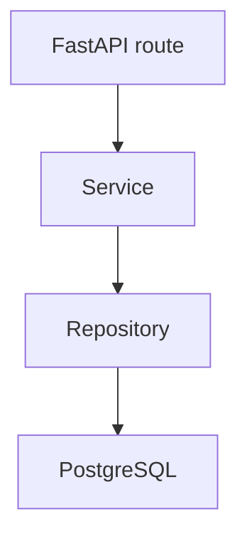

# Разработка слоя репозиториев бизнес-приложения

Репозиторий — это слой, который отвечает только за доступ к данным:

- пишет SQL;
- читает результаты запросов;
- ничего не знает про HTTP;
- не содержит бизнес-правил.

В проекте `business_todo` репозитории лежат в `src/repositories`:

- `user_repo.py`
- `task_repo.py`
- `token_repo.py`

Все они используют `get_db_cursor()` из `src/db/context.py`, поэтому:

- соединение берётся из пула;
- при успешной операции выполняется `commit()`;
- при ошибке выполняется `rollback()`;
- строки возвращаются как словари.

## Актуальная схема БД

Фактическая схема описана в `db_init.sql`.

### Таблица `users`

```sql
CREATE TABLE users (
    user_id SERIAL PRIMARY KEY,
    first_name VARCHAR(50) NOT NULL,
    last_name VARCHAR(50) NOT NULL,
    email VARCHAR(120) UNIQUE NOT NULL,
    phone VARCHAR(20),
    password_hash VARCHAR(255) NOT NULL,
    role VARCHAR(20) NOT NULL DEFAULT 'customer',
    status VARCHAR(20) NOT NULL DEFAULT 'active',
    created_at TIMESTAMP DEFAULT CURRENT_TIMESTAMP
);
```

### Таблица `tasks`

```sql
CREATE TABLE tasks (
    task_id SERIAL PRIMARY KEY,
    task_text VARCHAR(200) NOT NULL,
    description VARCHAR(2000),
    customer_id INTEGER NOT NULL REFERENCES users(user_id),
    executor_id INTEGER REFERENCES users(user_id),
    status VARCHAR(20) NOT NULL DEFAULT 'new',
    priority VARCHAR(20) NOT NULL,
    deadline TIMESTAMP,
    completed_at TIMESTAMP,
    created_at TIMESTAMP DEFAULT CURRENT_TIMESTAMP,
    updated_at TIMESTAMP DEFAULT CURRENT_TIMESTAMP
);
```

### Таблица `refresh_tokens`

```sql
CREATE TABLE refresh_tokens (
    id SERIAL PRIMARY KEY,
    user_id INTEGER NOT NULL REFERENCES users(user_id) ON DELETE CASCADE,
    token VARCHAR(500) UNIQUE NOT NULL,
    expires_at TIMESTAMP NOT NULL,
    created_at TIMESTAMP DEFAULT CURRENT_TIMESTAMP
);
```

### Индексы в текущей версии

```sql
CREATE INDEX idx_users_email ON users(email);
CREATE INDEX idx_tasks_customer ON tasks(customer_id);
CREATE INDEX idx_tasks_executor ON tasks(executor_id);
CREATE INDEX idx_tasks_status ON tasks(status);
```

Важно:

- в текущем `db_init.sql` нет `CHECK`-ограничений на `status`, `role` и `priority`;
- в коде принято использовать значения `customer`, `executor`, `admin` для ролей;
- для пользователей в коде проверяется статус `active`, а неактивные пользователи считаются заблокированными на уровне бизнес-логики.

## Архитектурная роль репозиториев

Связка слоёв в `business_todo` выглядит так:



Репозиторий:

- не знает про `Depends`, `HTTPException`, `response_model`;
- не решает, можно ли пользователю выполнять действие;
- просто возвращает данные или меняет их в БД.

## `UserRepository`

Файл: [user_repo.py].

Основные методы:

- `get_by_id(user_id)`
- `get_by_email(email)`
- `get_all(role=None, status=None)`
- `create(...)`
- `update(user_id, **kwargs)`

### Пример чтения пользователя по email

```python
@staticmethod
def get_by_email(email: str) -> Optional[dict]:
    with get_db_cursor() as cursor:
        cursor.execute(
            "SELECT * FROM users WHERE email = %s",
            (email,)
        )
        return cursor.fetchone()
```

Здесь важно:

- используется параметризованный запрос `%s`;
- SQL-инъекции исключаются драйвером;
- результатом будет либо словарь пользователя, либо `None`.

### Пример динамического обновления

```python
@staticmethod
def update(user_id: int, **kwargs) -> Optional[dict]:
    if not kwargs:
        return UserRepository.get_by_id(user_id)

    kwargs.pop("user_id", None)

    fields = ", ".join([f"{k} = %s" for k in kwargs.keys()])
    values = list(kwargs.values()) + [user_id]

    with get_db_cursor() as cursor:
        cursor.execute(
            f"UPDATE users SET {fields} WHERE user_id = %s RETURNING *",
            values
        )
        return cursor.fetchone()
```

Особенности:

- если обновлять нечего, возвращается текущее состояние пользователя;
- `user_id` из входных данных принудительно игнорируется;
- обновляются только те поля, которые передал сервис.

## `TaskRepository`

Файл: `task_repo.py`

Основные методы:

- `get_all(...)`
- `get_by_id(task_id)`
- `create(...)`
- `update(task_id, **kwargs)`
- `delete(task_id)`

### Получение списка задач с фильтрацией

```python
@staticmethod
def get_all(
        status: Optional[str] = None,
        priority: Optional[str] = None,
        customer_id: Optional[int] = None,
        executor_id: Optional[int] = None,
        page: int = 1,
        limit: int = 20
) -> Tuple[List[dict], int]:
```

Метод:

- строит SQL динамически;
- поддерживает фильтры по `status`, `priority`, `customer_id`, `executor_id`;
- делает отдельный `COUNT(*)` для общего количества записей;
- возвращает кортеж `(tasks, total)`.

В выборке используются `LEFT JOIN`, чтобы сразу подтянуть данные заказчика и исполнителя:

```sql
LEFT JOIN users c ON t.customer_id = c.user_id
LEFT JOIN users e ON t.executor_id = e.user_id
```

Это позволяет сервису потом собрать вложенные объекты `customer` и `executor`.

### Создание задачи

```python
@staticmethod
def create(task_text: str, description: str, customer_id: int, priority: str,
           deadline: Optional[str]) -> dict:
    now = datetime.utcnow()
    with get_db_cursor() as cursor:
        cursor.execute(
            """INSERT INTO tasks (task_text, description, customer_id, priority, deadline, status, created_at, updated_at)
               VALUES (%s, %s, %s, %s, %s, 'new', %s, %s)
               RETURNING *""",
            (task_text, description, customer_id, priority, deadline, now, now)
        )
        return cursor.fetchone()
```

Сервис передаёт сюда уже проверенные данные. Репозиторий только вставляет запись.

### Обновление задачи

```python
@staticmethod
def update(task_id: int, **kwargs) -> Optional[dict]:
    if not kwargs:
        return TaskRepository.get_by_id(task_id)

    if kwargs.get("status") == "completed":
        kwargs["completed_at"] = datetime.utcnow()

    kwargs["updated_at"] = datetime.utcnow()
    fields = ", ".join([f"{k} = %s" for k in kwargs.keys()])
    values = list(kwargs.values()) + [task_id]

    with get_db_cursor() as cursor:
        cursor.execute(
            f"UPDATE tasks SET {fields} WHERE task_id = %s RETURNING *",
            values
        )
        return cursor.fetchone()
```

Особенность текущей реализации:

- если статус меняется на `completed`, репозиторий сам выставляет `completed_at`;
- `updated_at` проставляется автоматически при любом обновлении.

### Удаление задачи

```python
@staticmethod
def delete(task_id: int) -> bool:
    with get_db_cursor() as cursor:
        cursor.execute("DELETE FROM tasks WHERE task_id = %s", (task_id,))
        return cursor.rowcount > 0
```

Важно: в текущем backend-е используется настоящее удаление через `DELETE`, а не перевод задачи в статус `cancelled`.

## `TokenRepository`

Файл: `token_repo.py`

Методы:

- `create(user_id, token, expires_days=7)`
- `get_by_token(token)`
- `delete_by_user_id(user_id)`
- `delete(token)`

### Зачем нужен отдельный репозиторий токенов

В проекте refresh token хранится в таблице `refresh_tokens`, чтобы можно было:

- завершать сессию через logout;
- не принимать старый refresh token после удаления;
- ограничивать обновление access token только известными токенами.

Пример чтения токена:

```python
@staticmethod
def get_by_token(token: str) -> Optional[dict]:
    with get_db_cursor() as cursor:
        cursor.execute(
            "SELECT * FROM refresh_tokens WHERE token = %s AND expires_at > %s",
            (token, datetime.utcnow())
        )
        return cursor.fetchone()
```

## Почему здесь везде `%s`

Для `psycopg2` параметризованные запросы пишутся через `%s`:

```python
cursor.execute("SELECT * FROM users WHERE email = %s", (email,))
```

Так делать правильно.

Неправильно:

```python
query = f"SELECT * FROM users WHERE email = '{email}'"
```

Причина:

- f-строки и конкатенация открывают путь к SQL-инъекциям;
- параметризованный запрос безопасно экранирует значение.

## Что покрывают тесты репозиториев

Актуальные unit-тесты лежат в `tests/unit/test_repository.py`

Они проверяют:

- чтение пользователей по `id` и `email`;
- фильтрацию списка пользователей;
- создание и обновление пользователя;
- фильтрацию и пагинацию задач;
- создание, обновление и удаление задачи;
- работу `TokenRepository`.

Запуск:

```bash
cd databases/business_todo
pytest -v tests/unit/test_repository.py
```

## Итог

В текущем `business_todo` репозитории:

- работают через `psycopg2`;
- получают курсор из общего context manager;
- используют параметризованные SQL-запросы;
- ничего не знают про HTTP и права доступа;
- отдают сервисам сырой, но уже удобный результат в виде словарей.

Это и есть актуальная база для следующего слоя — сервисов.
