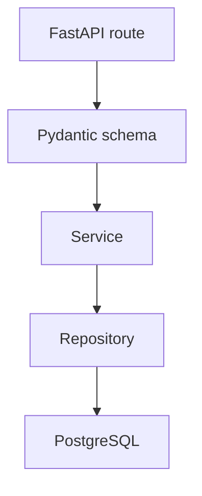
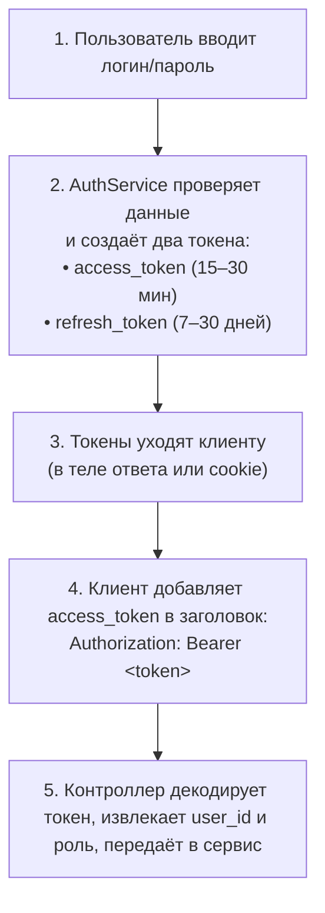

# Разработка функционального слоя бизнес-приложения

Сервисный слой — это место, где находится бизнес-логика:

- проверки ролей и прав доступа;
- правила регистрации и входа;
- работа с refresh token;
- ограничения на изменение задач и профилей;
- подготовка данных перед ответом API.

В `business_todo` сервисы лежат в `src/services`:

- `auth_service.py`
- `user_service.py`
- `task_service.py`

## Роль сервисного слоя

Архитектура проекта выглядит так:



### Что делает сервис

- принимает уже провалидированные данные;
- вызывает репозитории;
- применяет бизнес-правила;
- выбрасывает `ValidationError`, если правило нарушено;
- возвращает результат роуту.

### Что сервис не делает

- не использует `HTTPException`;
- не читает `request`;
- не знает ничего про `Depends`;
- не пишет SQL напрямую.

## Общий стиль сервиса в проекте

Во всех трёх сервисах:

- методы сделаны как `@staticmethod`;
- репозитории возвращают словари;
- бизнес-ошибки оформляются через `ValidationError`;
- HTTP-коды назначаются уже в контроллерах.

Исключение проекта:

```python
class ValidationError(Exception):
    def __init__(self, message: str, field: str = None):
        super().__init__(message)
        self.message = message
        self.field = field
```

Это позволяет, например, вернуть понятную ошибку для конкретного поля:

```python
raise ValidationError("Email already registered", "email")
```

## Как работают JWT-токены в business_todo

### Что такое JWT простыми словами

**JWT (JSON Web Token)** — это как «электронный пропуск» для пользователя.

Представь:
- Ты зашёл в офис, показал паспорт на ресепшене → получил бейдж с чипом.
- Теперь ходишь по офису: показываешь бейдж турникету, кофемашине, принтеру.
- Никто не спрашивает паспорт каждый раз — достаточно бейджа.
- У бейджа есть срок действия. И его можно аннулировать, если сотрудник уволился.

**JWT работает так же:**




## `AuthService`

Файл: `auth_service.py`

Отвечает за:

- `login`
- `register`
- `logout`
- `refresh_token`


### Вход пользователя

```python
@staticmethod
    def login(email: str, password: str) -> dict:
        """
        Аутентификация пользователя по email и паролю.
        
        Логика:
        1. Ищем пользователя в БД.
        2. Проверяем пароль и статус аккаунта.
        3. Если всё ок — генерируем пару токенов (Access + Refresh).
        4. Сохраняем Refresh токен в БД (для возможности отзыва/logout).
        5. Возвращаем токены и данные пользователя.
        """
        
        # 1. Получаем пользователя из БД по email
        user = UserRepository.get_by_email(email)
        
        # 2. Проверка: пользователь существует И пароль верный?
        # verify_password сравнивает введенный пароль с хешем в БД
        if not user or not verify_password(password, user["password_hash"]):
            # Если нет такого юзера или пароль неверный — кидаем общую ошибку
            # (чтобы не подсказывать атаующему, что именно не так)
            raise ValidationError("Invalid credentials")

        # 3. Проверка: активен ли аккаунт?
        if user["status"] != "active":
            raise ValidationError("User account is blocked")

        # 4. Генерация Access Token (живёт мало, например, 15-30 мин)
        # В payload кладем ID пользователя и его роль
        access_token = create_access_token(
            data={"sub": str(user["user_id"]), "role": user["role"]},
            expires_delta=timedelta(minutes=settings.ACCESS_TOKEN_EXPIRE_MINUTES)
        )
        
        # 5. Генерация Refresh Token (живёт долго, например, 7 дней)
        # В payload обычно только ID, роль не обязательна, так как он используется только для получения нового access
        refresh_token = create_refresh_token(
            data={"sub": str(user["user_id"])},
            expires_delta=timedelta(days=settings.REFRESH_TOKEN_EXPIRE_DAYS)
        )

        # 6. Сохраняем Refresh Token в БД
        # Это нужно, чтобы при logout мы могли удалить его из БД и сделать невалидным
        TokenRepository.create(
            user_id=user["user_id"], 
            token=refresh_token, 
            expires_days=settings.REFRESH_TOKEN_EXPIRE_DAYS
        )

        # 7. Формируем ответ
        # Убираем password_hash из данных пользователя перед отправкой клиенту
        safe_user_data = {k: v for k, v in user.items() if k != "password_hash"}
        
        return {
            "accessToken": access_token,
            "refreshToken": refresh_token,
            "expiresIn": settings.ACCESS_TOKEN_EXPIRE_MINUTES * 60,  # Срок жизни в секундах
            "user": safe_user_data
        }
```

Правила:

- пользователь должен существовать;
- пароль должен совпадать;
- статус должен быть `active`.

После этого сервис генерирует:

- `accessToken`
- `refreshToken`
- `expiresIn`
- `user` без поля `password_hash`

### Регистрация

```python
@staticmethod
    def register(
            first_name: str,
            last_name: str,
            email: str,
            password: str,
            phone: str = None,
            role: str = "customer"
    ) -> dict:
        """
        Регистрация нового пользователя.
        
        Логика:
        1. Проверяем, разрешена ли регистрация с такой ролью.
        2. Проверяем, не занят ли email.
        3. Хэшируем пароль.
        4. Создаем запись в БД.
        5. Сразу выдаем токены (авто-логин после регистрации).
        """
        
        # 1. Проверка роли: регистрироваться можно только как заказчик или исполнитель
        # Админов через публичную регистрацию создавать нельзя (безопасность)
        if role not in ["customer", "executor"]:
            raise ValidationError("Invalid role for registration")

        # 2. Проверка уникальности email
        existing = UserRepository.get_by_email(email)
        if existing:
            # Вторым аргументом передаем имя поля, чтобы фронтенд мог подсветить конкретное поле
            raise ValidationError("Email already registered", "email")

        # 3. Хешируем пароль перед сохранением
        # Никогда не храним пароли в открытом виде!
        password_hash = get_password_hash(password)
        
        # 4. Создаем пользователя в БД
        user = UserRepository.create(
            first_name=first_name, 
            last_name=last_name, 
            email=email, 
            password_hash=password_hash, 
            phone=phone, 
            role=role
        )

        # 5. Генерируем токены (так же, как в login)
        access_token = create_access_token(
            data={"sub": str(user["user_id"]), "role": user["role"]},
            expires_delta=timedelta(minutes=settings.ACCESS_TOKEN_EXPIRE_MINUTES)
        )
        refresh_token = create_refresh_token(
            data={"sub": str(user["user_id"])},
            expires_delta=timedelta(days=settings.REFRESH_TOKEN_EXPIRE_DAYS)
        )

        # 6. Сохраняем refresh токен в БД
        TokenRepository.create(user["user_id"], refresh_token, settings.REFRESH_TOKEN_EXPIRE_DAYS)

        # 7. Возвращаем результат
        safe_user_data = {k: v for k, v in user.items() if k != "password_hash"}
        
        return {
            "accessToken": access_token,
            "refreshToken": refresh_token,
            "expiresIn": settings.ACCESS_TOKEN_EXPIRE_MINUTES * 60,
            "user": safe_user_data
        }
```

Особенности текущей реализации:

- зарегистрироваться можно только как `customer` или `executor`;
- роль `admin` через публичную регистрацию запрещена;
- пароль хешируется через `get_password_hash`;
- после регистрации пользователь сразу получает пару токенов.

### Logout и refresh token

Текущий backend хранит refresh token в таблице `refresh_tokens`.

При logout:

```python
@staticmethod
    def logout(user_id: int) -> dict:
        """
        Выход пользователя из системы.
        
        Логика:
        1. Удаляем все активные refresh токены этого пользователя из БД.
        2. Теперь даже если у клиента остался старый refresh token, 
           сервер его отвергнет, так как записи в БД больше нет.
        """
        TokenRepository.delete_by_user_id(user_id)
        return {"message": "Logged out"}
```

При refresh:

```python
@staticmethod
    def refresh_token(refresh_token: str) -> dict:
        """
        Обновление Access Token с помощью Refresh Token.
        
        Логика:
        1. Проверяем, что токен передан.
        2. Декодируем токен и проверяем его подпись и тип (должен быть 'refresh').
        3. Проверяем наличие токена в БД (не был ли он отозван через logout).
        4. Находим пользователя по ID из токена.
        5. Выдаем новый Access Token.
        """
        
        # 1. Базовая проверка на пустоту
        if not refresh_token:
            raise ValidationError("Refresh token required")

        # 2. Декодируем токен
        # decode_token проверяет подпись и срок действия (exp)
        payload = decode_token(refresh_token)
        
        # Если токен поддельный, истекший или имеет неверный тип
        if not payload or payload.get("type") != "refresh":
            raise ValidationError("Invalid refresh token")

        # 3. Проверяем наличие токена в БД
        # Если записи нет — значит, пользователь сделал logout, и этот токен больше не действителен
        stored = TokenRepository.get_by_token(refresh_token)
        if not stored:
            raise ValidationError("Refresh token not found or expired")

        # 4. Получаем свежие данные пользователя из БД
        # (вдруг его заблокировали или изменили роль пока токен был активен)
        user = UserRepository.get_by_id(stored["user_id"])
        if not user:
            raise ValidationError("User not found")

        # 5. Генерируем НОВЫЙ Access Token
        new_access = create_access_token(
            data={"sub": str(user["user_id"]), "role": user["role"]},
            expires_delta=timedelta(minutes=settings.ACCESS_TOKEN_EXPIRE_MINUTES)
        )

        # 6. Возвращаем только новый access token
        # Refresh token обычно не меняют при каждом обновлении (хотя можно и ротировать)
        return {
            "accessToken": new_access,
            "expiresIn": settings.ACCESS_TOKEN_EXPIRE_MINUTES * 60
        }
```

Зачем хранить refresh token в БД:

- можно завершить сессию при logout;
- можно запретить использование старого токена после удаления;
- можно контролировать срок действия не только по JWT, но и по записи в БД.

## `UserService`

Файл: `user_service.py`

Отвечает за:

- `get_me`
- `get_users`
- `update_user`

### `get_me`

```python
@staticmethod
@staticmethod
    def get_me(user_id: int) -> dict:
        """
        Получить данные текущего авторизованного пользователя.
        
        Логика:
        1. Ищем пользователя в БД по ID (ID берется из декодированного JWT токена).
        2. Если не найден — ошибка (такое бывает редко, если токен валидный, но пользователь удален).
        3. Удаляем поле password_hash перед отправкой клиенту.
        """
        
        # 1. Запрос в БД
        user = UserRepository.get_by_id(user_id)
        
        # 2. Проверка существования
        if not user:
            raise ValidationError("User not found")

        # 3. Фильтрация чувствительных данных
        # Возвращаем все поля, кроме хеша пароля
        return {k: v for k, v in user.items() if k != "password_hash"}
```

Сервис возвращает профиль текущего пользователя без `password_hash`.

### `get_users`

```python
@staticmethod
    def get_users(
            role: Optional[str] = None,
            status: Optional[str] = None,
            current_user: Optional[dict] = None
    ) -> dict:
        """
        Получить список пользователей с фильтрацией.
        
        ВАЖНО: Доступно только для роли 'admin'.
        
        Аргументы:
        - role: фильтр по роли (например, 'customer', 'executor')
        - status: фильтр по статусу (например, 'active', 'blocked')
        - current_user: словарь с данными текущего пользователя (из JWT)
        """
        
        # 1. Проверка прав доступа (Authorization)
        # Только администратор может видеть список всех пользователей
        if current_user["role"] != "admin":
            raise ValidationError("Not enough permissions")

        # 2. Получение списка из БД с применением фильтров
        # Репозиторий сам обработает None значения (если фильтр не задан, он игнорируется)
        users = UserRepository.get_all(role=role, status=status)
        
        # 3. Очистка данных от паролей
        # Проходимся по каждому пользователю и убираем password_hash
        safe_users = [
            {k: v for k, v in u.items() if k != "password_hash"} 
            for u in users
        ]

        # 4. Возврат структуры с пагинацией (или просто списком)
        return {
            "users": safe_users,
            "total": len(safe_users)  # Общее количество найденных пользователей
        }
```

Список пользователей в текущем backend-е может получать только `admin`.

Сервис:

- применяет фильтры `role` и `status`;
- убирает `password_hash` из каждого пользователя;
- возвращает структуру:

```python
{
    "users": [...],
    "total": len(users)
}
```

### `update_user`

```python
@staticmethod
    def update_user(user_id: int, update_data: dict, current_user: dict) -> dict:
        """
        Обновить данные пользователя.
        
        Логика прав доступа:
        - Админ может обновлять любого пользователя.
        - Обычный пользователь может обновлять ТОЛЬКО свой профиль.
        
        Дополнительные проверки:
        - При смене email проверяем, не занят ли он другим пользователем.
        """
        
        # 1. Проверка прав доступа
        # Разрешаем обновление, если:
        # а) текущий пользователь — админ
        # б) ИЛИ текущий пользователь обновляет свой собственный профиль
        if current_user["role"] != "admin" and current_user["user_id"] != user_id:
            raise ValidationError("Not enough permissions")

        # 2. Проверка существования пользователя, которого хотят обновить
        user = UserRepository.get_by_id(user_id)
        if not user:
            raise ValidationError("User not found")

        # 3. Проверка уникальности email (если email пытаются изменить)
        if "email" in update_data and update_data["email"]:
            new_email = update_data["email"]
            
            # Ищем, есть ли уже такой email в базе
            existing = UserRepository.get_by_email(new_email)
            
            # Если нашли запись, И это НЕ тот же самый пользователь (значит, email занят кем-то другим)
            if existing and existing["user_id"] != user_id:
                raise ValidationError("Email already registered", "email")

        # 4. Обновление данных в БД
        # Передаем только те поля, которые пришли в update_data
        # Репозиторий должен уметь обрабатывать частичное обновление (PATCH logic)
        updated_user = UserRepository.update(user_id, **update_data)
        
        # 5. Возвращаем обновленные данные (без пароля, на всякий случай, хотя репозиторий может вернуть всё)
        return {k: v for k, v in updated_user.items() if k != "password_hash"}
```

Правила:

- обычный пользователь может обновлять только свой профиль;
- `admin` может обновить любой профиль;
- при смене email проверяется уникальность;
- обновление передаётся в репозиторий как частичный словарь.

## `TaskService`

Файл: `task_service.py`

Отвечает за:

- `get_tasks`
- `get_task`
- `create_task`
- `update_task`
- `delete_task`
- `claim_task`

### Получение списка задач

```python
@staticmethod
    def get_tasks(
            status: Optional[str] = None,
            priority: Optional[str] = None,
            customer_id: Optional[int] = None,
            executor_id: Optional[int] = None,
            page: int = 1,
            limit: int = 20
    ) -> dict:
        """
        Получить список задач с фильтрацией и пагинацией.
        
        Логика:
        1. Запрашиваем данные из БД через репозиторий.
           Репозиторий возвращает "плоские" строки (JOIN с таблицей users),
           где поля заказчика и исполнителя лежат рядом с полями задачи.
        2. Преобразуем плоскую структуру в вложенную (customer: {...}, executor: {...}).
        3. Возвращаем список задач и общее количество (для пагинации на фронтенде).
        """
        
        # 1. Получение сырых данных из БД
        tasks, total = TaskRepository.get_all(
            status=status,
            priority=priority,
            customer_id=customer_id,
            executor_id=executor_id,
            page=page,
            limit=limit
        )

        # 2. Преобразование данных (Mapping)
        # Превращаем плоский SQL-ответ в удобный JSON-объект
        for task in tasks:
            # Если есть данные заказчика, формируем вложенный объект
            if task.get("customer_first_name"):
                task["customer"] = {
                    "user_id": task["customer_id"],
                    "first_name": task["customer_first_name"],
                    "last_name": task["customer_last_name"],
                    "email": task["customer_email"]
                }
                # Удаляем плоские поля, чтобы не засорять ответ
                del task["customer_first_name"]
                del task["customer_last_name"]
                del task["customer_email"]

            # Если есть данные исполнителя, формируем вложенный объект
            if task.get("executor_first_name"):
                task["executor"] = {
                    "user_id": task["executor_id"],
                    "first_name": task["executor_first_name"],
                    "last_name": task["executor_last_name"],
                    "email": task["executor_email"]
                }
                # Удаляем плоские поля
                del task["executor_first_name"]
                del task["executor_last_name"]
                del task["executor_email"]

        # 3. Возврат результата с мета-информацией для пагинации
        return {
            "tasks": tasks,
            "total": total,
            "page": page,
            "limit": limit
        }
```

Сервис:

- получает плоские строки из `JOIN`;
- преобразует их во вложенные структуры `customer` и `executor`;
- возвращает:

```python
{
    "tasks": tasks,
    "total": total,
    "page": page,
    "limit": limit
}
```

### Получение одной задачи

```python
@staticmethod
    def get_task(task_id: int, current_user: dict) -> dict:
        """
        Получить одну задачу по ID.
        
        Логика безопасности:
        - Исполнитель (executor) может видеть ТОЛЬКО свои задачи.
        - Заказчик (customer) и Админ видят все задачи (в текущей реализации).
        """
        
        # 1. Получаем задачу из БД
        task = TaskRepository.get_by_id(task_id)
        if not task:
            raise ValidationError("Task not found")
        
        # 2. Проверка прав доступа для исполнителя
        # Если роль 'executor', проверяем, что он назначен именно на эту задачу
        if current_user["role"] == "executor" and task["executor_id"] != current_user["user_id"]:
            raise ValidationError("Not enough permissions")

        # 3. Преобразование плоских данных во вложенные (так же, как в get_tasks)
        if task.get("customer_first_name"):
            task["customer"] = {
                "user_id": task["customer_id"],
                "first_name": task["customer_first_name"],
                "last_name": task["customer_last_name"],
                "email": task["customer_email"]
            }
            del task["customer_first_name"]
            del task["customer_last_name"]
            del task["customer_email"]

        if task.get("executor_first_name"):
            task["executor"] = {
                "user_id": task["executor_id"],
                "first_name": task["executor_first_name"],
                "last_name": task["executor_last_name"],
                "email": task["executor_email"]
            }
            del task["executor_first_name"]
            del task["executor_last_name"]
            del task["executor_email"]

        return task
```

В текущей реализации:

- `executor` может открывать только задачу, назначенную ему;
- для остальных ролей дополнительная проверка на этом уровне не применяется.

### Создание задачи

```python
@staticmethod
    def create_task(
            task_text: str,
            priority: str,
            description: Optional[str] = None,
            deadline: Optional[str] = None,
            current_user: Optional[dict] = None
    ) -> dict:
        """
        Создать новую задачу.
        
        Правила:
        - Создавать задачи могут только 'customer' и 'admin'.
        - customer_id берется автоматически из токена текущего пользователя.
          (Клиент не может создать задачу от чужого имени).
        """
        
        # 1. Проверка роли
        if current_user["role"] not in ["admin", "customer"]:
            raise ValidationError("Not enough permissions to create tasks")
        
        # 2. Создание записи в БД
        # customer_id принудительно устанавливаем из текущей сессии
        task = TaskRepository.create(
            task_text=task_text,
            description=description,
            customer_id=current_user["user_id"],
            priority=priority,
            deadline=deadline
        )
        return task
```

Правила:

- задачу создаёт только `customer` или `admin`;
- `customer_id` всегда берётся из `current_user["user_id"]`;
- клиент не может сам подставить произвольного заказчика.

### Обновление задачи

Сервис задаёт разные правила по ролям:

```python
@staticmethod
    def update_task(task_id: int, update_data: dict, current_user: dict) -> dict:
        """
        Обновить задачу. Самая сложная часть логики прав доступа.
        
        Матрица прав:
        - Admin: может менять всё (текст, дедлайн, исполнителя, статус).
        - Customer: может менять только СВОИ задачи и только описание/приоритет/дедлайн.
                    Не может менять исполнителя или статус (это делает исполнитель).
        - Executor: может менять только СВОИ задачи и только статус (например, на 'done').
        """
        
        # 1. Получаем текущее состояние задачи
        task = TaskRepository.get_by_id(task_id)
        if not task:
            raise ValidationError("Task not found")

        # 2. Определяем список разрешенных полей в зависимости от роли
        allowed_fields = []
        
        if current_user["role"] == "admin":
            # Админ может менять всё
            allowed_fields = ["task_text", "description", "priority",
                              "deadline", "executor_id", "status"]
        
        elif current_user["role"] == "customer":
            # Заказчик может менять только свои задачи
            if task["customer_id"] != current_user["user_id"]:
                raise ValidationError("Not your task")
            # Но не может назначать исполнителя или менять статус напрямую
            allowed_fields = ["task_text", "description", "priority", "deadline"]
        
        elif current_user["role"] == "executor":
            # Исполнитель может менять только свои задачи
            if task["executor_id"] != current_user["user_id"]:
                raise ValidationError("Not your task")
            # И только статус (выполнено/в процессе)
            allowed_fields = ["status"]
        
        else:
            raise ValidationError("Not enough permissions")

        # 3. Фильтрация входных данных
        # Проходим по всем полям, которые прислал клиент, и оставляем только разрешенные
        validated = {}
        for field, value in update_data.items():
            # Пропускаем None значения (если поле не передано или явно null)
            if value is None:
                continue
            
            # Если поле не входит в список разрешенных для этой роли — ошибка
            if field not in allowed_fields:
                raise ValidationError(f"Cannot update {field}")
            
            validated[field] = value

        # Если после фильтрации ничего не осталось обновлять — возвращаем задачу как есть
        if not validated:
            return task

        # 4. Обновление в БД
        return TaskRepository.update(task_id, **validated)
```

Итоговая таблица прав:

| Роль | Что может менять |
|---|---|
| `admin` | `task_text`, `description`, `priority`, `deadline`, `executor_id`, `status` |
| `customer` | только свою задачу и только `task_text`, `description`, `priority`, `deadline` |
| `executor` | только свою задачу и только `status` |

Перед записью сервис ещё фильтрует входные поля:

```python
validated = {}
for field, value in update_data.items():
    if value is None:
        continue
    if field not in allowed_fields:
        raise ValidationError(f"Cannot update {field}")
    validated[field] = value
```

### Удаление задачи

```python
@staticmethod
    def delete_task(task_id: int, current_user: dict) -> dict:
        """
        Удалить задачу.
        
        Правила:
        - Удалить может только Админ или Владелец задачи (Customer).
        - Исполнитель не может удалять задачи, даже если они его.
        """
        
        # 1. Получаем задачу
        task = TaskRepository.get_by_id(task_id)
        if not task:
            raise ValidationError("Task not found")

        # 2. Проверка прав
        # Админ может всё. Обычный пользователь — только если он создатель (customer_id)
        if current_user["role"] != "admin" and task["customer_id"] != current_user["user_id"]:
            raise ValidationError("Not enough permissions")

        # 3. Физическое удаление из БД
        TaskRepository.delete(task_id)
        return {"message": "Task deleted"}
```

Важно: текущий backend действительно удаляет задачу из БД, а не меняет статус на `cancelled`.

### Взятие задачи в работу через `claim_task`

Это отдельная бизнес-операция.

```python
@staticmethod
    def claim_task(task_id: int, current_user: dict) -> dict:
        """
        Взять задачу в работу (для исполнителей).
        
        Бизнес-логика:
        1. Только роль 'executor' может брать задачи.
        2. Задача должна быть в статусе 'new' (новая).
        3. Задача не должна быть уже занята другим исполнителем.
        4. При успехе: назначаем текущего пользователя исполнителем и меняем статус на 'in_progress'.
        """
        
        # 1. Проверка роли
        if current_user["role"] != "executor":
            raise ValidationError("Only executors can claim tasks")

        # 2. Получаем задачу
        task = TaskRepository.get_by_id(task_id)
        if not task:
            raise ValidationError("Task not found")

        # 3. Проверка статуса
        # Брать можно только новые задачи
        if task["status"] != "new":
            raise ValidationError(f"Cannot claim task with status '{task['status']}'")

        # 4. Проверка занятости
        # Если executor_id уже заполнен и это НЕ текущий пользователь — задача чужая
        if task["executor_id"] is not None and task["executor_id"] != current_user["user_id"]:
            raise ValidationError("Task is already assigned to another executor")

        # 5. Обновление задачи
        # Назначаем себя исполнителем и меняем статус
        updated = TaskRepository.update(
            task_id,
            executor_id=current_user["user_id"],
            status="in_progress"
        )

        return updated
```

Правила:

- брать задачу в работу может только `executor`;
- задача должна быть в статусе `new`;
- задача не должна быть занята другим исполнителем;
- после успеха автоматически выставляются:
  - `executor_id`
  - `status="in_progress"`

## Актуальные тесты сервисного слоя

Тесты лежат в:

- `tests/unit/test_service.py`

Они покрывают:

- login / register / logout / refresh token;
- запрет регистрации с ролью `admin`;
- получение профиля;
- список пользователей только для `admin`;
- обновление профиля и проверку уникальности email;
- создание, обновление и удаление задач;
- ролевые ограничения;
- сценарии `claim_task`.

Запуск:

```bash
cd databases/business_todo
pytest -v tests/unit/test_service.py
```

## Итог

Сервисный слой `business_todo` сейчас отвечает именно за это:

- `AuthService` управляет аутентификацией и refresh token;
- `UserService` ограничивает доступ к списку пользователей и обновлению профилей;
- `TaskService` реализует ролевую модель для задач и отдельную операцию `claim_task`.

Именно сервисы содержат правила приложения. Репозитории только читают и пишут данные, а контроллеры только преобразуют ошибки сервиса в HTTP-ответы.
