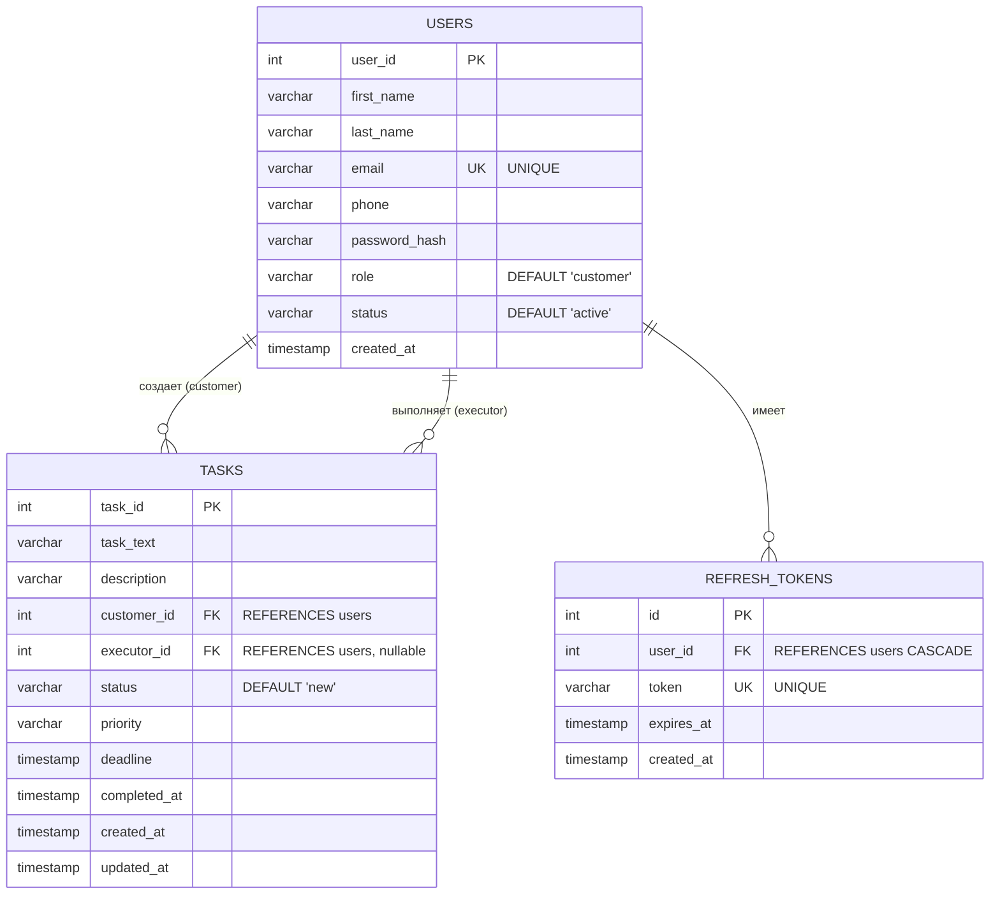

# 1 учебный вопрос. Установка библиотек и подключение базы данных PostgreSQL к приложению

## Введение и план на занятие

В рамках первого учебного вопроса нам предстоит заложить фундаментальную архитектурную и инфраструктурную базу разрабатываемого программного решения. На данном этапе осуществляется не просто установка необходимых библиотек, а формирование полноценного каркаса проекта business_todo, настройка корректного взаимодействия с системой управления базами данных (СУБД) и инициализация веб-сервера. Следует особо подчеркнуть, что непосредственная разработка бизнес-логики и функционального слоя самого приложения будет осуществляться на следующем занятии. Текущая задача заключается в обеспечении надежной среды для последующей разработки.

**Цели и задачи, рассматриваемые в рамках данного учебного вопроса:**

1. Подготовка и конфигурация рабочего окружения в операционной системе Astra Linux (инициализация директории проекта, настройка среды разработки VS Code).
2. Развертывание виртуального окружения Python и инсталляция проектных зависимостей для обеспечения строгой изоляции пакетов.
3. Организация безопасного управления конфигурацией и учетными данными посредством переменных окружения (методология Twelve-Factor App).
4. Проектирование и реализация отказоустойчивого модуля подключения к СУБД PostgreSQL с использованием паттерна «пул соединений» (Connection Pool).
5. Инициализация схемы базы данных: создание таблиц, определение связей и индексов для оптимизации производительности.
6. Разработка точки входа (entry point) приложения и тестовый запуск асинхронного ASGI-сервера.

В качестве основного технологического стека выбраны следующие решения:

- **FastAPI** — высокопроизводительный современный фреймворк для построения HTTP API, базирующийся на стандартах OpenAPI и JSON Schema.
- **PostgreSQL** — объектно-реляционная система управления базами данных, отличающаяся высокой надежностью и соответствием стандартам SQL.
- **psycopg2** — наиболее распространенный и проверенный драйвер (адаптер) для взаимодействия языка Python с PostgreSQL.
- **psycopg2.pool.SimpleConnectionPool** — встроенный механизм для эффективного управления пулом соединений, снижающий накладные расходы на установку связи с БД.

_Примечание:_ В текущей реализации проекта архитектурно обосновано использование стабильной версии `psycopg2`, а не более новой спецификации `psycopg` (v3).

## Подготовка рабочего пространства (Astra Linux и Visual Studio Code)

Организация процесса разработки программного обеспечения требует строгого соблюдения файловой структуры. Поскольку работа осуществляется в защищенной операционной системе Astra Linux, первоначальная настройка производится через интерфейс командной строки (терминал, вызываемый стандартным сочетанием клавиш `Ctrl+Alt+T`).

На первом этапе необходимо создать корневую директорию проекта и осуществить переход в нее:

```bash
mkdir business_todo
cd business_todo
```

Далее требуется открыть созданную директорию в интегрированной среде разработки (IDE) Visual Studio Code. Для инициализации редактора в текущем каталоге используется следующая команда:

```bash
code .
```

После выполнения данной команды запустится графический интерфейс редактора, где в панели обозревателя (Explorer) будет отображена пустая корневая директория проекта. Все последующие операции по созданию модулей, редактированию исходного кода и управлению проектом целесообразно выполнять непосредственно в среде VS Code. Интегрированный терминал среды разработки можно вызвать через верхнее меню (`Terminal -> New Terminal`)

## Виртуальное окружение и управление зависимостями

В профессиональной разработке на языке Python категорически не рекомендуется устанавливать сторонние пакеты глобально в систему. Подобная практика неизбежно приводит к конфликтам версий библиотек между различными проектами и может нарушить стабильность работы самой операционной системы. Для решения этой проблемы применяется механизм виртуальных окружений.

Для создания изолированного виртуального окружения необходимо выполнить в интегрированном терминале следующую команду:

```bash
python3 -m venv .venv
```

После генерации окружения его необходимо активировать в контексте текущей сессии оболочки (команда, специфичная для UNIX-подобных систем, включая Astra Linux):

```bash
source .venv/bin/activate
```

_(Индикатором успешной активации служит появление префикса (.venv) в строке приглашения терминала)._

Следующим шагом является фиксация списка зависимостей. Создайте в корневой директории файл requirements.txt. Этот файл представляет собой декларативное описание всех внешних библиотек, требуемых для функционирования серверной части разрабатываемого продукта. Внесите в него следующий перечень:

```text
fastapi
psycopg2-binary
python-dotenv
python-jose
passlib
pytest
uvicorn
```

_Примечание: Использование пакета psycopg2-binary вместо базового psycopg2 продиктовано необходимостью упрощения процесса установки, поскольку бинарная версия включает в себя предварительно скомпилированные библиотеки клиентской части C (libpq), что исключает необходимость локальной компиляции исходных кодов драйвера._

Инсталляция всех декларированных зависимостей осуществляется единой командой менеджера пакетов:

```bash
pip install -r requirements.txt
```

## Структура проекта

Грамотное проектирование программного обеспечения базируется на принципе разделения ответственности (Separation of Concerns). Монолитная структура, при которой весь исходный код располагается в единственном файле `main.py`, неприемлема для масштабируемых систем. В нашем проекте будет реализована многослойная архитектура.

Создайте в VS Code такую структуру файлов и папок:

```bash
business_todo/
├── .env
├── db_init.sql
├── requirements.txt
└── src/
├── main.py
├── api/
│ └── v1/
├── core/
│ └── config.py
├── db/
│ ├── connection.py
│ └── context.py
├── repositories/
├── services/
└── schemas/
```

В рамках текущего учебного вопроса будут реализованы только компоненты, относящиеся к конфигурации (`core`), взаимодействию с базой данных (`db`) и инициализации приложения (`main.py`). Оставшиеся директории (репозитории, сервисы, схемы данных) представляют собой инфраструктурный задел для последующих занятий.

## Управление конфигурацией и безопасность (Переменные окружения)

Хранение конфигурационных параметров, таких как реквизиты доступа к базам данных, криптографические ключи и идентификаторы API, в открытом виде внутри исходного кода (hardcoding) является грубым нарушением стандартов информационной безопасности. Подобные данные могут быть скомпрометированы при публикации исходного кода в системах контроля версий. Для безопасного хранения используется механизм переменных окружения.

Создайте в корневой директории скрытый файл `.env` и определите в нем следующие константы:

```bash
HOST=127.0.0.1
PORT=8000

DB_NAME=todolist
DB_USER=postgres
DB_PASSWORD=your_password
DB_HOST=127.0.0.1
DB_PORT=5432

SECRET_KEY=your_super_secret_key
ALGORITHM=HS256
ACCESS_TOKEN_EXPIRE_MINUTES=15
REFRESH_TOKEN_EXPIRE_DAYS=7
```

_Примечание: Значение `your_password` должно быть заменено на фактический пароль суперпользователя вашей локальной СУБД PostgreSQL._

Для интеграции данных параметров в среду выполнения Python-приложения необходимо реализовать модуль конфигурации. Создайте файл `src/core/config.py` и разместите в нем следующий код

```python
import os
from dotenv import load_dotenv

load_dotenv()

class Settings:

    def __init__(self):
        self.HOST = os.getenv("HOST", "0.0.0.0")
        self.PORT = int(os.getenv("PORT", 8000))
        self.DB_HOST = os.getenv("DB_HOST", "localhost")
        self.DB_NAME = os.getenv("DB_NAME", "task_pool")
        self.DB_USER = os.getenv("DB_USER", "postgres")
        self.DB_PASSWORD = os.getenv("DB_PASSWORD", "password")
        self.DB_PORT = os.getenv("DB_PORT", "5432")

settings = Settings()
```

Данный подход обеспечивает высокую гибкость: приложение считывает параметры из внешней среды, а при их отсутствии инициализируется безопасными значениями по умолчанию.

## Организация подключения к базе данных (Пул соединений)

### Зачем нужен пул? (Файл connection.py)

Процесс установления сетевого TCP-соединения с сервером базы данных, включая этапы аутентификации и выделения памяти на стороне СУБД, является крайне ресурсоемкой операцией. Если при обработке каждого входящего HTTP-запроса сервер будет инициировать новое подключение, это приведет к экспоненциальному росту задержек (latency) и быстрому исчерпанию лимита доступных соединений СУБД.
Оптимальным архитектурным решением данной проблемы является использование пула соединений (Connection Pool). Пул представляет собой кэш предварительно установленных и поддерживаемых в активном состоянии подключений. При поступлении запроса приложение заимствует свободное соединение из пула, выполняет необходимые SQL-операции и возвращает соединение обратно, избегая накладных расходов на его создание и уничтожение.

Реализуйте данный механизм в файле `src/db/connection.py`:

```python
from psycopg2 import pool
from src.core.config import settings

connection_pool = pool.SimpleConnectionPool(
    1, 10,
    host=settings.DB_HOST,
    database=settings.DB_NAME,
    user=settings.DB_USER,
    password=settings.DB_PASSWORD,
    port=settings.DB_PORT
)

def get_db_connection():
    """Выдает свободное соединение из пула"""
    return connection_pool.getconn()

def release_db_connection(conn):
    """Возвращает соединение обратно в пул"""
    connection_pool.putconn(conn)
```

### Управление транзакциями посредством менеджера контекста (Файл `context.py`)

Получение соединения из пула — лишь первый этап. Необходимо обеспечить корректное выполнение транзакций и гарантированное освобождение ресурсов (курсоров и самого соединения) даже в случае возникновения необработанных исключений (Exceptions) на уровне интерпретатора. В языке Python для безопасного управления жизненным циклом ресурсов применяется парадигма контекстных менеджеров (оператор `with`).

Создайте файл `src/db/context.py` и добавьте следующий программный код:

```python
from contextlib import contextmanager
from psycopg2.extras import RealDictCursor
from src.db.connection import get_db_connection, release_db_connection

@contextmanager
def get_db_cursor():
    conn = get_db_connection()
    try:
        cursor = conn.cursor(cursor_factory=RealDictCursor)
        yield cursor
        conn.commit()
    except Exception as e:
        conn.rollback()
        raise e
    finally:
        cursor.close()
        release_db_connection(conn)

```

## Проектирование и инициализация физической схемы базы данных

На данном этапе проектирования необходимо сформировать физическую модель реляционной базы данных, которая будет обеспечивать персистентное хранение информации о пользователях, задачах и сессиях авторизации.

Ниже представлена ER-диаграмма (Entity-Relationship), описывающая сущности разрабатываемой системы, их атрибуты и связи между ними:



### Задание для самостоятельной реализации

Опираясь на представленную ER-диаграмму, вам необходимо **самостоятельно** написать DDL-скрипт (Data Definition Language) для инициализации базы данных.

1. **Создание базы данных:** С помощью интерфейса командной строки или графического клиента (DBeaver/pgAdmin) создайте базу данных с именем `todolist` (или именем, указанным в вашем конфигурационном файле).
2. **Написание скрипта `db_init.sql`:** В корневой директории проекта создайте файл `db_init.sql` и реализуйте SQL-запросы `CREATE TABLE` для трех указанных сущностей.
3. **Проектирование индексов:** В реляционных базах данных индексы (Indexes) критически важны для оптимизации скорости выполнения SQL-запросов. Вам необходимо самостоятельно проанализировать схему и дописать в файл `db_init.sql` команды `CREATE INDEX`.
   _Подсказка:_ Индексы (обычно B-Tree) следует создавать для тех столбцов, которые будут часто использоваться в условиях фильтрации (`WHERE`), а также для полей, участвующих в операциях соединения таблиц (`JOIN`). Подумайте, по каким полям система будет искать пользователей (например, при авторизации) и как будет осуществляться фильтрация задач.
4. **Применение миграции:** После написания скрипта примените его к созданной базе данных с помощью утилиты `psql`. Пример команды для терминала:

```bash
psql -U postgres -d todolist -f db_init.sql
```

## Разработка точки входа приложения (`main.py`)

Для функционирования API требуется центральный исполняемый файл, который будет инициализировать объект приложения FastAPI, применять глобальные конфигурации и подключать маршрутизаторы (routers).

Откройте файл `src/main.py` и имплементируйте следующий код:

```python
from fastapi import FastAPI


app = FastAPI(
    title="Business Todo API",
    version="1.0.0",
    docs_url="/api/docs",
    redoc_url="/api/redoc"
)

@app.get("/health")
def health_check():
    return {"status": "ok", "message": "Server is running"}
```

Ключевые аспекты данной реализации:

- Автоматически генерируемая документация спецификации OpenAPI (Swagger) будет доступна по пути `/api/docs`.
- Наличие эндпоинта `/health` (проверка жизнеспособности) является отраслевым стандартом при проектировании микросервисов. Он не осуществляет обращений к БД и служит исключительно для подтверждения того, что процесс веб-сервера активен и способен обрабатывать TCP/HTTP запросы

## Запуск сервера и верификация работоспособности

Завершающим этапом данного учебного вопроса является запуск приложения и тестирование его доступности. В качестве асинхронного ASGI-сервера (Asynchronous Server Gateway Interface) используется программный пакет `uvicorn`.

В активированном виртуальном окружении терминала VS Code выполните следующую команду

```bash
uvicorn src.main:app --reload --host 0.0.0.0 --port 8000
```

_Параметр --reload активирует механизм горячей перезагрузки (hot reloading) сервера при обнаружении изменений в исходном коде, что значительно ускоряет процесс отладки при разработке)_

В случае успешной инициализации в консольном выводе появится системное сообщение, подтверждающее запуск сервера на адресе `http://0.0.0.0:8000`.

## Спецификации WSGI/ASGI и назначение Uvicorn

Перед запуском приложения необходимо рассмотреть теоретические основы взаимодействия веб-серверов и веб-приложений в экосистеме языка Python.

Сам по себе фреймворк FastAPI (как и Django или Flask) **не является веб-сервером**. Это набор программных интерфейсов для маршрутизации, валидации данных и выполнения бизнес-логики. Фреймворк не обладает встроенными механизмами для открытия сетевых сокетов на уровне операционной системы, прослушивания TCP-портов и низкоуровневой обработки сырых HTTP-запросов. Для выполнения этих задач требуется отдельное программное обеспечение — веб-сервер.

Чтобы веб-сервер и Python-приложение могли "понимать" друг друга, были разработаны строгие стандарты (интерфейсы шлюзов):

### 1. Спецификация WSGI (Web Server Gateway Interface)

Исторически первым стандартом стал WSGI. Он был спроектирован исключительно для **синхронного** выполнения кода.

- **Принцип работы:** На каждый входящий HTTP-запрос выделяется отдельный поток (thread) или процесс (process).
- **Недостаток:** Если приложение обращается к базе данных или стороннему API (операции ввода-вывода), поток блокируется и переходит в режим ожидания ответа. При высокой нагрузке синхронные серверы быстро исчерпывают лимит доступных потоков, что приводит к деградации производительности.

### 2. Спецификация ASGI (Asynchronous Server Gateway Interface)

Для решения проблем блокирующего ввода-вывода был разработан стандарт ASGI — духовный наследник WSGI, спроектированный с учетом современной асинхронной парадигмы программирования (`async`/`await`).

- **Принцип работы:** ASGI-сервер использует цикл событий (Event Loop). При обращении к базе данных сервер не блокирует поток, а делегирует задачу операционной системе, мгновенно переключаясь на обработку следующего входящего запроса.
- **Преимущества:** Поддержка долгоживущих соединений (WebSockets, Server-Sent Events), высочайшая пропускная способность при минимальном потреблении оперативной памяти. Фреймворк FastAPI базируется именно на стандарте ASGI.

### Роль и назначение Uvicorn

**Uvicorn** — это высокопроизводительная реализация ASGI-сервера. Он выступает в роли связующего звена (моста) между сетевым интерфейсом операционной системы и вашим FastAPI-приложением.

**Архитектурный цикл обработки запроса выглядит следующим образом:**

1. Клиент (например, браузер или Postman) отправляет HTTP-запрос на определенный порт сервера.
2. **Uvicorn** прослушивает этот порт, принимает входящий TCP-пакет, парсит сырые байты HTTP-запроса и преобразует их в стандартизированный Python-словарь (спецификация ASGI).
3. Uvicorn передает этот словарь в объект приложения FastAPI (`app`).
4. FastAPI маршрутизирует запрос в нужный контроллер, выполняет вашу бизнес-логику и возвращает ответ обратно серверу Uvicorn.
5. Uvicorn сериализует полученные данные в HTTP-ответ и отправляет байты обратно клиенту по сети.

Таким образом, использование `uvicorn` является не просто рекомендуемым, а строго обязательным условием для функционирования асинхронных веб-приложений, написанных на FastAPI.

### Методы тестирования и верификации

1. **Проверка диагностического эндпоинта средствами командной строки:**
   Используя утилиту передачи данных по сети `curl`, выполните в новом окне терминала Astra Linux следующий запрос:

   ```bash
   curl http://localhost:8000/health
   ```

   Ожидаемый ответ в формате JSON: `{"status": "ok", "message": "Server is running"}`. Это подтверждает успешную обработку HTTP-запроса маршрутизатором FastAPI

2. **Интерактивная проверка через веб-интерфейс (Swagger UI):**
   Запустите графический веб-браузер и перейдите по следующему унифицированному указателю ресурса (URL):
   `http://localhost:8000/api/docs`
   Вам будет предоставлен графический интерфейс OpenAPI (Swagger). Данный инструмент не только автоматически документирует все доступные API-маршруты, но и предоставляет возможность их интерактивного тестирования без необходимости разработки клиентского приложения.

## Итоги учебного вопроса

В ходе данного учебного вопроса был выполнен значительный объем работ по подготовке программной инфраструктуры проекта. Подводя итоги, можно констатировать достижение следующих результатов:

- Настроена безопасная среда разработки с использованием виртуального окружения и системы управления зависимостями.
- Реализован механизм безопасной подгрузки конфигурационных параметров окружения.
- Подготовлена физическая структура реляционной базы данных PostgreSQL с оптимальной системой индексов.
- Интегрирован отказоустойчивый пул соединений, управляемый менеджером контекста.
- Успешно поднят базовый ASGI-сервер FastAPI, готовый к обработке запросов.

Как было отмечено во введении, этот надежный каркас послужит основой для следующего занятия, в рамках которого мы перейдем непосредственно к разработке самого приложения, включая программирование слоев репозиториев, бизнес-сервисов и контроллеров маршрутизации
