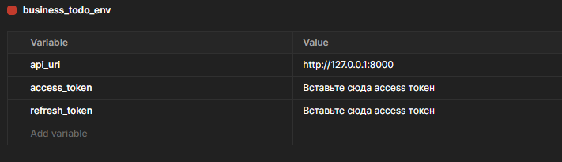
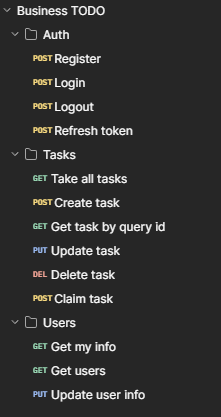
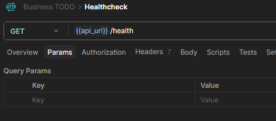
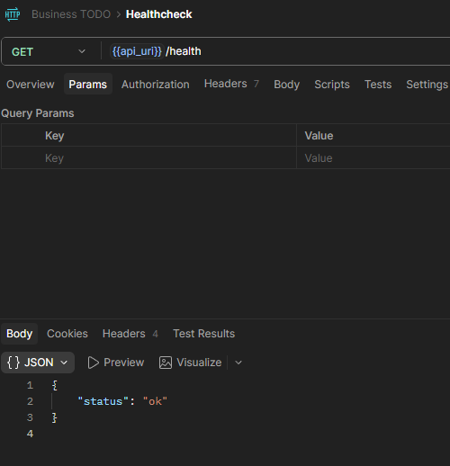

# Второй учебный вопрос. Основы работы в программном обеспечении Postman для тестирования API

## Введение в методологию тестирования API

В современной парадигме разработки программного обеспечения, все больше тяготеющей к микросервисной архитектуре, взаимодействие между различными узлами и клиентскими приложениями осуществляется посредством сетевых интерфейсов — API (Application Programming Interface). Прежде чем интегрировать серверную часть (backend) с пользовательским интерфейсом (frontend) или сторонними сервисами, критически важно верифицировать корректность работы каждого отдельного маршрута (эндпоинта).

Для решения этой задачи в индустрии стандартом де-факто стало программное обеспечение **Postman** — мощный, интуитивно понятный и масштабируемый инструментарий, предназначенный для разработки, отладки, документирования и автоматизированного тестирования API. Postman позволяет эмулировать любые клиентские запросы к серверу, что исключает необходимость написания временного клиентского кода для проверки работоспособности серверной логики.

**Фундаментальные возможности и функции Postman:**

- **Конструирование и отправка HTTP-запросов:** Инструмент предоставляет графический интерфейс для формирования запросов с использованием всех стандартизированных HTTP-методов (`GET`, `POST`, `PUT`, `PATCH`, `DELETE` и др.). Разработчик имеет полный контроль над структурой запроса: может модифицировать URI-параметры (Query Params), управлять HTTP-заголовками (Headers), а также формировать тело запроса (Body) в различных форматах, включая JSON, XML или Form-data.
- **Автоматизированное тестирование ответов:** Postman позволяет писать скрипты на языке JavaScript для автоматической валидации ответов сервера. Студенты и тестировщики могут задавать жесткие критерии проверки (Assertions): ожидаемый HTTP-статус код, время отклика системы, а также точное совпадение структуры и типов данных в возвращаемом JSON-объекте.
- **Управление коллекциями и средами:** Механизмы логической группировки запросов позволяют поддерживать порядок в крупных проектах и бесшовно передавать спецификации API между членами команды разработчиков.
- **Динамическая параметризация (работа с переменными):** Postman поддерживает сложную систему переменных на разных уровнях видимости (глобальные, переменные коллекции, переменные окружения). Это исключает так называемый "хардкодинг" (жесткое кодирование значений) и позволяет переиспользовать одни и те же запросы для разных сценариев.

## Организация рабочего пространства: Коллекции

**Коллекция (Collection)** в терминологии Postman — это иерархическая структура (директория), объединяющая группу связанных API-запросов, объединенных общей бизнес-логикой или относящихся к конкретному программному проекту.

В качестве примера, в единую коллекцию целесообразно сгруппировать все эндпоинты проектируемого приложения:

- Получение списка пользователей (`GET /users`)
- Аутентификация в системе (`POST /login`)
- Удаление конкретной записи (`DELETE /posts/:id`)

**Архитектурная ценность использования коллекций:**

- **Структурирование:** Возможность создания вложенных папок позволяет разделить монолитный список запросов на логические модули (например, "Модуль авторизации", "Модуль работы с задачами").
- **Пакетное выполнение (Collection Runner):** Postman позволяет запустить всю коллекцию запросов последовательно за одно нажатие. Это критически важно для регрессионного тестирования, когда необходимо убедиться, что новые изменения в коде не сломали старый функционал.
- **Коллаборация:** Коллекции легко экспортируются в формат JSON, что позволяет загружать их в системы контроля версий (Git) или делиться ими с другими разработчиками проекта.

## Изоляция тестовых данных: Окружения

**Окружение (Environment)** — это именованный набор пар "ключ-значение" (переменных), который позволяет адаптировать коллекцию запросов под конкретную инфраструктуру без изменения самих запросов.

В цикле разработки ПО (SDLC) приложение обычно проходит несколько стадий: локальная разработка (Local/Dev), тестирование (Stage/Test) и рабочая среда (Production). URL-адреса и ключи доступа на каждом этапе отличаются.

_Таблица 1. Пример распределения переменных по окружениям_

| Имя переменной | Значение (Локальная среда Dev) | Значение (Боевая среда Prod) |
| -------------- | ------------------------------ | ---------------------------- |
| `base_url`     | `http://localhost:3000`        | `https://api.myapp.com`      |
| `auth_token`   | `dev-abc123-token`             | `prod-xyz789-secure`         |

В самом Postman переменные вызываются с помощью синтаксиса двойных фигурных скобок:

```text
{{base_url}}/api/users
Authorization: Bearer {{auth_token}}
```

Благодаря этому механизму, разработчику достаточно просто переключить активное окружение в выпадающем списке интерфейса Postman, и программа автоматически подставит нужные значения адресов и токенов во все запросы коллекции.

## Практическая часть: Импорт конфигураций и тестирование API

Для продолжения работы вам необходимо загрузить предварительно подготовленные конфигурационные файлы проекта `business_todo`.

- <a target="_blank" href="../../../../assets/databases/business_todo_env.postman_environment.json">Файл коллекции Business TODO (JSON)</a>
- <a target="_blank" href="../../../../assets/databases/business_todo_env.postman_environment.json">Файл переменных окружения Business TODO (JSON)</a>

**Алгоритм импорта:**
В графическом интерфейсе Postman воспользуйтесь функцией импорта. Вы можете либо перетащить скачанные файлы в рабочую область программы (Drag-and-Drop), либо нажать кнопку `Import` в левом верхнем углу (или в меню `File -> Import`) и выбрать соответствующие файлы на жестком диске.

После успешного импорта обратите внимание на боковую навигационную панель. Перейдите на вкладку **Environments** и выберите импортированное окружение с именем `ENV`. Перед вами откроется таблица текущих переменных:



В данной таблице переменная `api_url` содержит базовый URL-адрес разрабатываемого локального сервера: `http://localhost:8000/api`. Переменные `access_token` и `refresh_token` в данный момент пусты — они зарезервированы для сохранения криптографических JWT-токенов, которые система будет выдавать пользователю после успешной процедуры авторизации.

Далее переключитесь на вкладку **Collections** в левом меню. Раскройте импортированную коллекцию `Business TODO`. Структура коллекции разбита на три логические папки:

- **Users** — маршруты для получения и модификации профилей пользователей.
- **Tasks** — маршруты бизнес-логики управления задачами (создание, фильтрация, смена статуса).
- **Auth** — маршруты, обеспечивающие безопасность (регистрация, вход, выход, обновление сессии).



Разработка основной массы этих эндпоинтов запланирована на следующие занятия. На текущем этапе тестирования нас интересует инфраструктурный маршрут проверки работоспособности сервера — `health-check`. Найдите его в корне коллекции и кликните по нему дважды.



В открывшемся окне конструирования запроса обратите внимание на интерфейс:

1. В левой части строки выделен используемый HTTP-метод — `GET`.
2. В строке ввода указан URL-адрес с использованием переменной `{{api_url}}`. Если навести курсор на эту переменную, Postman покажет её текущее вычисленное значение. Итоговый путь для отправки пакета составит: `http://localhost:8000/health`.
3. В правом верхнем углу окна программы (над кнопкой `Send`) находится выпадающий список выбора активного окружения. Убедитесь, что там выбрано окружение `gophertalk flavours` (или то, которое вы импортировали).

Убедитесь, что процесс вашего локального сервера FastAPI (запущенный через uvicorn на предыдущем этапе) активен в терминале Astra Linux. Нажмите синюю кнопку **Send** для инициирования сетевого запроса.

Ответ сервера отобразится в нижней панели интерфейса в секции **Response**:



Помимо самого тела ответа (JSON), панель конструирования запроса Postman содержит ряд важных вкладок, с которыми предстоит плотно работать при проектировании бизнес-логики:

- **Params** — табличный интерфейс для удобного ввода URL-параметров (Query Parameters).
- **Authorization** — настройка протоколов безопасности (например, передача Bearer Token).
- **Headers** — ручное управление служебными HTTP-заголовками.
- **Body** — полезная нагрузка (данные), отправляемая на сервер при использовании методов POST, PUT или PATCH.
- **Scripts** — программный код (Pre-request Script и Tests) для обработки данных до и после запроса.

## Итоги рассмотрения второго учебного вопроса

В рамках данного этапа обучающиеся освоили базовые принципы взаимодействия с инструментарием Postman, который является отраслевым стандартом в области тестирования сетевых интерфейсов.

Вы приобрели следующие компетенции:

- Понимание механизма формирования и отправки клиентских HTTP-запросов к локальному серверу.
- Навыки организации архитектуры тестирования посредством Коллекций (Collections), что обеспечивает порядок в сложных проектах.
- Практический опыт работы с изолированными Окружениями (Environments) и переменными, обеспечивающими гибкость тестирования без вмешательства в структуру запроса.
- Умение визуально анализировать ответы сервера, включая проверку статус-кодов и структуры возвращаемых JSON-данных.

Использование Postman позволяет многократно ускорить процесс разработки Backend-архитектуры, обеспечивая возможность мгновенной верификации написанного кода маршрутизации и авторизации без необходимости ожидания готовности Frontend-интерфейсов клиентской части приложения.

> На следующем этапе мы перейдем от инфраструктурных задач к реализации непосредственной бизнес-логики разрабатываемого программного продукта. Начнется проектирование и кодирование реальных эндпоинтов, разработка системы авторизации пользователей, что позволит постепенно трансформировать созданный базовый каркас в полнофункциональный REST API.
