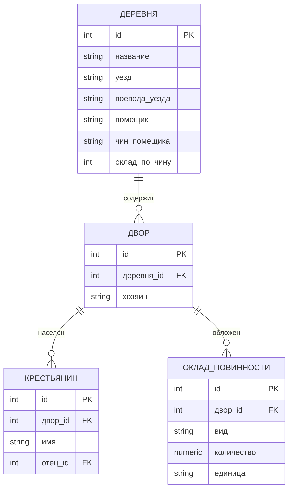
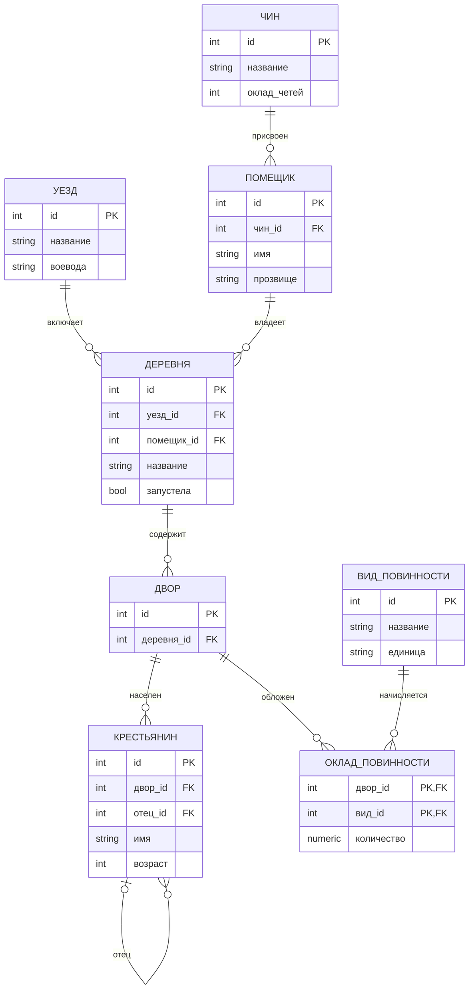

<script setup>
import Conversation from "../../../components/Conversation.vue";
import alexey from "../../assets/databases/heroes/clerk_alexey.png";
</script>

# Разработка информационно-логической модели базы данных

## Введение: Сорок приказов и ни одного порядка

**Москва, весна 1648 года.**

Государством управляют **приказы** – то, что потом назовут министерствами. Их несколько десятков, и выросли они не по замыслу, а по случаю: понадобилось дело – учредили приказ. Поместный ведает землями, Разрядный – служилыми людьми, Стрелецкий – стрельцами, Холопий – кабальными, Ямской – почтой и дорогами. Есть приказы, созданные под один город, и приказы, созданные под одну вдову покойного боярина.

Полномочия пересекаются, границы никто не проводил. Один и тот же человек с одной и той же землей числится в трех книгах сразу, в каждой – по-своему: в одной он Иванко, в другой Иван, в третьей Ивашко, и поместье у него то сто пятьдесят четей, то сто восемьдесят.

Внизу этой машины сидят **подьячие** – те, кто собственно пишет. В Поместном приказе их десятки, и один из них – семнадцатилетний Алексей Транзакциев.


Он не из приказной семьи, за него никто не хлопотал. Его взяли за почерк: ровный, разборчивый, без помарок. Беда в том, что он не только пишет, но и **читает то, что пишет**. И примерно на третий месяц службы начинает замечать странное.

<Conversation :phrases="[
    {
        name: 'Алексей',
        position: 'left',
        text: 'Пров Михайлыч, дозволь спросить. Я нынче переписывал Коломенский уезд. И вот тут у меня Иванко Петров, оклад сто пятьдесят четей. А через четыре листа – он же, и оклад сто восемьдесят. Какой из них правильный?',
        photo: alexey
    },
    {
        name: 'Столбцов',
        position: 'right',
        text: 'Оба.'
    },
    {
        name: 'Алексей',
        position: 'left',
        text: 'Как оба? Это же один человек.',
        photo: alexey
    },
    {
        name: 'Столбцов',
        position: 'right',
        text: 'Один человек, да две записи. Первую писал Гаврилка по старой росписи, вторую я по новой. Обе правильные, обе за подписью. Пиши, как написано, и не умствуй.'
    },
    {
        name: 'Алексей',
        position: 'left',
        text: 'А ежели с него оброк править? По какой записи?',
        photo: alexey
    },
    {
        name: 'Столбцов',
        position: 'right',
        text: '(не отрываясь от письма) По той, которую первой найдешь.'
    }
]"/>

Дьяк Пров Столбцов – не злодей и не дурак. Тридцать лет в приказе, помнит наизусть сотни дел, и его столбцы работают. Фамилия у него от главного инструмента эпохи: приказное делопроизводство велось **столбцами** – отдельные листы подклеивались один к другому в непрерывную ленту, которую сворачивали в рулон. К этому мы еще вернемся, когда доберемся до физического уровня проектирования.

А пока запомним главное. Алексей заметил не описку. Он заметил **избыточность**: один факт реального мира записан в книге дважды. И как только факт записан дважды, рано или поздно две записи начнут противоречить друг другу.

::: info Чем мы будем заниматься
Это практическое занятие. Теорию – уровни проектирования, нотации, нормальные формы – мы разобрали в занятии [Основы проектирования баз данных](./relational-model/erd-essentials.md). Здесь мы берем одну настоящую предметную область, доводим ее до третьей нормальной формы и рисуем модель в нотации Мартина.

Разбираем подробно **одну** область – поместное дело. Остальные будут в заданиях.
:::

## Июнь 1648: когда требования выясняются поздно

Чтобы понять, зачем Алексею вообще понадобился порядок, надо рассказать, что случилось летом.

Двумя годами раньше казна придумала способ пополнить бюджет: единая пошлина на соль. Соль – товар, без которого не обойтись, брали ее все, и сбор обещал быть большим. Вышло иначе: соль подорожала, покупать ее стали меньше, рыба, которую солью заготавливали, гнила на складах. Пошлину отменили. Но денег в казне от этого не прибавилось, и тогда решили взыскать **недоимки по старым налогам сразу за несколько прошедших лет**.

Взыскивать стали по книгам. По тем самым книгам, в которых один человек числился в трех местах с тремя разными окладами.

<Conversation :phrases="[
    {
        name: 'Алексей',
        position: 'left',
        text: 'Пров Михайлыч, с Иванка Петрова недоимку правят трижды. Он один, а записей три, и приставы ходят по всем трем. Он уже до нитки разорен.',
        photo: alexey
    },
    {
        name: 'Столбцов',
        position: 'right',
        text: 'Так пусть челобитную подает.'
    },
    {
        name: 'Алексей',
        position: 'left',
        text: 'Он подал. Челобитную положили в столбец. В Коломне таких как он половина уезда.',
        photo: alexey
    }
]"/>

**В начале июня 1648 года** посадские люди и стрельцы вышли в Кремль с челобитной и требованием убрать виновных в новых поборах. Дело кончилось плохо: толпу не сдержали, двое приказных начальников были выданы и погибли, часть Москвы выгорела. Царю пришлось уступить и пообещать разобраться с причинами.

Мы не будем здесь описывать подробности – это дело историков. Для нас важно другое следствие.

::: warning Главный вывод из бунта
Требования к системе учета никто заранее не собрал. Их **выяснили постфактум**, и самым дорогим из возможных способов.

Никто не спросил: а что будет, если один человек попадет в книгу дважды? А как мы отличим двух тезок? А по какой записи править недоимку, если записей три?

Эти вопросы и есть **анализ предметной области**. Их задают до того, как заводят книгу, а не после того, как по ней начали взыскивать деньги.
:::

И есть второе следствие, которое нам понадобится в самом конце занятия. Сразу после событий июня была собрана комиссия, которой велели написать **единый свод законов** – Соборное уложение. Его составили и приняли **за полгода**, к январю 1649 года, и напечатали типографским способом – около тысячи двухсот экземпляров.

Запомните эту цифру: **полгода**. Мы к ней вернемся.

## Предметная область: поместное дело

Разбираться будем с тем, что ведет Поместный приказ. Это, говоря современным языком, кадастр и реестр землевладения одновременно.

Понятия предметной области:

- **Поместье** – земля, данная служилому человеку **за службу и на время службы**. Служить перестал – поместье может быть отобрано.
- **Вотчина** – земля в полной собственности, ее наследуют и продают. Нас сейчас интересуют поместья.
- **Помещик** – тот, кому дано поместье.
- **Чин** – разряд служилого человека. От чина зависит **поместный оклад**: сколько земли человеку положено по его разряду. Оклад – это норма, а не факт: положено двести четей, а дано может быть сто.
- **Четь** (четверть) – мера, которой считали землю и хлеб.
- **Деревня** – населенный пункт. Если жителей не осталось, она становится **пустошью**, но из книги не исчезает: земля-то никуда не делась.
- **Двор** – хозяйственная единица. Налоги в эту эпоху брали подворно, то есть со двора, а не с человека.
- **Повинность** – что двор отдает помещику: хлебом, сеном, деньгами, работой.
- **Уезд** – административная единица, во главе – **воевода**.

<Conversation :phrases="[
    {
        name: 'Алексей',
        position: 'left',
        text: 'Хорошо. Я выписал все, что у нас в деле бывает. А теперь – как это в книгу уложить, чтобы Иванко Петров был один?',
        photo: alexey
    }
]"/>

## Писцовая книга как она есть

Вот как учет выглядел до Алексея. Одна строка – одна деревня, и в ней записано решительно все, что про эту деревню известно.

**Атрибутивный состав:**
`{ Уезд, Воевода_уезда, Деревня, Помещик, Чин, Оклад_по_чину, Дворы_и_люди, Повинности }`

| Уезд | Воевода | Деревня | Помещик | Чин | Оклад, четей | Дворы и люди | Повинности |
| :--- | :--- | :--- | :--- | :--- | :--- | :--- | :--- |
| Коломенский | Шеин П.А. | Малые Дубки | Иванко Петров Рябой | жилец | 150 | двор Фомки Иванова с сынами Гришкой да Ондрюшкой; двор Макарки Силина | рожь 4 чети; сено 10 копен; деньгами 2 рубля |
| Коломенский | Шеин П.А. | Высокое | Иванко Петров Рябой | жилец | 150 | двор Степанки Лукина; двор Гаврилки Лукина | рожь 6 четей; деньгами 3 рубля |
| Коломенский | Шеин П.А. | Гнилуши | Иванко Петров Кривой | жилец | 150 | двор Прошки Жукова | рожь 2 чети |
| Боровский | Телегин С.И. | Заборье | Макар Гаврилов | городовой дворянин | 250 | двор Куземки Фомина; двор Фильки Фомина с сыном Ивашкой | рожь 8 четей; сено 20 копен |
| Боровский | Телегин С.И. | Ивакино | Макар Гаврилов | городовой дворянин | 250 | запустела, людей нет | нет |

Это то, что в теории называется **универсальным отношением**: в одной структуре собраны сведения сразу о семи разных объектах реального мира – об уезде, о воеводе, о деревне, о помещике, о чине, о дворах, о людях и о повинностях.

::: danger Диагноз: смешение жизненных циклов
Все эти объекты живут **своей, независимой жизнью**:

1. Воеводу могут сменить, а деревни останутся на месте.
2. Деревня может запустеть, а помещик останется служить.
3. Помещик может умереть, а земля перейдет другому.
4. Оклад по чину может изменить государев указ – сразу для всех, кто в этом чине.
5. Помещику может быть пожалован новый чин, а земля останется та же.

В одной таблице все эти события жестко сцеплены. Отсюда и аномалии.
:::

Обратите внимание на третью строку. Там **Иванко Петров Кривой** – другой человек, не тот, что в первых двух. Тезка, из того же уезда, в том же чине. Отличается только прозвищем. Запомните его, он нам пригодится.

## Три аномалии

Прежде чем нормализовать, надо убедиться, что проблема настоящая. Пройдем по трем классическим аномалиям на нашей книге.

### Аномалия обновления

В Коломенском уезде сменили воеводу.

<Conversation :phrases="[
    {
        name: 'Столбцов',
        position: 'right',
        text: 'Шеина отставили, на Коломну сел Бутурлин. Поправь в книге.'
    },
    {
        name: 'Алексей',
        position: 'left',
        text: 'В каком месте поправить?',
        photo: alexey
    },
    {
        name: 'Столбцов',
        position: 'right',
        text: 'Во всех.'
    },
    {
        name: 'Алексей',
        position: 'left',
        text: 'В Коломенском уезде четыреста двадцать деревень. Это четыреста двадцать поправок. Ежели я три пропущу – в книге будет три деревни с прежним воеводой, и никто этого не заметит, пока не сверят.',
        photo: alexey
    }
]"/>

Один факт реального мира – «воевода Коломенского уезда теперь Бутурлин» – записан в книге четыреста двадцать раз. Чтобы изменить его, надо выполнить четыреста двадцать правок. **Пропуск хотя бы одной означает противоречие внутри одной и той же книги.**

То же самое с окладом: если государев указ меняет оклад жильцам, править придется каждую строку, где стоит чин «жилец», по всей стране.

### Аномалия вставки

<Conversation :phrases="[
    {
        name: 'Столбцов',
        position: 'right',
        text: 'Новика Третьяка Беклемишева в службу зачислили. Чин – жилец, оклад сто пятьдесят четей. Запиши.'
    },
    {
        name: 'Алексей',
        position: 'left',
        text: 'А какое ему поместье?',
        photo: alexey
    },
    {
        name: 'Столбцов',
        position: 'right',
        text: 'Никакого пока. Испоместят весной, как земля сыщется.'
    },
    {
        name: 'Алексей',
        position: 'left',
        text: 'Тогда мне его записать некуда. Строка в книге – это деревня. Нет деревни – нет строки. Человек в службе есть, а в книге его нет.',
        photo: alexey
    }
]"/>

Невозможно внести сведения об одном объекте, не внося сведений о другом, логически независимом. Помещик без поместья в такую книгу не помещается, хотя в жизни он прекрасно существует.

### Аномалия удаления

<Conversation :phrases="[
    {
        name: 'Столбцов',
        position: 'right',
        text: 'Деревню Гнилуши вычеркни. Поместье отобрано, деревня отписана на государя, нас больше не касается.'
    },
    {
        name: 'Алексей',
        position: 'left',
        text: '(вычеркивает, замирает) Пров Михайлыч. Я вычеркнул единственную строку, где был записан Иванко Петров Кривой. Теперь в книге нет ни его, ни того, что он в службе.',
        photo: alexey
    }
]"/>

Удаляя сведения об одном объекте, мы невольно уничтожаем сведения о другом. Пока Гнилуши были единственным поместьем Кривого, строка про деревню была заодно и единственной записью про человека.

## Функциональные зависимости

Аномалии – это симптом. Причину находят, выписывая **функциональные зависимости**: какой атрибут определяется каким.

Запись `A → B` читается так: зная значение `A`, мы однозначно знаем значение `B`.

Алексей выписывает их на отдельном листе:

```
Уезд                → Воевода_уезда
Чин                 → Оклад_по_чину
Помещик             → Чин
(Уезд, Деревня)     → Помещик, Дворы_и_люди, Повинности
```

Ключ таблицы – `(Уезд, Деревня)`: именно эта пара однозначно задает строку. Деревень с одинаковым названием в разных уездах полно, а в пределах одного уезда название уникально.

И вот теперь видно все три болезни сразу:

| Зависимость | Что не так |
| :--- | :--- |
| `Уезд → Воевода_уезда` | Воевода зависит **от части** ключа, а не от ключа целиком. Это нарушение **2НФ** |
| `Помещик → Чин → Оклад_по_чину` | Оклад зависит от ключа **через** два неключевых атрибута. Это нарушение **3НФ** |
| `Дворы_и_люди`, `Повинности` | В одной клетке список. Это нарушение **1НФ** |

::: tip Практический прием
Не пытайтесь нормализовать «на глаз». Сначала выпишите все функциональные зависимости текстом, потом определите ключ, и только потом смотрите, какие зависимости в этот ключ не укладываются.

Девять ошибок из десяти в проектировании – это зависимость, которую не заметили, а не нормальная форма, которую не знали.
:::

## Первая нормальная форма

Начинаем с атомарности. В 1НФ требуется три вещи: атомарные значения, отсутствие повторяющихся групп и наличие первичного ключа.

### Атомарность и повторяющиеся группы

Клетка «Дворы и люди» содержит целый список, да еще и вложенный: дворы, а внутри дворов – люди. Клетка «Повинности» содержит три разных повинности в разных единицах измерения.

Такие данные нельзя ни отобрать, ни посчитать, ни исправить. Нельзя ответить на вопрос «сколько всего дворов в Коломенском уезде», не читая текст глазами. Нельзя прибавить одному двору четь ржи, не переписав всю клетку.

Множественные значения выносятся в отдельные сущности:

- `Дворы_и_люди` разваливается на **ДВОР** и **КРЕСТЬЯНИН**.
- `Повинности` разваливается на **ВИД_ПОВИННОСТИ** и сам размер оклада.

### Сыновья, которых не было в данных

Отдельно стоит посмотреть на запись «двор Фомки Иванова с сынами Гришкой да Ондрюшкой».

<Conversation :phrases="[
    {
        name: 'Алексей',
        position: 'left',
        text: 'Фомка записан по имени и отчеству. А сыновья – только по именам. Их фамилии в книге нет вовсе, она подразумевается. И сколько им лет – тоже нет. Их как бы и нет, они приложение к отцу.',
        photo: alexey
    }
]"/>

Это очень частая ошибка и в современных системах: сущность не выделили, а запихнули в текстовое поле как примечание – и она тут же лишилась половины своих атрибутов. Как только мы делаем **КРЕСТЬЯНИН** полноценной сущностью, у Гришки появляется своя строка, свое имя, свой возраст и, что важно, **ссылка на отца**.

### Первичный ключ и два Иванка

Теперь самое интересное. Чем мы будем отличать одного помещика от другого?

<Conversation :phrases="[
    {
        name: 'Алексей',
        position: 'left',
        text: 'Иванко Петров Рябой и Иванко Петров Кривой. Один уезд, один чин, один оклад. Если я опознаю человека по имени – они склеятся в одного, и оброк с них будут править вдвое. Если по имени с прозвищем – то что мне делать, когда прозвище перепишут иначе? Рябой, Рябый, Ряб...',
        photo: alexey
    },
    {
        name: 'Столбцов',
        position: 'right',
        text: 'А ты как хочешь?'
    },
    {
        name: 'Алексей',
        position: 'left',
        text: 'Я хочу дать каждому человеку номер. Номер по книге. Он ничего не значит, его нельзя переписать иначе, и он не поменяется, даже если человека переведут в другой чин или переименуют.',
        photo: alexey
    },
    {
        name: 'Столбцов',
        position: 'right',
        text: '(после паузы) Людей номерами считать? В приказе тебя за это не похвалят.'
    },
    {
        name: 'Алексей',
        position: 'left',
        text: 'Зато недоимку с одного человека будут править один раз.',
        photo: alexey
    }
]"/>

Алексей только что изобрел **суррогатный ключ**. Это ровно тот случай, который описан в теории: естественный ключ (имя, прозвище, уезд) не годится, потому что он не уникален, изменчив и записывается разными писарями по-разному.

::: info Когда брать суррогатный ключ
Естественный ключ годится, если он **уникален, неизменен и записывается однозначно**. Номер паспорта, ИНН, код страны по стандарту.

Имя человека не годится ни по одному из трех признаков. Название деревни – тоже: деревни переименовывают.

Поэтому в подавляющем большинстве проектов берут суррогатный ключ – число, которое не значит ничего, кроме «это вот эта строка».
:::

### Модель после 1НФ

Разложив повторяющиеся группы и введя номера, получаем первое приближение:



Повторяющихся групп больше нет, ключи есть. Но посмотрите на сущность `ДЕРЕВНЯ`: воевода, помещик, чин и оклад все еще болтаются в ней. Аномалия обновления с воеводой никуда не делась.

## Вторая нормальная форма

2НФ требует, чтобы каждый неключевой атрибут зависел **от всего ключа целиком**, а не от его части.

Вернемся к исходной книге, где ключ был составным – `(Уезд, Деревня)`:

```
(Уезд, Деревня)  →  Помещик, Дворы, Повинности     ← зависит от всего ключа, это хорошо
 Уезд            →  Воевода_уезда                   ← зависит только от части ключа
```

`Воевода_уезда` – характеристика **уезда**, а не деревни. Деревня тут вообще ни при чем: мы могли бы узнать воеводу, зная один только уезд.

Такая зависимость от части составного ключа называется **частичной**, и устраняется она выделением отдельной сущности.

**Было:**

| Уезд | Воевода | Деревня | … |
| :--- | :--- | :--- | :--- |
| Коломенский | Шеин П.А. | Малые Дубки | … |
| Коломенский | Шеин П.А. | Высокое | … |
| Коломенский | Шеин П.А. | Гнилуши | … |

**Стало:**

`УЕЗД`

| id (PK) | название | воевода |
| :--- | :--- | :--- |
| 1 | Коломенский | Шеин П.А. |
| 2 | Боровский | Телегин С.И. |

`ДЕРЕВНЯ`

| id (PK) | название | уезд_id (FK) | … |
| :--- | :--- | :--- | :--- |
| 1 | Малые Дубки | 1 | … |
| 2 | Высокое | 1 | … |
| 3 | Гнилуши | 1 | … |

Смена воеводы теперь – **одна** правка в одной строке, а не четыреста двадцать.

::: tip Признак нарушения 2НФ
Нарушение 2НФ возможно **только при составном ключе**. Если ключ таблицы – одно поле, 2НФ выполняется автоматически.

Ровно поэтому суррогатный ключ из одного числа так популярен: он закрывает целый класс ошибок просто своим существованием. Но это не повод не понимать, что происходит: составные ключи никуда не исчезли, они живут в связующих таблицах связей «многие-ко-многим».
:::

## Третья нормальная форма

3НФ требует, чтобы неключевые атрибуты не зависели **друг от друга**. Остался последний больной участок:

```
ДЕРЕВНЯ.помещик  →  чин_помещика  →  оклад_по_чину
```

Оклад зависит от ключа деревни не напрямую, а **через** два неключевых атрибута. Такая зависимость называется **транзитивной**.

Последствия ровно те же, что и с воеводой, только хуже по масштабу:

<Conversation :phrases="[
    {
        name: 'Столбцов',
        position: 'right',
        text: 'Государев указ: жильцам оклад прибавить, было сто пятьдесят, стало сто семьдесят. Поправь.'
    },
    {
        name: 'Алексей',
        position: 'left',
        text: 'Жильцов по всей стране несколько тысяч, и у каждого от одной до десяти деревень. Это десятки тысяч поправок из-за одной строки указа.',
        photo: alexey
    },
    {
        name: 'Столбцов',
        position: 'right',
        text: 'А ты что предлагаешь?'
    },
    {
        name: 'Алексей',
        position: 'left',
        text: 'Записать оклад один раз – там, где он живет. Он принадлежит чину, а не деревне и не человеку. Будет отдельная книжица чинов на одном листе. Указ пришел – я правлю одну строку, и по всей стране сходится само.',
        photo: alexey
    }
]"/>

Декомпозиция:

`ЧИН`

| id (PK) | название | оклад_четей |
| :--- | :--- | :--- |
| 1 | жилец | 150 |
| 2 | городовой дворянин | 250 |

`ПОМЕЩИК`

| id (PK) | имя | прозвище | чин_id (FK) |
| :--- | :--- | :--- | :--- |
| 1 | Иванко Петров | Рябой | 1 |
| 2 | Иванко Петров | Кривой | 1 |
| 3 | Макар Гаврилов | | 2 |
| 4 | Третьяк Беклемишев | | 1 |

`ДЕРЕВНЯ`

| id (PK) | название | уезд_id (FK) | помещик_id (FK) |
| :--- | :--- | :--- | :--- |
| 1 | Малые Дубки | 1 | 1 |
| 2 | Высокое | 1 | 1 |
| 3 | Гнилуши | 1 | 2 |

Три вещи, которые произошли заодно:

1. **Два Иванка Петровых окончательно разъехались** – у них разные номера, и спутать их больше нельзя даже при желании.
2. **Новик Третьяк Беклемишев появился в книге**, хотя поместья у него пока нет. Аномалия вставки устранена: он живет в `ПОМЕЩИК`, а не в строке деревни.
3. **Отбирая Гнилуши, мы больше не теряем Кривого.** Удалим строку из `ДЕРЕВНЯ` – человек останется в своей книге. Аномалия удаления устранена.

::: info Мнемоническое правило
Классическая формулировка: каждый неключевой атрибут зависит **от ключа, от всего ключа и ни от чего, кроме ключа**.

- «от ключа» – это 1НФ;
- «от всего ключа» – это 2НФ;
- «ни от чего, кроме ключа» – это 3НФ.
:::

## Кардинальность и модальность

Сущности разложены. Теперь надо описать связи между ними – и не просто «связаны», а **сколько и обязательно ли**.

Это два независимых вопроса к каждому концу линии:

- **Кардинальность** – сколько: один или много.
- **Модальность** – обязательно ли: может быть ноль или не может.

Разберем на нашей области все четыре комбинации. И обратите внимание: каждая вычитывается не из головы проектировщика, а **из предметной области**.

| Связь | Как читается | Почему так |
| :--- | :--- | :--- |
| `ПОМЕЩИК` → `ДЕРЕВНЯ` | **ноль или много** | Новик Беклемишев в службе, но еще не испомещен. Деревень у него может быть и десять, и ни одной |
| `ДЕРЕВНЯ` → `ПОМЕЩИК` | **ровно один** | Земля не бывает ничьей: она либо за помещиком, либо отписана на государя, но владелец есть всегда |
| `ДЕРЕВНЯ` → `ДВОР` | **ноль или много** | Ивакино запустело, дворов нет, а деревня в книге осталась: земля-то есть |
| `ДВОР` → `ДЕРЕВНЯ` | **ровно один** | Двор не может стоять одновременно в двух деревнях |
| `ЧИН` → `ПОМЕЩИК` | **ноль или много** | Чин может быть учрежден, а людей в нем пока нет |
| `ПОМЕЩИК` → `ЧИН` | **ровно один** | Человек в службе всегда в каком-то чине |

::: warning Модальность – не формальность
Фраза «ноль или много» вместо «один или много» выглядит придиркой, но именно она определяет, можно ли будет записать в базу новика без поместья и пустошь без дворов.

Девять из десяти вопросов «а почему система не дает мне это сохранить» – это модальность, выбранная проектировщиком не глядя в предметную область.
:::

### Нотация Мартина, или гусиная лапка

Как это рисуют? Алексей, не знавший ни слова «нотация», пришел к тому же, к чему пришли проектировщики в 1980-х.

<Conversation :phrases="[
    {
        name: 'Алексей',
        position: 'left',
        text: '(чертит на обороте черновика) Коли на одном конце один, поставлю одну черточку поперек. А коли много – надо знак, который сразу виден. Разведу линию на три и получится... (смотрит на перо) Да это ж птичья лапка выходит. Гусиная.',
        photo: alexey
    }
]"/>

Нотация, которую вы будете рисовать, называется **нотацией Мартина**, а по-английски – **Crow's Foot**, то есть «воронья лапка». Знак «многих» в ней и правда выглядит как трехпалый птичий след.

Читается конец линии так:

| Что нарисовано у сущности | Кардинальность | Модальность | Как читать |
| :--- | :--- | :--- | :--- |
| две поперечные черточки | один | обязательно | ровно один |
| черточка и кружок | один | необязательно | ноль или один |
| лапка и поперечная черточка | много | обязательно | один или много |
| лапка и кружок | много | необязательно | ноль или много |

Правило чтения простое: **дальний от сущности знак отвечает на вопрос «сколько», ближний – на вопрос «обязательно ли»**. Кружок всегда означает «может быть ноль», поперечная черточка – «ровно, не меньше».

::: info Та же нотация в тексте
Все диаграммы в этом курсе, включая те, что вы видели в теме про SQL, нарисованы в нотации Мартина с помощью `mermaid`. Там концы линий записываются символами, и полезно научиться их читать:

- `A ||--|{ B` – у A ровно один, у B один или много;
- `A ||--o{ B` – у A ровно один, у B ноль или много;
- `A |o--o{ B` – у A ноль или один, у B ноль или много;
- `A }o--o{ B` – многие-ко-многим с обеих сторон.

Мысленно замените `o` на кружок, а `{` и `}` на лапку, и запись совпадет с тем, что вы рисуете в draw.io.
:::

## Многие-ко-многим: повинности

Остался один участок, который не укладывается в «один-ко-многим».

<Conversation :phrases="[
    {
        name: 'Алексей',
        position: 'left',
        text: 'Двор Фомки платит рожью, сеном и деньгами – три повинности с одного двора. А рожью платят почти все дворы уезда. Куда мне это записать? Если в двор – будет список в клетке, а мы от этого ушли. Если в повинность – тоже список.',
        photo: alexey
    }
]"/>

Это связь **«многие-ко-многим»**: один двор обложен многими видами повинностей, один вид повинности лежит на многих дворах. В реляционной модели такая связь напрямую не реализуется – нужна **связующая сущность**.

И у этой связующей сущности появляется то, чего нет ни у двора, ни у вида повинности: **сколько именно**.

`ВИД_ПОВИННОСТИ`

| id (PK) | название | единица |
| :--- | :--- | :--- |
| 1 | оброк хлебом | четь |
| 2 | сено | копна |
| 3 | оброк деньгами | рубль |

`ОКЛАД_ПОВИННОСТИ` – связующая сущность, ключ составной

| двор_id (PK, FK) | вид_id (PK, FK) | количество |
| :--- | :--- | :--- |
| 1 | 1 | 4 |
| 1 | 2 | 10 |
| 1 | 3 | 2 |
| 2 | 1 | 6 |

::: tip Признак того, что нужна связующая сущность
Если вы не можете ответить на вопрос «а где хранить **сколько**», значит связь не «один-ко-многим», а «многие-ко-многим», и у нее есть собственные атрибуты.

Кстати, вот он, тот самый составной первичный ключ, про который мы говорили в разделе про 2НФ. Пара `(двор_id, вид_id)` – естественный и совершенно правильный составной ключ: он гарантирует, что один и тот же вид повинности не ляжет на один двор дважды.
:::

## Рекурсивная связь: «Иванов сын»

Последняя деталь. Вспомним Фомку с сыновьями.

В писцовых книгах родство записывали прямо в имени: Гришка Фомин сын. Теперь, когда крестьянин стал полноценной сущностью, родство можно выразить честно – **ссылкой на строку в той же самой таблице**.

`КРЕСТЬЯНИН`

| id (PK) | двор_id (FK) | имя | отец_id (FK) |
| :--- | :--- | :--- | :--- |
| 1 | 1 | Фома Иванов | |
| 2 | 1 | Гришка | 1 |
| 3 | 1 | Ондрюшка | 1 |
| 4 | 1 | Макар Силин | |

Такая связь называется **рекурсивной** (самоссылающейся). Модальность у нее почти всегда «ноль или один»: у любой цепочки есть начало, и у первого человека в книге отца уже не записано.

## Итоговая модель

Собираем все вместе. Вот информационно-логическая модель поместного дела, приведенная к третьей нормальной форме.



Проверим, что аномалии ушли:

| Было | Стало |
| :--- | :--- |
| Смена воеводы – 420 правок | одна правка в `УЕЗД` |
| Указ об окладе – десятки тысяч правок | одна правка в `ЧИН` |
| Новика без поместья записать некуда | строка в `ПОМЕЩИК` |
| Отобрали деревню – потеряли человека | человек живет в `ПОМЕЩИК`, деревня в `ДЕРЕВНЯ` |
| Двух тезок не отличить | у каждого свой `id` |
| Сыновья без имен и возраста | полноценные строки в `КРЕСТЬЯНИН` |
| Повинности списком в клетке | `ОКЛАД_ПОВИННОСТИ` с количеством |

<Conversation :phrases="[
    {
        name: 'Столбцов',
        position: 'right',
        text: '(разглядывает чертеж) Было одна книга, стало восемь. Ты это называешь порядком?'
    },
    {
        name: 'Алексей',
        position: 'left',
        text: 'Восемь, да каждый факт в них записан по одному разу. В твоей одной книге Иванко Петров записан триста раз, и ты сам не знаешь, какая из записей верная.',
        photo: alexey
    },
    {
        name: 'Столбцов',
        position: 'right',
        text: 'Ладно. А как ты по восьми книгам сыщешь, сколько ржи с Коломенского уезда?'
    },
    {
        name: 'Алексей',
        position: 'left',
        text: '(медленно) А вот это, Пров Михайлыч, хороший вопрос. Мне придется ходить из книги в книгу по номерам.',
        photo: alexey
    }
]"/>

Столбцов задал абсолютно правильный вопрос. Нормализация устраняет противоречия, но **платой за это становится необходимость собирать данные из нескольких таблиц**. В SQL эта операция называется соединением, и ей посвящена целая тема дальше в курсе. А решение о том, где остановиться в нормализации, называется **денормализацией** и принимается осознанно, когда цена соединений становится выше цены избыточности.

## Три уровня проектирования

Теперь вернемся назад и посмотрим на то, что мы делали, с высоты. Мы прошли по трем уровням, хотя и не называли их.

### Концептуальный уровень

На этом уровне мы отвечаем на вопрос **«что вообще есть в этом мире и по каким правилам»**. Ни таблиц, ни типов данных, ни ключей.

Для нас это был раздел «Предметная область»: есть поместье и вотчина, и это разные вещи; поместье дается за службу и может быть отобрано; у чина есть оклад, и это норма, а не факт; деревня может запустеть, но из учета не исчезает.

Историческим примером концептуальной модели эпохи служит **Соборное уложение 1649 года**. Это не инструкция по заполнению книг – это описание того, какие в государстве бывают сущности (холоп, крестьянин, помещик, вотчина, поместье, беглый) и какие между ними действуют правила. Форму книг оно не задает вовсе.

### Логический уровень

Здесь мы отвечаем на вопрос **«как это уложить в структуру»**: какие сущности, какие атрибуты, что первичный ключ, что от чего зависит, где связь и какой у нее кардинальность и модальность.

Именно этим мы занимались всю первую половину занятия. Нормализация, выделение `УЕЗД` и `ЧИН`, суррогатные ключи, связующая сущность – это все логический уровень. Обратите внимание: **ни слова про PostgreSQL**. Эта модель одинаково годится и для реляционной СУБД, и для бумажных книг XVII века.

### Физический уровень

А здесь – **как это реально лежит и как быстро находится**. И вот тут история дает иллюстрацию лучше любой придуманной.

Логически Соборное уложение – один документ. Физически у него было **две разных реализации одновременно**:

**Реализация первая: столбец.** Приказное делопроизводство велось так: исписанные листы подклеивали один к другому в непрерывную ленту и сворачивали в рулон. Подлинник Уложения – такой свиток, и длина его составляет около трехсот метров.

<Conversation :phrases="[
    {
        name: 'Алексей',
        position: 'left',
        text: 'Триста саженей склеенной бумаги. Чтобы прочесть статью с середины, надо раскатать половину по полу. А чтобы вписать статью в середину – расклеить, вставить лист и подклеить обратно.',
        photo: alexey
    },
    {
        name: 'Столбцов',
        position: 'right',
        text: 'Зато ничего не потеряется и порядок не перепутаешь. Лист из столбца не вынешь незаметно.'
    }
]"/>

И Столбцов опять прав. У свитка есть реальные достоинства: он защищен от подмены и перестановки листов, и его невозможно расшить. Но вставка в середину стоит дорого, а произвольный доступ невозможен.

**Реализация вторая: печатный тираж.** Около тысячи двухсот отпечатанных экземпляров, разосланных по приказам и городам. Та же логическая модель, совершенно другая физическая: искать стало быстро, тираж доступен одновременно в сотне мест – но каждое исправление надо теперь вносить в тысячу двести копий, иначе они разойдутся.

::: info Это и есть физический уровень
Посмотрите, как знакомо звучит:

- **свиток** – это последовательный доступ, дорогая вставка в середину, высокая целостность;
- **печатный тираж** – это репликация: быстрое чтение во многих местах за счет риска рассогласования копий;
- **разделение книг по уездам** – это секционирование;
- **номер по книге** – это первичный ключ и, по сути, индекс.

Логическая модель у всего этого **одна и та же**. Меняется только то, как она лежит и какие операции на ней дешевы.

Кстати, столбцы отменили именно при Петре: в начале 1700-х делопроизводство перевели на тетради и книги. Миграция с одного физического формата на другой при неизменной логической модели.
:::

## Почему порядок уровней не линеен

Осталось главное. В теории уровни идут один за другим: концептуальный, логический, физический. Алексей решил сделать именно так – и именно так провалился.

<Conversation :phrases="[
    {
        name: 'Алексей',
        position: 'left',
        text: 'Я понял, как надо. Не буду я чинить одну писцовую книгу. Я опишу все дело целиком: и поместья, и вотчины, и холопов, и службу, и податные дворы. Сперва опишу все понятия без изъятия, потом разложу все книги до последней графы, и уж тогда велю переписывать. Года мне хватит.',
        photo: alexey
    },
    {
        name: 'Столбцов',
        position: 'right',
        text: 'Хватит, хватит. Пиши.'
    }
]"/>

Года не хватило. Пока Алексей описывал государство, государство менялось.

Началась долгая война, и служилых людей стали считать иначе. Учредили новые приказы, а часть старых слили. Прошла денежная реформа, и все суммы в черновиках стали неверны. Переменились правила сыска беглых. А в довершение – провели новую перепись, и податной единицей стал двор там, где раньше была земля.

<Conversation :phrases="[
    {
        name: 'Алексей',
        position: 'left',
        text: '(над кипой исчерканных листов) Пров Михайлыч. Я закончил.',
        photo: alexey
    },
    {
        name: 'Столбцов',
        position: 'right',
        text: 'И что?'
    },
    {
        name: 'Алексей',
        position: 'left',
        text: 'А то, что я описал державу, которой больше нет. Пока я чертил – переменилось все: и приказы, и деньги, и чем подати считают. Моя модель верна для того года, в котором я ее начал.',
        photo: alexey
    },
    {
        name: 'Столбцов',
        position: 'right',
        text: 'А я тебе что говорил.'
    },
    {
        name: 'Алексей',
        position: 'left',
        text: 'Ты говорил «не умствуй». Это неверно. Умствовать надо, иначе будет как в июне. Неверно другое – что я хотел все разом и наперед.',
        photo: alexey
    }
]"/>

Вот теперь вспомним ту цифру, которую мы просили запомнить в начале.

**Соборное уложение написали за полгода.** Не потому, что составители были гениальны, а потому, что иначе было нельзя: требовалось решение сейчас. Получился документ неполный, местами противоречивый – и совершенно работоспособный. А дальше его **полвека дополняли** так называемыми новоуказными статьями: о сыске беглых, о поместьях и вотчинах, о разбойных делах.

То есть главный системный документ эпохи сделан не водопадом, а короткой первой версией плюс долгой цепочкой доработок.

::: warning Почему линейный порядок не работает
Каскадная модель предполагает две вещи, которых в жизни не бывает:

1. **Что требования можно собрать полностью до начала работы.** Нельзя: в июне 1648 года их выяснили бунтом, а не опросом. Заказчик сам не знает своих требований, пока не увидит первую версию.
2. **Что предметная область не меняется, пока вы проектируете.** Меняется. И тем быстрее, чем крупнее замах.

При этом сами три уровня никуда не деваются и остаются обязательными. Меняется способ их проходить: **не один раз целиком, а много раз маленькими кусками, с возвратами назад.**

- Итерация первая: только поместья. Концепция, структура, реализация – и работающая книга через месяц.
- Итерация вторая: добавляем податные дворы. И тут выясняется, что структура поместий неудачна. Возвращаемся на логический уровень и перестраиваем.
- Итерация третья: повинности. Опять возврат.

Возврат на предыдущий уровень в этой логике – не провал проекта, а **нормальный рабочий шаг**. Провал – это когда модель закончена и сразу устарела.
:::

Два дополнительных соображения из современной практики, которые разобраны в теории подробнее:

- **Технологический детерминизм.** Классика велит выбирать СУБД в самом конце. На практике ее выбирают в начале, и это влияет на решения вверху: зная, что будет PostgreSQL, вы уже на логическом уровне можете заложить массив или `JSONB` вместо отдельной таблицы. Строго говоря, это нарушение чистоты уровней – и совершенно оправданное.
- **Code-First.** Там, где схему генерирует ORM из классов приложения, физическая модель вообще производна от кода, а концептуальная и логическая существуют только в голове разработчика. Это работает, пока система маленькая, и становится источником боли, когда вырастает.

::: tip Из тетради дьяка Алексея

Не пытайся начертить всю державу. Начерти один приказ, заведи по нему книгу, и пусть она год поработает.

За этот год ты узнаешь о деле больше, чем за три года черчения. И вот тогда принимайся за второй приказ, и не бойся переделать первый.

:::

## Как рисовать: практика в draw.io

Модель мы разобрали, теперь ее надо изобразить. Рисовать будем в **draw.io** в нотации Мартина.

**Подготовка.** В левой панели нажмите «Еще фигуры» (More Shapes) и включите библиотеку **Entity Relation** в разделе Software. В ней есть и блоки сущностей, и готовые концы линий с лапками и кружками.

**Как оформлять сущность.** Прямоугольник, в заголовке – имя сущности, ниже списком – атрибуты. Ключи помечайте явно:

```
        ПОМЕЩИК
  ---------------------
  PK  id
  FK  чин_id
      имя
      прозвище
```

**Как оформлять связь.** Линия между двумя сущностями, на каждом конце – свой знак. Проверяйте каждый конец вопросами: сколько и обязательно ли. И подписывайте связь глаголом: «владеет», «включает», «обложен». Если глагол не подбирается – скорее всего, связь лишняя или сущности выделены неудачно.

**Чего не делать:**

- не рисовать связь «многие-ко-многим» одной линией – только через связующую сущность;
- не писать типы данных вроде `VARCHAR(50)`: это физический уровень, а мы на логическом;
- не ставить везде «один или много» по привычке – модальность берется из предметной области;
- не оставлять сущность без первичного ключа.

**Про именование.** Договоритесь о правилах заранее и держитесь их по всей модели: единственное или множественное число, язык, разделитель. В этом занятии сущности названы по-русски и в единственном числе – так читается ближе к предметной области. В коде дальше в курсе вы увидите английские имена во множественном числе: `recruits`, `ships`. Оба соглашения нормальны, ненормально смешивать их в одной схеме.

## Выводы по учебному вопросу

Алексей сидел над восемью листами, разложенными на столе, и чувствовал себя скорее дураком, чем победителем. Год работы ушел на модель, которая устарела до того, как ее успели применить. Зато он понял, чего делать не надо.

Он завел новую тетрадь – в кожаном переплете, из тех, что покупают, когда рассчитывают пользоваться вещью долго. И записал на первой странице то немногое, в чем был уверен.

<Conversation :phrases="[
    {
        name: 'Алексей',
        position: 'left',
        text: '(пишет) Первое. Один факт – одна запись. Записал дважды – жди, что записи разойдутся, и ты не узнаешь, какая верная.',
        photo: alexey
    },
    {
        name: 'Алексей',
        position: 'left',
        text: 'Второе. Прежде чем завести книгу, спроси у дела, а не у себя: сколько их бывает и бывает ли ни одного.',
        photo: alexey
    },
    {
        name: 'Алексей',
        position: 'left',
        text: 'Третье. Не черти всю державу. Черти один приказ и дай книге год поработать.',
        photo: alexey
    },
    {
        name: 'Алексей',
        position: 'left',
        text: '(помолчав) И четвертое. Запрос живет один миг, а книга – сто лет.',
        photo: alexey
    }
]"/>

Эту тетрадь он будет вести пятьдесят лет. Она появится еще не раз – в теме про SQL, где Алексей будет уже не подьячим, а дьяком и наставником. И в самом конце она достанется другому человеку.

**Чему мы научились в этом занятии:**

1. **Находить избыточность.** Распознавать универсальное отношение и видеть в нем смешение объектов с разными жизненными циклами.
2. **Диагностировать по аномалиям.** Аномалии вставки, обновления и удаления – это симптомы, по которым определяют, что структура неверна.
3. **Выписывать функциональные зависимости.** Главный рабочий инструмент: сначала зависимости текстом, потом ключ, потом нормальные формы.
4. **Нормализовать до 3НФ.** Атомарность и повторяющиеся группы, частичная зависимость от составного ключа, транзитивная зависимость между неключевыми атрибутами.
5. **Выбирать ключ.** Почему естественный ключ из имени не годится и когда берут суррогатный.
6. **Описывать связи полностью.** Кардинальность и модальность по отдельности, все четыре комбинации, и каждая – из предметной области, а не из привычки.
7. **Реализовывать «многие-ко-многим».** Через связующую сущность, у которой есть собственные атрибуты и естественный составной ключ.
8. **Различать три уровня проектирования.** Концептуальный отвечает «что есть в мире», логический – «как уложить в структуру», физический – «как лежит и что здесь дешево».
9. **Понимать, почему уровни проходят итерациями.** Требования нельзя собрать полностью заранее, а предметная область меняется быстрее, чем вы чертите. Возврат назад – рабочий шаг, а не провал.
10. **Рисовать в нотации Мартина** и не делать типовых ошибок оформления.

## Учебный вопрос 2: Разработка информационно-логических моделей

Теперь то же самое, но самостоятельно. Задания выполняются по вариантам.

Для каждого варианта дана **грязная книга** – универсальное отношение, собранное из настоящих учетных практик эпохи. Порядок работы одинаковый:

1. Опишите предметную область словами: какие сущности и какие правила между ними. Это концептуальный уровень.
2. Выпишите **функциональные зависимости** и определите первичный ключ исходного отношения.
3. Найдите и назовите **все три вида аномалий** на конкретных примерах из своих данных.
4. Приведите отношение к **3НФ**, показав декомпозицию по шагам: что сделали для 1НФ, что для 2НФ, что для 3НФ.
5. Нарисуйте итоговую модель в **draw.io в нотации Мартина**, с кардинальностью и модальностью на каждом конце каждой связи.
6. Обоснуйте модальность: по каждому концу, где вы поставили «ноль», скажите, какой случай из предметной области это допускает.

### Вариант 1: Ямская гоньба

Ямской приказ ведает почтой и перевозками. По дорогам стоят **ямы** – станции, где меняют лошадей. На яме живут **ямщики** со своими лошадьми. Гонец едет с **подорожной** – документом, дающим право требовать лошадей, – и проезжает несколько **перегонов** между ямами.

| Ям | Уезд ямa | Дорога | Ямщик | Лошадей у ямщика | Подорожная | Кому выдана | Чин получателя | Прогонные деньги по чину | Перегоны |
| :--- | :--- | :--- | :--- | :--- | :--- | :--- | :--- | :--- | :--- |
| Черная Грязь | Московский | Тверская | Сенька Хромой | 3 | 114 | Гаврила Пушкин | стольник | 8 | Черная Грязь – Клин; Клин – Тверь |
| Клин | Клинский | Тверская | Ивашка Долгий | 2 | 114 | Гаврила Пушкин | стольник | 8 | Черная Грязь – Клин; Клин – Тверь |
| Клин | Клинский | Тверская | Фомка Рыжий | 4 | 120 | Петр Шереметев | окольничий | 12 | Клин – Тверь |
| Тверь | Тверской | Тверская | Макарка Косой | 5 | | | | | |

Дополнительные правила предметной области:

- прогонные деньги зависят только от чина получателя подорожной;
- на яме может не быть ни одного ямщика, если ям только учрежден;
- подорожная всегда выдана кому-то, но перегонов по ней может быть один или много;
- один и тот же перегон проезжают по многим подорожным.

### Вариант 2: Таможенный учет

Таможня берет пошлину с привозимых товаров. **Купец** привозит **товар** через определенную **таможню**, и с него берется пошлина по **ставке**, зависящей от рода товара.

| Таможня | Город | Голова таможни | Купец | Откуда купец | Гильдия купца | Товар | Род товара | Ставка с рода, % | Привезено | Единица | Дата | Пошлина взята |
| :--- | :--- | :--- | :--- | :--- | :--- | :--- | :--- | :--- | :--- | :--- | :--- | :--- |
| Архангельская | Архангельск | Б. Пустозеров | Иван Босый | Вологда | гостиная сотня | сукно английское | ткани | 5 | 40 | постав | 12.07 | да |
| Архангельская | Архангельск | Б. Пустозеров | Иван Босый | Вологда | гостиная сотня | вино фряжское | питье | 10 | 12 | бочка | 12.07 | да |
| Архангельская | Архангельск | Б. Пустозеров | Юрий Немчин | Любек | иноземцы | сукно английское | ткани | 5 | 100 | постав | 14.07 | нет |
| Новгородская | Новгород | М. Овцын | Иван Босый | Вологда | гостиная сотня | соль | съестное | 3 | 200 | пуд | 02.08 | да |

Дополнительные правила:

- ставка зависит только от рода товара;
- гильдия и город зависят только от купца;
- голова зависит только от таможни;
- купец может быть записан в книге, но еще ничего не привезти в этом году;
- один товар привозят многие купцы, один купец привозит многие товары.

### Вариант 3: Аптекарский приказ

Аптекарский приказ ведает лекарями и лекарствами. **Лекарь** лечит **больных**, назначая **снадобья**, которые составляются из **зелий** (ингредиентов), хранящихся в аптеке.

| Лекарь | Откуда родом | Жалованье лекаря | Больной | Чин больного | Снадобье | Зелья в снадобье | Аптека | Дьяк аптеки | Дата | Исход |
| :--- | :--- | :--- | :--- | :--- | :--- | :--- | :--- | :--- | :--- | :--- |
| Андрей Энгельгардт | Любек | 300 | Гаврила Пушкин | стольник | декокт от огневой | ромашка 2 золотника; мед 1 золотник | Верхняя | И. Чириков | 04.03 | полегчало |
| Андрей Энгельгардт | Любек | 300 | Фрол Скобеев | подьячий | мазь от ломоты | скипидар 3 золотника; воск 2 золотника | Верхняя | И. Чириков | 11.03 | полегчало |
| Лука Костомаров | Москва | 120 | Гаврила Пушкин | стольник | декокт от огневой | ромашка 2 золотника; мед 1 золотник | Новая | П. Жданов | 18.03 | без перемен |
| Лука Костомаров | Москва | 120 | Марья Пушкина | | питье сердечное | мелисса 1 золотник | Новая | П. Жданов | 20.03 | полегчало |

Дополнительные правила:

- состав снадобья одинаков всегда и от больного не зависит;
- жалованье и место рождения зависят только от лекаря;
- дьяк зависит только от аптеки;
- у больного может не быть чина;
- зелье может лежать в аптеке и не входить ни в одно снадобье;
- одно и то же зелье входит в многие снадобья, в разных количествах.

### Вариант 4: Стрелецкие сотни

Стрелецкий приказ ведает стрелецким войском. Войско делится на **приказы** (полки), приказы – на **сотни**, в сотнях служат **стрельцы**. Стрельцам выдается **оружие** и **хлебное жалованье**.

| Приказ (полк) | Голова приказа | Слобода | Сотня | Сотник | Стрелец | Отец стрельца | Оклад по службе | Выслуга, лет | Оружие стрельца | Хлебное жалованье |
| :--- | :--- | :--- | :--- | :--- | :--- | :--- | :--- | :--- | :--- | :--- |
| Приказ Лопухина | А. Лопухин | Замоскворецкая | 1-я | Фома Бутырь | Сенька Карпов | Карп Карпов | 5 | 10 | пищаль; бердыш | рожь 3 чети; овес 2 чети |
| Приказ Лопухина | А. Лопухин | Замоскворецкая | 1-я | Фома Бутырь | Гришка Карпов | Карп Карпов | 4 | 5 | пищаль | рожь 2 чети |
| Приказ Лопухина | А. Лопухин | Замоскворецкая | 2-я | Иван Кривов | Макар Жуков | | 5 | 10 | пищаль; сабля | рожь 3 чети; овес 2 чети |
| Приказ Зубова | Н. Зубов | Сретенская | 1-я | Петр Долгий | Фролка Жуков | Макар Жуков | 4 | 5 | бердыш | рожь 2 чети |

Дополнительные правила:

- оклад по службе зависит только от выслуги лет;
- хлебное жалованье зависит только от оклада;
- голова и слобода зависят только от приказа;
- номер сотни уникален лишь внутри приказа: «1-я сотня» есть и у Лопухина, и у Зубова;
- у стрельца может не быть отца в книге, но отец, если он есть, – тоже стрелец из этой же книги;
- один вид оружия есть у многих стрельцов, у одного стрельца несколько видов оружия.

### Вариант 5: Монастырское хозяйство

Монастырь владеет селами, в селах стоят дворы, с которых идет доход. Монастырь ведет учет **вкладов** – того, что жертвуют миряне, – и **послушаний**, то есть работ, которые выполняют монахи.

| Монастырь | Епархия | Архиерей епархии | Село | Дворов в селе | Доход с села | Вкладчик | Чин вкладчика | Вклад | Чем вложено | Монах | Послушание | Срок послушания |
| :--- | :--- | :--- | :--- | :--- | :--- | :--- | :--- | :--- | :--- | :--- | :--- | :--- |
| Спасский | Рязанская | Мисаил | Выползово | 24 | 40 руб. | Гаврила Пушкин | стольник | 100 руб. | деньгами | Нифонт | пекарня | 1 год |
| Спасский | Рязанская | Мисаил | Выползово | 24 | 40 руб. | Гаврила Пушкин | стольник | 100 руб. | деньгами | Савватий | книгописание | 3 года |
| Спасский | Рязанская | Мисаил | Дубровка | 11 | 18 руб. | Марья Пушкина | | село Дубровка | землей | Нифонт | пекарня | 1 год |
| Никольский | Коломенская | Иоаким | Хотеичи | 7 | 9 руб. | Фрол Скобеев | подьячий | 5 руб. | деньгами | Зосима | звонница | 2 года |

Дополнительные правила:

- архиерей зависит только от епархии;
- число дворов и доход зависят только от села;
- чин вкладчика зависит только от вкладчика, и чина может не быть;
- вклад может быть сделан деньгами, землей или вещью, и вкладчик может сделать несколько вкладов;
- монах несет одно послушание в данный момент, но за жизнь – многие;
- село может принадлежать монастырю и не иметь ни одного двора.

### Повышенная сложность (для всех вариантов)

Кто закончил раньше, разберите два вопроса:

**А) Атрибут или сущность?** В разобранном примере воевода остался **атрибутом** уезда. Но если потребуется знать, с какого по какой год воевода сидел в уезде и где служил до того, атрибутом он быть перестанет и станет сущностью со своей связью к уезду.

Найдите в своем варианте атрибут, который при расширении требований должен стать сущностью. Объясните, какое именно новое требование это вызовет, и нарисуйте оба варианта модели.

**Б) Где остановиться?** Приведите пример запроса к своей предметной области, для ответа на который после нормализации придется обойти четыре и более сущностей. Предложите осознанную **денормализацию**: какой факт вы согласны хранить дважды, чтобы этот запрос стал дешевым, и какой ценой – то есть какую аномалию вы при этом сознательно возвращаете и как будете с ней жить.
