# Реляционная модель данных

В 1970 году сотрудник корпорации IBM Эдгар Франк Кодд опубликовал работу _«A Relational Model of Data for Large Shared Data Banks»_. Данная публикация считается основополагающей для становления современных систем управления базами данных. До появления реляционной теории организация данных осуществлялась посредством графовых, иерархических структур или файловых систем, что требовало от разработчика знания физических путей доступа к информации.

Э. Коддом была предложена концепция представления данных в виде математических отношений (Relations).

## Структура отношения: Терминологический аппарат

В инженерной практике принято разделять теоретическую (фундаментальную) и прикладную терминологию. Данные понятийные аппараты описывают идентичные сущности.

::: info Определение
**Отношение (Relation)** — это фундаментальная структура данных реляционной модели.
В прикладной практике используется термин **Таблица**.
:::

Ниже рассматривается структура таблицы на примере абстрактной сущности «Студент».

### Отношение (Relation)

Двумерная структура, обладающая уникальным идентификатором (именем).
С математической точки зрения, отношение представляет собой подмножество декартова произведения доменов. В контексте баз данных отношение рассматривается как неупорядоченное множество записей об объектах одного класса.

### Кортеж (Tuple)

Горизонтальный элемент отношения.

- **В теории:** Упорядоченный набор значений, описывающий **один** конкретный экземпляр сущности.
- **На практике:** Используются термины **Строка (Row)** или **Запись (Record)**.

### Атрибут (Attribute)

Вертикальный элемент отношения.

- **В теории:** Поименованная характеристика сущности.
- **На практике:** Используются термины **Столбец (Column)** или **Поле (Field)**.

### Домен (Domain)

Множество допустимых значений для одного или нескольких атрибутов.

- **В теории:** Совокупность значений, из которой осуществляется выборка данных. Например, домен «Оценка» включает множество целых чисел $\{2, 3, 4, 5\}$. Значения, не входящие в множество (например, $6$ или $A$), недопустимы.
- **На практике:** Реализуется через **Типы данных** (Integer, Date, Varchar) и **Ограничения (Constraints)**.

::: tip Сопоставление терминологии
| Математический термин | Инженерный термин | Пример |
| :--- | :--- | :--- |
| **Отношение** | Таблица | Список студентов |
| **Кортеж** | Строка / Запись | Иванов Иван Иванович |
| **Атрибут** | Столбец / Поле | Фамилия, Номер зачетки |
| **Домен** | Тип данных | Целое число, Строка |
| **Мощность (Cardinality)** | Количество строк | 150 студентов |
| **Степень (Degree)** | Количество столбцов | 5 характеристик |

:::

## Свойства отношений

Отношение в базе данных представляет собой строгую математическую структуру, подчиняющуюся определенным аксиомам. Нарушение данных правил ведет к потере целостности и переходу базы данных в несогласованное состояние.

### Неупорядоченность кортежей (строк)

В математическом множестве $\{A, B, C\}$ порядок элементов не имеет значения и эквивалентен $\{C, A, B\}$. В реляционной таблице строки не имеют порядкового номера. Обращение к конкретной записи по индексу невозможно без явной сортировки по значению атрибута. Физическое расположение данных на носителе не регламентировано и может изменяться. Прикладное программное обеспечение не должно полагаться на порядок вставки данных.

### Неупорядоченность атрибутов (столбцов)

Идентификация столбцов в отношении осуществляется по **имени**, а не по позиции. Семантика записи не зависит от последовательности перечисления атрибутов.

### Уникальность кортежей (Отсутствие дубликатов)

В множестве отсутствуют повторяющиеся элементы. Множество $\{1, 2, 2\}$ редуцируется до $\{1, 2\}$. Таблица не может содержать две абсолютно идентичные строки. Для обеспечения данного свойства вводится понятие **Первичного ключа**, гарантирующего уникальность каждой записи.

### Атомарность значений (Первая нормальная форма)

На пересечении конкретной строки и конкретного столбца допускается нахождение **только одного** значения.

- **Запрещено:** Хранение массивов или списков в одной ячейке (например, перечисление телефонных номеров в одной строке).
- **Разрешено:** Принцип «один атрибут — одно значение». Множественные характеристики реализуются через отдельные таблицы или структуры.

::: warning Реализация в СУБД (PostgreSQL)
Следует учитывать различия между теоретической моделью и реализацией в PostgreSQL.

1.  **Дубликаты:** Стандарт SQL и PostgreSQL оперируют не множествами (Sets), а мультимножествами (Multisets/Bags). Без явного создания Первичного ключа (PK) или ограничения `UNIQUE` система **допускает** создание полных дубликатов строк. Технически это возможно, однако является признаком некорректного проектирования.
2.  **Неатомарные значения:** PostgreSQL является **Объектно-Реляционной** СУБД. Поддерживаются сложные типы данных, нарушающие правило атомарности: массивы (`integer[]`, `text[]`), `JSON` и `JSONB`. Использование данных типов допускается в инженерной практике для оптимизации производительности (денормализация) при осознанном отступлении от академических правил.

:::

## Трехзначная логика и NULL

В отличие от классической булевой алгебры (Истина/Ложь), реляционная модель учитывает возможность неполноты информации об объектах реального мира. Для моделирования отсутствующей информации используется специальный маркер — `NULL`.

::: warning Природа NULL
Критически важно понимать природу маркера `NULL`.

- Это **не** ноль (число 0).
- Это **не** пустая строка (текст нулевой длины).
- Это состояние **«Значение неизвестно»** или **«Значение отсутствует»**.

:::

Примером может служить атрибут «Номер телефона». Значение `NULL` интерпретируется как отсутствие телефона у субъекта либо отсутствие сведений о номере.

### Логика неизвестности

Поскольку `NULL` обозначает неизвестность, любые операции сравнения с ним возвращают результат «неизвестно».

Рассмотрим пример с переменными: $A = 5$, $B = NULL$.

1.  $A > 0$ $\rightarrow$ **Истина**.
2.  $A > B$ $\rightarrow$ **Неизвестно** (Результат сравнения числа с неизвестным значением не определен).
3.  $B = B$ $\rightarrow$ **Неизвестно** (Равенство двух неизвестных величин не определено).

В связи с этим в реляционной алгебре и языках запросов использование стандартных операторов равенства для поиска пустых значений недопустимо. Проверка осуществляется через предикат состояния: «Является ли значение неопределенным?».

## Система ключей и идентификация кортежей

В рамках реляционной модели доступ к кортежам по их физическому адресу или порядковому номеру невозможен. Единственным способом адресации конкретного экземпляра сущности является использование значений его атрибутов, гарантированно отличающих данный экземпляр от остальных.

Система ключей представляет собой иерархию понятий, обеспечивающую формализацию свойства уникальности.

### Суперключ (Superkey)

Является наиболее общим понятием в теории идентификации.
**Суперключ** — это подмножество атрибутов отношения (один или несколько), позволяющее уникально идентифицировать кортеж.

Рассмотрим отношение `Студенты` со следующим набором атрибутов:

- `Номер_зачетки` (Уникален)
- `Паспорт` (Уникален)
- `Email` (Уникален)
- `ФИО` (Не уникально)
- `Группа` (Не уникальна)

**Примеры суперключей:**

1. $\{Номер\_зачетки\}$ — Суперключ (однозначная идентификация).
2. $\{Номер\_зачетки, ФИО\}$ — Суперключ. Добавление атрибута к уникальному ключу сохраняет свойство уникальности всего набора.
3. $\{Паспорт, Группа, Email\}$ — Суперключ.

**Недостаток:** Суперключи могут обладать свойством избыточности. Наличие атрибута `ФИО` в связке с `Номер_зачетки` не требуется для идентификации, так как `Номер_зачетки` сам по себе обеспечивает уникальность.

### Потенциальный ключ (Candidate Key)

Понятие является производным от суперключа.
**Потенциальный ключ** — это **минимальный** (неизбыточный) суперключ.
Критерий минимальности означает, что при исключении любого атрибута из состава ключа свойство уникальности утрачивается.

Анализ суперключей на соответствие критерию потенциального ключа:

1. $\{Номер\_зачетки\}$ $\rightarrow$ Исключение атрибутов невозможно. Является **Потенциальным ключом**.
2. $\{Номер\_зачетки, ФИО\}$ $\rightarrow$ При исключении `Номер_зачетки` остается `ФИО` (не уникально). При исключении `ФИО` остается `Номер_зачетки` (уникален). Следовательно, исходный набор избыточен. **Не является** потенциальным ключом.
3. $\{Паспорт\}$ $\rightarrow$ **Потенциальный ключ**.
4. $\{Email\}$ $\rightarrow$ **Потенциальный ключ**.

::: info Вывод
Отношение может обладать **множеством** потенциальных ключей. С точки зрения реляционной теории они эквивалентны.
:::

### Первичный ключ (Primary Key)

**Первичный ключ (PK)** — это один конкретный потенциальный ключ, выбранный на этапе проектирования схемы базы данных в качестве основного идентификатора кортежа.

**Критерии выбора Первичного ключа:**

1. **Гарантированная уникальность.**
2. **Ограничение NOT NULL:** Атрибуты первичного ключа не могут принимать неопределенное значение.
3. **Компактность:** Рекомендуется использование целочисленных типов или строк фиксированной длины для оптимизации размера индекса и скорости поиска (B-Tree).
4. **Неизменность (Stationarity):** Значение первичного ключа не должно подвергаться изменениям в течение жизненного цикла объекта.

**Анализ кандидатов для сущности «Студент»:**

- `Email` — Неоптимальный выбор. Возможна смена адреса или утрата доступа.
- `Паспорт` — Неоптимальный выбор. Документ подлежит замене по возрасту или утере; возможны ошибки оператора при вводе данных.
- `Номер_зачетки` — Оптимальный выбор. Присваивается учреждением, неизменен в рамках процесса обучения.

Потенциальные ключи, не выбранные в качестве первичного, классифицируются как **Альтернативные ключи (Alternate Keys)**. В схеме базы данных для них создается ограничение уникальности (`UNIQUE Constraint`).

### Простые и Составные ключи

- **Простой ключ (Simple Key):** Состоит из одного атрибута (например, `ID`).
- **Составной ключ (Composite Key):** Состоит из двух и более атрибутов. Пример: в отношении «Успеваемость» идентификация производится по связке $\{ID\_Студента, ID\_Предмета\}$. Один студент может иметь только одну итоговую оценку по одной дисциплине.

::: warning Сложность поддержки
Использование составных ключей усложняет структуру базы данных. При создании связей с дочерними таблицами (Foreign Keys) требуется миграция всех атрибутов составного ключа родителя. В современной инженерной практике приоритет отдается простым суррогатным ключам.
:::

## Типология ключей: Естественные и суррогатные

При проектировании схемы данных выбор атрибута для Первичного ключа осуществляется между двумя подходами.

### Естественные ключи (Natural Keys)

**Естественный ключ** — атрибут (или набор атрибутов), присущий сущности в предметной области и обладающий свойством уникальности.

- **Примеры:**
  - Номер паспорта (Физическое лицо).
  - СНИЛС / ИНН.
  - VIN-код (Транспортное средство).
  - ISBN (Издание).
  - Email (Учетная запись).

**Преимущества:**

1. **Нормализация:** Отсутствие избыточного атрибута `id`.
2. **Семантика:** Внешние ключи в связанных таблицах несут смысловую нагрузку (например, `customer_email` в таблице заказов позволяет идентифицировать клиента без соединения таблиц).

**Недостатки:**

1. **Изменчивость (Mutability):** Атрибуты реального мира подвержены изменениям. Изменение значения естественного ключа требует каскадного обновления (Cascade Update) во всех зависимых таблицах, что является ресурсоемкой операцией.
2. **Конфиденциальность:** Использование персональных идентификаторов (паспорт, СНИЛС) в качестве ключей приводит к их распространению в URL, логах и смежных системах, повышая риск утечки данных.
3. **Производительность:** Естественные ключи часто представлены длинными строками, индексация которых менее эффективна по сравнению с целочисленными типами.

### Суррогатные ключи (Surrogate Keys)

**Суррогатный ключ** — искусственный идентификатор, не имеющий семантического значения в предметной области. Служит исключительно для организации ссылочной целостности.

- **Sequence / Serial:** Последовательный целочисленный идентификатор (`Integer` / `BigInt`).
- **UUID (Universally Unique Identifier):** Глобально уникальный идентификатор (128-битное значение).

**Преимущества:**

1. **Неизменность:** Значение ключа не зависит от изменений атрибутов сущности.
2. **Производительность:** Операции сравнения и соединения (`JOIN`) целочисленных значений выполняются процессором наиболее эффективно.
3. **Абстракция:** Идентификатор скрывает бизнес-логику и защищает персональные данные.

**Недостатки:**

1. **Диссоциация:** Значение ключа (`id=55`) неинформативно без обращения к таблице-источнику.
2. **Риск логических дубликатов:** Использование суррогатного ключа технически позволяет создать две записи с разными `id`, но идентичными бизнес-атрибутами (например, два студента с одинаковым паспортом).

::: warning Регламент проектирования
Внедрение суррогатного ключа (PK) **не отменяет** необходимость создания ограничений уникальности (Unique Constraints) для естественных ключей.
**Эталонная схема:**

- `id` (PK, Serial) — для обеспечения ссылочной целостности и связей.
- `passport_number` (Unique) — для реализации бизнес-правил и предотвращения дублирования сущностей.

:::

Сравнительная характеристика типов суррогатных ключей:

| Характеристика         | Integer (Serial/Identity)                           | UUID                                                 |
| :--------------------- | :-------------------------------------------------- | :--------------------------------------------------- |
| **Читаемость**         | Высокая (`user/1`)                                  | Низкая (`user/a0eeb...`)                             |
| **Размер хранения**    | 4 или 8 байт                                        | 16 байт (снижение производительности индекса)        |
| **Генерация**          | Централизованная (средствами СУБД, последовательно) | Децентрализованная (генерация на стороне приложения) |
| **Безопасность**       | Низкая (риск перебора `id+1` и скрапинга данных)    | Высокая (непредсказуемость значения)                 |
| **Область применения** | Монолитные архитектуры, классические ИС             | Распределенные системы, микросервисы                 |

## Взаимосвязи отношений и внешние ключи (Foreign Key)

Таблицы в реляционной базе данных функционируют не изолированно, а в составе единой структуры, реализуя ссылки друг на друга. Механизмом обеспечения связности данных выступает **Внешний ключ (Foreign Key)**.

::: info Определение
**Внешний ключ (FK)** — атрибут (или совокупность атрибутов) одного отношения, который ссылается на **Первичный ключ (PK)** другого отношения.
Данный механизм обеспечивает навигацию между связанными данными и поддержание ссылочной целостности.
:::

::: warning Правило иерархии
Внешний ключ всегда располагается в зависимом отношении («Дочерняя таблица» / Child Table) и указывает на главное отношение («Родительская таблица» / Parent Table).
:::

### Связь «Один-ко-Многим» (One-to-Many / 1:M)

Данный тип связи является доминирующим при проектировании баз данных и описывает иерархические отношения, где один родительский объект ассоциирован с множеством дочерних.

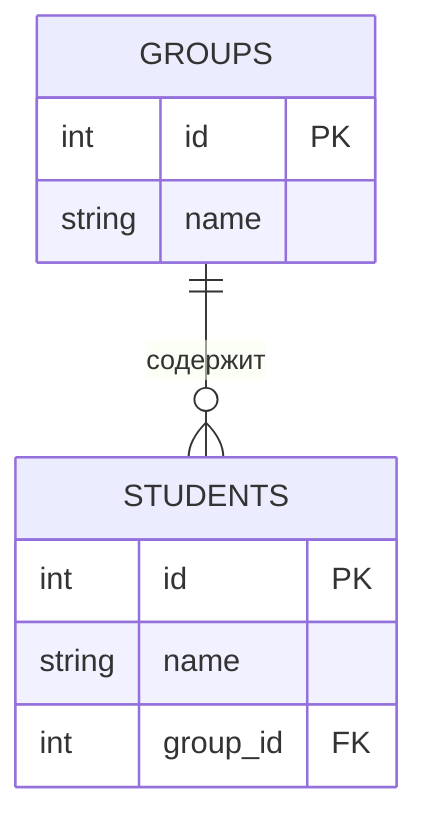

Классическим примером является отношение **«Учебная группа — Курсанты»**. Одна учебная группа включает в себя множество курсантов, однако каждый конкретный курсант организационно приписан только к одной группе.

Реализация связи осуществляется на стороне сущности с множественностью. Добавление списка курсантов в таблицу групп невозможно, так как это нарушает требование атомарности (1НФ). Следовательно, в таблицу `Students` добавляется атрибут `group_id`, являющийся внешним ключом, ссылающимся на `id` таблицы `Groups`. Таким образом устанавливается принадлежность каждой записи студента к конкретной группе.

### Связь «Многие-ко-Многим» (Many-to-Many / M:M)

Тип связи, при котором один экземпляр сущности A может быть связан с множеством экземпляров сущности B, и наоборот. Прямая реализация данного отношения в реляционной модели невозможна.

Рассмотрим взаимодействие сущностей **«Студенты»** и **«Учебные дисциплины»**. Один обучающийся посещает множество дисциплин, а одну дисциплину изучают множество обучающихся. Размещение внешних ключей в любой из исходных таблиц приведет к логическому тупику и нарушению нормализации.

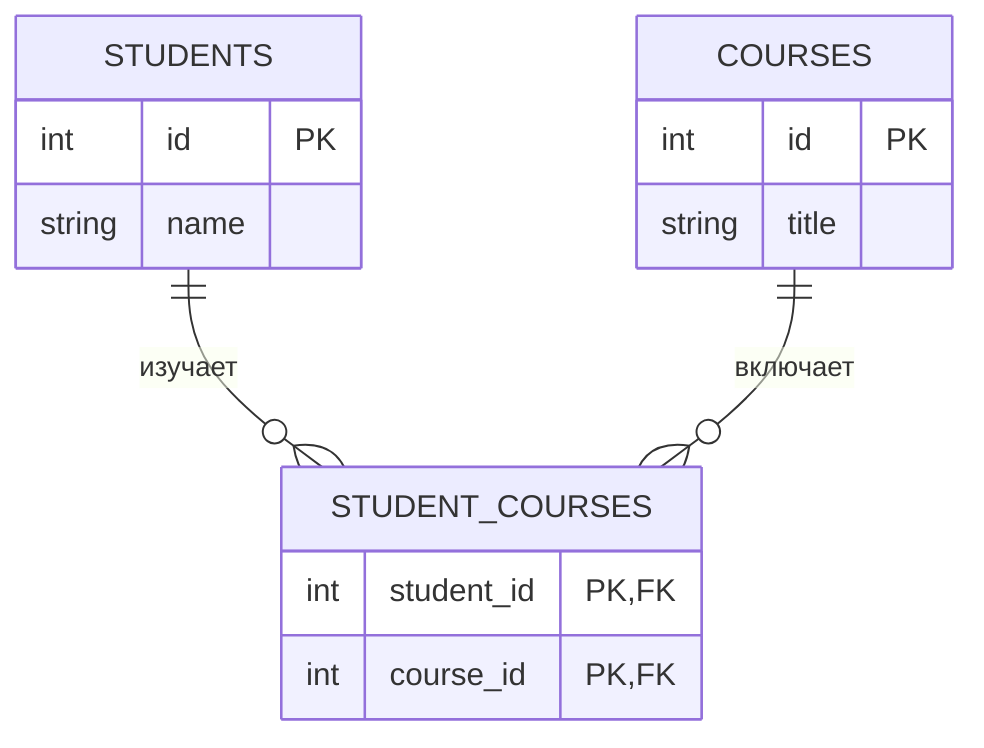

Разрешение коллизии осуществляется через паттерн **Связующая таблица** (Junction Table / Associative Entity). Создается третье отношение (например, `Student_Courses`), задача которого — хранение пар идентификаторов: $\{ID\_Студента, ID\_Дисциплины\}$.

Фактически сложная связь «Многие-ко-Многим» декомпозируется на две связи типа «Один-ко-Многим», направленные от исходных таблиц к связующей. Данное архитектурное решение обеспечивает неограниченное масштабирование системы без нарушения нормальных форм.

### Связь «Один-к-Одному» (One-to-One / 1:1)

Тип связи, характеризующийся строгим соответствием: одной записи в отношении A соответствует ровно одна запись в отношении B.

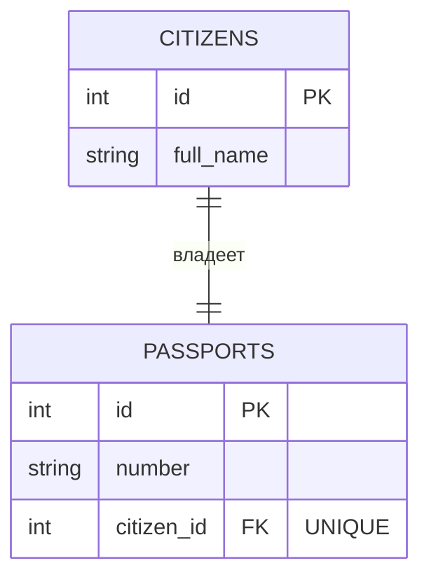

Примером служит пара **«Гражданин — Паспорт»** (при допущении наличия одного действующего документа). Разделение данных на две таблицы (вертикальное партицирование) вместо хранения в одной применяется в специфических инженерных сценариях:

1.  **Информационная безопасность:** Таблица `Users` с общедоступными данными открыта для чтения большинству сервисов, тогда как таблица `User_Passports` или `User_Secrets` доступна ограниченному кругу процессов с высокими привилегиями.
2.  **Оптимизация производительности:** Вынос ресурсоемких атрибутов (например, биографии большого объема или бинарных данных изображений) в отдельную таблицу `User_Profiles`. Это позволяет основной таблице сохранять компактность и повышает эффективность кеширования.

Техническая реализация аналогична связи 1:M, однако на столбец внешнего ключа накладывается ограничение уникальности (`UNIQUE Constraint`), предотвращающее появление дубликатов ссылок.

### Рекурсивная связь (Self-Referencing)

Частный случай связи, при котором отношение ссылается само на себя. Используется для моделирования иерархических структур (деревья, графы) или организационно-штатных структур.

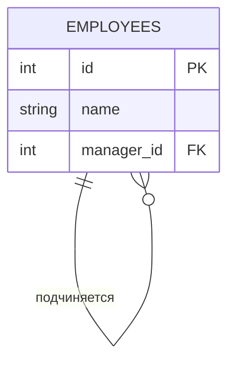

Рассмотрим таблицу **«Личный состав»**. У каждого сотрудника имеется непосредственный руководитель, который также является сотрудником и содержится в том же отношении.

Для реализации структуры в таблицу добавляется атрибут `manager_id`. Специфика заключается в том, что данный внешний ключ ссылается на первичный ключ `id` **этой же самой таблицы**. Таким образом выстраивается цепочка подчинения произвольной глубины. У корневого элемента иерархии (начальника высшего звена) значение поля `manager_id` является неопределенным (`NULL`).

## Ограничения целостности (Integrity Constraints)

Обеспечение **целостности данных (Data Integrity)** является фундаментальной характеристикой промышленных систем управления базами данных. В контексте реляционной теории под целостностью понимается свойство корректности, непротиворечивости и точности информации в любой момент времени.

СУБД функционирует не как пассивное хранилище, а как активная подсистема контроля качества данных. Для реализации данной функции применяется механизм **Ограничений целостности** — декларативных правил, регламентирующих допустимые состояния базы данных. Транзакции, результат выполнения которых нарушает установленные правила, автоматически отклоняются системой.

### Целостность сущности (Entity Integrity)

Данный класс ограничений регламентирует идентификацию кортежей в пределах одного отношения. Поскольку объекты предметной области обладают свойством различимости, каждый кортеж отношения обязан иметь уникальный идентификатор — **Первичный ключ (Primary Key)**.

**Формальные требования:**

1.  **Уникальность:** Значение первичного ключа должно быть уникальным в пределах таблицы, что обеспечивает математическую различимость кортежей.
2.  **Определенность (NOT NULL):** Атрибуты, входящие в состав первичного ключа, не могут принимать значение `NULL`. Семантика `NULL` («значение неизвестно») противоречит концепции детерминированной идентификации.

### Ссылочная целостность (Referential Integrity)

Регламентирует взаимосвязи между отношениями. Если отношение $B$ ссылается на отношение $A$ посредством Внешнего ключа, то значение ссылки в $B$ должно либо совпадать с существующим значением Первичного ключа в $A$, либо быть полностью неопределенным (`NULL`).

**Обработка модификации ссылочных данных:**
Риск нарушения целостности возникает при удалении или изменении ключа в родительской таблице (Referenced Table). На этапе проектирования схемы данных инженер обязан определить стратегию обработки связанных записей в дочерних таблицах.

| Стратегия                | Техническое описание                                                                                                                        | Область применения и пример                                                                                                                                                                                                                     |
| :----------------------- | :------------------------------------------------------------------------------------------------------------------------------------------ | :---------------------------------------------------------------------------------------------------------------------------------------------------------------------------------------------------------------------------------------------- |
| **RESTRICT / NO ACTION** | **Блокирующая стратегия.** Транзакция на удаление родительской записи отклоняется при наличии ссылающихся на неё дочерних записей.          | Стандарт поведения по умолчанию. Гарантирует максимальную сохранность данных.  **Пример:** Запрет удаления структурного подразделения, если в нем числятся сотрудники. Требуется предварительный перевод сотрудников в другое подразделение. |
| **CASCADE**              | **Распространение изменений.** Удаление родительской записи инициирует автоматическое рекурсивное удаление всех связанных дочерних записей. | Используется для жестко связанных сущностей (композиция).  **Пример:** Удаление «Заказа» влечет автоматическое удаление всех «Позиций заказа», так как их хранение без привязки к заказу лишено смысла.                                      |
| **SET NULL**             | **Диссоциация.** Родительская запись удаляется, значения внешних ключей в дочерних записях устанавливаются в `NULL`.                        | Применяется для опциональных связей. Объект сохраняется, но теряет иерархическую привязку.  **Пример:** При удалении учетной записи куратора, у курируемых групп поле «Куратор» очищается, но сами группы сохраняются в системе.             |
| **SET DEFAULT**          | **Переназначение.** Значение внешнего ключа заменяется на предустановленное значение по умолчанию.                                          | Используется для автоматической смены ответственности согласно бизнес-логике.  **Пример:** При увольнении сотрудника незавершенные задачи переназначаются на системного пользователя «Administrator».                                        |

### Доменная целостность (Domain Integrity)

Определяет правила допустимости значений для отдельных атрибутов. Значение атрибута должно соответствовать семантике предметной области.

Механизмы обеспечения:

1.  **Типизация данных (Data Typing):** Базовое ограничение схемы. СУБД блокирует запись данных несоответствующего формата (например, текстовых строк в числовые поля), предотвращая ошибки интерпретации битовых последовательностей.
2.  **Ограничение обязательности (NOT NULL):** Запрет на отсутствие значения. Применяется для критически важных атрибутов, существование записи без которых нецелесообразно (например, ИНН организации).
3.  **Предикаты проверки (CHECK Constraints):** Логические выражения, валидирующие значения строки.
    - _Контроль диапазонов:_ $Age \in [18, 65]$.
    - _Контроль форматов:_ Наличие символа `@` в поле Email.
    - _Перекрестная проверка:_ $Date_{end} \geq Date_{start}$.
4.  **Значения по умолчанию (DEFAULT):** Автоматическое заполнение атрибутов при отсутствии явного ввода, что обеспечивает валидность данных при неполном входном потоке (например, статус «Новый» при создании заявки).

::: tip Принцип независимости данных
Вынос правил валидации из кода приложений (Application Layer) на уровень хранения (Storage Layer) реализует принцип **независимости данных**. Это гарантирует соблюдение бизнес-правил вне зависимости от используемого интерфейса доступа (API, веб-интерфейс, консоль администратора или стороннее ПО). СУБД выступает последним рубежом защиты качества информации.
:::

## Реляционная алгебра (Фундаментальные операции)

Реляционная алгебра (Э. Кодд) — теоретический процедурный язык манипулирования данными. В отличие от декларативного реляционного исчисления (описывающего _«что»_ получить), алгебра описывает алгоритм — _«как»_ получить результат шаг за шагом.

Понимание операций алгебры необходимо для оптимизации взаимодействия с СУБД, так как **Оптимизатор запросов (Query Optimizer)** транслирует SQL-команды в дерево операций реляционной алгебры для построения эффективного плана выполнения.

**Принцип замкнутости (Closure):** Результатом любой операции над отношением всегда является новое отношение. Это позволяет строить вложенные выражения произвольной сложности, где выход одной операции служит входом для следующей.

Классификация операторов:

1.  **Теоретико-множественные:** Объединение, пересечение, разность, декартово произведение.
2.  **Специальные реляционные:** Выборка, проекция, соединение, деление.

### Совместимость по объединению (Union Compatibility)

Для выполнения бинарных теоретико-множественных операций (Объединение, Пересечение, Разность) отношения не могут быть произвольными, они должны быть **совместимы**.

Условия совместимости отношений $A$ и $B$:

1.  **Равная степень:** Идентичное количество атрибутов (столбцов) в обоих отношениях.
2.  **Совместимость доменов:** $i$-й атрибут отношения $A$ должен принадлежать к тому же домену (типу данных), что и $i$-й атрибут отношения $B$. Объединение семантически разнородных атрибутов (например, «Фамилия» и «Дата рождения») недопустимо, даже при совпадении количества столбцов.

### Теоретико-множественные операции

В рамках нижеследующих определений принимается допущение, что отношения $A$ и $B$ являются совместимыми по объединению.

#### Объединение (Union, $A \cup B$)

Операция объединения формирует отношение, включающее в себя все кортежи, принадлежащие либо отношению $A$, либо отношению $B$, либо обоим одновременно.

- **Формальное определение:** $A \cup B = \{ t \mid t \in A \lor t \in B \}$
- **Свойства:**
  - **Коммутативность:** $A \cup B = B \cup A$. Порядок операндов не влияет на результат.
  - **Устранение дубликатов:** Согласно строгой реляционной теории, если идентичный кортеж присутствует в обоих отношениях, в результирующее множество он включается в единственном экземпляре. (Примечание: в языке SQL для реализации теоретического объединения используется оператор `UNION`, для объединения с сохранением дубликатов — `UNION ALL`).
- **Пример:** Объединение списков сотрудников двух различных филиалов для формирования полного штатного расписания организации.

#### Пересечение (Intersection, $A \cap B$)

Операция пересечения формирует отношение, содержащее исключительно те кортежи, которые присутствуют **одновременно** в отношении $A$ и в отношении $B$.

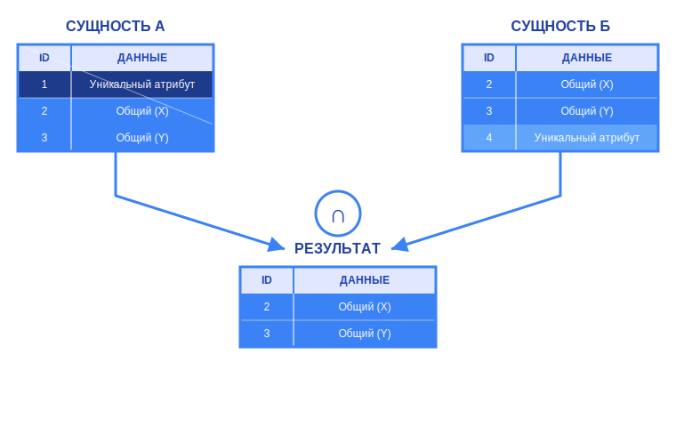

- **Формальное определение:** $A \cap B = \{ t \mid t \in A \land t \in B \}$
- **Свойства:**
  - **Коммутативность:** $A \cap B = B \cap A$.
- **Пример:** Выборка студентов, одновременно находящихся в списке «Получающие стипендию» и в списке «Имеющие академическую задолженность».

#### Разность (Difference, $A - B$ или $A \setminus B$)

Операция разности формирует отношение, содержащее кортежи, присутствующие в $A$, но **отсутствующие** в $B$. Операция реализует механизм исключения одного набора данных из другого.

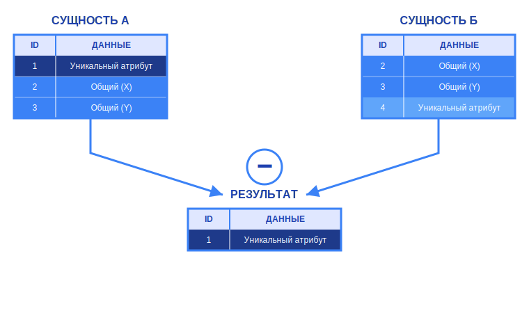

- **Формальное определение:** $A - B = \{ t \mid t \in A \land t \notin B \}$
- **Свойства:**
  - **Некоммутативность:** $A - B \neq B - A$. Исключение должников из общего списка студентов не эквивалентно исключению студентов из списка должников.
- **Пример:** Получение номенклатуры товаров, числящихся на складе ($A$), по которым отсутствуют факты продаж ($B$).

#### Декартово произведение (Cartesian Product, $A \times B$)

В отличие от вышеописанных операций, декартово произведение **не требует** совместимости отношений по объединению. Операция производит соединение каждого кортежа отношения $A$ с каждым кортежем отношения $B$.

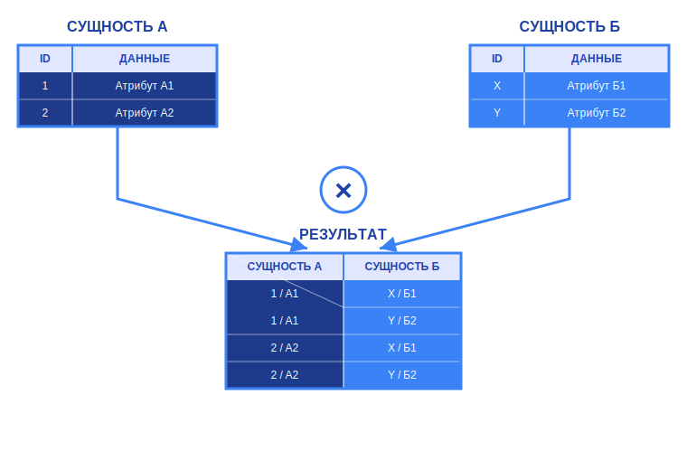

- **Результат операции:**
  - Степень (количество атрибутов) результата равна сумме степеней $A$ и $B$.
  - Мощность (количество кортежей) результата равна произведению мощностей $A$ и $B$.
- **Назначение:** Самостоятельное использование декартова произведения в прикладных задачах нецелесообразно ввиду генерации избыточного объема данных. Однако данная операция является **фундаментальным базисом** для всех операций соединения (JOIN). Соединение определяется как декартово произведение, к которому применена операция ограничения (фильтрации) строк.

### Специальные реляционные (Унарные) операции

Данная группа операций применяется к одному отношению и служит для декомпозиции таблицы в горизонтальной или вертикальной плоскости.

#### Выборка / Ограничение (Selection, $\sigma$)

Выборка осуществляет **горизонтальную фильтрацию** отношения. Результатом является подмножество кортежей, удовлетворяющих заданному логическому условию (предикату).

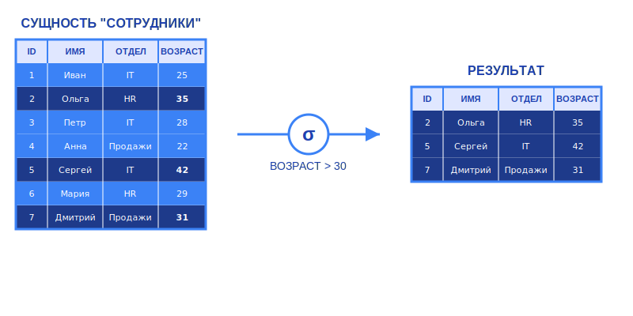

- **Нотация:** $\sigma_{условие}(R)$
- **Характеристики:**
  - Степень результирующего отношения (количество атрибутов) остается неизменной.
  - Мощность (количество кортежей) может уменьшиться или остаться прежней.
  - Предикат может включать операторы сравнения ($=, \neq, <, \leq, >, \geq$) и логические связки ($\land, \lor, \neg$).
- **Физический смысл:** Отсечение иррелевантных данных. Пример: выборка только совершеннолетних пользователей: $\sigma_{age \geq 18}(Users)$.

#### Проекция (Projection, $\pi$)

Проекция осуществляет **вертикальную выборку** отношения. Создается новое отношение, содержащее только указанное подмножество атрибутов; остальные атрибуты отбрасываются.

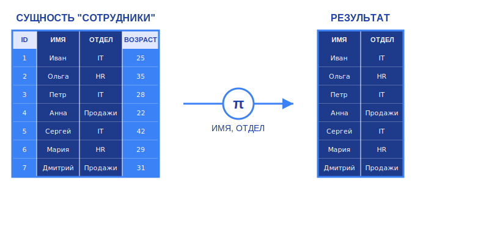

- **Нотация:** $\pi_{список\_атрибутов}(R)$
- **Характеристики:**
  - Степень отношения уменьшается до количества атрибутов в заданном списке.
  - **Удаление дубликатов:** Это ключевой аспект теории. Если после исключения различительных атрибутов (например, уникального ID) в таблице образуются идентичные строки, проекция производит их объединение в одну запись.
- **Физический смысл:** Уменьшение размерности данных, выборка необходимых характеристик. Пример: получение списка контактных телефонов сотрудников без указания ФИО и адресов: $\pi_{phone}(Employees)$.

## Операции соединения (JOINs)

Операция соединения является ключевым инструментом реляционной модели, позволяющим восстанавливать данные, декомпозированные в процессе нормализации. Математически соединение представляет собой композицию декартова произведения двух отношений и последующей операции выборки (фильтрации) по заданному предикату.

В зависимости от типа предиката в теории выделяют два фундаментальных класса соединений.

#### Тета-соединение (Theta-Join, $\theta$-join)

Является наиболее общим случаем операции соединения.

**Определение:** Тета-соединением отношений $A$ и $B$ по предикату $F$ называется отношение, полученное путем применения операции выборки $\sigma_F$ к декартову произведению $A \times B$.
$$A \bowtie_F B = \sigma_F(A \times B)$$
Предикат $F$ представляет собой логическое выражение вида $A.a\ \theta\ B.b$, где $a$ и $b$ — атрибуты соответствующих отношений, а $\theta$ — бинарный оператор сравнения из множества $\{ =, \neq, <, \leq, >, \geq \}$.

**Пример:** Соединение отношений «Сотрудники» и «Руководители» по условию $Salary_{emp} > Salary_{mgr}$ (поиск сотрудников, чей оклад превышает оклад руководителя).

#### Эквисоединение (Equi-Join)

Является частным случаем тета-соединения и наиболее распространенным типом в прикладных задачах.

**Определение:** Эквисоединение — это соединение, в котором предикат $F$ использует исключительно оператор равенства ($=$).
$$A \bowtie_{A.a = B.b} B$$
Как правило, эквисоединение выполняется по паре атрибутов «Внешний ключ» (в дочернем отношении) и «Первичный ключ» (в родительском отношении).

::: info Свойство избыточности
Формально результат эквисоединения содержит два столбца с идентичными значениями (атрибут соединения из $A$ и атрибут соединения из $B$). В теоретической реляционной алгебре применяется дополнительная операция проекции для удаления дублирующего столбца (естественное соединение). В реализации SQL сохраняются оба столбца, если в запросе не указано иное.
:::

### Классификация соединений в SQL

В стандарте SQL операции соединения классифицируются на основе стратегии обработки кортежей, для которых не было найдено соответствие в другом отношении.

#### Внутреннее соединение (INNER JOIN)

Данная операция является прямой реализацией эквисоединения.

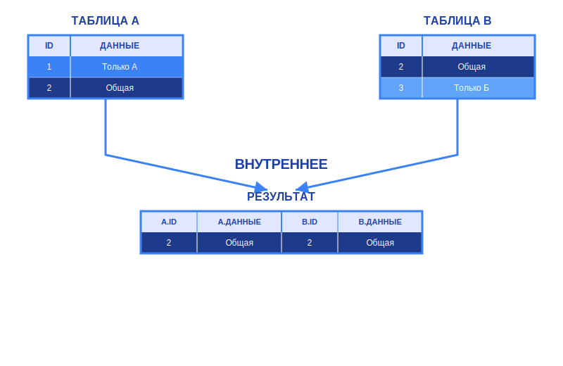

**Алгоритм:**
СУБД формирует результирующее множество, включая в него исключительно те пары кортежей из левого и правого отношения, для которых предикат соединения принимает значение `TRUE`.

**Свойства:**

- **Симметричность:** Результат $A \bowtie B$ семантически эквивалентен $B \bowtie A$ (с точностью до порядка столбцов).
- **Фильтрация:** Кортежи, не имеющие соответствия (например, внешний ключ равен `NULL` или ссылается на отсутствующее значение при нарушении ссылочной целостности), исключаются из результата. Операция работает по принципу пересечения множеств.

#### Внешние соединения (OUTER JOINs)

Внешние соединения являются расширением внутреннего соединения. Предназначены для сохранения информации о кортежах, не удовлетворяющих условию соединения. Для отсутствующих атрибутов используется заполнитель `NULL` (маркер неопределенности).

**1. Левое внешнее соединение (LEFT OUTER JOIN)**

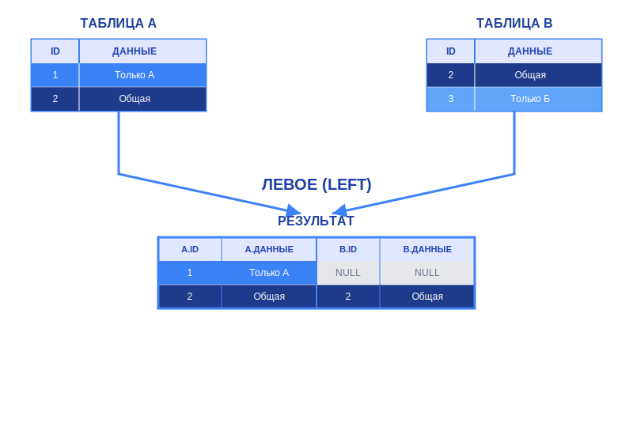

- **Характеристика:** Сохраняет (не отбрасывает) все кортежи левого отношения (первого операнда).
- **Формальная логика:** Результат содержит все строки внутреннего соединения $A \bowtie B$, плюс все строки из $A$, для которых не нашлось соответствия в $B$. Для таких строк атрибуты отношения $B$ заполняются значением `NULL`.
- **Применение:** Получение полных списков сущностей (например, Клиентов) с присоединением опциональных данных (Заказов), где отсутствие связанных данных не должно исключать сущность из выборки.

**2. Правое внешнее соединение (RIGHT OUTER JOIN)**

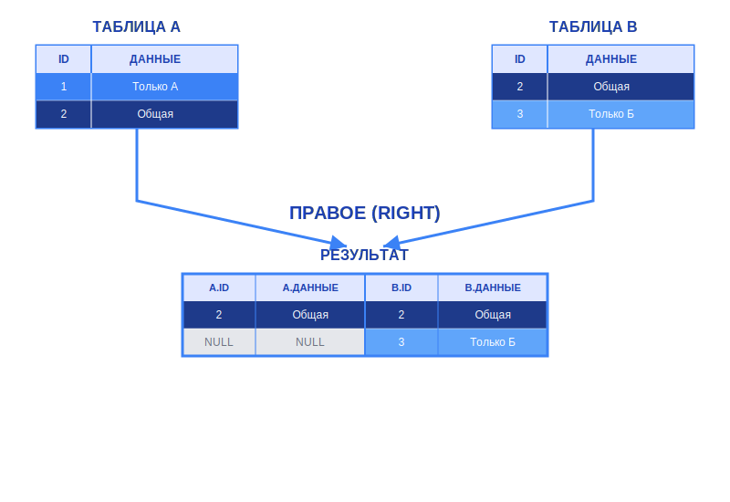

- **Характеристика:** Сохраняет все кортежи правого отношения (второго операнда).
- **Формальная логика:** Симметрична левому соединению. В результат попадают все кортежи из $B$. Если для кортежа из $B$ нет соответствия в $A$, атрибуты $A$ принимают значение `NULL`.
- **Применение:** В инженерной практике используется редко, так как эквивалентна операции `LEFT JOIN` с переставленными местами операндами. Обычно заменяется на левое соединение для обеспечения читаемости кода (слева направо).

**3. Полное внешнее соединение (FULL OUTER JOIN)**

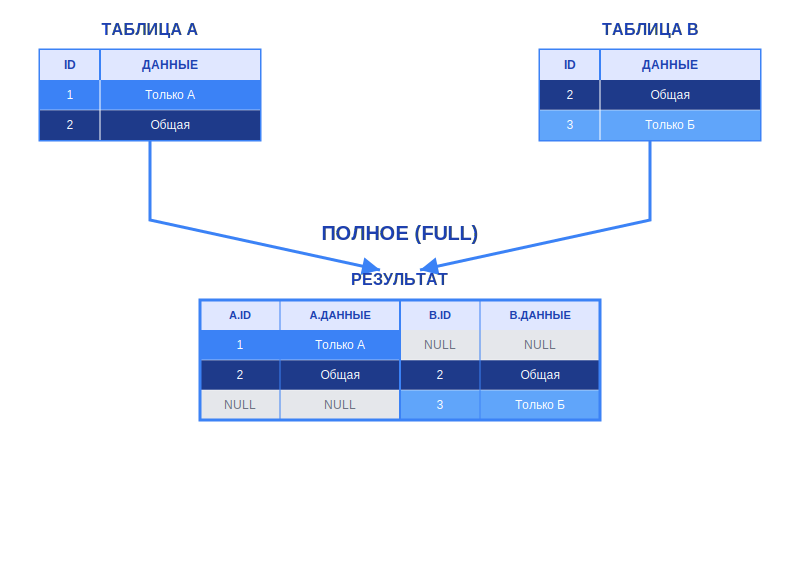

- **Характеристика:** Сохраняет кортежи обоих отношений.
- **Формальная логика:** Является теоретико-множественным объединением (`UNION`) результатов левого и правого соединений.
- **Результат:** Отношение содержит:
  - Совпадающие пары (Inner part).
  - Кортежи из $A$ без соответствия в $B$ (дополненные `NULL`).
  - Кортежи из $B$ без соответствия в $A$ (дополненные `NULL`).
- **Применение:** Задачи сверки данных (Reconciliation), поиск расхождений в двух наборах данных, агрегация полной статистики по двум независимым критериям.

::: tip Резюме

- **INNER JOIN:** Пересечение множеств. Исключает несовпадающие данные.
- **LEFT/RIGHT JOIN:** Направленное дополнение. Сохраняет данные одной из сторон, дополняя их информацией другой стороны или `NULL`-значениями.
- **FULL JOIN:** Объединение множеств с сохранением всех данных и заполнением пропусков `NULL`-значениями.

:::

## Выводы по учебному вопросу

Реляционная модель данных, предложенная Э. Коддом, является не историческим этапом развития информационных технологий, а строгим математическим базисом, на котором функционирует подавляющее большинство современных промышленных СУБД. Понимание анатомии отношений, системы ключей и принципов нормализации позволяет инженеру переходить от интуитивного хранения данных к проектированию устойчивых, масштабируемых и целостных информационных систем.

Особое место в теории занимает реляционная алгебра. Несмотря на использование декларативного языка SQL («что получить»), на уровне ядра СУБД запрос транслируется в процедурную последовательность операций реляционной алгебры («как получить»). Глубокое понимание механики селекции, проекции и различных видов соединений (JOIN) является обязательным условием для написания производительных запросов и оптимизации работы базы данных.

Ограничения целостности и правила реляционной алгебры выступают гарантом качества данных, трансформируя базу данных из пассивного хранилища байтов в интеллектуальную систему, способную самостоятельно поддерживать логическую непротиворечивость информации и обеспечивать достоверность результатов аналитической обработки.
