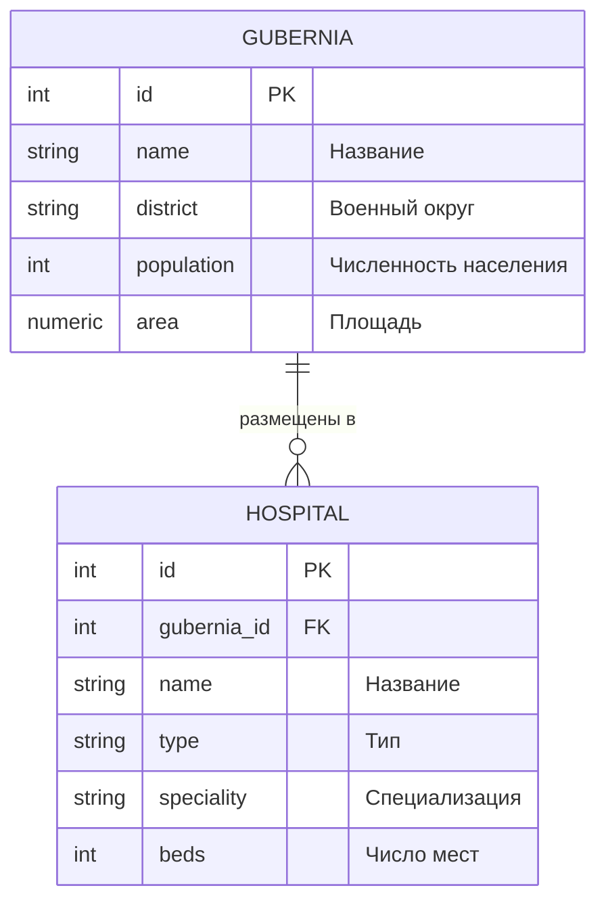
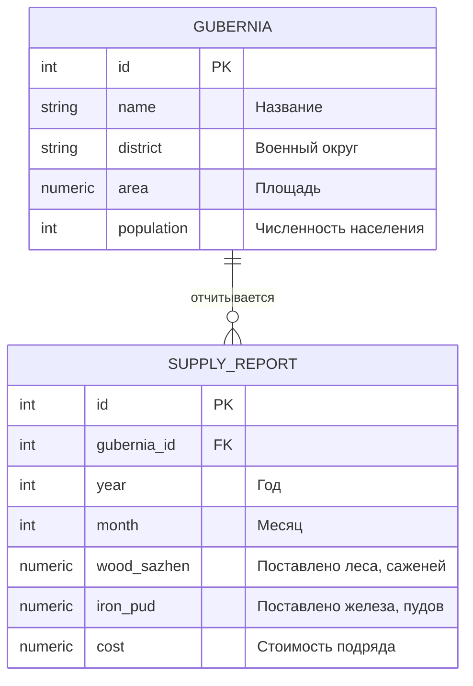
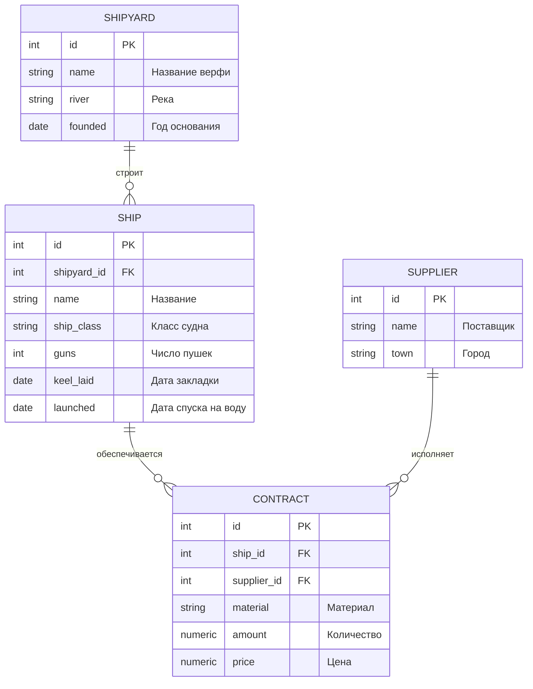
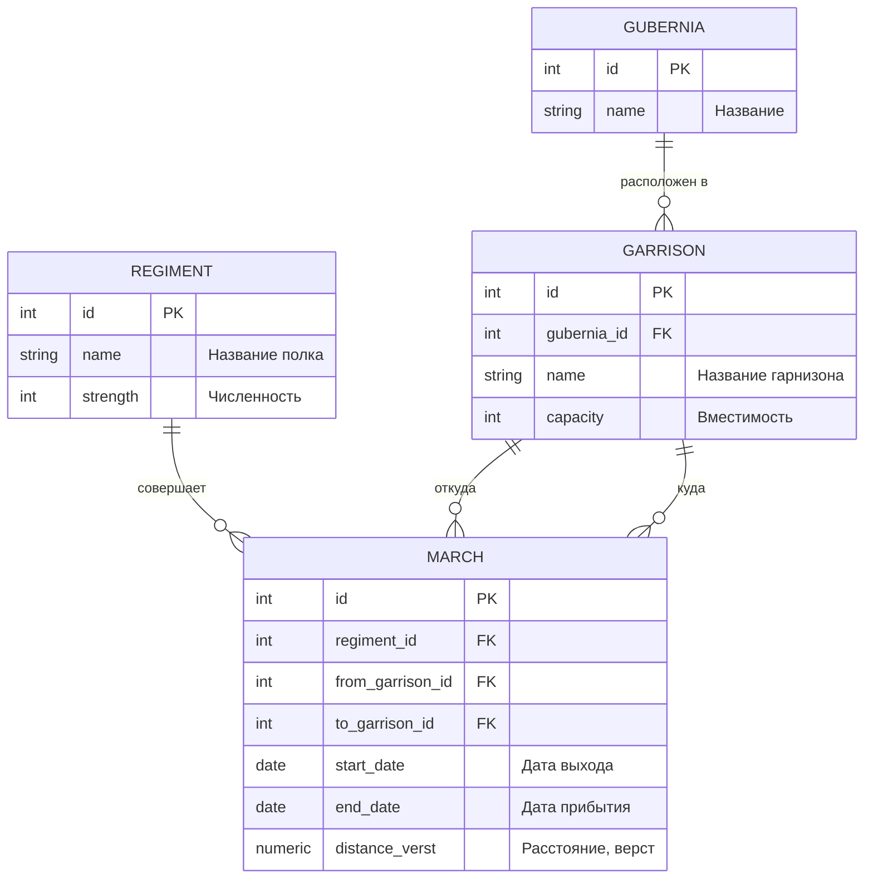

<script setup>
import Conversation from "../../../components/Conversation.vue";
import ivan from "../../assets/databases/heroes/clerk_fedor.png";
import petr from "../../assets/databases/heroes/petr_young.png";
import doctor from "../../assets/databases/heroes/doctor.png";
import { defineAsyncComponent } from "vue";

const Repl = defineAsyncComponent(() => import("../../../components/Repl.vue"))
</script>

# Разработка таблиц

## Введение: Город на пустом месте

**Август 1698 года.** Великое посольство возвращается домой раньше срока. Петр бросает Вену и мчится в Москву, получив депешу: стрельцы снова взбунтовались. Бунт подавили без него, но царь устраивает розыск такой жестокости, что о нем будут помнить столетиями. Старая Россия сопротивляется, и Петр ломает ее через колено: боярам при личной встрече он собственноручно режет бороды, длиннополые кафтаны подрезают прямо на улицах, а с **1 января 1700 года** страна начинает новое летоисчисление – не от сотворения мира, а от Рождества Христова.

Канцелярия в эти годы работает на износ. Ведомости переписываются под новый календарь, бородовые знаки учитываются поштучно, в приказах появляются новые должности, которых вчера не существовало.

И именно в эту зиму история теряет одного из своих героев.

Дьяк Алексей Транзакциев простудился в дороге между Москвой и Воронежем. Старику было под семьдесят, и горячка свалила его за неделю. Он умер в начале **1701 года**, в своей избе, разбирая очередную смету. После него осталась толстая тетрадь в кожаном переплете – тридцать лет наблюдений о том, как вести дела с данными: где врут цифры, где врут люди, и почему порядок в книгах дороже порядка в казне.

Тетрадь перешла к Федору Запросову. Ему тридцать, он уже не подьячий, а дьяк. И впервые за всю службу рядом с ним нет никого, кто сказал бы: «Не суетись, Федька, делай так».

<Conversation :phrases="[
    {
        name: 'Федор',
        position: 'right',
        text: '(один, над раскрытой тетрадью) Пятнадцать лет я спрашивал, а он отвечал. А теперь спрашивать некого. Ну что ж, Алексей Иваныч. Будем читать, что ты тут понаписал.',
        photo: ivan
    }
]"/>

Дальше события летят вскачь. **1700 год** – «нарвская конфузия», страшный разгром под Нарвой, где шведы Карла XII разбивают русскую армию и забирают всю артиллерию. **1702 год** – взят Нотебург, древний русский Орешек, который Петр переименовывает в Шлотбург: «Зело жесток сей орех был, однако, слава Богу, счастливо разгрызен». **Весна 1703 года** – пала крепость Ниеншанц в самом устье Невы.

И вот здесь, на болотистом Заячьем острове, где Нева разливается перед выходом в залив, **16 мая 1703 года** Петр закладывает крепость Санкт-Питер-Бурх.

Место, честно говоря, отвратительное. Болото, комары, осенние нагонные воды, которые раз в несколько лет смывают все построенное. Ни камня, ни дорог, ни людей. Зато это выход к морю – то, за что Петр воевал всю жизнь.

Через полгода царь вызывает Федора.

<Conversation :phrases="[
    {
        name: 'Петр',
        position: 'left',
        text: 'Федор! Город будем строить. Настоящий, каменный, по европейскому чертежу. Людей сгоним со всей страны, по сорок тысяч в год. Каждому надо отвести место, каждый двор записать, с каждого спросить. Давай книги.',
        photo: petr
    },
    {
        name: 'Федор',
        position: 'right',
        text: 'Какие книги, государь? Тут ничего нет. Ни ведомостей, ни окладных списков, ни межевых. Пустое болото.',
        photo: ivan
    },
    {
        name: 'Петр',
        position: 'left',
        text: 'Вот и славно. Значит, никто до тебя не напортил. Садись и сочиняй с нуля. Все эти годы ты чужие книги читал, а теперь напишешь свою. Смотри не осрамись: по этим книгам город простоит двести лет.',
        photo: petr
    },
    {
        name: 'Федор',
        position: 'right',
        text: '(про себя) Двести лет... Вот этого-то я и боюсь, мин херц. Запрос я могу переписать хоть десять раз, никто и не заметит. А ошибку в чертеже таблицы потом будут править те, кто меня в глаза не видел.',
        photo: ivan
    }
]"/>

::: tip Из тетради дьяка Алексея

Запрос живет один миг, а таблица – сто лет.

Если ты напутал в запросе, об этом узнаешь ты один и через минуту. Если ты напутал в чертеже таблицы, об этом узнают твои внуки, и чинить это будут они, а не ты.

Потому садясь проектировать, не спеши к перу. Сперва спроси себя три вещи: что я храню, чего я про это обещаю, и что случится, когда государь передумает.

:::

Весь этот курс мы читали данные. Сегодня мы впервые их **создаем** – не записи, а сами хранилища. Это другая работа и другая ответственность.

Вот схема, к которой мы придем к концу занятия.

```mermaid
erDiagram
    CITY_PARTS ||--o{ SETTLERS : "приписаны к"
    SETTLERS ||--o{ DUTIES : "отрабатывают"
    SETTLERS ||--o{ REMEDIES : "получают"

    CITY_PARTS {
        int id PK
        string name "Часть города"
        int sloboda_from "Первый номер слободы"
        int sloboda_to "Последний номер слободы"
    }

    SETTLERS {
        int id PK
        string full_name "ФИО"
        date birth_date "Дата рождения"
        time arrival_time "Час прибытия"
        timestamp arrival_at "Дата и час прибытия"
        bool is_male "Пол"
        int sloboda_no "Номер слободы"
        string craft "Ремесло"
        numeric salary "Оклад"
    }

    DUTIES {
        int settler_id PK_FK
        string work_type PK "Вид наряда"
        int days "Отработано дней"
    }

    REMEDIES {
        int id PK
        int settler_id FK
        string name "Снадобье"
        string base "Основа"
        int spirit_degree "Крепость"
    }
```

Справочник частей города Федор завел сразу – он понадобится нам для внешних ключей. Все остальное мы будем сочинять, рвать и сочинять заново прямо по ходу занятия.

::: details Данные для БД

```sql
CREATE TABLE city_parts (
    id SERIAL PRIMARY KEY,
    name VARCHAR(50) NOT NULL UNIQUE,
    sloboda_from INTEGER NOT NULL,
    sloboda_to INTEGER NOT NULL
);

INSERT INTO city_parts (name, sloboda_from, sloboda_to) VALUES
('Санкт-Петербургская сторона', 1111, 1155),
('Васильевский остров',         2211, 2255),
('Адмиралтейская часть',        3311, 3355);
```

:::

<ClientOnly>
<Repl :initial-queries="[
`CREATE TABLE city_parts (
    id SERIAL PRIMARY KEY,
    name VARCHAR(50) NOT NULL UNIQUE,
    sloboda_from INTEGER NOT NULL,
    sloboda_to INTEGER NOT NULL
);`,
`INSERT INTO city_parts (name, sloboda_from, sloboda_to) VALUES
('Санкт-Петербургская сторона', 1111, 1155),
('Васильевский остров',         2211, 2255),
('Адмиралтейская часть',        3311, 3355);`
]"/>
</ClientOnly>

## Из чего строить: типы данных

Прежде чем писать первую строчку чертежа, Федор упирается в вопрос, которого раньше для него не существовало. Когда ты читаешь чужую таблицу, типы столбцов – это данность. Когда ты ее создаешь, это твое решение, и оно останется в силе надолго.

<Conversation :phrases="[
    {
        name: 'Федор',
        position: 'right',
        text: 'Так. «Оклад». Это число. А какое число? Целое? С копейками? А «ремесло» – это слово. А сколько букв в слове? А если плотник окажется с длинным прозвищем, книга лопнет?',
        photo: ivan
    }
]"/>

::: tip Из тетради дьяка Алексея

Тип – это не украшение столбца. Это обещание, которое база обязана держать за тебя.

Поставил `DATE` – и база сама не пустит в столбец «вчера после обеда». Поставил `TEXT` – и сам потом будешь разбирать, что писарь туда насовал.

:::

Полный перечень типов PostgreSQL мы уже разбирали в занятии [Типы данных и операторы СУБД PostgreSQL](./essentials/data-types.md). Там справочник. Здесь – про **выбор**: почему из двух похожих типов берут один, и чем это обойдется через год.

### Числа: чем мерить деньги, а чем людей

Целые числа различаются только размером и, следовательно, диапазоном.

| Тип | Размер | Диапазон | Когда брать |
| --- | --- | --- | --- |
| `smallint` | 2 байта | от −32 768 до 32 767 | номер слободы, количество дней, этажность. Экономия почти всегда мнимая |
| `integer` (`int`) | 4 байта | примерно ±2,1 млрд | выбор по умолчанию для любых счетных величин и идентификаторов |
| `bigint` | 8 байт | примерно ±9,2 квинтиллиона | когда строк реально может стать больше двух миллиардов: журналы, события, метрики |

Практический совет простой: берите `integer`, а для первичных ключей в таблицах, которые будут расти вечно (логи, события, сообщения), сразу `bigint`. Переделать `integer` в `bigint` на большой живой таблице – это долгая операция с блокировкой, которую планируют заранее.

С вещественными числами интереснее. Их два семейства, и путать их дорого.

| Тип | Как считает | Когда брать |
| --- | --- | --- |
| `numeric(p, s)` / `decimal(p, s)` | **точно**, в десятичной системе. `p` – всего значащих цифр, `s` – из них после запятой | деньги, проценты, все, что должно сходиться до копейки |
| `real` (4 байта), `double precision` (8 байт) | **приблизительно**, в двоичной системе с плавающей точкой | физические измерения, координаты, статистика, где седьмой знак не важен |

Разница не теоретическая. Проверьте сами:

```sql
-- Приблизительная арифметика
SELECT 0.1::float + 0.2::float = 0.3::float AS float_result;
-- false

-- Точная арифметика
SELECT 0.1::numeric + 0.2::numeric = 0.3::numeric AS numeric_result;
-- true
```

Причина в том, что `0.1` невозможно точно представить в двоичной дроби – так же, как `1/3` невозможно точно записать в десятичной. `double precision` хранит ближайшее приближение, и при сложении погрешности накапливаются.

<Conversation :phrases="[
    {
        name: 'Федор',
        position: 'right',
        text: 'То есть если я сложу тысячу окладов по копейке, у меня в итоге может не хватить трех копеек? И мне это объяснять государю?',
        photo: ivan
    },
    {
        name: 'Петр',
        position: 'left',
        text: '(из-за двери) Что там про три копейки?! Кто взял?!',
        photo: petr
    }
]"/>

::: warning Заповедь про деньги
Деньги, оклады, сметы, подати и все, что обязано сходиться в копейку, хранят **только** в `numeric`.

Для денег берут `numeric(12, 2)` или шире: двух знаков после запятой хватает на копейки, а `p = 12` дает суммы до десяти миллиардов.

`float` и `double precision` в сметах – это гарантированный спор с казначеем, который вы проиграете.
:::

Отдельно про автонумерацию. Привычный `SERIAL` – это не тип, а сокращение: PostgreSQL создает последовательность и подставляет из нее значение по умолчанию. Современный стандартный способ – `GENERATED AS IDENTITY`. О различиях – в разделе про `CREATE TABLE`.

### Текст: varchar(n), varchar, text и механизм TOAST

Это самый частый вопрос начинающего проектировщика и самая распространенная ошибка: «возьму `varchar(50)`, он же быстрее, чем `text`».

Нет. Он не быстрее.

**Внутри PostgreSQL все три типа – это один и тот же `varlena`**: заголовок с длиной плюс сами байты. На диске `varchar(50)`, `varchar` и `text` с одинаковым содержимым занимают **одинаково**. Никакой «предвыделенной» области под 50 символов не существует – это не `char(50)` из старых систем и не массив фиксированной длины из Си.

#### Что такое TOAST

Данные в PostgreSQL лежат страницами по 8 КБ, и строка таблицы не может быть разрезана между страницами. А значит, что-то надо делать с длинными значениями.

Этим занимается **TOAST** – The Oversized-Attribute Storage Technique:

1. Если строка не влезает примерно в четверть страницы (порог около 2 КБ), PostgreSQL берет самые длинные значения в строке и **сжимает** их.
2. Если и после сжатия строка не влезает, значение **выносится в отдельную TOAST-таблицу**, нарезанное на куски, а в самой строке остается короткий указатель.
3. При чтении столбца значение собирается обратно. Если вы этот столбец в запросе не трогаете, оно даже не читается – и это, кстати, аргумент не писать `SELECT *`.

Ключевое: **TOAST – это механизм хранения, а не свойство типа.** Он работает для `text`, `varchar(n)` и `jsonb` совершенно одинаково.

::: info Миф: «text медленнее, потому что он про TOAST»
Короткое значение в `text` в TOAST не попадет никогда. Длинное значение попадет в TOAST и из `varchar(10000)` тоже.

В TOAST значение уезжает из-за **своего размера**, а не из-за имени типа в чертеже.
:::

#### Единственная реальная разница

`varchar(n)` при каждой вставке и обновлении **дополнительно проверяет длину строки** и бросает ошибку, если не влезло. `text` этого не делает.

То есть накладные расходы есть, и они на стороне `varchar(n)`, а не `text`. Разница микроскопическая и в реальной жизни незаметна, но направление важно запомнить: аргумента «`varchar(n)` ради производительности» не существует.

#### Где varchar(n) принципиален

Ограничение длины имеет смысл тогда, когда это **предметное правило или внешний контракт**, а не вкусовщина.

- Код части города ровно из двух букв, артикул, номер участка фиксированной ширины.
- Поле, которое уедет в чужую систему, где колонка жестко шириной 30 знаков.
- Поле, попадающее в печатный отчет или бланк фиксированного формата.
- Любой случай, когда вы можете вслух назвать причину, почему именно столько знаков.

В этих случаях ограничение в схеме – это и документация, и защита от мусора, которую не надо дублировать в каждом приложении, обращающемся к базе. База одна, приложений со временем становится много.

#### Где все равно, и лучше text

Имена, фамилии, названия улиц, названия снадобий, описания, примечания – любой свободный текст. Здесь `varchar(50)` не защищает ни от чего, зато однажды обязательно отрежет кому-то фамилию.

Если ограничение все-таки нужно, но оно «приблизительное» и может поменяться, честнее вынести его в явное правило:

```sql
note TEXT CONSTRAINT ck_note_len CHECK (length(note) <= 500)
```

Такое ограничение видно глазами как бизнес-правило, у него есть имя, и его можно снять и поставить заново одной командой.

#### Цена изменения решения

Это главный аргумент, который редко называют вслух.

| Изменение | Цена |
| --- | --- |
| `varchar(50)` → `varchar(100)` | дешево: современные версии PostgreSQL не перезаписывают таблицу |
| `varchar(n)` → `text` | дешево: ограничение просто снимается |
| `varchar(100)` → `varchar(50)` | дорого: нужна полная проверка всех строк и перезапись таблицы под блокировкой |
| `text` → `varchar(n)` | дорого: то же самое |

Вывод: `text` – это решение, которое потом **не придется отменять**. `varchar(n)` – решение, которое, возможно, придется.

Мы вернемся к этому в разделе «Государь передумал», где Петр в очередной раз поменяет план города.

#### А char(n) не используйте

`character(n)` дополняет строку пробелами справа до полной длины **и хранит эти пробелы на диске**. Тут и начинаются странности.

**Во-первых, он действительно занимает больше места** – в отличие от `varchar(n)`, у которого ограничение бесплатное:

```sql
CREATE TEMP TABLE t (a CHAR(20), b VARCHAR(20));
INSERT INTO t VALUES ('аб', 'аб');
SELECT pg_column_size(a) AS char20, pg_column_size(b) AS varchar20 FROM t;
-- char20 = 23, varchar20 = 5
```

**Во-вторых, функции расходятся в показаниях.** `length()` хвостовые пробелы отбрасывает, а `octet_length()` считает:

```sql
SELECT length('аб'::CHAR(10))       AS len,     -- 2
       octet_length('аб'::CHAR(10)) AS octets;  -- 12
```

**А в-третьих – и это настоящая ловушка – равенство и поиск по шаблону отвечают по-разному.** Для `char(n)` хвостовые пробелы при сравнении на равенство **не значимы**, а для `LIKE` и регулярных выражений **значимы**:

```sql
SELECT 'аб'::CHAR(10) = 'аб'     AS eq,        -- true
       'аб'::CHAR(10) LIKE 'аб'  AS like_exact, -- false (!)
       'аб'::CHAR(10) ~ 'аб$'    AS regexp;     -- false (!)
```

Два запроса, которые человек считает одинаковыми, дают противоположные ответы. Найти такую ошибку в большом отчете почти невозможно: все выглядит правильно, просто часть строк куда-то не попадает.

Тип оставлен в PostgreSQL для совместимости со стандартом SQL, и документация прямо говорит, что преимуществ в быстродействии у него нет. В новых чертежах ему места нет: нужна фиксированная длина – берите `varchar(n)` и ограничение `CHECK (length(code) = 2)`.

::: tip Из тетради дьяка Алексея

Бери `TEXT`, пока не можешь назвать причину, почему именно столько знаков.

Назвал причину – ставь `VARCHAR(n)` и ту причину запиши рядом в комментарий. Через год ты ее не вспомнишь, а кто-то придет и спросит, почему именно двадцать пять.

:::

### Дата и время: ловушка без пояса

| Тип | Что хранит |
| --- | --- |
| `date` | только дату: год, месяц, день |
| `time` | только время суток |
| `timestamp` | дату и время **без** часового пояса |
| `timestamptz` | момент времени, приведенный к UTC |
| `interval` | промежуток: «16 лет», «3 дня 4 часа» |

Разница между `timestamp` и `timestamptz` сбивает с толку всех. Запомнить проще так:

- `timestamptz` хранит **момент**. Один и тот же момент, прочитанный в Петербурге и в Амстердаме, покажет разное время на часах, но это будет то же мгновение. Берите его для всего, что происходит в реальном мире: когда записали, когда отправили, когда случилось.
- `timestamp` хранит **показания часов** без привязки к месту. Это правильный выбор для «времени на бумаге»: во сколько по регламенту начинается работа, на какой час назначен прием. Такое время не должно ехать при смене пояса.

Исторически Федор столкнулся ровно с этой задачей. С **1 января 1700 года** Россия перешла на новое летоисчисление: год стал начинаться не 1 сентября, а 1 января, и считаться не от сотворения мира, а от Рождества Христова. Старые ведомости датированы по одной системе, новые – по другой, и одно и то же событие в двух книгах выглядит как два разных.

<Conversation :phrases="[
    {
        name: 'Федор',
        position: 'right',
        text: 'Семь тысяч двести восьмой год от создания мира и одна тысяча семисотый от Рождества – это один и тот же год. Я это знаю. А книга не знает. Если я запишу в столбец «7208», через сто лет никто не разберет, что это такое.',
        photo: ivan
    }
]"/>

Отсюда правило: храните дату датой, а не числом и не строкой. `interval` тоже полноценный тип, а не текст, и с ним можно считать:

```sql
SELECT now() - INTERVAL '16 years' AS sixteen_years_ago;
```

Этой конструкцией мы воспользуемся в ограничениях.

### Логический тип и NULL

`boolean` принимает три состояния: `TRUE`, `FALSE` и `NULL` – «неизвестно». Для истины PostgreSQL понимает `TRUE`, `'t'`, `'true'`, `'y'`, `'yes'`, `'1'`, для лжи – соответствующие им формы.

В методических материалах пол нередко задают числом: мужской – 1, женский – 0. Это работает, но `boolean` честнее: по имени столбца `is_male` сразу видно, что `true` значит, и не нужно помнить, в какую сторону договорились.

А вот ловушка, которая понадобится нам на следующем занятии:

::: warning Запомните про NULL и CHECK
Ограничение `CHECK` считается **выполненным**, если выражение вернуло `TRUE` **или** `NULL`.

То есть `CHECK (salary > 0)` не пропустит значение `0`, но спокойно пропустит `NULL`: сравнение неизвестного с нулем дает неизвестный результат, а неизвестность ограничение не нарушает.

Если пустые значения недопустимы – это отдельное ограничение `NOT NULL`. Одно другое не заменяет.
:::

### Что еще стоит знать

- **`uuid`** – 16 байт, глобально уникальный идентификатор. Нужен, когда ключ генерирует клиент или когда данные сливаются из нескольких независимых баз и `id` обязаны не столкнуться. Для обычной таблицы с одной базой `integer` удобнее и компактнее.
- **`bytea`** – двоичные данные. Технически в нем можно хранить картинки и файлы, практически – почти всегда лучше хранить файл отдельно, а в базе держать путь к нему. Иначе резервная копия базы начинает весить как файловый архив.
- **`jsonb`** – те самые «заморские сундуки» из занятия по функциям. Для данных, у которых структура у каждой строки своя. Не замена нормальным столбцам, а дополнение к ним.
- **Массивы** (`integer[]`, `text[]`) – удобны для коротких однородных списков. Как только по элементам нужно искать, соединять и считать статистику, честнее отдельная таблица.
- **`ENUM`** против `varchar + CHECK`. Перечисляемый тип выглядит академичнее, но на практике `varchar(25) CHECK (craft IN (...))` удобнее: список допустимых значений расширяется одним `ALTER TABLE`, а не пересборкой типа, от которого зависят другие объекты.

### Шпаргалка: как выбирать тип

::: tip Что храним – что берем – почему

| Что храним | Что берем | Почему |
| --- | --- | --- |
| Идентификатор | `integer` + `IDENTITY`, для вечно растущих таблиц `bigint` | компактно и быстро в соединениях |
| Деньги, оклад, смета | `numeric(12, 2)` | точная арифметика, сходится в копейку |
| Измерение, координата, доля | `double precision` | погрешность в седьмом знаке не важна, зато быстро |
| Имя, фамилия, название, примечание | `text` | ограничение длины ничего не защищает, а отрезать фамилию может |
| Код, артикул, поле для внешней системы | `varchar(n)` | длина – часть предметного правила |
| Дата рождения, дата закладки | `date` | время суток не нужно и только мешает |
| Момент события в реальном мире | `timestamptz` | хранит мгновение, а не показания часов |
| Время по регламенту, «на бумаге» | `timestamp` | не должно ехать при смене пояса |
| Да или нет | `boolean` | и не забыть, что бывает третье состояние |
| Фиксированный набор значений | `varchar(n)` + `CHECK (... IN ...)` | расширяется одним `ALTER` |
| Своя структура у каждой строки | `jsonb` | и только если по ней действительно надо искать |
| Строка ровно из n знаков | `varchar(n)` + `CHECK (length(x) = n)`, но не `char(n)` | у `char(n)` равенство и `LIKE` отвечают по-разному |

:::

Теперь, когда Федор решил, **чем** мерить, можно браться за чертеж.

## Первый чертеж (CREATE TABLE)

<Conversation :phrases="[
    {
        name: 'Петр',
        position: 'left',
        text: 'Начни с людей. Мне со всей страны гонят работных людей: плотников, каменщиков, землекопов. Про каждого надо знать: кто таков, когда родился, когда прибыл, к какой слободе приписан, какому ремеслу обучен и сколько ему положено.',
        photo: petr
    },
    {
        name: 'Федор',
        position: 'right',
        text: 'Понял, мин херц. Заводим книгу поселенцев.',
        photo: ivan
    }
]"/>

Общий вид команды создания таблицы:

```sql
CREATE TABLE имя_таблицы (
    имя_столбца_1 тип_данных [ограничения_столбца],
    имя_столбца_2 тип_данных [ограничения_столбца],
    ...
    [ограничения_таблицы]
);
```

Первый чертеж книги поселенцев:

```sql
CREATE TABLE settlers (
    id SERIAL,
    full_name CHARACTER VARYING (50),   -- фамилия, имя, отчество
    birth_date DATE,                    -- дата рождения
    arrival_time TIME,                  -- час прибытия на работы
    arrival_at TIMESTAMP,               -- дата и час прибытия
    is_male BOOLEAN,                    -- пол
    sloboda_no INTEGER,                 -- номер слободы
    craft CHARACTER VARYING (25),       -- ремесло
    salary DOUBLE PRECISION             -- оклад
);
```

### Псевдонимы типов

Ровно та же таблица, записанная короче. PostgreSQL понимает оба варианта одинаково:

```sql
CREATE TABLE settlers (
    id SERIAL,
    full_name VARCHAR (50),
    birth_date DATE,
    arrival_time TIME,
    arrival_at TIMESTAMP,
    is_male BOOL,
    sloboda_no INT,
    craft VARCHAR (25),
    salary FLOAT
);
```

`VARCHAR` – псевдоним `CHARACTER VARYING`, `BOOL` – `BOOLEAN`, `INT` – `INTEGER`, `FLOAT` – `DOUBLE PRECISION`. Выбирайте одну манеру записи и держитесь ее по всей базе: читать чертеж, где половина столбцов в полной форме, а половина в короткой, неприятно.

### SERIAL и GENERATED AS IDENTITY

Запись:

```sql
id SERIAL
```

равносильна по смыслу записи:

```sql
id INT GENERATED ALWAYS AS IDENTITY
```

В обоих случаях PostgreSQL создает последовательность и берет из нее очередное значение. Разница в деталях, и она в пользу `IDENTITY`:

- `IDENTITY` – это стандарт SQL, `SERIAL` – особенность PostgreSQL;
- последовательность у `IDENTITY` принадлежит столбцу и удаляется вместе с ним, а у `SERIAL` живет сама по себе и после `DROP COLUMN` может остаться сиротой;
- `GENERATED ALWAYS` запрещает вписать в столбец свое значение руками. Если такая возможность нужна, пишут `GENERATED BY DEFAULT AS IDENTITY`.

В этом курсе мы пользуемся `SERIAL`, потому что он короче и так написано в большинстве учебных материалов. В новом рабочем проекте берите `IDENTITY`.

### TEXT или VARCHAR без длины

Если ограничивать строку не требуется, годится и `TEXT`, и `VARCHAR` без указания длины – они равносильны:

```sql
full_name TEXT,
craft VARCHAR
```

Почему это обычно лучше, мы разобрали выше.

### Комментарии к таблице и столбцам

Полезная привычка, которой нет в большинстве учебников: причину решения записывают прямо в базу, а не только в комментарий к SQL-файлу.

```sql
COMMENT ON TABLE settlers IS 'Работные люди, приписанные к постройке города с 1703 года';
COMMENT ON COLUMN settlers.craft IS 'Ремесло. Список значений ограничен регламентом';
COMMENT ON COLUMN settlers.sloboda_no IS 'Номер слободы. Первые две цифры – часть города';
```

Эти примечания видны в `pgAdmin` и выдаются командой `\d+ settlers` в `psql`. Через год они спасут вас от разговора «а зачем мы вообще это завели».

### Удаление таблицы

```sql
DROP TABLE settlers;
```

Если таблицы нет, команда завершится ошибкой. Чтобы этого не произошло – например, в скрипте, который должен работать и на чистой базе, – добавляют проверку:

```sql
DROP TABLE IF EXISTS settlers;
```

Симметричная конструкция есть и у создания:

```sql
CREATE TABLE IF NOT EXISTS settlers (...);
```

::: warning DROP и TRUNCATE – разные вещи
`DROP TABLE` уносит и данные, и саму таблицу: чертежа больше нет.

`TRUNCATE TABLE` оставляет таблицу, но мгновенно вычищает все строки. Это не то же самое, что `DELETE FROM`: `TRUNCATE` не ходит по строкам по одной, а освобождает файлы целиком, поэтому работает несопоставимо быстрее на больших таблицах. Подробно – на следующем занятии.
:::

Первый чертеж готов. Рвем его и пишем второй – теперь с правилами.

```sql
DROP TABLE IF EXISTS settlers;
```

## Значения по умолчанию (DEFAULT)

<Conversation :phrases="[
    {
        name: 'Петр',
        position: 'left',
        text: 'Федор, писари жалуются: на каждого мужика по девять полей заполнять. Обоз пришел, сто человек, а они до вечера одно и то же пишут: «мазанка, слобода такая-то, оклад такой-то».',
        photo: petr
    },
    {
        name: 'Федор',
        position: 'right',
        text: 'Так пусть база сама подставляет. Если девяносто человек из ста – землекопы в одной слободе с одним окладом, нечего это руками выписывать.',
        photo: ivan
    }
]"/>

Ограничение `DEFAULT` задает значение, которое база подставит, если при вставке столбец не указали.

```sql
CREATE TABLE settlers (
    id SERIAL,
    full_name VARCHAR (50),
    birth_date DATE DEFAULT '1680-05-25',
    arrival_time TIME DEFAULT '10:45',
    arrival_at TIMESTAMP DEFAULT '1703-05-16 10:45',
    is_male BOOL DEFAULT true,
    sloboda_no INT DEFAULT 1122,
    craft VARCHAR (25) DEFAULT 'землекоп',
    salary FLOAT DEFAULT 123.4
);
```

::: warning Про формат даты в литералах
В методических указаниях и старых учебниках даты часто пишут в привычном виде: `'25.05.2010'`. Такая запись работает, **но только если** параметр сервера `datestyle` настроен на `DMY` (день, месяц, год).

А по умолчанию во многих сборках PostgreSQL стоит `MDY` (месяц, день, год), и тогда `'25.05.2010'` просто не разберется:

```
ERROR:  date/time field value out of range: "25.05.2010"
HINT:  Perhaps you need a different "datestyle" setting.
```

Проверить текущую настройку можно так:

```sql
SHOW datestyle;
```

Поэтому во всех примерах этого курса даты записаны в формате ISO 8601: `'1680-05-25'`. Он однозначен и понимается одинаково при любой настройке сервера. А `'05.11.1703'` в разных настройках – это и пятое ноября, и одиннадцатое мая.
:::

В значении по умолчанию может стоять не только константа, но и вызов функции. Самое частое:

```sql
registered_at TIMESTAMPTZ DEFAULT now()
```

Теперь каждая новая запись сама запомнит, когда ее внесли.

```sql
DROP TABLE settlers;
```

## Обязательные поля (NOT NULL)

<Conversation :phrases="[
    {
        name: 'Петр',
        position: 'left',
        text: 'Принесли ведомость: «прибыло сорок человек». Фамилий нет, дат нет. Кто прибыл? Куда их девать? Чем кормить?',
        photo: petr
    },
    {
        name: 'Федор',
        position: 'right',
        text: 'Виноват. Писарь торопился. Больше такого не повторится – я ему запрещу.',
        photo: ivan
    },
    {
        name: 'Федор',
        position: 'right',
        text: '(помолчав, глядя в тетрадь Алексея) Нет. Не так. Я не писарю запрещу, я книге запрещу такое принимать.',
        photo: ivan
    }
]"/>

Это главная мысль всего занятия. Правило, записанное в регламенте, нарушают. Правило, записанное в схеме базы, нарушить нельзя.

Пишем третий чертеж. Лишние столбцы с часами прибытия убираем – оказалось, они никому не нужны, а вот три поля сделаем обязательными.

```sql
CREATE TABLE settlers (
    id SERIAL,
    full_name VARCHAR (50) NOT NULL,
    birth_date DATE NOT NULL,
    is_male BOOL NOT NULL,
    sloboda_no INT,
    craft VARCHAR (25),
    salary FLOAT
);
```

Теперь попытка записать поселенца без фамилии завершится ошибкой, а не загадочной строкой в ведомости.

::: info Две особенности NOT NULL и DEFAULT
**Первая.** `DEFAULT` и `NOT NULL` задаются **только** как ограничения столбца. В виде ограничения таблицы, в отличие от `CHECK`, `PRIMARY KEY`, `UNIQUE` и `FOREIGN KEY`, их записать нельзя.

**Вторая.** У столбца может быть несколько ограничений. Они записываются подряд друг за другом через пробел, без запятых:

```sql
salary FLOAT NOT NULL DEFAULT 123.4
```
:::

Этот чертеж мы оставим и будем дополнять его дальше.

## Строительный регламент (CHECK)

**1714 год.** Петр издает указ, который для России звучит дико: в Петербурге запрещено строить деревянные дома. Только мазанки и камень, только по «образцовым» чертежам, только в линию по улице, а не как привычно – двором внутрь участка. Для разных сословий – разные типовые дома: «для подлых», «для зажиточных», «для именитых».

Строительный регламент. Ровно то же, что ограничения целостности в базе данных.

<Conversation :phrases="[
    {
        name: 'Петр',
        position: 'left',
        text: 'И еще: в книгу не писать детей. Мне на свайную работу нужны мужики, а не отроки. Шестнадцать лет – самый край.',
        photo: petr
    },
    {
        name: 'Федор',
        position: 'right',
        text: 'А ремесло пусть будет только из списка. Писарь вчера записал «мастер по всему». Я до утра думал, что это значит.',
        photo: ivan
    }
]"/>

Ограничение `CHECK` задает условие, которому обязано удовлетворять значение. Прежде чем смотреть примеры, важное замечание о форме записи.

::: info Четыре способа записать одно ограничение
Ограничения-проверки, ограничения уникальности, первичные и внешние ключи можно задавать:

- как **ограничение столбца** – с названием или без;
- как **ограничение таблицы** – с названием или без.

Названия ограничений должны быть **уникальны в пределах базы данных**, а не таблицы.
:::

Разберем все четыре варианта на одном и том же наборе правил: ремесло только из списка, оклад больше нуля, возраст не меньше шестнадцати лет.

**Как ограничения столбцов, без названий:**

```sql
CREATE TABLE settlers (
    id SERIAL,
    full_name VARCHAR (50) NOT NULL,
    birth_date DATE NOT NULL CHECK (birth_date <= now() - INTERVAL '16y'),
    is_male BOOL NOT NULL,
    sloboda_no INT,
    craft VARCHAR (25) CHECK (craft IN
        ('землекоп', 'плотник', 'каменщик', 'кузнец')),
    salary FLOAT CHECK (salary > 0)
);
```

**Как ограничения столбцов, с названиями:**

```sql
CREATE TABLE settlers (
    id SERIAL,
    full_name VARCHAR (50) NOT NULL,
    birth_date DATE NOT NULL CONSTRAINT ck1
        CHECK (birth_date <= now() - INTERVAL '16y'),
    is_male BOOL NOT NULL,
    sloboda_no INT,
    craft VARCHAR (25) CONSTRAINT ck2 CHECK (craft IN
        ('землекоп', 'плотник', 'каменщик', 'кузнец')),
    salary FLOAT CONSTRAINT ck3 CHECK (salary > 0)
);
```

**Как ограничения таблицы, без названий:**

```sql
CREATE TABLE settlers (
    id SERIAL,
    full_name VARCHAR (50) NOT NULL,
    birth_date DATE NOT NULL,
    is_male BOOL NOT NULL,
    sloboda_no INT,
    craft VARCHAR (25),
    salary FLOAT,
    CHECK (birth_date <= now() - INTERVAL '16y'),
    CHECK (salary > 0),
    CHECK (craft IN ('землекоп', 'плотник', 'каменщик', 'кузнец'))
);
```

**Как ограничения таблицы, с названиями:**

```sql
CREATE TABLE settlers (
    id SERIAL,
    full_name VARCHAR (50) NOT NULL,
    birth_date DATE NOT NULL,
    is_male BOOL NOT NULL,
    sloboda_no INT,
    craft VARCHAR (25),
    salary FLOAT,
    CONSTRAINT ck1 CHECK (birth_date <= now() - INTERVAL '16y'),
    CONSTRAINT ck2 CHECK (salary > 0),
    CONSTRAINT ck3 CHECK (craft IN
        ('землекоп', 'плотник', 'каменщик', 'кузнец'))
);
```

Все четыре команды дают таблицу с одинаковым поведением. Разница в удобстве:

- ограничение, затрагивающее **один** столбец, читается лучше рядом с этим столбцом;
- ограничение, затрагивающее **несколько** столбцов, записать как ограничение столбца невозможно – только как ограничение таблицы;
- **имена стоит давать всегда.** Без имени PostgreSQL придумает его сам, что-нибудь вроде `settlers_salary_check`. Пока вы не захотели это ограничение снять – все хорошо. А когда захотите, окажется, что имя надо сначала выяснить запросом к системному каталогу. Про это подробнее в разделе про `ALTER TABLE`.

Имена лучше делать осмысленными: не `ck2`, а `ck_settlers_craft`. В учебных заданиях мы оставим короткие, как в методических указаниях, но в рабочем проекте так делать не стоит.

```sql
DROP TABLE settlers;
```

### Мемория о лекаре и аптекарском огороде

**1714 год.** На Аптекарском острове заводят аптекарский огород: лекарственные травы для армии и флота. Начальником над ним ставят нашего старого знакомого – того самого немчина, который еще в Воронеже дослужился от спившегося полкового лекаря до Главного корабельного аптекаря.

Он врывается в приказ к Федору, пахнущий хвоей и чем-то крепче хвои.

<Conversation :phrases="[
    {
        name: 'Лекарь',
        position: 'left',
        text: 'Федор! Mein Freund! Мне нужна своя книга! Мои снадобья – это наука, их нельзя записывать в ту же ведомость, что лопаты!',
        photo: doctor
    },
    {
        name: 'Федор',
        position: 'right',
        text: 'Заведу. Только скажи честно: сколько казенного спирта ушло в прошлом месяце?',
        photo: ivan
    },
    {
        name: 'Лекарь',
        position: 'left',
        text: '(не моргнув) Три ведра. На дезинфекцию.',
        photo: doctor
    },
    {
        name: 'Федор',
        position: 'right',
        text: 'По записям – девять. А на складе пусто.',
        photo: ivan
    },
    {
        name: 'Лекарь',
        position: 'left',
        text: 'Ну хорошо, девять! Но ты посмотри сюда! (достает склянку с мутной густой жижей) Это живичная мазь. Сосновая смола на скипидаре. Пятьдесят землекопов на свайной работе зимой – обмороженные руки, чернеют пальцы, обычно это ампутация. Я мазал их этой штукой три недели. Ampute null! Ни одной! Пальцы целы у всех пятидесяти!',
        photo: doctor
    },
    {
        name: 'Федор',
        position: 'right',
        text: '(долго молчит) Пятьдесят человек с руками. Хорошо. Книгу заведу. Но спирт у тебя будет считать не твоя совесть, а база данных.',
        photo: ivan
    }
]"/>

Федор заводит лекарю отдельную таблицу – и сразу с правилами:

```sql
CREATE TABLE remedies (
    id SERIAL,
    settler_id INT,
    name VARCHAR (50) NOT NULL,
    base VARCHAR (30) NOT NULL
        CONSTRAINT ck_base CHECK (base IN ('хвоя', 'скипидар', 'хрен', 'травы')),
    spirit_degree INT NOT NULL
        CONSTRAINT ck_degree CHECK (spirit_degree BETWEEN 0 AND 70),
    issued_date DATE NOT NULL DEFAULT now()
);
```

Теперь «настойка крепостью девяносто градусов на основе «не твое дело»» в книгу не попадет. Не потому, что лекарь дал слово, а потому что база не примет.

::: tip Из тетради дьяка Алексея

Ограничение – это не недоверие к человеку. Это перила на мосту.

Перила ставят не потому, что считают прохожих пьяными. Их ставят потому, что в реку падают и трезвые.

:::

## Крепостной номер (PRIMARY KEY)

<Conversation :phrases="[
    {
        name: 'Петр',
        position: 'left',
        text: 'Федор, мне доносят: в слободе 1122 живет Иван Козлов и получает оклад. И в слободе 1122 живет Иван Козлов и получает оклад. Это один человек получает дважды или два разных человека?',
        photo: petr
    },
    {
        name: 'Федор',
        position: 'right',
        text: 'А я откуда знаю, мин херц? В книге две строки, и обе одинаковые.',
        photo: ivan
    },
    {
        name: 'Петр',
        position: 'left',
        text: 'Так сделай, чтобы знал!',
        photo: petr
    }
]"/>

Первичный ключ – это столбец или набор столбцов, который однозначно определяет строку. Он автоматически получает `NOT NULL` и уникальность.

### Ключ по одному столбцу

Все те же четыре формы записи.

**Ограничение столбца, без названия:**

```sql
CREATE TABLE settlers (
    id SERIAL PRIMARY KEY,
    full_name VARCHAR (50) NOT NULL,
    birth_date DATE NOT NULL,
    is_male BOOL NOT NULL,
    sloboda_no INT,
    craft VARCHAR (25),
    salary FLOAT
);
```

**Ограничение столбца, с названием:**

```sql
CREATE TABLE settlers (
    id SERIAL CONSTRAINT pk1 PRIMARY KEY,
    full_name VARCHAR (50) NOT NULL,
    birth_date DATE NOT NULL,
    is_male BOOL NOT NULL,
    sloboda_no INT,
    craft VARCHAR (25),
    salary FLOAT
);
```

**Ограничение таблицы, без названия:**

```sql
CREATE TABLE settlers (
    id SERIAL,
    full_name VARCHAR (50) NOT NULL,
    birth_date DATE NOT NULL,
    is_male BOOL NOT NULL,
    sloboda_no INT,
    craft VARCHAR (25),
    salary FLOAT,
    PRIMARY KEY (id)
);
```

**Ограничение таблицы, с названием:**

```sql
CREATE TABLE settlers (
    id SERIAL,
    full_name VARCHAR (50) NOT NULL,
    birth_date DATE NOT NULL,
    is_male BOOL NOT NULL,
    sloboda_no INT,
    craft VARCHAR (25),
    salary FLOAT,
    CONSTRAINT pk1 PRIMARY KEY (id)
);
```

```sql
DROP TABLE settlers;
```

### Составной ключ

А что, если решить задачу Петра без искусственного номера? Договоримся, что человек однозначно определяется фамилией и слободой.

::: warning Важно
Составной первичный ключ можно задать **только** как ограничение таблицы. Как ограничение столбца его записать физически негде – он относится не к одному столбцу.
:::

**Без названия:**

```sql
CREATE TABLE settlers (
    full_name VARCHAR (50) NOT NULL,
    birth_date DATE NOT NULL,
    is_male BOOL NOT NULL,
    sloboda_no INT,
    craft VARCHAR (25),
    salary FLOAT,
    PRIMARY KEY (full_name, sloboda_no)
);
```

**С названием:**

```sql
CREATE TABLE settlers (
    full_name VARCHAR (50) NOT NULL,
    birth_date DATE NOT NULL,
    is_male BOOL NOT NULL,
    sloboda_no INT,
    craft VARCHAR (25),
    salary FLOAT,
    CONSTRAINT pk1 PRIMARY KEY (full_name, sloboda_no)
);
```

Обратите внимание: `sloboda_no` вошел в первичный ключ, а значит, автоматически стал `NOT NULL`, хотя мы этого не писали.

<Conversation :phrases="[
    {
        name: 'Федор',
        position: 'right',
        text: 'Задачу про двух Козловых это решает. Но мне это не нравится.',
        photo: ivan
    }
]"/>

И правильно не нравится. Такой ключ называют естественным, и в реальной жизни он почти всегда оказывается ошибкой:

- человек переедет в другую слободу – придется менять первичный ключ, а за ним все ссылки на эту строку;
- в городе действительно может оказаться два Ивана Козлова в одной слободе, и тогда второго просто некуда записать;
- ссылаться на такую строку из других таблиц придется парой столбцов вместо одного числа.

Поэтому почти всегда берут искусственный ключ – `id SERIAL PRIMARY KEY`, который ничего не значит и потому никогда не меняется. А «фамилия и слобода не должны повторяться» – это требование уникальности, и для него есть отдельное ограничение.

```sql
DROP TABLE settlers;
```

## Один участок – одна запись (UNIQUE)

Ограничение `UNIQUE` требует, чтобы значения не повторялись, но, в отличие от первичного ключа, допускает `NULL` и может быть в таблице не одно.

### Вариант А: отдельно на каждый столбец

**Ограничения столбцов, без названий:**

```sql
CREATE TABLE settlers (
    id SERIAL,
    full_name VARCHAR (50) NOT NULL UNIQUE,
    birth_date DATE NOT NULL UNIQUE,
    is_male BOOL NOT NULL,
    sloboda_no INT,
    craft VARCHAR (25),
    salary FLOAT
);
```

**Ограничения столбцов, с названиями:**

```sql
CREATE TABLE settlers (
    id SERIAL,
    full_name VARCHAR (50) NOT NULL CONSTRAINT u1 UNIQUE,
    birth_date DATE NOT NULL CONSTRAINT u2 UNIQUE,
    is_male BOOL NOT NULL,
    sloboda_no INT,
    craft VARCHAR (25),
    salary FLOAT
);
```

**Ограничения таблицы, без названий:**

```sql
CREATE TABLE settlers (
    id SERIAL,
    full_name VARCHAR (50) NOT NULL,
    birth_date DATE NOT NULL,
    is_male BOOL NOT NULL,
    sloboda_no INT,
    craft VARCHAR (25),
    salary FLOAT,
    UNIQUE (full_name),
    UNIQUE (birth_date)
);
```

**Ограничения таблицы, с названиями:**

```sql
CREATE TABLE settlers (
    id SERIAL,
    full_name VARCHAR (50) NOT NULL,
    birth_date DATE NOT NULL,
    is_male BOOL NOT NULL,
    sloboda_no INT,
    craft VARCHAR (25),
    salary FLOAT,
    CONSTRAINT u1 UNIQUE (full_name),
    CONSTRAINT u2 UNIQUE (birth_date)
);
```

```sql
DROP TABLE settlers;
```

### Вариант Б: одно ограничение на оба столбца

Как и составной первичный ключ, составное ограничение уникальности задается **только** как ограничение таблицы.

**Без названия:**

```sql
CREATE TABLE settlers (
    id SERIAL,
    full_name VARCHAR (50) NOT NULL,
    birth_date DATE NOT NULL,
    is_male BOOL NOT NULL,
    sloboda_no INT,
    craft VARCHAR (25),
    salary FLOAT,
    UNIQUE (full_name, birth_date)
);
```

**С названием:**

```sql
CREATE TABLE settlers (
    id SERIAL,
    full_name VARCHAR (50) NOT NULL,
    birth_date DATE NOT NULL,
    is_male BOOL NOT NULL,
    sloboda_no INT,
    craft VARCHAR (25),
    salary FLOAT,
    CONSTRAINT u1 UNIQUE (full_name, birth_date)
);
```

### Будут ли таблицы А и Б отличаться?

Будут, и очень сильно. Это один из самых частых источников ошибок при проектировании.

<Conversation :phrases="[
    {
        name: 'Федор',
        position: 'right',
        text: 'Стой-стой. В первом варианте я запретил двум людям иметь одинаковую дату рождения. В городе, куда гонят сорок тысяч человек в год.',
        photo: ivan
    },
    {
        name: 'Петр',
        position: 'left',
        text: 'И что будет?',
        photo: petr
    },
    {
        name: 'Федор',
        position: 'right',
        text: 'А то, что триста шестьдесят шестой мужик, родившийся в тот же день, что и кто-то до него, в книгу не влезет. Писарь будет врать с датами, чтобы ведомость сошлась.',
        photo: ivan
    }
]"/>

Разберем по существу.

**Вариант А** – два независимых ограничения:

- фамилия не должна повторяться **нигде** в таблице;
- дата рождения не должна повторяться **нигде** в таблице.

Два человека с фамилией Козлов невозможны. Два человека, родившихся 25 мая 1680 года, невозможны. Для книги поселенцев это абсурд.

**Вариант Б** – одно ограничение на пару:

- не должно повторяться **сочетание** фамилии и даты рождения.

Козловых может быть сколько угодно, людей с одной датой рождения сколько угодно, но двух Козловых, родившихся в один и тот же день, – нет.

| | Козлов 1680-05-25 | Козлов 1681-03-10 | Кузнецов 1680-05-25 |
| --- | --- | --- | --- |
| Вариант А | есть | **нельзя**: фамилия занята | **нельзя**: дата занята |
| Вариант Б | есть | можно | можно |

::: tip Из тетради дьяка Алексея

Ставя уникальность на несколько столбцов, всякий раз проговаривай вслух: «не может быть двух строк, у которых одновременно совпадает и то, и то».

Если после этих слов тебе хочется возразить самому себе – значит, ограничение не на те столбцы.

:::

```sql
DROP TABLE settlers;
```

## Двор и хозяин (FOREIGN KEY)

Книга поселенцев – это только половина дела. Вторая половина: кто сколько отработал. В Петербурге работные люди отбывали наряды: свайная работа, возка камня, мощение улиц.

<Conversation :phrases="[
    {
        name: 'Петр',
        position: 'left',
        text: 'Еще книгу. Кто какой наряд отрабатывал и сколько дней. По этой книге будут считать, кого отпускать домой, а кому еще работать.',
        photo: petr
    },
    {
        name: 'Федор',
        position: 'right',
        text: 'Тут осторожно надо, государь. Если в книге нарядов будет записан человек, которого нет в книге поселенцев, – это чей-то вымышленный мужик, на которого кто-то получает хлеб.',
        photo: ivan
    },
    {
        name: 'Петр',
        position: 'left',
        text: 'Вот и запрети.',
        photo: petr
    }
]"/>

Внешний ключ – это ограничение, которое требует, чтобы значение в дочерней таблице существовало в родительской.

::: info Два правила про внешние ключи
**Первое.** Внешний ключ может ссылаться только на такой столбец родительской таблицы, который является первичным ключом или на который наложено ограничение уникальности. Ссылаться на произвольный столбец нельзя: иначе проверка была бы неоднозначной.

**Второе.** По умолчанию внешний ключ ссылается на первичный ключ родительской таблицы, поэтому столбец можно не указывать: достаточно `REFERENCES settlers`.
:::

Сначала создаем родительскую таблицу:

```sql
CREATE TABLE settlers (
    id SERIAL PRIMARY KEY,
    full_name VARCHAR (50) NOT NULL,
    birth_date DATE NOT NULL,
    is_male BOOL NOT NULL,
    sloboda_no INT,
    craft VARCHAR (25),
    salary FLOAT
);
```

Теперь дочернюю – книгу нарядов. Первичный ключ составной: один человек может отбывать разные наряды, но один и тот же наряд у него только один.

**Ограничение столбца, без названия:**

```sql
CREATE TABLE duties (
    settler_id INT REFERENCES settlers,
    work_type VARCHAR (25),
    days INT,
    PRIMARY KEY (settler_id, work_type)
);
```

**Ограничение столбца, с названием:**

```sql
CREATE TABLE duties (
    settler_id INT CONSTRAINT fk1 REFERENCES settlers,
    work_type VARCHAR (25),
    days INT,
    PRIMARY KEY (settler_id, work_type)
);
```

**Ограничение таблицы, без названия:**

```sql
CREATE TABLE duties (
    settler_id INT,
    work_type VARCHAR (25),
    days INT,
    PRIMARY KEY (settler_id, work_type),
    FOREIGN KEY (settler_id) REFERENCES settlers
);
```

**Ограничение таблицы, с названием:**

```sql
CREATE TABLE duties (
    settler_id INT,
    work_type VARCHAR (25),
    days INT,
    PRIMARY KEY (settler_id, work_type),
    CONSTRAINT fk1 FOREIGN KEY (settler_id) REFERENCES settlers
);
```

### Как удалять связанные таблицы

Порядок теперь имеет значение: пока существует `duties` со ссылкой на `settlers`, удалить `settlers` просто так нельзя.

Ниже три равноценных варианта. Выполняйте **один из них**: после любого обе таблицы исчезнут, и следующие команды уже не найдут, что удалять.

**Одной командой** – тогда порядок перечисления не важен:

```sql
DROP TABLE settlers, duties;
```

**Двумя командами** – сначала дочернюю:

```sql
DROP TABLE duties;
DROP TABLE settlers;
```

**Или с указанием `CASCADE`** – тогда порядок обратный:

```sql
DROP TABLE settlers CASCADE;
DROP TABLE duties;
```

::: warning Что делает CASCADE
`CASCADE` удаляет вместе с таблицей **все зависящие от нее объекты** – в нашем случае внешний ключ таблицы `duties`.

То есть после `DROP TABLE settlers CASCADE` таблица `duties` останется, но связь исчезнет, и в ней спокойно появятся ссылки на несуществующих людей.

`CASCADE` не предупреждает и не спрашивает. Он просто делает.
:::

### Снос слободы, или мемория о лекаре номер два

**1719 год.** Под расширение Адмиралтейства сносят целую слободу: дворы разбирают, людей переселяют. Федор чистит книги.

<Conversation :phrases="[
    {
        name: 'Федор',
        position: 'right',
        text: 'Слобода 1133 упразднена. Сношу запись и все, что на нее ссылается, одной командой. CASCADE – и готово.',
        photo: ivan
    },
    {
        name: 'Лекарь',
        position: 'left',
        text: '(врывается, роняя склянки) НЕ ТРОГАЙ! Nein! В той слободе был мой лазарет! Там журнал на двести больных, записи за четыре года, какое снадобье кому помогло!',
        photo: doctor
    },
    {
        name: 'Федор',
        position: 'right',
        text: 'Поздно. Уже.',
        photo: ivan
    },
    {
        name: 'Лекарь',
        position: 'left',
        text: '(садится) Четыре года наблюдений. Я помню каждый двор в той слободе, ибо в каждом пил. А записи... записи помнит только бумага.',
        photo: doctor
    },
    {
        name: 'Федор',
        position: 'right',
        text: '(после паузы, записывает в тетрадь) «CASCADE не спрашивает». Запомню на всю жизнь.',
        photo: ivan
    }
]"/>

### ON DELETE CASCADE

`CASCADE` в `DROP TABLE` и `ON DELETE CASCADE` в описании внешнего ключа – разные вещи, и путать их не надо.

- `DROP TABLE ... CASCADE` – про **удаление объектов схемы**: уносит зависимые ограничения и представления.
- `ON DELETE CASCADE` – про **удаление строк**: когда удаляют строку в родительской таблице, автоматически удаляются все ссылающиеся на нее строки в дочерней.

Нам нужно второе: отпустили человека домой – его наряды в книге больше не нужны.

Книги мы только что снесли, поэтому заводим их заново – и сразу с нужным поведением:

```sql
CREATE TABLE settlers (
    id SERIAL PRIMARY KEY,
    full_name VARCHAR (50) NOT NULL,
    birth_date DATE NOT NULL,
    is_male BOOL NOT NULL,
    sloboda_no INT,
    craft VARCHAR (25),
    salary FLOAT
);

CREATE TABLE duties (
    settler_id INT REFERENCES settlers ON DELETE CASCADE,
    work_type VARCHAR (25),
    days INT,
    PRIMARY KEY (settler_id, work_type)
);
```

Эти две таблицы останутся с нами до конца учебного вопроса: дальше мы будем их переделывать, копировать и секционировать.

Полный набор вариантов поведения мы разбирали в занятии [SQL-команды определения данных](./essentials/ddl.md): кроме `CASCADE` есть `RESTRICT`, `NO ACTION`, `SET NULL` и `SET DEFAULT`.

## Государь передумал: столбцы (ALTER TABLE)

Петр трижды менял замысел центра города. Сначала центром должен был стать Городской остров у крепости. Потом – Васильевский, под который Трезини начертил целый план с каналами. В итоге город вырос вокруг Адмиралтейства, то есть там, где его никто не планировал.

<Conversation :phrases="[
    {
        name: 'Петр',
        position: 'left',
        text: 'Федор, слободы отменяем. Будем делить город по частям, как в Амстердаме. Убирай номера слобод.',
        photo: petr
    },
    {
        name: 'Федор',
        position: 'right',
        text: 'Государь, я эту книгу третий год веду...',
        photo: ivan
    },
    {
        name: 'Петр',
        position: 'left',
        text: 'Убирай!',
        photo: petr
    }
]"/>

Хорошая новость: чертеж таблицы можно менять, не создавая ее заново.

**Удалить столбец:**

```sql
ALTER TABLE settlers DROP sloboda_no;
```

**Добавить столбец:**

```sql
ALTER TABLE settlers ADD sloboda_no INT;
```

::: info Куда встанет новый столбец
Новый столбец всегда добавляется **на последнее место**. Вставить его в середину нельзя – только пересоздать таблицу целиком и перелить данные.

Это, кстати, еще одна причина не писать `SELECT *` в коде приложения: порядок столбцов со временем меняется.
:::

**Изменить тип столбца:**

```sql
ALTER TABLE settlers ALTER sloboda_no TYPE VARCHAR (5);
```

::: warning Не всякий тип можно поменять
Не любое изменение типа выполнимо, причем **даже если в таблице нет ни одной строки**.

PostgreSQL сможет поменять тип сам, только если умеет неявно привести старый тип к новому. `INT` в `VARCHAR` – пожалуйста. А вот `VARCHAR` в `INT` само не поедет: база не знает, что делать со строкой «мастер по всему».

В таких случаях приведение задают явно:

```sql
ALTER TABLE settlers
ALTER sloboda_no TYPE INT USING sloboda_no::INTEGER;
```

И это сработает, только если **все** значения в столбце действительно приводятся. Одна строка с мусором – и команда откатится целиком.
:::

<Conversation :phrases="[
    {
        name: 'Федор',
        position: 'right',
        text: '(листая тетрадь) «Проектируй так, чтобы изменение не стоило тебе жизни». Вот о чем ты писал, Алексей Иваныч.',
        photo: ivan
    }
]"/>

Здесь и становится понятна та самая разница в цене решений, о которой мы говорили в разделе про типы. Расширить `VARCHAR (25)` до `VARCHAR (50)` – мгновенно. Сузить обратно – долгая перезапись с блокировкой. Поэтому в сомнении берут `TEXT`.

## Государь передумал: ограничения (ALTER TABLE)

Ограничения тоже снимаются и ставятся на живой таблице.

**А) Запретить столбцу пустые значения:**

```sql
ALTER TABLE settlers ALTER sloboda_no SET NOT NULL;
```

**Б) Снять этот запрет:**

```sql
ALTER TABLE settlers ALTER sloboda_no DROP NOT NULL;
```

**В) Задать значение по умолчанию:**

```sql
ALTER TABLE settlers ALTER sloboda_no SET DEFAULT '1122';
```

**Г) Убрать значение по умолчанию:**

```sql
ALTER TABLE settlers ALTER sloboda_no DROP DEFAULT;
```

**Д) Добавить ограничение-проверку:**

```sql
ALTER TABLE settlers ADD CONSTRAINT ck1 CHECK (salary > 0);
```

**Е) Удалить ограничение-проверку:**

```sql
ALTER TABLE settlers DROP CONSTRAINT ck1;
```

Заметили асимметрию? `NOT NULL` и `DEFAULT` – это свойства столбца, поэтому их меняют через `ALTER столбец`. А `CHECK`, `UNIQUE`, `PRIMARY KEY` и `FOREIGN KEY` – это самостоятельные объекты с именами, поэтому их добавляют и удаляют через `ADD CONSTRAINT` и `DROP CONSTRAINT`.

### Вот зачем нужны имена ограничений

Посмотрите на пункт Е еще раз. Чтобы снять ограничение, надо знать его имя.

Если бы мы его не назвали, PostgreSQL придумал бы имя сам – например, `settlers_salary_check`. Угадать его можно, но полагаться на догадку в скрипте, который пойдет на рабочий сервер, нельзя: правило формирования имени не является частью контракта.

Выяснить настоящее имя можно так:

```sql
SELECT conname, pg_get_constraintdef(oid) AS definition
FROM pg_constraint
WHERE conrelid = 'settlers'::regclass;
```

Либо командой `\d settlers` в `psql`.

::: tip Из тетради дьяка Алексея

Всякому ограничению давай имя, и имя говорящее.

Безымянное ограничение ты поставишь за минуту, а снимать его будешь полдня, разыскивая, как база его про себя назвала.

:::

## Образцовые проекты (LIKE, AS, INHERITS)

Главная строительная идея Петра – **«образцовые» дома**. Доменико Трезини начертил типовые проекты для разных сословий, и застройщик не придумывал ничего сам: он брал готовый чертеж и строил по нему.

В SQL есть ровно те же приемы – только для таблиц. И разница между ними тонкая, зато последствия разные.

<Conversation :phrases="[
    {
        name: 'Петр',
        position: 'left',
        text: 'Книга поселенцев получилась добрая. Заводи по ее образцу такие же для Кронштадта, для Олонецкой верфи, для Ладожского канала. Чтоб везде одинаково было.',
        photo: petr
    },
    {
        name: 'Федор',
        position: 'right',
        text: 'Сделаю. Только надо решить один вопрос заранее, а то потом будет поздно.',
        photo: ivan
    },
    {
        name: 'Петр',
        position: 'left',
        text: 'Какой?',
        photo: petr
    },
    {
        name: 'Федор',
        position: 'right',
        text: 'Когда ты в следующий раз передумаешь и велишь поменять образец – новые книги должны поменяться вслед за ним или остаться как были?',
        photo: ivan
    },
    {
        name: 'Петр',
        position: 'left',
        text: '(после паузы) Вот это ты, Федька, вырос. Раньше бы просто сделал.',
        photo: petr
    }
]"/>

### А) Таблица по аналогии

Два разных способа, которые дают разный результат:

```sql
CREATE TABLE settlers_1 (LIKE settlers);
```

```sql
CREATE TABLE settlers_1 AS SELECT * FROM settlers;
```

::: info Чем LIKE отличается от AS SELECT
**`CREATE TABLE ... (LIKE ...)`** копирует названия столбцов, их типы данных и ограничения `NOT NULL`. Данные **не** копируются. Первичные ключи, `UNIQUE`, `CHECK`, `DEFAULT` и индексы по умолчанию тоже не копируются – для них нужны явные указания: `INCLUDING DEFAULTS`, `INCLUDING CONSTRAINTS`, `INCLUDING INDEXES` или сразу `INCLUDING ALL`.

**`CREATE TABLE ... AS SELECT`** (сокращенно CTAS) копирует названия столбцов, их типы и **сами данные**, которые вернул запрос. Ограничений не копируется никаких, даже `NOT NULL`.
:::

То есть `LIKE` – это «сними чертеж», а `AS SELECT` – «сними чертеж вместе с жильцами». Если нужна структура с полным набором правил, пишут:

```sql
CREATE TABLE settlers_1 (LIKE settlers INCLUDING ALL);
```

А если нужна пустая таблица со структурой результата запроса, пользуются хитростью:

```sql
CREATE TABLE settlers_1 AS SELECT * FROM settlers WHERE false;
```

### Б) Унаследованная таблица

```sql
CREATE TABLE settlers_2 () INHERITS (settlers);
```

Наследование – механизм PostgreSQL, которого нет в стандарте SQL. Дочерняя таблица получает все столбцы родителя, **остается связанной с ним** и дальше живет его жизнью. Кроме того, `SELECT` из родительской таблицы по умолчанию возвращает и строки всех наследников.

### В) А теперь государь передумал

Удалим столбец из родительской таблицы и посмотрим, что стало с копией и с наследником:

```sql
ALTER TABLE settlers DROP sloboda_no;
```

::: warning Результат
Таблица `settlers_1`, созданная **по аналогии**, останется **неизменной**: столбец `sloboda_no` в ней на месте. Она была снимком и после рождения с оригиналом не связана.

Унаследованная таблица `settlers_2` **лишится столбца** `sloboda_no` вслед за родителем.
:::

Вот почему вопрос Федора был не праздным. Это не две записи одного и того же, а два разных решения:

| | `LIKE` / `AS SELECT` | `INHERITS` |
| --- | --- | --- |
| Связь с оригиналом после создания | нет | есть |
| `ALTER` родителя | не влияет | меняет и потомка |
| `SELECT` из родителя | потомка не видит | видит строки потомка |
| Когда брать | нужна независимая таблица похожей структуры | нужна единая структура, управляемая из одного места |

Честное предупреждение: наследование таблиц в современном PostgreSQL используют редко. Исторически через него делали секционирование, но с версии 10 для этого есть штатный механизм, о котором дальше. Знать про `INHERITS` нужно, применять – почти никогда.

Убираем за собой:

```sql
DROP TABLE settlers, duties, settlers_1, settlers_2;
```

## Части города (секционирование)

**1718 год.** Город разросся, и в книге поселенцев уже десятки тысяч строк. Петр делит Петербург на части, у каждой свой начальник, своя отчетность и свой архив.

<Conversation :phrases="[
    {
        name: 'Петр',
        position: 'left',
        text: 'Федор, книга стала неподъемная. Адмиралтейскому начальнику нужны только его люди, а он листает весь город. И если книга сгорит – сгорит весь учет сразу.',
        photo: petr
    },
    {
        name: 'Федор',
        position: 'right',
        text: 'Можно разложить по сундукам, государь. Снаружи – одна книга, как и была. Внутри – три отдельных, по частям города. Начальник берет свой сундук, а ты, если надо, смотришь все три как одну.',
        photo: ivan
    }
]"/>

Секционирование (partitioning) разбивает одну логическую таблицу на несколько физических частей – **секций**. Для запросов это по-прежнему одна таблица, а на диске – несколько независимых.

### А) Секционирование по списку

```sql
CREATE TABLE settlers (
    id SERIAL,
    full_name VARCHAR (50) NOT NULL,
    birth_date DATE,
    is_male BOOL,
    sloboda_no INT,
    craft VARCHAR (25),
    salary FLOAT
) PARTITION BY LIST (sloboda_no);
```

::: info Две важные особенности
**Первая.** Секционированная таблица – «виртуальная», на диске она не хранится. Хранятся ее **секции**. Пока ни одной секции не создано, вставить в такую таблицу ничего нельзя.

**Вторая.** Список столбцов в скобках предложения `PARTITION BY` образует **ключ разбиения**. Именно по нему база решает, в какую секцию отправить строку.
:::

### Б) Создаем секции

```sql
CREATE TABLE settlers_11 PARTITION OF settlers
FOR VALUES IN (1111, 1122, 1133, 1144, 1155);

CREATE TABLE settlers_22 PARTITION OF settlers
FOR VALUES IN (2211, 2222, 2233, 2244, 2255);

CREATE TABLE settlers_33 PARTITION OF settlers
FOR VALUES IN (3311, 3322, 3333, 3344, 3355);
```

Теперь строка с `sloboda_no = 2233` физически ляжет в `settlers_22`, хотя писать мы будем по-прежнему в `settlers`.

### В) Удаляем секцию и таблицу

```sql
DROP TABLE settlers_33;
DROP TABLE settlers;
```

Удаление секции – мгновенная операция: база просто отцепляет и удаляет отдельный файл, а не ходит по строкам. Именно поэтому секционирование так любят для архивных данных: «удалить все записи за прошлый год» превращается из многочасового `DELETE` в один `DROP TABLE`.

### Г) Секционирование по диапазонам

```sql
CREATE TABLE settlers (
    id SERIAL,
    full_name VARCHAR (50) NOT NULL,
    birth_date DATE,
    is_male BOOL,
    sloboda_no INT,
    craft VARCHAR (25),
    salary FLOAT
) PARTITION BY RANGE (sloboda_no);

CREATE TABLE settlers_11 PARTITION OF settlers
FOR VALUES FROM (1111) TO (1156);

CREATE TABLE settlers_22 PARTITION OF settlers
FOR VALUES FROM (2211) TO (2256);

CREATE TABLE settlers_33 PARTITION OF settlers
FOR VALUES FROM (3311) TO (3356);
```

::: warning Границы диапазона несимметричны
Нижняя граница **включается**, верхняя **исключается**.

`FROM (1111) TO (1156)` – это слободы с 1111 по 1155. Номер 1156 в эту секцию не попадет.

Поэтому соседние диапазоны пишут стык в стык: `TO (1156)` и следующий `FROM (1156)`. Если написать `TO (1155)` и `FROM (1156)`, значение 1155 окажется бездомным, и вставка упадет с ошибкой «no partition of relation found for row».
:::

Чаще всего по диапазонам разбивают по дате: секция на месяц или на год. Это тот самый случай, когда старые данные можно отцеплять и архивировать одной командой.

```sql
DROP TABLE settlers;
```

## Шпаргалка: какое ограничение выбрать

В арсенале Федора теперь полный набор правил. Когда какое доставать?

::: tip От самого строгого к самому гибкому

1. **`PRIMARY KEY`** – «это и есть опознавательный знак строки». Один на таблицу. Сам по себе дает `NOT NULL` и уникальность, и именно на него ссылаются внешние ключи. Берите искусственный `id`, а не фамилию с датой.
2. **`FOREIGN KEY`** – «такого человека нет, значит и записи о нем быть не может». Единственное ограничение, которое защищает от выдуманных данных. Не экономьте на нем: приложение однажды ошибется, база – нет.
3. **`UNIQUE`** – «двух таких быть не должно». Проговаривайте вслух, на какие именно столбцы ставите: один `UNIQUE` на пару и два отдельных `UNIQUE` – это разные правила.
4. **`NOT NULL`** – «без этого запись бессмысленна». Самое дешевое и самое недооцененное ограничение. Если поле обязательно по смыслу – ставьте, не надейтесь на дисциплину.
5. **`CHECK`** – «значение должно быть из такого-то набора или в таких-то рамках». Помните про `NULL`: проверка выполнена, если выражение дало `TRUE` **или** `NULL`.
6. **`DEFAULT`** – не ограничение, а удобство: «если не сказали, считай, что так». Хорошо сочетается с `NOT NULL`.

И общее правило: **ограничение дешевле ошибки.** Проверка при вставке стоит микросекунды. Поиск причины, почему в отчете за три года не сходится сумма, стоит недели.

:::

## Выводы по первому вопросу

Федор отложил перо и посмотрел на разложенные по столу чертежи. Книга поселенцев, книга нарядов, книга снадобий, справочник частей города. Ни одной записи в них пока не было – только структура. Но эта структура уже держала правила: без фамилии не запишешь, выдуманного человека не проведешь, оклад в минус не поставишь, детей на свайную работу не отправишь.

<Conversation :phrases="[
    {
        name: 'Петр',
        position: 'left',
        text: 'Ну и что ты мне показываешь? Тут же пусто. Ни одного мужика.',
        photo: petr
    },
    {
        name: 'Федор',
        position: 'right',
        text: 'Пусто, мин херц. Зато теперь в эти книги нельзя записать неправду. Раньше я ловил ошибки писарей глазами, а теперь их ловит сама книга. Я могу хоть помереть – правила останутся.',
        photo: ivan
    },
    {
        name: 'Петр',
        position: 'left',
        text: '(хмыкает) Вот как Алексей говорил, так и ты заговорил. Добро. Заполняй.',
        photo: petr
    }
]"/>

**Чему мы научились в этом разделе:**

1. **Выбирать тип осознанно.** `numeric` для денег, `text` по умолчанию для текста, `varchar(n)` – когда можешь назвать причину. Понимать, что TOAST – про размер значения, а не про имя типа, и что миф «`text` медленнее» – именно миф.
2. **Создавать и удалять таблицы (`CREATE TABLE`, `DROP TABLE`)**: полные имена типов и псевдонимы, `SERIAL` против `GENERATED AS IDENTITY`, `IF EXISTS` и `IF NOT EXISTS`, примечания через `COMMENT ON`.
3. **Задавать правила столбцов (`DEFAULT`, `NOT NULL`)**: подставлять значения автоматически и запрещать пустоту там, где она бессмысленна.
4. **Описывать регламент (`CHECK`)**: ограничивать значения списком и диапазоном, во всех четырех формах записи, и всегда с именем.
5. **Опознавать строки (`PRIMARY KEY`)**: одиночный и составной ключ, и почему искусственный ключ надежнее естественного.
6. **Запрещать повторы (`UNIQUE`)**: и четко различать уникальность по каждому столбцу и уникальность по их сочетанию.
7. **Связывать таблицы (`FOREIGN KEY`)**: ссылаться только на ключ или уникальный столбец, удалять связанные таблицы в правильном порядке, различать `DROP ... CASCADE` и `ON DELETE CASCADE`.
8. **Переделывать готовое (`ALTER TABLE`)**: добавлять и удалять столбцы, менять типы с явным приведением, ставить и снимать ограничения, и понимать, какие изменения дешевы, а какие дороги.
9. **Размножать структуру (`LIKE`, `AS SELECT`, `INHERITS`)**: снимать независимый снимок, копировать вместе с данными или заводить связанного с родителем потомка.
10. **Разбивать большое на части (`PARTITION BY LIST / RANGE`)**: раскладывать одну логическую таблицу по секциям и мгновенно отцеплять ненужное.

### На пороге переписи

Город строится. Книги готовы. Но Петр не умеет останавливаться, и в **1718 году** он задумывает дело, по масштабу превосходящее любую стройку: **подушную перепись**.

Переписать не дворы, а души. Каждого податного человека в стране – поименно, в особые книги, которые назовут «ревизскими сказками». Это несколько миллионов записей, которые надо внести, проверить, исправить и поддерживать в порядке десятилетиями.

Пустые таблицы придется наполнить. А наполненные – править: люди рождаются, умирают, переезжают, получают чины.

Этим мы и займемся на следующем занятии – **Модификация данных**. А сейчас – **Учебный вопрос №2**, и чертежи Петр ждет от вас.

## Учебный вопрос 2: Разработка таблиц

Задания выполняются самостоятельно по вариантам. Названия таблиц и столбцов, а также типы данных определите сами – но будьте готовы объяснить свой выбор, особенно там, где выбирали между `text` и `varchar(n)` и между `numeric` и `float`.

<Conversation :phrases="[
    {
        name: 'Петр',
        position: 'left',
        text: 'Хватит смотреть, как работает Федор. Теперь сами. Чертите книги, да с правилами, чтоб неправду в них записать было нельзя. Кто начертит так, что потом придется переделывать, – пойдет считать сваи на Васильевском.',
        photo: petr
    }
]"/>

### Блок 1: Губернии и госпитали

**А)** Напишите SQL-команды создания таблиц, представленных в информационно-логической модели.



Ограничения таблицы «Губерния»:

- атрибуты «Название» и «Военный округ» не могут принимать пустых значений;
- значения атрибута «Название» должны быть уникальными.

Ограничения таблицы «Госпиталь»:

- значение по умолчанию для атрибута «Специализация» – «лечение ран»;
- правило проверки допустимых значений: значения атрибута «Тип» должны быть из множества: госпиталь, лазарет, аптека.

**Б)** Напишите SQL-команды:

- удаления из таблицы «Губерния» столбца «Численность населения»;
- добавления значения по умолчанию «лазарет» для атрибута «Тип».

### Блок 2: Губернии и ведомости подрядов

**А)** Напишите SQL-команды создания таблиц, представленных в информационно-логической модели.



Ограничения таблицы «Губерния»:

- значение по умолчанию для атрибута «Военный округ» – «Ингерманландский»;
- столбцы «Площадь» и «Численность населения» не могут принимать пустых значений.

Ограничения таблицы «Ведомость подрядов»:

- правило проверки допустимых значений: значения атрибута «Месяц» должны быть от 1 до 12;
- значения совокупности атрибутов «Год» и «Месяц» должны быть уникальными.

**Б)** Напишите SQL-команды:

- добавления в таблицу «Ведомость подрядов» столбца «Стоимость фиксированного набора припасов»;
- снятия ограничений со столбцов «Площадь» и «Численность населения», запрещающих им принимать пустые значения.

### Блок 3: Верфи, корабли и подряды

Напишите SQL-команды создания таблиц, представленных в информационно-логической модели. Названия таблиц и столбцов, типы данных столбцов и ограничения определите самостоятельно.



Дополнительно обоснуйте: какие столбцы вы сделали обязательными и почему; где поставили `numeric`, а где `float`; где взяли `text`, а где `varchar(n)`.

### Блок 4: Полки и переходы

Напишите SQL-команды создания таблиц, представленных в информационно-логической модели. Обратите внимание: таблица «Переход» связана с таблицей «Гарнизон» **двумя** внешними ключами.



Дополнительно:

- задайте ограничение, запрещающее переход, у которого гарнизон выхода и гарнизон прибытия совпадают;
- задайте ограничение, запрещающее дату прибытия раньше даты выхода;
- сделайте так, чтобы при удалении полка все записи о его переходах удалялись автоматически.
