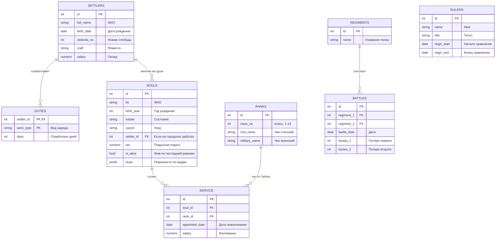
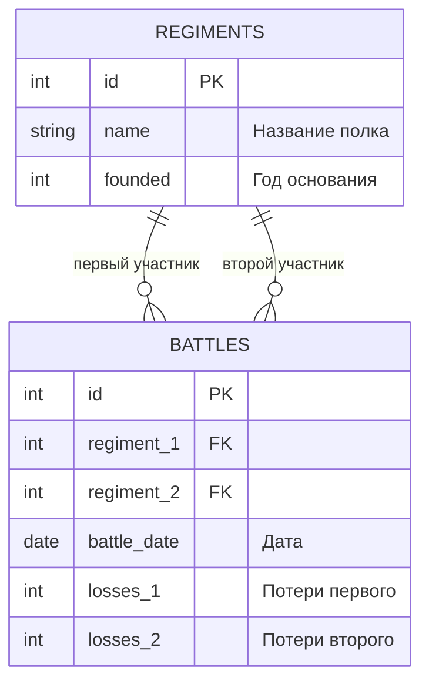
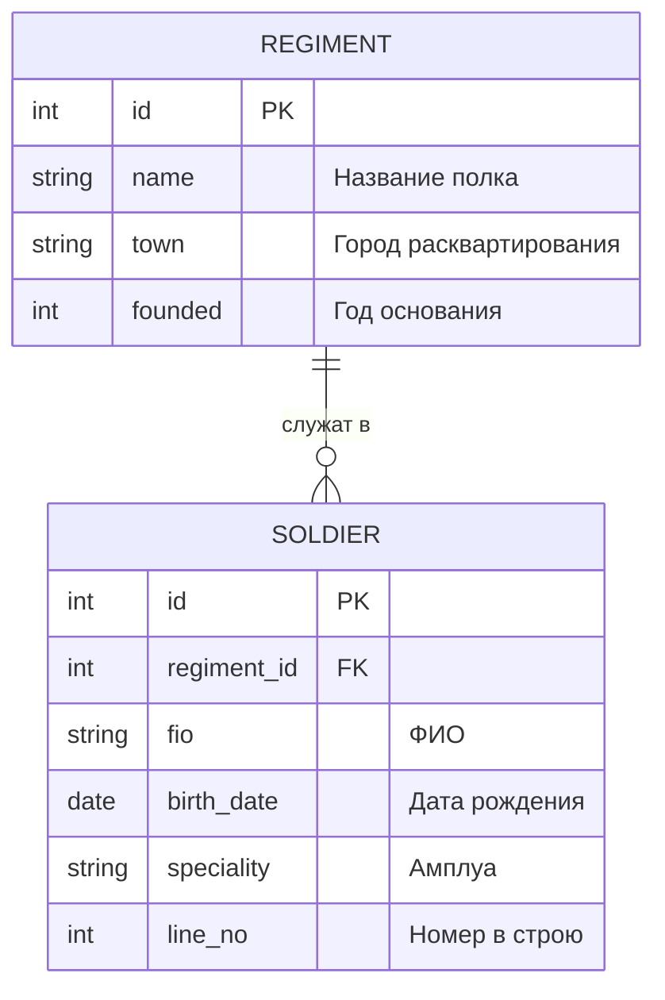
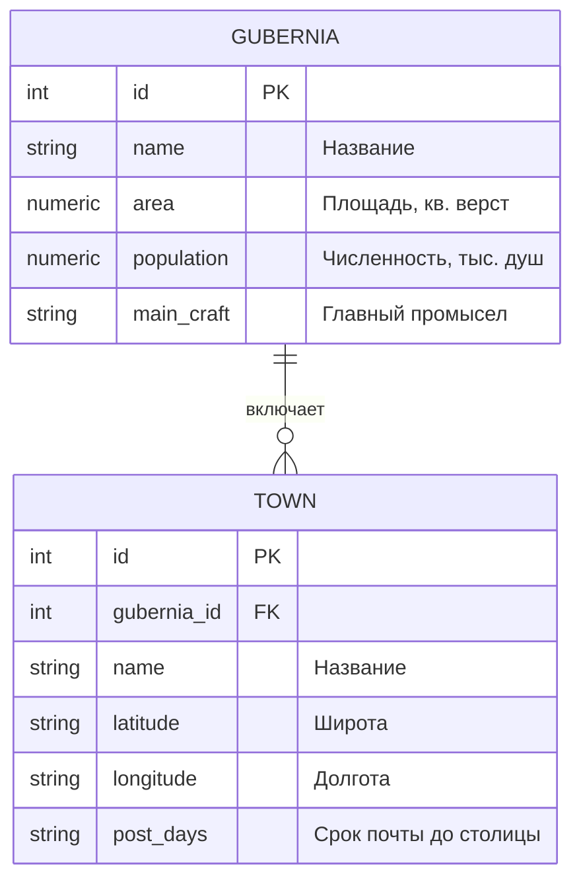
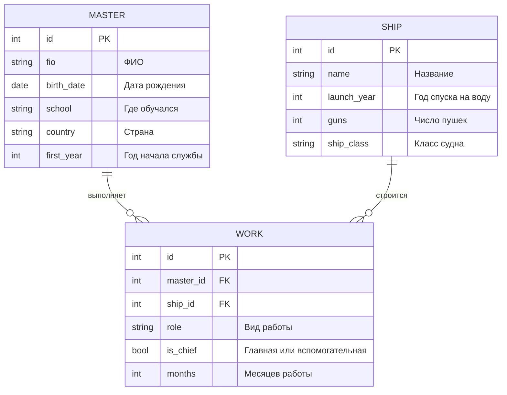
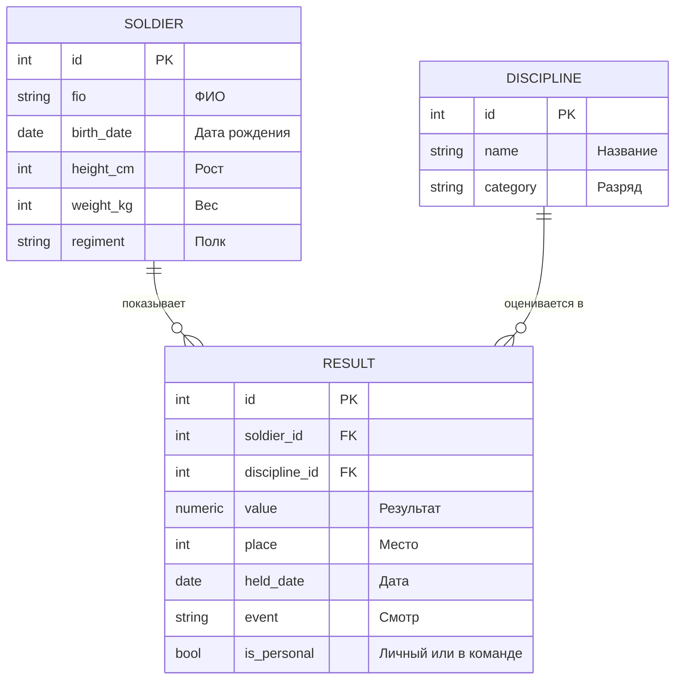

<script setup>
import Conversation from "../../../components/Conversation.vue";
import ivan from "../../assets/databases/heroes/clerk_fedor.png";
import petr from "../../assets/databases/heroes/petr_young.png";
import doctor from "../../assets/databases/heroes/doctor.png";
import { defineAsyncComponent } from "vue";

const Repl = defineAsyncComponent(() => import("../../../components/Repl.vue"))
</script>

# Модификация данных

## Введение: Душа на бумаге

Пятнадцать лет пролетели как один обоз.

**1709 год** – Полтава. Карл XII, который десять лет гонял русскую армию по всей Европе, разбит наголову и бежит к туркам. Швеция перестает быть великой державой, Россия начинает ею становиться.

**1711 год** – учрежден Сенат. Боярская дума, сидевшая в Кремле двести лет, перестает существовать.

**1712 год** – столица переезжает в Петербург. Город на болоте, который Федор когда-то чертил по пустым книгам, теперь держит в себе двор, Сенат, коллегии и все главные приказы страны.

**1717–1721 годы** – вместо беспорядочной толпы приказов появляются коллегии: Военная, Адмиралтейская, Камер-коллегия, Берг-коллегия. У каждой свой регламент, своя отчетность, свои книги.

Федору под пятьдесят. Он обер-секретарь, у него свои подьячие и свой стол в новом здании. Тетрадь дьяка Алексея по-прежнему лежит под рукой, переплет уже обтрепался, и на полях появились приписки другим почерком – Федоровым.

А в **ноябре 1718 года** Петр подписывает указ, от которого у всей канцелярии холодеют руки.

Старая податная единица – **двор**. Налог брали со дворов, а дворы считали редко и плохо. Мужики быстро сообразили: три семьи огораживаются одним плетнем, и получается один двор вместо трех. Казна недобирала, помещики помалкивали. Петр решает это кончить разом: считать не дворы, а **души**. Каждого податного человека мужского пола, поименно, в особые книги, которые назовут **ревизскими сказками**.

Это первая в истории России всеобщая перепись населения. Несколько миллионов записей.

<Conversation :phrases="[
    {
        name: 'Петр',
        position: 'left',
        text: 'Федор, подати будем брать с души. С каждой. Помещики подадут сказки о своих людях, ты их сведешь в книги, а ревизоры проверят. Срок – год.',
        photo: petr
    },
    {
        name: 'Федор',
        position: 'right',
        text: 'Государь, миллионы строк. Год – это несерьезно.',
        photo: ivan
    },
    {
        name: 'Петр',
        position: 'left',
        text: 'Два года.',
        photo: petr
    },
    {
        name: 'Федор',
        position: 'right',
        text: 'И это не все. Перепись – это ведь не один раз написать. Люди рождаются и умирают. Переезжают. Получают чины. Книга, которую мы заведем, будет меняться каждый день до скончания века. Я умею их создавать и умею читать, но править живую книгу на миллион душ – это другое дело.',
        photo: ivan
    },
    {
        name: 'Лекарь',
        position: 'left',
        text: '(не отрываясь от склянки) А я скажу так: записать легко. Вычеркнуть страшно. Я тридцать лет пишу в журнал, кому что дал, и ни одной строки не вычеркнул. Боюсь.',
        photo: doctor
    },
    {
        name: 'Федор',
        position: 'right',
        text: '(медленно) А вот это, пожалуй, самое верное, что ты за всю жизнь сказал.',
        photo: ivan
    }
]"/>

На прошлом занятии мы строили пустые хранилища. Сегодня мы их **наполняем и правим**: `INSERT`, `UPDATE`, `DELETE`. Это самые опасные команды в SQL – потому что `SELECT` можно переписать и выполнить заново, а неудачный `UPDATE` переписать уже нельзя.

### База данных ревизии

К петербургским книгам из прошлого занятия добавляются ревизские.



Отдельно обратите внимание на последнюю таблицу – **книгу государей** `rulers`. Она маленькая, в ней всего несколько строк, и она понадобится нам дважды: в разделе про `UPDATE` и в самом конце занятия.

::: details Данные для БД

```sql
-- === КНИГИ ГОРОДА (с прошлого занятия) ===
CREATE TABLE settlers (
    id SERIAL PRIMARY KEY,
    full_name VARCHAR(50) NOT NULL,
    birth_date DATE NOT NULL,
    sloboda_no INTEGER,
    craft VARCHAR(25),
    salary NUMERIC(10, 2)
);

INSERT INTO settlers (full_name, birth_date, sloboda_no, craft, salary) VALUES
('Иванов Иван Иванович',      '1680-05-25', 1122, 'плотник',   122.20),
('Козлов Федор Петрович',     '1682-03-10', 1122, 'землекоп',   98.50),
('Кузнецов Степан Лукич',     '1679-11-02', 1133, 'кузнец',    145.00),
('Соколов Михаил Андреевич',  '1685-07-07', 2211, 'каменщик',  130.00),
('Зайцев Андрей Макарович',   '1690-04-12', 2222, 'землекоп',   98.50),
('Титов Григорий Савельевич', '1681-06-18', 3311, 'плотник',   122.20),
('Чехов Антон Егорович',      '1688-01-29', 3322, 'каменщик',  130.00);

CREATE TABLE duties (
    settler_id INT REFERENCES settlers ON DELETE CASCADE,
    work_type VARCHAR(25),
    days INT,
    PRIMARY KEY (settler_id, work_type)
);

INSERT INTO duties VALUES
(1, 'Свайная работа', 40), (1, 'Возка камня', 12), (1, 'Мощение', 8),
(2, 'Свайная работа', 55), (2, 'Возка камня', 20),
(3, 'Кузнечное дело', 60),
(4, 'Возка камня', 35), (4, 'Мощение', 25),
(5, 'Свайная работа', 70),
(6, 'Мощение', 30);

-- === РЕВИЗСКИЕ КНИГИ ===
CREATE TABLE souls (
    id SERIAL PRIMARY KEY,
    fio VARCHAR(50) NOT NULL,
    birth_year INT,
    estate VARCHAR(30),
    uyezd VARCHAR(50),
    settler_id INT REFERENCES settlers,
    tax NUMERIC(8, 2) CHECK (tax > 0),
    is_alive BOOLEAN NOT NULL DEFAULT true,
    dues JSONB
);

INSERT INTO souls (fio, birth_year, estate, uyezd, settler_id, tax, is_alive, dues) VALUES
('Иванов Иван Иванович',      1680, 'Мастеровой',  'Санкт-Петербургский', 1,    0.74, true,
    '{"подушная": 0.74, "постойная": 0.20}'),
('Козлов Федор Петрович',     1682, 'Крестьянин',  'Новгородский',        2,    0.74, true,
    '{"подушная": 0.74, "оброчная": 0.40}'),
('Кузнецов Степан Лукич',     1679, 'Мастеровой',  'Тульский',            3,    0.74, true,
    '{"подушная": 0.74}'),
('Соколов Михаил Андреевич',  1685, 'Крестьянин',  'Олонецкий',           4,    0.74, true,
    '{"подушная": 0.74, "оброчная": 0.40}'),
('Зайцев Андрей Макарович',   1690, 'Крестьянин',  'Новгородский',        5,    0.74, true,
    '{"подушная": 0.74, "оброчная": 0.40}'),
('Титов Григорий Савельевич', 1681, 'Мастеровой',  'Воронежский',         6,    0.74, true,
    '{"подушная": 0.74}'),
('Чехов Антон Егорович',      1688, 'Мещанин',     'Московский',          7,    1.20, true,
    '{"подушная": 1.20}'),
('Муромец Илья Иванович',     1660, 'Крестьянин',  'Владимирский',     NULL,    0.74, true,
    '{"подушная": 0.74, "оброчная": 0.40}'),
('Громов Савелий Лукич',      1665, 'Крестьянин',  'Новгородский',     NULL,    0.74, true,
    '{"подушная": 0.74}'),
('Минин Кузьма Петрович',     1662, 'Мещанин',     'Нижегородский',    NULL,    1.20, true,
    '{"подушная": 1.20, "постойная": 0.20}');

CREATE TABLE ranks (
    id SERIAL PRIMARY KEY,
    class_no INT NOT NULL CHECK (class_no BETWEEN 1 AND 14),
    civil_name VARCHAR(50),
    military_name VARCHAR(50)
);

INSERT INTO ranks (class_no, civil_name, military_name) VALUES
(1,  'Канцлер',                          'Генерал-фельдмаршал'),
(2,  'Действительный тайный советник',   'Генерал-аншеф'),
(3,  'Тайный советник',                  'Генерал-лейтенант'),
(4,  'Действительный статский советник', 'Генерал-майор'),
(5,  'Статский советник',                'Бригадир'),
(6,  'Коллежский советник',              'Полковник'),
(7,  'Надворный советник',               'Подполковник'),
(8,  'Коллежский асессор',               'Майор'),
(9,  'Титулярный советник',              'Капитан'),
(10, 'Коллежский секретарь',             'Капитан-лейтенант'),
(11, 'Корабельный секретарь',            NULL),
(12, 'Губернский секретарь',             'Поручик'),
(13, 'Провинциальный секретарь',         'Подпоручик'),
(14, 'Коллежский регистратор',           'Фендрик');

CREATE TABLE service (
    id SERIAL PRIMARY KEY,
    soul_id INT REFERENCES souls,
    rank_id INT REFERENCES ranks,
    appointed_date DATE,
    salary NUMERIC(10, 2)
);

INSERT INTO service (soul_id, rank_id, appointed_date, salary) VALUES
(1,  (SELECT id FROM ranks WHERE class_no = 6),  '1722-02-01', 600.00),
(3,  (SELECT id FROM ranks WHERE class_no = 8),  '1722-02-01', 300.00),
(7,  (SELECT id FROM ranks WHERE class_no = 9),  '1722-03-15', 250.00),
(9,  (SELECT id FROM ranks WHERE class_no = 12), '1722-04-01', 120.00),
(10, (SELECT id FROM ranks WHERE class_no = 8),  '1722-02-20', 300.00);

CREATE TABLE regiments (
    id SERIAL PRIMARY KEY,
    name VARCHAR(50) NOT NULL,
    founded INT
);

INSERT INTO regiments (name, founded) VALUES
('Преображенский', 1691),
('Семеновский',    1691),
('Ингерманландский', 1703),
('Астраханский',   1700);

CREATE TABLE battles (
    id SERIAL PRIMARY KEY,
    regiment_1 INT REFERENCES regiments,
    regiment_2 INT REFERENCES regiments,
    battle_date DATE,
    losses_1 INT,
    losses_2 INT
);

INSERT INTO battles (regiment_1, regiment_2, battle_date, losses_1, losses_2) VALUES
(1, 2, '1719-06-10', 120, 95),
(3, 4, '1720-07-27', 210, 340),
(1, 3, '1721-05-14', 60, 80);

CREATE TABLE rulers (
    id SERIAL PRIMARY KEY,
    name VARCHAR(50) NOT NULL,
    title VARCHAR(50),
    reign_start DATE,
    reign_end DATE
);

INSERT INTO rulers (name, title, reign_start, reign_end) VALUES
('Федор Алексеевич',  'Царь Всероссийский', '1676-01-30', '1682-05-07'),
('Иван Алексеевич',   'Царь Всероссийский', '1682-05-26', '1696-02-08'),
('Петр Алексеевич',   'Царь Всероссийский', '1682-05-07', NULL);
```

:::

<ClientOnly>
<Repl :initial-queries="[
`CREATE TABLE settlers (
    id SERIAL PRIMARY KEY,
    full_name VARCHAR(50) NOT NULL,
    birth_date DATE NOT NULL,
    sloboda_no INTEGER,
    craft VARCHAR(25),
    salary NUMERIC(10, 2)
);`,
`INSERT INTO settlers (full_name, birth_date, sloboda_no, craft, salary) VALUES
('Иванов Иван Иванович',      '1680-05-25', 1122, 'плотник',   122.20),
('Козлов Федор Петрович',     '1682-03-10', 1122, 'землекоп',   98.50),
('Кузнецов Степан Лукич',     '1679-11-02', 1133, 'кузнец',    145.00),
('Соколов Михаил Андреевич',  '1685-07-07', 2211, 'каменщик',  130.00),
('Зайцев Андрей Макарович',   '1690-04-12', 2222, 'землекоп',   98.50),
('Титов Григорий Савельевич', '1681-06-18', 3311, 'плотник',   122.20),
('Чехов Антон Егорович',      '1688-01-29', 3322, 'каменщик',  130.00);`,
`CREATE TABLE duties (
    settler_id INT REFERENCES settlers ON DELETE CASCADE,
    work_type VARCHAR(25),
    days INT,
    PRIMARY KEY (settler_id, work_type)
);`,
`INSERT INTO duties VALUES
(1, 'Свайная работа', 40), (1, 'Возка камня', 12), (1, 'Мощение', 8),
(2, 'Свайная работа', 55), (2, 'Возка камня', 20),
(3, 'Кузнечное дело', 60),
(4, 'Возка камня', 35), (4, 'Мощение', 25),
(5, 'Свайная работа', 70),
(6, 'Мощение', 30);`,
`CREATE TABLE souls (
    id SERIAL PRIMARY KEY,
    fio VARCHAR(50) NOT NULL,
    birth_year INT,
    estate VARCHAR(30),
    uyezd VARCHAR(50),
    settler_id INT REFERENCES settlers,
    tax NUMERIC(8, 2) CHECK (tax > 0),
    is_alive BOOLEAN NOT NULL DEFAULT true,
    dues JSONB
);`,
`INSERT INTO souls (fio, birth_year, estate, uyezd, settler_id, tax, is_alive, dues) VALUES
('Иванов Иван Иванович',      1680, 'Мастеровой',  'Санкт-Петербургский', 1,    0.74, true, '{&quot;подушная&quot;: 0.74, &quot;постойная&quot;: 0.20}'),
('Козлов Федор Петрович',     1682, 'Крестьянин',  'Новгородский',        2,    0.74, true, '{&quot;подушная&quot;: 0.74, &quot;оброчная&quot;: 0.40}'),
('Кузнецов Степан Лукич',     1679, 'Мастеровой',  'Тульский',            3,    0.74, true, '{&quot;подушная&quot;: 0.74}'),
('Соколов Михаил Андреевич',  1685, 'Крестьянин',  'Олонецкий',           4,    0.74, true, '{&quot;подушная&quot;: 0.74, &quot;оброчная&quot;: 0.40}'),
('Зайцев Андрей Макарович',   1690, 'Крестьянин',  'Новгородский',        5,    0.74, true, '{&quot;подушная&quot;: 0.74, &quot;оброчная&quot;: 0.40}'),
('Титов Григорий Савельевич', 1681, 'Мастеровой',  'Воронежский',         6,    0.74, true, '{&quot;подушная&quot;: 0.74}'),
('Чехов Антон Егорович',      1688, 'Мещанин',     'Московский',          7,    1.20, true, '{&quot;подушная&quot;: 1.20}'),
('Муромец Илья Иванович',     1660, 'Крестьянин',  'Владимирский',     NULL,    0.74, true, '{&quot;подушная&quot;: 0.74, &quot;оброчная&quot;: 0.40}'),
('Громов Савелий Лукич',      1665, 'Крестьянин',  'Новгородский',     NULL,    0.74, true, '{&quot;подушная&quot;: 0.74}'),
('Минин Кузьма Петрович',     1662, 'Мещанин',     'Нижегородский',    NULL,    1.20, true, '{&quot;подушная&quot;: 1.20, &quot;постойная&quot;: 0.20}');`,
`CREATE TABLE ranks (
    id SERIAL PRIMARY KEY,
    class_no INT NOT NULL CHECK (class_no BETWEEN 1 AND 14),
    civil_name VARCHAR(50),
    military_name VARCHAR(50)
);`,
`INSERT INTO ranks (class_no, civil_name, military_name) VALUES
(1,  'Канцлер',                          'Генерал-фельдмаршал'),
(2,  'Действительный тайный советник',   'Генерал-аншеф'),
(3,  'Тайный советник',                  'Генерал-лейтенант'),
(4,  'Действительный статский советник', 'Генерал-майор'),
(5,  'Статский советник',                'Бригадир'),
(6,  'Коллежский советник',              'Полковник'),
(7,  'Надворный советник',               'Подполковник'),
(8,  'Коллежский асессор',               'Майор'),
(9,  'Титулярный советник',              'Капитан'),
(10, 'Коллежский секретарь',             'Капитан-лейтенант'),
(11, 'Корабельный секретарь',            NULL),
(12, 'Губернский секретарь',             'Поручик'),
(13, 'Провинциальный секретарь',         'Подпоручик'),
(14, 'Коллежский регистратор',           'Фендрик');`,
`CREATE TABLE service (
    id SERIAL PRIMARY KEY,
    soul_id INT REFERENCES souls,
    rank_id INT REFERENCES ranks,
    appointed_date DATE,
    salary NUMERIC(10, 2)
);`,
`INSERT INTO service (soul_id, rank_id, appointed_date, salary) VALUES
(1,  (SELECT id FROM ranks WHERE class_no = 6),  '1722-02-01', 600.00),
(3,  (SELECT id FROM ranks WHERE class_no = 8),  '1722-02-01', 300.00),
(7,  (SELECT id FROM ranks WHERE class_no = 9),  '1722-03-15', 250.00),
(9,  (SELECT id FROM ranks WHERE class_no = 12), '1722-04-01', 120.00),
(10, (SELECT id FROM ranks WHERE class_no = 8),  '1722-02-20', 300.00);`,
`CREATE TABLE regiments (
    id SERIAL PRIMARY KEY,
    name VARCHAR(50) NOT NULL,
    founded INT
);`,
`INSERT INTO regiments (name, founded) VALUES
('Преображенский', 1691),
('Семеновский',    1691),
('Ингерманландский', 1703),
('Астраханский',   1700);`,
`CREATE TABLE battles (
    id SERIAL PRIMARY KEY,
    regiment_1 INT REFERENCES regiments,
    regiment_2 INT REFERENCES regiments,
    battle_date DATE,
    losses_1 INT,
    losses_2 INT
);`,
`INSERT INTO battles (regiment_1, regiment_2, battle_date, losses_1, losses_2) VALUES
(1, 2, '1719-06-10', 120, 95),
(3, 4, '1720-07-27', 210, 340),
(1, 3, '1721-05-14', 60, 80);`,
`CREATE TABLE rulers (
    id SERIAL PRIMARY KEY,
    name VARCHAR(50) NOT NULL,
    title VARCHAR(50),
    reign_start DATE,
    reign_end DATE
);`,
`INSERT INTO rulers (name, title, reign_start, reign_end) VALUES
('Федор Алексеевич',  'Царь Всероссийский', '1676-01-30', '1682-05-07'),
('Иван Алексеевич',   'Царь Всероссийский', '1682-05-26', '1696-02-08'),
('Петр Алексеевич',   'Царь Всероссийский', '1682-05-07', NULL);`
]"/>
</ClientOnly>

## Вписать душу (INSERT)

Начинаем с самого простого: внести в книгу новую запись. Для учебных примеров Федор завел черновую книгу – чтобы не портить ревизскую.

```sql
CREATE TABLE cadet (
    fio VARCHAR (50),
    date_b DATE,
    gender BOOL,
    n_group INT,
    rang VARCHAR (25),
    salary FLOAT
);
```

### А) С полным списком столбцов

Самый надежный способ: перечислить столбцы явно.

```sql
INSERT INTO cadet (fio, date_b, gender, n_group, rang, salary)
VALUES ('Олин О.О.', '1700-10-20', true, 1122, 'работник', 123.4);
```

А теперь то же самое, но столбцы перечислены в другом порядке и часть значений пустая:

```sql
INSERT INTO cadet (fio, n_group, rang, salary, date_b, gender)
VALUES ('Колин К.К.', NULL, 'работник', NULL, '1700-01-21', true);
```

::: info Порядок столбцов в списке
При использовании списка столбцов (полного или сокращенного) столбцы в нем могут располагаться в **произвольном порядке**.

Главное, чтобы было соответствие между порядком следования столбцов в списке и порядком следования значений в предложении `VALUES`.
:::

### Б) С сокращенным списком столбцов

Перечисляем только те столбцы, которые знаем:

```sql
INSERT INTO cadet (fio, date_b, gender, rang)
VALUES ('Мишин М.М.', '1700-02-22', true, 'работник');
```

::: info Что будет с остальными столбцами
Столбцам, которые отсутствуют в списке, будут присвоены **значения по умолчанию**, если таковые имеются, или **пустые значения**.
:::

### В) Без списка столбцов

Список можно опустить совсем:

```sql
INSERT INTO cadet
VALUES ('Анин А.А.', '1700-03-23', true, NULL, 'работник', NULL);
```

::: warning Опасная форма
Без списка столбцов порядок следования значений должен соответствовать порядку, в котором столбцы были **определены в команде создания таблицы**.

Именно поэтому в рабочем коде так писать не стоит: стоит кому-то добавить столбец через `ALTER TABLE` – и все такие вставки либо упадут, либо, что хуже, запишут значения не туда.
:::

Есть еще одна форма, короче:

```sql
INSERT INTO cadet VALUES ('Ванин В.В.', '1700-04-24', true);
```

::: info Расширение PostgreSQL
Эта форма команды является расширением PostgreSQL и в стандарте SQL отсутствует.

При ее использовании заполняются столбцы **слева** по числу переданных значений, а всем остальным столбцам присваиваются значения по умолчанию, если таковые имеются, или пустые значения.
:::

### Г) Несколько строк одной командой

```sql
INSERT INTO cadet VALUES
('Петин П.П.', '1700-05-25'),
('Светин С.С.', '1700-06-26');
```

::: info Пакетная вставка
В PostgreSQL одна команда вставки данных может вставить **несколько строк**. Списки значений в предложении `VALUES` перечисляются через запятую.

Это не просто удобнее, это существенно быстрее: одна команда – один проход, одна проверка плана, одна запись в журнал транзакций. Вставлять тысячу строк тысячей отдельных `INSERT` – классическая ошибка, из-за которой загрузка данных идет часами вместо секунд.
:::

<Conversation :phrases="[
    {
        name: 'Федор',
        position: 'right',
        text: 'Вот это и спасет перепись. Помещик присылает сказку на двести душ – я ее одной командой и запишу, а не двести раз перо макать.',
        photo: ivan
    }
]"/>

## Перенос из старых книг (INSERT ... SELECT)

Главная работа ревизии – не записать новое, а **перенести старое**. Подворные книги уже существуют, в них десятки лет записей. Их надо переложить в новые, подушные.

### А) Копия книги целиком

```sql
CREATE TABLE cadet_1 (LIKE cadet);
INSERT INTO cadet_1 SELECT * FROM cadet;
```

::: info То же самое короче
Такого же результата можно достичь одной командой:

```sql
CREATE TABLE cadet_1 AS SELECT * FROM cadet;
```

Но помните разницу, которую мы разбирали на прошлом занятии: `CREATE TABLE ... AS SELECT` не перенесет ни одного ограничения, даже `NOT NULL`. Если структура важна, лучше `(LIKE ... INCLUDING ALL)` плюс отдельный `INSERT ... SELECT`.
:::

### Б) Перенос с отбором и показом результата

Переносим только тех, у кого известна должность, и сразу смотрим, что перенеслось:

```sql
INSERT INTO cadet_1
SELECT * FROM cadet WHERE rang IS NOT NULL
RETURNING *;
```

::: info Предложение RETURNING
Синтаксис предложения `RETURNING` аналогичен предложению `SELECT` команды выборки данных. То есть можно вернуть не все столбцы, а выбранные, с выражениями и псевдонимами:

```sql
INSERT INTO cadet_1
SELECT * FROM cadet WHERE rang IS NOT NULL
RETURNING fio, salary * 1.1 AS salary_with_raise;
```

`RETURNING` работает у всех трех команд модификации: `INSERT`, `UPDATE` и `DELETE`. И это не роскошь, а рабочий инструмент: он разом отвечает на вопрос «а сколько строк я, собственно, задел».
:::

Отдельно стоит знать про `INSERT ... SELECT` то, что это способ переложить данные **внутри базы**, не вытаскивая их в приложение. Миллион строк, переложенный одной командой на сервере, и миллион строк, прочитанный приложением и записанный обратно по одной, отличаются по времени на три порядка.

```sql
DROP TABLE cadet, cadet_1;
```

## Шаблон сказки (DEFAULT при вставке)

<Conversation :phrases="[
    {
        name: 'Федор',
        position: 'right',
        text: 'Девять подьячих пишут сказки. У девяти из десяти душ подать одинаковая, уезд один, сословие одно. Заведу шаблон, чтоб не переписывали одно и то же.',
        photo: ivan
    }
]"/>

### А) Таблица с готовыми значениями

```sql
CREATE TABLE cadet (
    id SERIAL,
    fio VARCHAR (25),
    date_b DATE DEFAULT '1700-10-20',
    gender BOOL DEFAULT '1',
    n_group INT DEFAULT 1122,
    rang VARCHAR (25) DEFAULT 'работник',
    salary FLOAT DEFAULT 123.4
);
```

### Б) Вставка по шаблону

Указываем только фамилию – все остальное подставится само:

```sql
INSERT INTO cadet (fio) VALUES ('Мишин М.М.');
```

Указываем фамилию и то, что отличается от шаблона:

```sql
INSERT INTO cadet (fio, date_b, salary) VALUES
('Гришин Г.Г.', '1700-01-21', 100.5);
```

Проверим:

```sql
SELECT * FROM cadet;
```

::: info Про SERIAL
При определении столбца типа `SERIAL` создается целочисленный столбец со **значением по умолчанию, извлекаемым из последовательности**, созданной СУБД.

То есть `id SERIAL` – это тоже `DEFAULT`, просто не константа, а вызов `nextval()`. Поэтому мы и не указываем `id` при вставке: за нас это делает значение по умолчанию.
:::

Если нужно явно сказать «возьми значение по умолчанию», для этого есть ключевое слово `DEFAULT`:

```sql
INSERT INTO cadet VALUES (DEFAULT, 'Тишин Т.Т.', DEFAULT, DEFAULT, DEFAULT, DEFAULT, DEFAULT);
```

```sql
DROP TABLE cadet;
```

## Ревизор не пропускает (ограничения при вставке)

Теперь самое интересное. На прошлом занятии мы ставили ограничения. Посмотрим, как они работают изнутри – то есть что именно происходит, когда кто-то пытается записать неправду.

<Conversation :phrases="[
    {
        name: 'Петр',
        position: 'left',
        text: 'Из Новгородского уезда сказки пришли. Ревизор глянул и вернул обратно: половину не принял.',
        photo: petr
    },
    {
        name: 'Федор',
        position: 'right',
        text: 'Не ревизор не принял, государь. База не приняла. Ревизор только прочитал, что она ответила.',
        photo: ivan
    }
]"/>

### А) Книга с полным набором правил

```sql
CREATE TABLE cadet (
    id SERIAL PRIMARY KEY,
    fio VARCHAR (25),
    date_b DATE NOT NULL,
    gender BOOL,
    n_group INT,
    rang VARCHAR (25),
    salary FLOAT CHECK (salary > 0),
    UNIQUE (fio, n_group)
);
```

### Б) Пять попыток вставки

Выполняйте по одной и смотрите, что отвечает база.

**Попытка 1:**

```sql
INSERT INTO cadet VALUES
(DEFAULT, 'Анин А.А.', '1700-10-20', true, 1122, 'работник', 123.4);
```

Первая команда выполнится **успешно**, и строка будет вставлена в таблицу, потому что ее значения удовлетворяют всем ограничениям.

**Попытка 2:**

```sql
INSERT INTO cadet VALUES
(DEFAULT, 'Ванин В.В.', NULL, true, 1122, 'работник', 123.4);
```

Выполнение приведет к **ошибке**, потому что столбец `date_b` не может принимать пустые значения.

```
ERROR:  null value in column "date_b" of relation "cadet" violates not-null constraint
```

**Попытка 3:**

```sql
INSERT INTO cadet VALUES
(DEFAULT, 'Олин О.О.', '1700-01-21', true, 1122, 'работник', 0);
```

Выполнение приведет к **ошибке**, потому что значения столбца `salary` должны быть больше 0.

```
ERROR:  new row for relation "cadet" violates check constraint "cadet_salary_check"
```

Кстати, обратите внимание на имя ограничения в тексте ошибки: `cadet_salary_check`. Это то самое имя, которое PostgreSQL придумал сам, потому что мы его не назвали. Теперь понятно, почему имена стоит давать осмысленные: в ошибке на рабочем сервере вы увидите именно его.

**Попытка 4:**

```sql
INSERT INTO cadet VALUES
(DEFAULT, 'Колин К.К.', '1700-02-22', true, 1122, 'работник', NULL);
```

А вот это – **успешно**, и строка будет вставлена.

::: warning Главная ловушка CHECK
Четвертая команда выполнилась, потому что ограничение-проверка **удовлетворяется, если выражение принимает значение `TRUE` или `NULL`**.

`NULL > 0` – это не `FALSE`, это `NULL`: сравнение неизвестного с нулем дает неизвестный результат. А неизвестность ограничение не нарушает.

Вывод: `CHECK (salary > 0)` защищает от нуля и от минуса, но **не** защищает от пустоты. Если пустота недопустима, нужно отдельное `NOT NULL`. Одно ограничение другое не заменяет.
:::

**Попытка 5:**

```sql
INSERT INTO cadet VALUES
(DEFAULT, 'Анин А.А.', '1700-03-23', true, 1122, 'командир', 156.7);
```

Выполнение приведет к **ошибке**, потому что значения столбцов `fio` и `n_group` должны быть уникальны в совокупности. Анин А.А. из группы 1122 в книге уже есть.

```
ERROR:  duplicate key value violates unique constraint "cadet_fio_n_group_key"
```

### Когда дубли – это норма жизни

<Conversation :phrases="[
    {
        name: 'Федор',
        position: 'right',
        text: 'Государь, тут беда. Помещики подают сказки дважды: сперва черновую, потом исправленную. А иногда и трижды. Мне что, каждый раз ошибку ловить и вручную разбираться?',
        photo: ivan
    },
    {
        name: 'Петр',
        position: 'left',
        text: 'А ты сделай так, чтоб повторная сказка не ломала дело, а поправляла прежнюю.',
        photo: petr
    }
]"/>

Для этого есть конструкция `ON CONFLICT` – то, что в других базах называют upsert.

**Молча пропустить дубль:**

```sql
INSERT INTO cadet VALUES
(DEFAULT, 'Анин А.А.', '1700-03-23', true, 1122, 'командир', 156.7)
ON CONFLICT DO NOTHING;
```

Команда выполнится, строка не вставится, ошибки не будет.

**Обновить существующую строку:**

```sql
INSERT INTO cadet (fio, date_b, gender, n_group, rang, salary) VALUES
('Анин А.А.', '1700-03-23', true, 1122, 'командир', 156.7)
ON CONFLICT (fio, n_group)
DO UPDATE SET rang = EXCLUDED.rang, salary = EXCLUDED.salary
RETURNING *;
```

Здесь `EXCLUDED` – это псевдотаблица с той строкой, которую мы пытались вставить. То есть читается команда так: «попробуй вставить; если помешало ограничение по `(fio, n_group)` – возьми из моей строки должность и оклад и запиши их в ту, что уже лежит».

Это ровно та логика, которая нужна для повторных сказок: последняя присланная версия побеждает.

```sql
DROP TABLE cadet;
```

## Приписать душу ко двору (вставка в дочернюю таблицу)

### А) Дочерняя книга

Заводим родительскую и дочернюю таблицы:

```sql
CREATE TABLE cadet (
    id SERIAL PRIMARY KEY,
    fio VARCHAR (25),
    date_b DATE,
    n_group INT,
    rang VARCHAR (25),
    salary FLOAT
);

INSERT INTO cadet (fio, date_b, n_group, rang, salary) VALUES
('Анин А.А.',  '1700-10-20', 1122, 'работник', 123.4),
('Ванин В.В.', '1700-11-21', 1122, 'работник', 123.4),
('Олин О.О.',  '1700-12-22', 1133, 'работник', 123.4),
('Колин К.К.', '1701-01-23', 1133, 'работник', 123.4);

CREATE TABLE mark (
    id INT REFERENCES cadet,
    sub VARCHAR (25),
    mark INT,
    PRIMARY KEY (id, sub)
);
```

### Б) Два способа записать оценки

Нужно записать Анину А.А. химию 5, физику 5, историю 4, а Колину К.К. химию 4, физику 3, историю 4.

**Способ первый: с непосредственными значениями.** Сначала выясняем идентификаторы:

```sql
SELECT id FROM cadet WHERE fio = 'Анин А.А.';
SELECT id FROM cadet WHERE fio = 'Колин К.К.';
```

Потом вставляем:

```sql
INSERT INTO mark VALUES
(1, 'Химия', 5), (1, 'Физика', 5), (1, 'История', 4),
(4, 'Химия', 4), (4, 'Физика', 3), (4, 'История', 4);
```

**Способ второй: с подзапросом.** База сама найдет идентификаторы:

```sql
INSERT INTO mark VALUES
((SELECT id FROM cadet WHERE fio = 'Анин А.А.'),  'Химия',   5),
((SELECT id FROM cadet WHERE fio = 'Анин А.А.'),  'Физика',  5),
((SELECT id FROM cadet WHERE fio = 'Анин А.А.'),  'История', 4),
((SELECT id FROM cadet WHERE fio = 'Колин К.К.'), 'Химия',   4),
((SELECT id FROM cadet WHERE fio = 'Колин К.К.'), 'Физика',  3),
((SELECT id FROM cadet WHERE fio = 'Колин К.К.'), 'История', 4);
```

<Conversation :phrases="[
    {
        name: 'Федор',
        position: 'right',
        text: 'Первый способ короче, но опасный. Пока я бегаю смотреть номера, кто-то может вписать нового человека, и номера сдвинутся. Второй способ база выполнит сама, за один раз, и подменить ничего не успеют.',
        photo: ivan
    }
]"/>

Это важное соображение, и дело не только в удобстве. Первый способ – это два похода в базу: сначала узнать, потом записать. Между ними данные могут измениться. Второй способ – одна команда, которую база выполняет целиком. Для одиночных вставок разница незаметна, для массовой загрузки – принципиальна.

::: tip Из тетради дьяка Алексея

Если можно спросить и записать одной командой – не ходи дважды.

Между двумя твоими походами в архив кто-то успеет переложить бумаги.

:::

Книги оставляем, они нам еще понадобятся.

## Табель о рангах (UPDATE)

**24 января 1722 года.** Петр утверждает **Табель о рангах** – документ, который перевернул русское общество.

Все должности делятся на 14 классов, от самого высокого (первого) до самого низкого (четырнадцатого). И главное: продвигаться по ним теперь можно **за службу, а не за происхождение**. Дослужился до восьмого класса – получил потомственное дворянство, даже если родился сыном солдата. Для России это была революция, и Табель прожила почти двести лет, до 1917 года.

Для канцелярии это означало одно: надо разом перевести в новую систему всех служащих страны.

<Conversation :phrases="[
    {
        name: 'Петр',
        position: 'left',
        text: 'Федор, старые звания отменяются. Стольники, стряпчие, дьяки – всего этого больше нет. Всех переписать по классам.',
        photo: petr
    },
    {
        name: 'Федор',
        position: 'right',
        text: 'Всех переписать не надо, мин херц. Надо изменить. Это разные дела.',
        photo: ivan
    }
]"/>

Команда `UPDATE` меняет значения в существующих строках.

### А) Изменить одно значение

```sql
UPDATE cadet SET salary = 122.2
WHERE fio = 'Анин А.А.' AND n_group = 1122;
```

### Б) Изменить несколько значений сразу

Перечисляем через запятую:

```sql
UPDATE cadet SET rang = 'командир отделения', salary = 144.4
WHERE fio = 'Анин А.А.' AND n_group = 1122;
```

### В) Изменить значение относительно текущего

В правой части можно использовать само старое значение:

```sql
UPDATE cadet SET salary = salary + 10
WHERE fio = 'Анин А.А.' AND n_group = 1122;
```

Это важный приём: прибавку не надо сначала вычитывать, считать в приложении и записывать обратно. База сделает это сама, атомарно.

### Г) Записать пустое значение

```sql
UPDATE cadet SET salary = NULL
WHERE fio = 'Анин А.А.' AND n_group = 1122;
```

### RETURNING и главное предупреждение

Для вывода измененных строк можно использовать предложение `RETURNING`:

```sql
UPDATE cadet SET salary = 122.2
WHERE fio = 'Анин А.А.' AND n_group = 1122
RETURNING *;
```

::: danger UPDATE без WHERE
При использовании команды `UPDATE` **без** предложения `WHERE` изменению подлежат **все строки таблицы**.

Это не ошибка синтаксиса. База не спросит «вы уверены?». Она просто сделает.
:::

### Мемория о лекаре: как разжаловать империю

Лекарь, теперь уже глубоко немолодой, но все такой же бодрый, решил помочь с переводом служащих на новые чины. Федор отвлекся на четверть часа.

<Conversation :phrases="[
    {
        name: 'Лекарь',
        position: 'left',
        text: '(довольно) Федор! Я все сделал! Сам! Ты говорил, UPDATE меняет чин. Я написал UPDATE. Всем.',
        photo: doctor
    },
    {
        name: 'Федор',
        position: 'right',
        text: '(медленно поворачивается) Что значит «всем»?',
        photo: ivan
    },
    {
        name: 'Лекарь',
        position: 'left',
        text: 'Ну как ты учил: UPDATE service SET rank_id = 14. Четырнадцатый же есть в книге классов, я проверял! А потом хотел дописать, кому именно, но тут чихнул и нажал.',
        photo: doctor
    },
    {
        name: 'Федор',
        position: 'right',
        text: '(очень тихо) Ты только что разжаловал в последний класс всю империю. Включая двух генерал-фельдмаршалов и канцлера.',
        photo: ivan
    },
    {
        name: 'Лекарь',
        position: 'left',
        text: '(после паузы) ...Это плохо?',
        photo: doctor
    }
]"/>

Вот что он сделал:

```sql
-- НЕ ВЫПОЛНЯЙТЕ ЭТО НА РАБОЧЕЙ БАЗЕ
UPDATE service SET rank_id = 14;
```

Ни ошибки, ни предупреждения. Все пять строк изменены, прежние значения утрачены безвозвратно.

### Как от этого защищаться

Три приема, которые стоит довести до рефлекса.

**Первый: сначала `SELECT`, потом `UPDATE`.** Напишите условие в `SELECT`, убедитесь, что вернулось именно то, что нужно, и только потом замените `SELECT *` на `UPDATE ... SET`.

```sql
-- 1. Проверяем, кого зацепит
SELECT * FROM service WHERE soul_id = 1;

-- 2. Только теперь меняем
UPDATE service SET rank_id = 4 WHERE soul_id = 1;
```

**Второй: `RETURNING` как контрольный выстрел.** Команда сама покажет, сколько строк и какие она задела. Если вместо одной строки вернулось пять – вы уже знаете, что ошиблись.

**Третий, главный: транзакция.** Это та самая страховка, ради которой `COMMIT` и `ROLLBACK` вообще существуют.

```sql
BEGIN;

UPDATE service SET rank_id = 14;

-- Смотрим, что натворили
SELECT * FROM service;

-- Передумали: откатываем все обратно
ROLLBACK;
```

Пока вы не сказали `COMMIT`, изменения видны только вам и существуют только внутри транзакции. `ROLLBACK` возвращает все как было, будто команды и не было.

::: tip Из тетради дьяка Алексея

Прежде чем править живую книгу, спроси себя: а как я это отменю?

Если ответа нет – не начинай. Открой транзакцию, и тогда ответ появится сам: `ROLLBACK`.

:::

Подробно транзакции разбираются в курсе дальше. Пока запомните главное: `BEGIN` перед опасной командой стоит бесплатно, а стоимость его отсутствия вы только что видели.

### Мемория о лекаре: восьмой класс

Через неделю, когда чины восстановили из черновой копии, лекарь явился снова – с совершенно другим лицом.

<Conversation :phrases="[
    {
        name: 'Лекарь',
        position: 'left',
        text: 'Федор. Я читал Табель. Всю ночь, со словарем. Штаб-лекарь – это какой класс?',
        photo: doctor
    },
    {
        name: 'Федор',
        position: 'right',
        text: 'Восьмой.',
        photo: ivan
    },
    {
        name: 'Лекарь',
        position: 'left',
        text: 'А что дает восьмой класс?',
        photo: doctor
    },
    {
        name: 'Федор',
        position: 'right',
        text: 'Потомственное дворянство.',
        photo: ivan
    },
    {
        name: 'Лекарь',
        position: 'left',
        text: '(садится на пол) Mein Gott. Я приехал сюда тридцать лет назад пьяным полковым лекарем, которого царь обещал повесить на рее. А теперь я... дворянин?',
        photo: doctor
    },
    {
        name: 'Федор',
        position: 'right',
        text: 'По Табели – да. Там не написано «кроме пропойц». Там написано «кто дослужился».',
        photo: ivan
    },
    {
        name: 'Лекарь',
        position: 'left',
        text: '(вскакивает) Тогда пиши! Двор на Васильевском! И печать! С гербом! И на гербе – еловая ветка и чарка!',
        photo: doctor
    }
]"/>

И ведь он действительно дослужился. Та самая хвойная настойка от цинги, с которой все началось на воронежской верфи, за двадцать пять лет превратилась в норму: **в Морском уставе чарка хлебного вина служителю в день прописана как часть снабжения.** Изобретение пьяного немчина стало законом флота.

Федор вписывает его в книгу душ и жалует чин – на этот раз аккуратно, с подзапросами вместо угаданных номеров:

```sql
INSERT INTO souls (fio, birth_year, estate, uyezd, tax)
VALUES ('Аптекарь корабельный, немчин', 1662, 'Иноземец',
        'Санкт-Петербургский', 1.20);

INSERT INTO service (soul_id, rank_id, appointed_date, salary)
VALUES (
    (SELECT id FROM souls WHERE fio LIKE 'Аптекарь%'),
    (SELECT id FROM ranks WHERE class_no = 8),
    '1722-05-01',
    300.00
)
RETURNING *;
```

Фамилии у него в книге так и не появилось: за тридцать лет никто в приказе не удосужился ее спросить, а сам он не настаивал.

### Царство становится империей

**22 октября 1721 года.** Подписан Ништадтский мир: Северная война, длившаяся двадцать один год, окончена. Россия получает Ингерманландию, Карелию, Эстляндию и Лифляндию – выход к Балтике, за который все и начиналось.

Сенат преподносит Петру титулы: **Отец Отечества, Император Всероссийский, Петр Великий**.

<Conversation :phrases="[
    {
        name: 'Петр',
        position: 'left',
        text: 'Федор, в книге государей поправь. Царство кончилось. Теперь империя.',
        photo: petr
    },
    {
        name: 'Федор',
        position: 'right',
        text: 'Одной строчкой, государь?',
        photo: ivan
    },
    {
        name: 'Петр',
        position: 'left',
        text: 'Одной. Двадцать один год воевали, чтоб ты одну строчку поправил.',
        photo: petr
    }
]"/>

```sql
UPDATE rulers
SET title = 'Император Всероссийский'
WHERE name = 'Петр Алексеевич'
RETURNING *;
```

Запомните эту таблицу. Мы вернемся к ней в самом конце.

## Мертвые души (DELETE)

А теперь про то, чего боялся лекарь.

<Conversation :phrases="[
    {
        name: 'Лекарь',
        position: 'left',
        text: 'Федор, я смотрел твои сказки по Новгородскому уезду. Там беда.',
        photo: doctor
    },
    {
        name: 'Федор',
        position: 'right',
        text: 'Какая? Цифры сходятся, ревизор принял.',
        photo: ivan
    },
    {
        name: 'Лекарь',
        position: 'left',
        text: 'Цифры сходятся. А люди нет. Зайцев Андрей – я его хоронил позапрошлой зимой. Муромец Илья – тоже, у него грудная болезнь была. А у тебя они в книге. С подушной податью.',
        photo: doctor
    },
    {
        name: 'Федор',
        position: 'right',
        text: '(листает) Так... Да. Числятся. Значит, помещик за них платит подать.',
        photo: ivan
    },
    {
        name: 'Лекарь',
        position: 'left',
        text: 'За покойников. Тридцать лет я пишу в журнал и не вычеркиваю. А ты заметил, что я ни разу не ошибся в том, кто жив? Я их лечил, я их и хоронил. Я помню каждого в лицо.',
        photo: doctor
    }
]"/>

Это не выдумка. Подушная подать взималась по последней ревизии, а ревизии проводились раз в несколько десятилетий. Умерший человек продолжал числиться живым и платящим до следующей переписи. Эти записи так и называли – **мертвые души**. Вторая ревизия 1743 года обнаружила их в огромном количестве, а спустя сто лет на этом материале Гоголь напишет поэму.

Для нас это идеальная иллюстрация к команде `DELETE`.

### А) Удалить одну запись

```sql
DELETE FROM mark WHERE id = 1 AND sub = 'История';
```

::: info RETURNING при удалении
Для вывода строк, подлежащих удалению из таблицы, тоже можно использовать предложение `RETURNING`:

```sql
DELETE FROM mark WHERE id = 1 AND sub = 'История' RETURNING *;
```

При удалении это особенно полезно: `RETURNING` покажет, что именно вы сейчас потеряли.
:::

### Б) Удалить по составному условию

```sql
DELETE FROM mark
WHERE id = 1 AND sub = 'Химия' OR id = 4 AND sub = 'Физика';
```

::: warning Про приоритет операторов
`AND` выполняется раньше `OR`, поэтому условие читается как:

`(id = 1 AND sub = 'Химия') OR (id = 4 AND sub = 'Физика')`

Это то, что нам нужно. Но полагаться на приоритет в сложных условиях опасно: один пропущенный `AND` – и `DELETE` заберет не то. Ставьте скобки явно:

```sql
DELETE FROM mark
WHERE (id = 1 AND sub = 'Химия') OR (id = 4 AND sub = 'Физика');
```
:::

### DELETE без WHERE и TRUNCATE

Все сказанное про `UPDATE` без `WHERE` относится и к `DELETE`:

```sql
-- Удалит ВСЕ строки таблицы
DELETE FROM mark;
```

Есть и вторая команда, делающая, на первый взгляд, то же самое:

```sql
TRUNCATE TABLE mark;
```

| | `DELETE FROM` | `TRUNCATE TABLE` |
| --- | --- | --- |
| Как работает | идет по строкам, помечая каждую удаленной | освобождает файлы таблицы целиком |
| Скорость на большой таблице | медленно | мгновенно |
| Можно ли с `WHERE` | да | нет, только всю таблицу |
| `RETURNING` | работает | не работает |
| Срабатывают ли триггеры на строку | да | нет |
| В транзакции | откатывается | тоже откатывается |
| Сбрасывает `SERIAL` | нет | по желанию, `RESTART IDENTITY` |

Старые подворные книги после ревизии именно «усекали»: они больше не нужны, но сама книга пусть останется.

### Удалять ли мертвые души

Вопрос, который выглядит техническим, а на самом деле предметный.

<Conversation :phrases="[
    {
        name: 'Федор',
        position: 'right',
        text: 'Значит, вычеркиваю покойников. DELETE FROM souls WHERE... и дальше по списку, который ты принес.',
        photo: ivan
    },
    {
        name: 'Лекарь',
        position: 'left',
        text: 'Стой. А если ревизор спросит, почему в прошлом году подать была на двести рублей больше? Ты что ему покажешь? Пустое место?',
        photo: doctor
    },
    {
        name: 'Федор',
        position: 'right',
        text: '(останавливается) Верно. Если я их вычеркну, я потеряю не только их. Я потеряю объяснение, почему цифры раньше были другие.',
        photo: ivan
    }
]"/>

Отсюда два разных решения, и выбор между ними делается не программистом, а предметной областью. Выполняйте **одно из них**: после физического удаления логическое уже не найдет, что помечать.

**Физическое удаление** – строка исчезает:

```sql
DELETE FROM souls WHERE fio = 'Зайцев Андрей Макарович';
```

**Логическое удаление** – строка остается, но помечена:

```sql
UPDATE souls SET is_alive = false, tax = NULL
WHERE fio IN ('Зайцев Андрей Макарович', 'Муромец Илья Иванович')
RETURNING fio, is_alive;
```

Именно для этого в таблице `souls` и завели столбец `is_alive`. Платить подать за покойника больше не надо, но запись о том, что он существовал, никуда не делась – и прошлые отчеты по-прежнему объяснимы.

::: tip Из тетради дьяка Алексея

Прежде чем вычеркнуть строку, спроси: кто-нибудь когда-нибудь спросит у меня, почему прежние цифры были другими?

Если спросит – не вычеркивай. Помечай.

:::

Правило простое: удаляйте физически технический мусор, черновики и то, что по закону обязаны уничтожить. Все, что участвовало в отчетах, деньгах или решениях, помечайте.

## Две книги сразу (UPDATE FROM и DELETE USING)

Самая частая задача на практике: условие известно в одной таблице, а менять надо в другой.

<Conversation :phrases="[
    {
        name: 'Петр',
        position: 'left',
        text: 'Иванову из слободы 1122 исправить запись о кузнечном деле. Он там отработал больше, чем записано.',
        photo: petr
    },
    {
        name: 'Федор',
        position: 'right',
        text: 'Так в книге нарядов нет ни фамилий, ни слобод, государь. Там только номера. А фамилия и слобода – в книге поселенцев.',
        photo: ivan
    }
]"/>

### А) Изменение по данным из другой таблицы

Нужно изменить в таблице `mark` оценку по химии у Анина А.А. из группы 1122. Новое значение – 5.

**Через предложение `FROM`:**

```sql
UPDATE mark m SET mark = 5
FROM cadet c
WHERE c.id = m.id
  AND c.fio = 'Анин А.А.'
  AND c.n_group = 1122
  AND m.sub = 'Химия';
```

Читается так: «меняй в `mark`, а чтобы понять, где именно, возьми еще и `cadet` и свяжи их по `id`».

**Через подзапрос:**

```sql
UPDATE mark SET mark = 5
WHERE sub = 'Химия'
  AND id = (SELECT id FROM cadet WHERE fio = 'Анин А.А.' AND n_group = 1122);
```

### Б) Удаление по данным из другой таблицы

**Через предложение `USING`:**

```sql
DELETE FROM mark m
USING cadet c
WHERE c.id = m.id
  AND c.fio = 'Анин А.А.'
  AND c.n_group = 1122
  AND m.sub = 'Химия';
```

**Через подзапрос:**

```sql
DELETE FROM mark
WHERE sub = 'Химия'
  AND id = (SELECT id FROM cadet WHERE fio = 'Анин А.А.' AND n_group = 1122);
```

::: info FROM и USING – это одно и то же
Предложение `FROM` в `UPDATE` и предложение `USING` в `DELETE` выполняют одну и ту же роль: подключают дополнительные таблицы, по которым строится условие.

Разные ключевые слова – историческая случайность, не более. Запомнить просто: `UPDATE ... FROM`, `DELETE ... USING`.
:::

::: warning Ловушка, о которой не пишут
Если условие в `FROM` или `USING` соответствует **нескольким** строкам подключенной таблицы, целевая строка будет изменена **один раз**, причем какой из вариантов победит – не определено.

Подзапрос в этом смысле честнее: `= (SELECT ...)` упадет с ошибкой, если подзапрос вернул больше одной строки, и вы об этом узнаете, а не получите молча случайный результат.

Поэтому для одиночных точных правок надежнее подзапрос, а `FROM` и `USING` берут для массовых операций, когда соответствие заведомо однозначное.
:::

## Три книги сразу

Теперь задача посложнее: три таблицы, две связи. Заводим новый набор книг.

```sql
DROP TABLE IF EXISTS mark, cadet;

CREATE TABLE cadet (
    id SERIAL PRIMARY KEY,
    fio VARCHAR (25),
    date_b DATE,
    n_group INT,
    rang VARCHAR (25),
    salary FLOAT
);

CREATE TABLE sub (
    id SERIAL PRIMARY KEY,
    name_sub VARCHAR (25)
);

CREATE TABLE mark (
    id SERIAL PRIMARY KEY,
    id_c INT REFERENCES cadet,
    id_s INT REFERENCES sub,
    mark INT
);

INSERT INTO cadet (fio, date_b, n_group, rang, salary) VALUES
('Анин А.А.',  '1700-10-20', 1122, 'работник', 123.4),
('Ванин В.В.', '1700-11-21', 1122, 'работник', 123.4);

INSERT INTO sub (name_sub) VALUES ('Химия'), ('Физика'), ('История');

INSERT INTO mark (id_c, id_s, mark) VALUES
(1, 1, 5), (1, 2, 4), (2, 1, 3);
```

### А) Вставка через подзапросы

Записать курсанту Чехову из группы 1122 оценки: 5 по географии и 4 по биологии. Ни Чехова, ни этих дисциплин в книгах еще нет.

```sql
INSERT INTO cadet (fio, n_group, rang)
VALUES ('Чехов', 1122, 'работник');

INSERT INTO sub (name_sub) VALUES ('География'), ('Биология');

INSERT INTO mark VALUES
(DEFAULT,
 (SELECT id FROM cadet WHERE fio = 'Чехов' AND n_group = 1122),
 (SELECT id FROM sub WHERE name_sub = 'География'),
 5),
(DEFAULT,
 (SELECT id FROM cadet WHERE fio = 'Чехов' AND n_group = 1122),
 (SELECT id FROM sub WHERE name_sub = 'Биология'),
 4);
```

Обратите внимание: `DEFAULT` на месте первичного ключа – это способ сказать «возьми следующее значение из последовательности». Без него пришлось бы перечислять столбцы.

### Б) Изменение по двум подзапросам

Изменить оценку по биологии у Чехова из группы 1122. Новое значение – 5.

```sql
UPDATE mark SET mark = 5
WHERE id_s = (SELECT id FROM sub WHERE name_sub = 'Биология')
  AND id_c = (SELECT id FROM cadet WHERE fio = 'Чехов' AND n_group = 1122);
```

### В) Удаление по списку из подзапроса

Удалить оценки по географии и биологии у Чехова из группы 1122.

```sql
DELETE FROM mark
WHERE id_s IN (SELECT id FROM sub WHERE name_sub IN ('Биология', 'География'))
  AND id_c = (SELECT id FROM cadet WHERE fio = 'Чехов' AND n_group = 1122);
```

Здесь важно различие: для дисциплин мы взяли `IN`, потому что их две, а для курсанта – `=`, потому что он один. Если бы мы написали `= (SELECT ... IN ('Биология', 'География'))`, команда упала бы с ошибкой «more than one row returned by a subquery used as an expression».

<Conversation :phrases="[
    {
        name: 'Федор',
        position: 'right',
        text: 'Хорошая ошибка. Она честная: база не угадывает, что я имел в виду, а говорит прямо, что я написал бессмыслицу.',
        photo: ivan
    }
]"/>

## Две связи между двумя книгами

Самый хитрый случай: две таблицы, но связаны они **дважды**. Такое бывает всегда, когда запись описывает отношение между двумя объектами одного вида.

В нашей базе это таблица `battles`: в каждом учебном сражении участвуют два полка, и оба ссылаются на одну и ту же таблицу `regiments`.



### А) Вставка результата

Записать учебное сражение, состоявшееся 25 мая 1723 года между Преображенским и Семеновским полками, с потерями 1 и 2 соответственно.

```sql
INSERT INTO battles VALUES
(DEFAULT,
 (SELECT id FROM regiments WHERE name = 'Преображенский'),
 (SELECT id FROM regiments WHERE name = 'Семеновский'),
 '1723-05-25', 1, 2);
```

### Б) Изменение результата

Итоговый результат сражения – потери 2 и 1.

```sql
UPDATE battles SET losses_1 = 2, losses_2 = 1
WHERE regiment_1 = (SELECT id FROM regiments WHERE name = 'Преображенский')
  AND regiment_2 = (SELECT id FROM regiments WHERE name = 'Семеновский')
  AND battle_date = '1723-05-25';
```

### В) Удаление результата

```sql
DELETE FROM battles
WHERE regiment_1 = (SELECT id FROM regiments WHERE name = 'Преображенский')
  AND regiment_2 = (SELECT id FROM regiments WHERE name = 'Семеновский')
  AND battle_date = '1723-05-25'
RETURNING *;
```

::: warning Про порядок участников
Условие `regiment_1 = Преображенский AND regiment_2 = Семеновский` найдет запись только при таком порядке. Если в книге записано наоборот, запись не найдется, и команда тихо изменит или удалит **ноль строк** – без ошибки.

Это классический источник потерянных часов. Если порядок участников не важен по смыслу, условие пишут симметрично:

```sql
WHERE (regiment_1 = :a AND regiment_2 = :b)
   OR (regiment_1 = :b AND regiment_2 = :a)
```

А лучше – сразу запретить двусмысленность ограничением на уровне схемы, как мы учились на прошлом занятии.
:::

## Повинности в сундуке (JSONB)

Последняя трудность ревизии. Подати и повинности у разных людей разные: у одного только подушная, у другого еще оброчная, у третьего постойная, у четвертого какая-нибудь местная, о которой в Петербурге и не слышали.

<Conversation :phrases="[
    {
        name: 'Федор',
        position: 'right',
        text: 'Если под каждую повинность завести столбец, у меня будет книга в сорок столбцов, из которых у каждой души заполнены два. Это уже было, в Воронеже, с голландскими чертежами. Доставай сундук.',
        photo: ivan
    }
]"/>

Речь про `jsonb` – тип, с которым мы познакомились в занятии [Встроенные функции СУБД PostgreSQL](./functions/internal.md). Там мы его **читали**. Теперь будем **менять**.

### А) Книга с JSON-столбцом

```sql
DROP TABLE IF EXISTS mark, sub, cadet;

CREATE TABLE cadet (
    id SERIAL PRIMARY KEY,
    fio VARCHAR (25),
    date_b DATE,
    n_group INT,
    rang VARCHAR (25),
    mark JSONB
);
```

### Б) Вставка JSON-значений

```sql
INSERT INTO cadet VALUES
(DEFAULT, 'Иванов',  '1700-01-21', 1122, 'работник',
    '{"История": 5, "Химия": 5, "Физика": 4}'),
(DEFAULT, 'Петров',  '1700-02-22', 1122, 'работник',
    '{"История": 4, "Химия": 4, "Физика": 5}'),
(DEFAULT, 'Сидоров', '1700-03-23', 2233, 'работник',
    '{"История": 4, "Химия": 5, "Физика": 3}'),
(DEFAULT, 'Попов',   '1700-04-24', 2233, 'работник',
    '{"История": 3, "Химия": 3, "Физика": 4}');
```

JSON записывается обычной строкой в апострофах. PostgreSQL сам разберет ее и проверит на правильность: ошибетесь в скобке – получите ошибку при вставке, а не загадочную строку в таблице.

### В) Изменение внутри сундука

Вот где начинается новое. Менять значение внутри JSON можно, не переписывая весь объект.

**Изменить существующий ключ.** Ставим Иванову из группы 1122 пятерку по физике:

```sql
UPDATE cadet SET mark = mark || '{"Физика": 5}'
WHERE fio = 'Иванов' AND n_group = 1122;
```

::: info Оператор ||
Оператор `||` позволяет **соединить два значения JSON**.

Если ключ в правом объекте уже есть в левом, значение перезаписывается. Если ключа нет – он добавляется. Одна и та же команда и правит, и дописывает.
:::

**Добавить новый ключ.** Тот же оператор, тот же синтаксис:

```sql
UPDATE cadet SET mark = mark || '{"Биология": 5}'
WHERE fio = 'Иванов' AND n_group = 1122;
```

**Удалить ключ.** Убираем у Попова из группы 2233 оценку по истории:

```sql
UPDATE cadet SET mark = mark - 'История'
WHERE fio = 'Попов' AND n_group = 2233;
```

::: info Оператор минус
Оператор `-` позволяет **удалить ключ (и его значение) из JSON-объекта**.

Если ключа не было, ошибки не будет: объект просто останется как есть.

Чтобы удалить сразу несколько ключей, справа ставят массив: `mark - '{"История","Химия"}'::text[]`.
:::

Посмотрим, что получилось:

```sql
SELECT fio, mark FROM cadet;
```

### Г) Поиск внутри сундука

**Пятерка по физике:**

```sql
SELECT * FROM cadet WHERE mark @> '{"Физика": 5}';
```

::: info Оператор @>
Оператор `@>` позволяет проверить, **содержит ли первое JSON-значение второе**.

Он проверяет и ключ, и значение одновременно. То есть `mark @> '{"Физика": 5}'` означает «в сундуке есть физика, и она равна пяти».
:::

**Пятерка по физике ИЛИ по химии:**

```sql
SELECT * FROM cadet
WHERE mark @> '{"Химия": 5}' OR mark @> '{"Физика": 5}';
```

**Пятерка И по физике, И по химии:**

```sql
SELECT * FROM cadet WHERE mark @> '{"Химия": 5, "Физика": 5}';
```

Обратите внимание на изящество: «и то, и то» – это не два условия через `AND`, а один объект с двумя ключами. `@>` требует, чтобы содержалось все перечисленное.

**Есть ли оценка по биологии вообще:**

```sql
SELECT * FROM cadet WHERE mark ? 'Биология';
```

::: info Оператор вопросительный знак
Оператор `?` позволяет проверить, **присутствует ли текстовая строка в значении JSON в качестве ключа**.

Здесь нас не интересует, какая именно оценка – только сам факт, что такой ключ в сундуке есть.
:::

То же самое можно сделать и грубее, через текстовый поиск:

```sql
SELECT * FROM cadet WHERE LOWER(mark::TEXT) LIKE '%био%';
```

Но этот способ хуже по двум причинам. Во-первых, он найдет совпадение и в ключе, и в значении, и даже в середине чужого слова. Во-вторых, он не сможет воспользоваться индексом и заставит базу перечитать всю таблицу.

::: tip Из тетради дьяка Алексея

Для сундуков с JSONB заводят особый указатель – индекс GIN:

```sql
CREATE INDEX idx_cadet_mark ON cadet USING GIN (mark);
```

Операторы `@>` и `?` им пользуются и находят нужное мгновенно. А `LIKE` по тексту сундука не пользуется ничем и перебирает все подряд.

:::

::: warning И все-таки не увлекайтесь
`jsonb` – отличное решение для того, у чего структура у каждой строки своя. Повинности, характеристики корабля, настройки, произвольные примечания.

Но это **не** замена нормальным столбцам. Если по полю надо постоянно фильтровать, соединять таблицы и считать суммы – ему место в обычном столбце, где работают `NOT NULL`, `CHECK` и внешние ключи. Внутри JSON база не проверит ничего: туда можно записать и `{"Физика": "очень хорошо"}`, и `{"Физика": -500}`.
:::

## Выводы по первому вопросу

Федор закрыл последнюю книгу и впервые за три года разогнул спину без спешки. Первая ревизия была завершена.

Цифры вышли тяжелые: податного населения оказалось куда больше, чем показывали подворные книги. Казна выросла почти вдвое. Помещики, которые десятилетиями прятали людей за общими плетнями, впервые были посчитаны.

<Conversation :phrases="[
    {
        name: 'Петр',
        position: 'left',
        text: 'Федор, я смотрю итог и не верю глазам. Нас, выходит, больше, чем мы думали. На полтора миллиона душ больше.',
        photo: petr
    },
    {
        name: 'Федор',
        position: 'right',
        text: 'Они и раньше были, государь. Просто их никто не записал. Страна не стала больше. Мы просто впервые ее увидели.',
        photo: ivan
    },
    {
        name: 'Петр',
        position: 'left',
        text: '(долго молчит) Вот за это я тебя сорок лет и держу. Ты один говоришь мне не то, что я хочу слышать, а то, что есть.',
        photo: petr
    }
]"/>

**Чему мы научились в этом разделе:**

1. **Вставлять данные (`INSERT`)**: с полным списком столбцов, с сокращенным, без списка вовсе и в сокращенной форме PostgreSQL. И почему первый способ – единственный, которому можно доверять в рабочем коде.
2. **Вставлять пакетами и из запроса (`INSERT ... SELECT`)**: одной командой вместо тысячи, и перекладывать данные внутри базы, не вытаскивая их в приложение.
3. **Пользоваться значениями по умолчанию**: `DEFAULT` при создании таблицы, ключевое слово `DEFAULT` при вставке, и `SERIAL` как частный случай значения по умолчанию.
4. **Понимать, как ограничения ведут себя при вставке**: что ловит `NOT NULL`, что ловит `CHECK`, что ловит составной `UNIQUE`, и главное – почему `CHECK (salary > 0)` пропускает `NULL`.
5. **Обрабатывать конфликты (`ON CONFLICT`)**: молча пропускать дубль или обновлять существующую строку через `EXCLUDED`.
6. **Изменять данные (`UPDATE`)**: один столбец и несколько, относительно старого значения, в `NULL`, и через подзапрос.
7. **Удалять данные (`DELETE`, `TRUNCATE`)**: точечно, по составному условию, и понимать, чем `TRUNCATE` принципиально отличается от `DELETE`.
8. **Защищаться от собственных ошибок**: сначала `SELECT`, потом `UPDATE`; `RETURNING` как контрольная проверка; и `BEGIN ... ROLLBACK` как единственная настоящая страховка.
9. **Выбирать между удалением и пометкой**: физическое удаление против логического, и почему все, что участвовало в отчетах, помечают, а не вычеркивают.
10. **Работать с несколькими таблицами (`UPDATE ... FROM`, `DELETE ... USING`)**: и знать, чем подзапрос честнее при точечной правке.
11. **Править JSON на месте (`||`, `-`)** и искать в нем (`@>`, `?`), не переписывая весь объект и пользуясь индексом GIN.

## Учебный вопрос 2: Модификация данных в таблицах

Задания выполняются самостоятельно по вариантам. В каждом нужно: **А)** создать таблицы по информационно-логической модели, **Б)** вставить данные, **В)** изменить и удалить указанные строки, **Г)** выполнить два запроса на выборку.

Названия таблиц и столбцов, а также типы данных определите самостоятельно.

<Conversation :phrases="[
    {
        name: 'Петр',
        position: 'left',
        text: 'Теперь сами. И запомните, что говорил Федор: прежде чем менять живую книгу, подумайте, как будете отменять. Кто выполнит UPDATE без WHERE – пойдет к лекарю за настойкой, она ему понадобится.',
        photo: petr
    }
]"/>

### Блок 1: Полки и солдаты

**А)** Напишите SQL-команды создания таблиц, представленных в информационно-логической модели базы данных учета солдат в полках.



**Б)** Вставьте данные.

О полках:

- Преображенский (Санкт-Петербург, год основания 1691);
- Семеновский (Санкт-Петербург, год основания 1691);
- Ингерманландский (Нарва, год основания 1703).

О солдатах Преображенского полка:

- Бухвостов Сергей (02.03.1659, гренадер, 7);
- Апраксин Федор (09.02.1661, бомбардир, 10);
- Репнин Аникита (22.06.1668, гренадер, 70);
- Головин Автоном (27.01.1667, мушкетер, 1).

О солдатах Семеновского полка:

- Голицын Михаил (19.03.1675, мушкетер, 98);
- Бутурлин Иван (11.02.1661, бомбардир, 47);
- Брюс Яков (27.06.1669, бомбардир, 18).

О солдатах Ингерманландского полка:

- Меншиков Александр (08.04.1673, гренадер, 35);
- Волков Петр (27.09.1668, мушкетер, 78);
- Морозов Дмитрий (05.07.1671, мушкетер, 10);
- Соловьев Сергей (29.07.1667, гренадер, 11).

**В)** Напишите SQL-команды:

- изменения номера в строю у солдата Преображенского полка Репнина; новое значение 77;
- удаления строки с информацией о солдате Преображенского полка Головине.

**Г)** Напишите SQL-команды выборки:

- названий и городов полков, ФИО солдат, их номеров в строю и амплуа; результат представьте только о солдатах Преображенского полка;
- названий полков, амплуа и количества солдат в полках в каждом амплуа.

### Блок 2: Губернии и города

**А)** Напишите SQL-команды создания таблиц, представленных в информационно-логической модели базы данных учета городов в губерниях.



**Б)** Вставьте данные.

О губерниях:

- Санкт-Петербургская (14 500; 320,4; корабельное дело);
- Московская (12 300; 1 240,8; торговля);
- Казанская (28 700; 870,2; кожевенное дело).

О городах Санкт-Петербургской губернии:

- Санкт-Петербург (59-57 с.ш., 30-19 в.д.; 0 дней);
- Нарва (59-22 с.ш., 28-12 в.д.; 3 дня);
- Выборг (60-42 с.ш., 28-45 в.д.; 4 дня);
- Олонец (60-59 с.ш., 32-58 в.д.; 6 дней).

О городах Московской губернии:

- Москва (55-45 с.ш., 37-37 в.д.; 7 дней);
- Тула (54-12 с.ш., 37-37 в.д.; 9 дней);
- Калуга (54-31 с.ш., 36-16 в.д.; 10 дней).

О городах Казанской губернии:

- Казань (55-47 с.ш., 49-06 в.д.; 18 дней);
- Нижний Новгород (56-19 с.ш., 44-00 в.д.; 14 дней);
- Астрахань (46-21 с.ш., 48-02 в.д.; 30 дней).

**В)** Напишите SQL-команды:

- изменения срока почты у всех городов Казанской губернии; новое значение – 20 дней;
- удаления строки с информацией о городе Казанской губернии – Астрахани.

**Г)** Напишите SQL-команды выборки:

- названий губерний и их главных промыслов, названий городов этих губерний и сроков почты; результат представьте только о городах Санкт-Петербургской и Московской губерний;
- названий губерний и количества городов в них; результат представьте только о городах, до которых почта идет 6 дней и более.

### Блок 3: Мастера, корабли и работы

**А)** Напишите SQL-команды создания таблиц, представленных в информационно-логической модели базы данных учета работы мастеров на постройке кораблей.



**Б)** Вставьте данные.

О мастерах:

- Федосей Скляев, 1672, Навигацкая школа, Россия, начало службы 1697;
- Ричард Козенц, 1674, Дептфордская верфь, Англия, начало службы 1700;
- Выбе Геренс, 1668, Амстердамская верфь, Голландия, начало службы 1698;
- Гаврила Меншиков, 1672, Навигацкая школа, Россия, начало службы 1697.

О кораблях:

- Полтава, 1712, 54 пушки, линейный корабль;
- Ингерманланд, 1715, 64 пушки, линейный корабль;
- Святая Екатерина, 1713, 60 пушек, линейный корабль;
- Лизет, 1708, 18 пушек, шнява.

О работах мастеров:

Федосей Скляев выполнял:

- главную работу «корабельный мастер» на постройке «Полтавы», 23 месяца;
- вспомогательную работу «правка чертежей» на постройке «Лизет», 12 месяцев.

Ричард Козенц выполнял:

- главную работу «корабельный мастер» на постройке «Ингерманланда», 44 месяца;
- главную работу «корабельный мастер» на постройке «Святой Екатерины», 36 месяцев.

Выбе Геренс выполнял:

- главную работу «мачтовый мастер» на постройке «Полтавы», 31 месяц;
- главную работу «мачтовый мастер» на постройке «Ингерманланда», 39 месяцев.

Гаврила Меншиков выполнял:

- главную работу «корабельный подмастерье» на постройке «Лизет», 42 месяца;
- главную работу «корабельный подмастерье» на постройке «Полтавы», 44 месяца;
- вспомогательную работу «обшивка корпуса» на постройке «Святой Екатерины», 42 месяца;
- вспомогательную работу «обшивка корпуса» на постройке «Ингерманланда», 46 месяцев.

**В)** Напишите SQL-команду удаления работы, выполненной Гаврилой Меншиковым на постройке «Лизет».

**Г)** Напишите SQL-команды выборки:

- названия корабля, ФИО мастеров, работавших на нем, и вида их работы; результат представьте только о корабле «Полтава»;
- ФИО мастера, названий кораблей и видов работ; результат представьте только о мастере Федосее Скляеве.

### Блок 4: Солдаты и смотры

**А)** Напишите SQL-команды создания таблиц, представленных в информационно-логической модели базы данных учета результатов смотров.



**Б)** Вставьте данные.

О солдатах:

- Сергей Бухвостов, 02.03.1659, рост 198, вес 94, Преображенский;
- Александр Меншиков, 08.04.1673, рост 185, вес 78, Ингерманландский;
- Илья Муромец, 02.02.1660, рост 195, вес 88, Семеновский;
- Яков Брюс, 27.06.1669, рост 182, вес 77, Преображенский.

О дисциплинах смотра:

- стрельба из мушкета, одиночная;
- стрельба из мушкета, залпом;
- бег в полной выкладке, одиночный;
- бег в полной выкладке, командный;
- переноска ядер, одиночная;
- штурм стены, одиночный;
- штурм стены, командный.

О результатах:

Сергея Бухвостова:

- в стрельбе из мушкета одиночной: 19,58 очков, 1 место, 16.08.1719, смотр в Петербурге, личное достижение;
- в штурме стены командном: 36,84 очков, 1 место, 11.08.1720, смотр в Нарве, в команде;
- в переноске ядер одиночной: 19,19 очков, 1 место, 20.08.1719, смотр в Петербурге, личное достижение.

Александра Меншикова:

- в переноске ядер одиночной: 44,80 очков, 3 место, 29.08.1721, смотр в Ревеле, личное достижение.

Ильи Муромца:

- в переноске ядер одиночной: 43,03 очков, 1 место, 14.08.1722, смотр в Москве, личное достижение;
- в стрельбе из мушкета одиночной: 9,94 очков, 5 место, 05.08.1723, смотр в Петербурге, личное достижение.

Якова Брюса:

- в беге в полной выкладке одиночном: 10,60 очков, 1 место, 17.07.1722, смотр в Москве, личное достижение;
- в беге в полной выкладке командном: 41,02 очков, 1 место, 06.08.1721, смотр в Ревеле, в команде.

**В)** Напишите SQL-команду изменения результата Сергея Бухвостова в стрельбе из мушкета одиночной, показанного им на смотре в Петербурге 16.08.1719; новое значение – 9,58 очков.

**Г)** Напишите SQL-команды выборки:

- ФИО солдат, названия дисциплины и результатов солдат в этой дисциплине; результат представьте только о дисциплине «стрельба из мушкета, одиночная»;
- ФИО солдат, названий дисциплин, результатов, дат и смотров, на которых были зафиксированы результаты; результат представьте только о смотре в Петербурге.

## Заключение: 28 января 1725 года

Последние годы были годами итогов.

**22 октября 1721 года** – Ништадтский мир. Двадцать один год войны окончен, Балтика наша, Россия провозглашена империей, а Петр принимает титул Императора Всероссийского, Отца Отечества и Великого.

**24 января 1722 года** – Табель о рангах. Служба становится важнее происхождения.

**28 января 1724 года** – указ об учреждении Академии наук. Страна, в которой двадцать пять лет назад арифметику знали единицы, заводит собственную науку.

**1724 год** – завершена первая ревизия. Впервые в истории Россия знает, сколько в ней людей.

А потом зима 1725 года оказалась последней.

О том, что произошло **28 января**, в приказе узнали не от гонца. Узнали по тишине. Впервые за сорок лет никто не прислал к утру срочного требования, не ворвался в дверь с кипой мокрых чертежей, не велел переделать все к рассвету. Сорок лет служба Федора состояла в том, чтобы успеть. Успевать стало некуда.

Он пришел в приказ рано, когда еще не рассвело, зажег свечу и открыл книгу государей. Ту самую, маленькую, в несколько строк.

```sql
UPDATE rulers
SET title = 'Император Всероссийский',
    reign_end = '1725-01-28'
WHERE name = 'Петр Алексеевич'
RETURNING *;

COMMIT;
```

Одна строка. Сорок три года правления, две войны, флот, город на болоте, империя – и все это закрывается одной командой на девять слов.

`COMMIT` здесь не формальность. Пока транзакция открыта, все еще можно откатить: `ROLLBACK`, и запись исчезнет, будто ее не было. После `COMMIT` отменить нельзя ничем.

Федор поставил точку и закрыл книгу.

### Величайший правитель России


Споры о Петре не прекращаются триста лет, и это само по себе говорит о масштабе. Про большинство правителей спорить нечего.

#### Что он сделал

**Армия и флот.** Вместо поместного войска, которое собиралось к походу и расходилось после, – регулярная армия на рекрутской основе, с единым обмундированием, уставом и артиллерией. Два флота, созданных с нуля: Азовский и Балтийский. Полтава 1709 года и Гангут 1714 года – первые в русской истории победы над первоклассным европейским противником на земле и на море.

**Государственный аппарат.** Сенат вместо Боярской думы (1711). Коллегии вместо беспорядочной толпы приказов (1717–1721). Генеральный регламент (1720) – первая попытка описать делопроизводство как систему, а не как обычай. Губернская реформа. Прокуратура и фискалы – надзор за самим аппаратом. Табель о рангах (1722), открывшая службу для недворян.

**Церковь.** Патриаршество упразднено, учрежден Синод (1721). Церковь становится государственным ведомством – решение, последствия которого Россия будет переживать двести лет.

**Экономика.** Около двухсот заводов, из которых уральские металлургические вывели Россию в первые в мире по выплавке чугуна. Тульские оружейные заводы. Подушная подать вместо подворной. Протекционистский тариф. Ладожский канал. Петербург как главный порт страны.

**Наука, образование и быт.** Гражданский шрифт и арабские цифры в печати (1708–1710) – тот самый шрифт, которым набрана эта страница. Первая русская печатная газета «Ведомости». Навигацкая, инженерная, артиллерийская и медицинские школы. Кунсткамера – первый в стране музей. Академия наук. Новое летоисчисление с 1 января 1700 года. Европейское платье, ассамблеи, запрет на браки без согласия невесты.

**И то, чем мы занимались весь этот курс – данные.** Ревизские сказки, реестры флота, сметы верфей, окладные книги, регламенты коллегий. Петровская эпоха – первая в русской истории попытка управлять страной **по цифрам**, а не по памяти дьяков и устной традиции. Именно тогда государство начало спрашивать «сколько?» и требовать ответа на бумаге.

#### Что осталось

- **Санкт-Петербург** и статус морской державы.
- **Академия наук** – работает по сей день.
- **Регулярная армия и флот** как институты, а не как ополчение.
- **Табель о рангах** – прожила почти двести лет, до 1917 года.
- **Подушная подать** – до 1887 года, то есть пережила и самого Петра, и крепостное право.
- **Гражданский шрифт и календарь** – ими пользуется каждый, кто читает по-русски.
- **Сама идея государственной статистики** и регулярного учета. Ревизии проводились до 1858 года, десять раз, и из них вырос весь русский статистический учет.

#### Что пропало и чего это стоило

Честный разговор требует и второй половины.

**Азовский флот**, на который ушли воронежские верфи, тысячи людей и годы работы, был по Прутскому миру **1711 года** отдан, сожжен и распродан. Все, что учитывал Федор в своих реестрах, перестало существовать через пятнадцать лет после закладки.

**Петербург построен на костях.** Точных цифр нет, оценки расходятся в разы, но речь о десятках тысяч работных людей, умерших от болезней, голода и непосильного труда на свайных работах.

**Подушная подать закрепостила крестьян окончательно.** Привязка человека к ревизской душе лишила его последней возможности уйти: теперь за него платил помещик, а значит, помещик его и держал. Побочным следствием стали те самые мертвые души и вся логика «владения людьми по спискам».

**Цена реформ.** Тяжесть налогов и повинностей в петровское правление выросла в несколько раз. Часть историков оценивает убыль податного населения в эти годы как сопоставимую с военными потерями.

**Не оставлено порядка наследования.** Закон 1722 года дал государю право назначать преемника по своей воле – и Петр этим правом не воспользовался. Прямым следствием стала эпоха дворцовых переворотов, когда судьбу империи на тридцать семь лет решали гвардейские полки.

**И не все прижилось.** Коллегии, задуманные как лекарство от приказной волокиты, за несколько десятилетий сами заросли бюрократией. Многие заводы, построенные под казенные заказы, без этих заказов встали. Часть европейских установлений была скопирована механически, без понимания, зачем они там работали.

#### Закрывающая мысль

Учет пережил учредителя.

Книги, которые Федор чертил на пустом болоте в 1703 году, продолжали работать, когда не стало ни дьяка Алексея, ни самого Петра. Правила, записанные в схему, не зависят от того, кто сегодня сидит за столом. Это, пожалуй, единственная настоящая форма бессмертия, доступная человеку, который работает с данными.

### Разговор с новой государыней

Престол заняла **Екатерина I**. Через несколько недель она вызвала Федора.

<Conversation :phrases="[
    {
        name: 'Екатерина',
        position: 'left',
        text: 'Говорят, вы знаете все ревизские книги наизусть. Это правда?'
    },
    {
        name: 'Федор',
        position: 'right',
        text: 'Неправда, государыня. Я знаю, где что лежит. Наизусть их знать невозможно – там четыре миллиона душ.',
        photo: ivan
    },
    {
        name: 'Екатерина',
        position: 'left',
        text: 'А кто еще знает, где что лежит?'
    },
    {
        name: 'Федор',
        position: 'right',
        text: '(пауза) Никто, государыня.',
        photo: ivan
    },
    {
        name: 'Екатерина',
        position: 'left',
        text: 'Вот это меня и беспокоит. Петр Алексеевич строил на века, а вышло, что весь учет империи держится на одном пожилом человеке. Отвечайте: что будет, если в приказ войдет пожар? Или вор? Или просто недобрый человек с правом читать все, что захочет?'
    },
    {
        name: 'Федор',
        position: 'right',
        text: 'Пожар – сгорит. Вор – унесет. А про недоброго человека... государыня, у нас сейчас всякий подьячий может открыть любую книгу. Так заведено было: доверяли людям, не дверям.',
        photo: ivan
    },
    {
        name: 'Екатерина',
        position: 'left',
        text: 'Переменить. Каждому – только то, что ему по службе положено. И еще: мне жалуются, что справки стали идти долго. При Петре приказ отвечал за день, теперь за неделю. Писарей втрое больше, а быстрее не стало. Отчего?'
    },
    {
        name: 'Федор',
        position: 'right',
        text: 'Отчего, я и сам не знаю, государыня. Книг стало вдесятеро, людей втрое, а порядок, которым мы работаем, остался тот же, что при потешных полках. Что-то надо настраивать в самом устройстве дела, а не в запросах.',
        photo: ivan
    },
    {
        name: 'Екатерина',
        position: 'left',
        text: 'Так настраивайте. Что для этого нужно?'
    },
    {
        name: 'Федор',
        position: 'right',
        text: '(открывает тетрадь Алексея, долго листает, закрывает) Нужна наука, которой здесь нет, государыня. Алексей Иваныч учил меня спрашивать у данных и записывать их по правилам. Но он никогда не держал четырех миллионов душ. Про то, как устроено само хранилище, кого к нему пускать и как заставить его отвечать быстро, в этой тетради не написано ни строчки.',
        photo: ivan
    },
    {
        name: 'Екатерина',
        position: 'left',
        text: 'Значит, напишете сами. Начинайте новую тетрадь, Федор Иванович.'
    }
]"/>

На этом история Петра заканчивается – и начинается другая.

Мы прошли весь язык SQL: от первого `SELECT` в штабной избе Преображенского полка до последнего `UPDATE` в книге государей. Мы умеем читать данные, связывать их, считать, строить сложные вопросы, создавать хранилища и править их содержимое.

Но вопросы Екатерины остались без ответа. И они не про SQL:

- **Как база данных устроена внутри?** Почему справка идет неделю вместо дня, где именно теряется время, как на самом деле лежат на диске те страницы, про которые мы говорили в разделе про TOAST.
- **Какими инструментами с ней работать?** Чтобы не ходить к одному пожилому дьяку за каждой справкой.
- **Кого к чему пускать?** Роли, права, разграничение доступа – чтобы всякий видел только то, что ему положено по службе.
- **Как ее настраивать?** Параметры сервера, память, журналы, резервные копии – все то, от чего зависит, выдержит ли приказ четыре миллиона душ или ляжет.

Это и есть следующая тема курса: **Основы организации и администрирования СУБД PostgreSQL**.

**Чему мы научились за всю тему «Язык запросов SQL»:**

1. **Читать данные (`SELECT`, `WHERE`, `LIKE`, `CASE`)**: отбирать строки и столбцы, искать по шаблону, приводить типы, создавать новые смыслы из сухих цифр.
2. **Наводить порядок (`ORDER BY`, `LIMIT`, `GROUP BY`, `HAVING`)**: сортировать, брать верхушку, схлопывать детали в статистику и отсеивать ненужные группы.
3. **Соединять источники (`JOIN`, `UNION`, `INTERSECT`, `EXCEPT`)**: связывать таблицы по ключам, находить пропавших через внешние соединения, складывать и вычитать множества.
4. **Считать средствами базы (встроенные и оконные функции)**: математика, строки, даты, генерация данных, нарастающие итоги, рейтинги и сравнение строки с соседями.
5. **Задавать вопросы внутри вопросов (подзапросы, `EXISTS`, `CTE`, рекурсия)**: выносить логику наверх, разворачивать иерархии и не ходить в архив дважды.
6. **Создавать хранилища (`CREATE TABLE`, ограничения, `ALTER`, секционирование)**: выбирать типы осознанно и записывать правила в схему, а не в регламент.
7. **Изменять содержимое (`INSERT`, `UPDATE`, `DELETE`, `JSONB`)**: наполнять, править и удалять данные, не теряя того, что потом придется объяснять.

Сорок лет назад молодой подьячий Федор Запросов не знал, как вывести из книги список рекрутов. Теперь он держит в руках учет империи.

Ваша тетрадь только начата.
