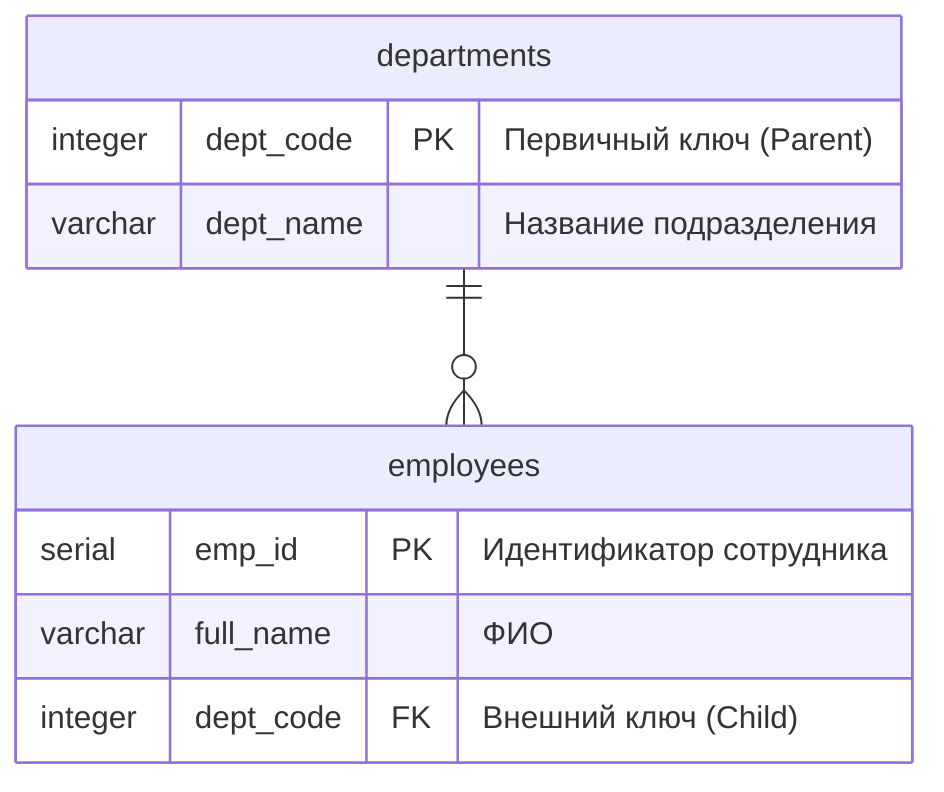

# SQL-команды определения данных (DDL)

Операторы определения данных (Data Definition Language, DDL) обеспечивают управление структурой базы данных: создание, модификацию и удаление объектов (таблиц, индексов, представлений, схем).

Основой реляционной базы данных является таблица. Для создания новой таблицы применяется инструкция `CREATE TABLE`.

## Синтаксис создания таблицы {#create-table-syntax}

Вместо сложной формальной нотации рекомендуется использовать следующую логическую структуру команды:

```sql
CREATE TABLE имя_схемы.имя_таблицы (
имя_столбца_1 тип_данных [ограничения_столбца],
имя_столбца_2 тип_данных [ограничения_столбца],
...
[ограничения_таблицы]
);
```

::: info ВЛАДЕЛЕЦ ОБЪЕКТА
Владельцем таблицы автоматически назначается роль (пользователь), инициировавшая команду `CREATE TABLE`. Если имя схемы не указано явно (например, `public.personnel`), таблица создается в текущей схеме по умолчанию (обычно `public`).
:::

## Система ограничений целостности (Constraints) {#constraints}

Ограничения — это правила, применяемые к столбцам таблицы для обеспечения достоверности и согласованности данных. Они могут быть определены двумя способами:

1.  **Ограничение столбца (Column Constraint):** Записывается сразу после типа данных конкретного столбца.
2.  **Ограничение таблицы (Table Constraint):** Записывается отдельным элементом списка после описания всех столбцов. Обязательно для составных ключей (включающих несколько столбцов).

### Виды ограничений {#constraint-types}

| Ограничение     | Синтаксис                  | Описание действия                                                                                                             |
| :-------------- | :------------------------- | :---------------------------------------------------------------------------------------------------------------------------- |
| **NOT NULL**    | `NOT NULL`                 | Запрещает сохранение неопределенных значений (`NULL`) в столбце.                                                              |
| **DEFAULT**     | `DEFAULT значение`         | Устанавливает значение по умолчанию, если оно не передано в запросе `INSERT`.                                                 |
| **UNIQUE**      | `UNIQUE`                   | Гарантирует уникальность значений в столбце (или группе столбцов) в рамках всей таблицы.                                      |
| **CHECK**       | `CHECK (условие)`          | Проверяет соответствие значения заданному логическому условию (например, `price > 0`).                                        |
| **PRIMARY KEY** | `PRIMARY KEY`              | Первичный ключ. Уникально идентифицирует строку. Объединяет свойства `UNIQUE` и `NOT NULL`.                                   |
| **FOREIGN KEY** | `REFERENCES таблица(поле)` | Внешний ключ. Обеспечивает ссылочную целостность, разрешая вставку только тех значений, которые существуют в целевой таблице. |

### Практическая реализация {#ddl-example}

Рассмотрим создание структуры данных для учета личного состава. Пример демонстрирует использование обоих типов записи ограничений.

```sql
CREATE TABLE units (
  unit_id serial PRIMARY KEY, -- Ограничение столбца
  unit_code varchar(10) UNIQUE NOT NULL, -- Комбинация ограничений
  location text
);

CREATE TABLE personnel (
  person_id serial, -- Суррогатный ключ
  last_name varchar(50) NOT NULL,
  first_name varchar(50) NOT NULL,
  rank varchar(30) DEFAULT 'Рядовой', -- Значение по умолчанию
  birth_date date,
  unit_id integer, -- Поле для связи

  /* Ограничения уровня таблицы */
  CONSTRAINT pk_personnel PRIMARY KEY (person_id),

  CONSTRAINT chk_birth_date CHECK (birth_date > '1950-01-01'),

  CONSTRAINT fk_unit FOREIGN KEY (unit_id)
      REFERENCES units (unit_id)
      ON DELETE RESTRICT -- Запрет удаления подразделения, если есть люди
      ON UPDATE CASCADE  -- Обновление ссылки при изменении id подразделения

);
```

## Механизмы поддержания ссылочной целостности

При определении ограничений внешнего ключа (`FOREIGN KEY`) критически важно регламентировать поведение СУБД при изменении ключевых полей в родительской таблице. Это достигается с помощью инструкций `ON UPDATE` (при обновлении ключа) и `ON DELETE` (при удалении записи).

Синтаксис определения:

```sql
FOREIGN KEY (внешний_ключ) REFERENCES родительская_таблица (первичный_ключ)
ON UPDATE [действие]
ON DELETE [действие]
```

### Варианты действий системы (Actions)

Система поддерживает четыре стратегии реагирования на изменения в родительской таблице:

| Стратегия                | Описание действия                                                                                                                                                  | Применимость                                                                                                      |
| :----------------------- | :----------------------------------------------------------------------------------------------------------------------------------------------------------------- | :---------------------------------------------------------------------------------------------------------------- |
| **NO ACTION / RESTRICT** | **Блокировка.** Запрещает удаление или изменение ключа в родительской таблице, если на него существуют ссылки в дочерней таблице. Транзакция отменяется с ошибкой. | Поведение по умолчанию. Используется для предотвращения случайной потери связей.                                  |
| **CASCADE**              | **Распространение.** Действие, выполненное над родительской записью, автоматически дублируется для всех связанных дочерних записей.                                | Используется для жестко связанных сущностей (например, состав части).                                             |
| **SET NULL**             | **Обнуление.** При удалении или изменении родителя значение внешнего ключа в дочерней таблице устанавливается в `NULL`.                                            | Используется, если связь необязательна (например, куратор уволился $\rightarrow$ поле `curator_id` стало пустым). |
| **SET DEFAULT**          | **Значение по умолчанию.** Значение внешнего ключа заменяется на значение, указанное в `DEFAULT` при создании столбца.                                             | Применяется редко, требует наличия дефолтного значения.                                                           |

### Примеры поведения системы

Для наглядности рассматривается связь двух таблиц:

1.  **`departments`** (Подразделения) — _Родительская таблица_. Первичный ключ: `dept_code` (код подразделения, например, `101`).
2.  **`employees`** (Сотрудники) — _Дочерняя таблица_. Внешний ключ: `dept_code`.



```sql
CREATE TABLE departments (
  dept_code integer PRIMARY KEY,
  dept_name varchar(100)
);

CREATE TABLE employees (
  emp_id serial PRIMARY KEY,
  full_name varchar(100),
  dept_code integer,

  CONSTRAINT fk_dept FOREIGN KEY (dept_code)
      REFERENCES departments (dept_code)
      ON UPDATE CASCADE   -- При смене номера отдела - менять номер у сотрудников
      ON DELETE RESTRICT  -- Запретить удаление отдела, если там есть люди

);
```

#### Сценарий обновления ключа (ON UPDATE)

Ситуация: В связи с реорганизацией код подразделения меняется с `101` на `202`.

- **При `ON UPDATE RESTRICT`:** СУБД **запретит** изменение кода `101` в таблице подразделений, пока в этом подразделении числится хотя бы один сотрудник. Оператор получит ошибку. Требуется сначала перевести людей, потом менять код.
- **При `ON UPDATE CASCADE`:** СУБД изменит код `101` на `202` в таблице подразделений и **автоматически** обновит поле `dept_code` на `202` у всех сотрудников этого подразделения. Целостность сохраняется прозрачно для пользователя.

#### Сценарий удаления записи (ON DELETE)

Ситуация: Подразделение `101` расформировывается (удаляется из базы).

- **При `ON DELETE RESTRICT`:** Удаление записи о подразделении невозможно, пока в таблице сотрудников есть записи со ссылкой на `101`. Защита от появления "сотрудников-призраков".
- **При `ON DELETE CASCADE`:** При удалении подразделения `101` СУБД **автоматически удалит** (уволит) всех сотрудников, приписанных к этому коду.
  ::: warning ОПАСНОСТЬ КАСКАДНОГО УДАЛЕНИЯ
  Использование `ON DELETE CASCADE` требует повышенного внимания. Одно неосторожное удаление строки в справочнике может привести к безвозвратной потере тысяч связанных записей в оперативных таблицах.
  :::
- **При `ON DELETE SET NULL`:** Запись о подразделении удаляется. У сотрудников в поле `dept_code` проставляется значение `NULL` (сотрудники остаются в штате, но временно не приписаны к подразделению).

### Механизм копирования структуры (LIKE)

Для ускоренного создания таблиц на основе уже существующих шаблонов в СУБД PostgreSQL применяется предложение `LIKE`. Данная конструкция обеспечивает наследование имен столбцов, типов данных и ограничения `NOT NULL` из таблицы-источника.

**Синтаксис:**

```sql
CREATE TABLE new_table (
  LIKE source_table
);
```

::: info ОГРАНИЧЕНИЕ КОПИРОВАНИЯ
При использовании `LIKE` копируется только структура (схема) данных. Сами данные (строки), а также индексы и внешние ключи исходной таблицы в новую таблицу **не переносятся**, если это не указано дополнительными параметрами (`INCLUDING INDEXES` и др.).
:::

### Создание таблицы с наполнением данными (CTAS)

Инструкция `CREATE TABLE AS` (CTAS) реализует механизм одновременного определения структуры новой таблицы и импорта в неё результирующего набора данных произвольного запроса `SELECT`.

**Синтаксис:**

```sql
CREATE TABLE имя_новой_таблицы [ ( имена_столбцов ) ]
AS
SELECT ... ;
```

**Принципы формирования структуры:**

1.  Типы данных столбцов новой таблицы автоматически наследуются от типов данных возвращаемых полей запроса.
2.  Имена столбцов по умолчанию соответствуют именам в выборке, однако могут быть переопределены явным указанием списка имен.

::: warning ОГРАНИЧЕНИЯ CTAS
В отличие от конструкции `LIKE`, команда `CREATE TABLE AS` **не переносит** ограничения целостности (первичные и внешние ключи, значения по умолчанию, проверки `CHECK`) и индексы. В новую таблицу копируются только имена столбцов, типы данных и непосредственно сами данные.
:::

**Пример создания архивной таблицы:**

```sql
-- Создание таблицы officers_archive, содержащей только офицерский состав
CREATE TABLE officers_archive (surname, name, current_rank)
AS
SELECT last_name, first_name, rank
FROM personnel
WHERE rank IN ('Лейтенант', 'Капитан', 'Майор');
```

### Инициализация значений (DEFAULT)

Предложение `DEFAULT` определяет алгоритм автоматического присвоения значения столбцу в случае, если при вставке строки (`INSERT`) данное значение не было передано явно.

Значение по умолчанию задается выражением, тип которого должен быть совместим с типом данных столбца.

**Примеры использования:**

```sql
CREATE TABLE audit_log (
  log_id serial PRIMARY KEY,
  event_time timestamp DEFAULT current_timestamp, -- Текущее время сервера
  status_code integer DEFAULT 0, -- Фиксированная константа
  user_name text DEFAULT user -- Системная переменная
);
```

### Логическая валидация данных (CHECK)

Ограничение `CHECK` обеспечивает проверку допустимости вводимых данных на основе произвольного логического (булева) выражения.

**Принципы работы:**

1.  **Условие успеха:** Операция вставки или обновления считается допустимой, если результат вычисления выражения равен `TRUE` или `NULL`.
2.  **Условие отказа:** Операция блокируется только в том случае, если результат выражения равен `FALSE`.

::: warning ОСОБЕННОСТЬ ОБРАБОТКИ NULL
Важно учитывать, что выражение `CHECK (price > 0)` пропустит строку, где `price` имеет значение `NULL` (так как результат сравнения с `NULL` не является `FALSE`). Для строгого запрета пустых значений необходимо использовать комбинацию `CHECK (...) AND NOT NULL`.
:::

**Области действия ограничения:**

- **Ограничение столбца:** Может ссылаться только на текущий столбец.
- **Ограничение таблицы:** Может ссылаться на любые столбцы в пределах одной строки (используется для перекрестной проверки).

**Пример комплексной валидации:**

```sql
CREATE TABLE project_tasks (
  task_id serial PRIMARY KEY,
  start_date date,
  end_date date,
  progress integer,

  /* Ограничение столбца */
  CONSTRAINT chk_progress_limit CHECK (progress >= 0 AND progress <= 100),

  /* Ограничение таблицы (сравнение двух полей) */
  CONSTRAINT chk_dates_order CHECK (end_date >= start_date)
);
```

### Технические особенности реализации ограничений

Помимо логической валидации данных, объявление ограничений инициирует определенные системные процессы и влияет на физическую организацию данных.

#### Обработка неопределенных значений (NULL) в UNIQUE

Согласно стандарту SQL, значение `NULL` означает «неизвестное значение». Следовательно, два неизвестных значения не могут считаться равными друг другу.

- **Поведение системы:** Ограничение `UNIQUE` допускает наличие множества строк, в которых уникальный столбец содержит `NULL`. Это не считается нарушением уникальности.
- **Исключение:** Если требуется строгая уникальность с запретом пустых полей, необходимо использовать комбинацию ограничений: `UNIQUE NOT NULL`.

#### Автоматическая индексация

При создании ограничений **PRIMARY KEY** или **UNIQUE** СУБД PostgreSQL автоматически создает соответствующие индексы для поддержки этих ограничений.

- **Тип индекса:** По умолчанию создается сбалансированное дерево (**B-tree**).
- **Назначение:** Индекс обеспечивает быструю проверку уникальности без необходимости полного сканирования таблицы (Full Table Scan) при каждой вставке данных.

::: info СИСТЕМНЫЙ ЭФФЕКТ
Удаление ограничения `PRIMARY KEY` или `UNIQUE` автоматически приводит к удалению связанного с ним индекса.
:::

#### Требования к внешним ключам

При создании связи `FOREIGN KEY` (предложение `REFERENCES`) налагаются строгие требования к целевой (родительской) таблице:

1.  Целевой столбец, на который производится ссылка, **обязательно** должен иметь ограничение `PRIMARY KEY` или `UNIQUE`. Ссылка на неуникальные поля запрещена.
2.  Если список целевых столбцов опущен, по умолчанию связь устанавливается с первичным ключом целевой таблицы.

## Модификация структуры таблицы (ALTER TABLE)

В процессе эксплуатации информационной системы возникает необходимость изменения схемы данных без потери накопленной информации. Для этих целей используется универсальная команда `ALTER TABLE`.

### Основные сценарии использования

Синтаксическая конструкция команды позволяет выполнять широкий спектр операций, которые можно классифицировать по объекту воздействия.

#### Операции со столбцами (Columns) {#alter-columns}

Позволяют менять состав и характеристики атрибутов отношения.

```sql
ALTER TABLE personnel
  -- Добавление нового столбца
  ADD COLUMN phone_number varchar(20),
  -- Удаление существующего столбца с проверкой зависимостей
  DROP COLUMN fax_number RESTRICT,
  -- Изменение типа данных
  ALTER COLUMN rank TYPE varchar(50),
  -- Управление значением по умолчанию
  ALTER COLUMN status SET DEFAULT 'active', -- Установить
  ALTER COLUMN status DROP DEFAULT;         -- Удалить
```

**Механизм контроля зависимостей (RESTRICT / CASCADE):**

При попытке удаления столбца СУБД проверяет, используется ли он в других объектах базы данных (представлениях, индексах, внешних ключах).

| Режим                          | Описание действия                                                                                                                                                                                              |
| :----------------------------- | :------------------------------------------------------------------------------------------------------------------------------------------------------------------------------------------------------------- |
| **RESTRICT**<br>(По умолчанию) | **Блокировка удаления.** Операция отменяется с ошибкой, если на удаляемый столбец существуют ссылки. <br>_Пример:_ Нельзя удалить столбец `rank`, если он используется в представлении (VIEW) `officers_list`. |
| **CASCADE**                    | **Каскадное удаление.** Столбец удаляется вместе со всеми зависимыми объектами. <br>_Пример:_ При удалении столбца `rank` автоматически удалится и представление `officers_list`.                              |

::: warning ВАЛИДАЦИЯ ДАННЫХ
При установке ограничения `NOT NULL` (форма `SET NOT NULL`) СУБД выполняет полную проверку таблицы. Если хотя бы одна строка содержит `NULL` в целевом столбце, команда завершится ошибкой.
:::

#### 2. Операции с ограничениями (Constraints)

Позволяют добавлять или удалять правила целостности для уже существующей таблицы.

```sql
ALTER TABLE personnel
  -- Добавление ограничения
  ADD CONSTRAINT chk_salary CHECK (salary > 0) NOT VALID,
  -- Удаление ограничения
  DROP CONSTRAINT chk_birth_date;
```

**Опция `NOT VALID`:**
Применяется для оптимизации производительности на больших объемах данных. Ключевое слово `NOT VALID` указывает системе, что проверку ограничения нужно применять только к **новым** или **изменяемым** строкам, пропуская проверку существующих исторических данных.

## Удаление таблиц (DROP TABLE)

Для безвозвратного удаления таблицы и всех хранящихся в ней данных используется команда `DROP TABLE`.

**Синтаксис:**

```sql
DROP TABLE [IF EXISTS] имя_таблицы [, ...] [CASCADE | RESTRICT];
```

### Параметры выполнения {#drop-parameters}

1.  **`IF EXISTS`**: Предотвращает возникновение системной ошибки, если удаляемая таблица не существует в базе данных. В этом случае выдается лишь предупреждение (NOTICE).
2.  **Побочные эффекты**: Удаление таблицы автоматически инициирует удаление всех связанных с ней внутренних объектов: индексов, правил, триггеров и ограничений.

### Режимы удаления зависимостей {#drop-dependencies}

Механизм контроля ссылочной целостности (аналогичен `ALTER TABLE ... DROP COLUMN`).

| Режим                          | Описание действия                                                                                                                                                |
| :----------------------------- | :--------------------------------------------------------------------------------------------------------------------------------------------------------------- |
| **RESTRICT**<br>(По умолчанию) | **Запрет удаления.** Команда блокируется, если существуют объекты (например, представления `VIEW` или внешние ключи `FOREIGN KEY`), зависящие от данной таблицы. |
| **CASCADE**                    | **Каскадное удаление.** Вместе с таблицей принудительно удаляются все зависимые объекты.                                                                         |

::: danger ОПАСНОСТЬ CASCADE
Использование режима `CASCADE` требует особой осторожности, так как может привести к неявному удалению критически важных компонентов системы (например, представлений, используемых в отчетах), которые ссылаются на удаляемую таблицу.
:::

---

## Выводы по второму учебному вопросу {#conclusion-q2}

Рассмотренные команды группы DDL (`CREATE`, `ALTER`, `DROP`) составляют базис администрирования структуры реляционной базы данных.

Установлено, что проектирование схемы данных требует строгого соблюдения правил нормализации и целостности. Корректное применение ограничений (`CONSTRAINTS`) на этапе создания таблицы позволяет минимизировать количество логических ошибок в прикладном программном обеспечении. Особое внимание оператора должно уделяться управлению зависимостями при модификации и удалении объектов (режимы `RESTRICT` / `CASCADE`), чтобы исключить нарушение работоспособности связанных элементов информационной системы.
